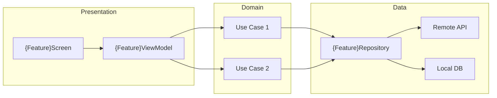

# Codebase Documentation Generator — Instructions

## Goal

Generate comprehensive documentation for features in `~/Developer/chalo/chalo-app-kmp/` (the upstream KMP codebase). Output documentation goes to this dashboard repo under:

- `content/docs/catalog.json` — Master catalog of all documented features
- `content/docs/feature-slug-map.json` — Maps folder slugs to catalog keys
- `content/docs/overview/*.md` — Project-wide overview documents
- `content/docs/features/<featureSlug>/hld.md` — High-Level Design document
- `content/docs/features/<featureSlug>/components.md` — UI component LLD (shared)
- `content/docs/features/<featureSlug>/components-android.md` — Android-specific UI LLD (optional)
- `content/docs/features/<featureSlug>/components-ios.md` — iOS-specific UI LLD (optional)
- `content/docs/features/<featureSlug>/usecases.md` — Domain use cases LLD
- `content/docs/features/<featureSlug>/repositories.md` — Data layer LLD

The output must be usable by the dashboard UI without code changes.

## Non-Goals / Constraints

- Do **not** modify the upstream KMP codebase.
- Do **not** modify dashboard UI code—only the content snapshot under `content/docs/`.
- Prefer **minimal diffs** to existing docs: update only what changed.
- **Preserve manual edits**: If a section was clearly edited by a human (detailed prose, custom diagrams), preserve it unless the underlying code has fundamentally changed.

## Code Tracing Methodology

When documenting a feature, follow this code path tracing approach:

### 1. Identify Entry Points
- **Android**: Search for `@Composable` screens, `Activity`, `Fragment` classes in `feature/<name>/`
- **iOS**: Search for `View` structs in SwiftUI, `ViewController` classes
- **Shared**: Look for `ScreenModel`, `ViewModel` classes in `shared/` or `commonMain/`

### 2. Trace the Data Flow
```
User Action → UI Component → ViewModel/ScreenModel → UseCase → Repository → Data Source (API/DB)
```

### 3. Document Each Layer
- **Presentation**: Screens, ViewModels, UI state classes, events
- **Domain**: Use cases, domain models, business rules
- **Data**: Repositories, data sources, mappers, DTOs

### 4. Cross-Reference
- Link to corresponding analytics flow if `hasAnalyticsFlow: true` in catalog
- Note which analytics events are fired from which components

---

## HLD Template

Use this template for `content/docs/features/<featureSlug>/hld.md`:

```markdown
---
feature: {feature-slug}
lastUpdated: {YYYY-MM-DD}
sourceCommit: {upstream-sha}
platforms: [android, ios, shared]
hasAnalyticsFlow: {true/false}
---

# {Feature Name} — High-Level Design


## Overview

{1-2 paragraph description of the feature's purpose and user value}

## User Journey

1. **Entry Points**: {How users reach this feature}
2. **Core Flow**: {Main screens and actions}
3. **Exit Points**: {Where users go after completing the flow}

## Architecture Diagram



## Key Components

| Component | Platform | File Path | Responsibility |
|-----------|----------|-----------|----------------|
| {ScreenName}Screen | Android | `feature/{slug}/presentation/{Screen}.kt` | {Brief description} |
| {ScreenName}View | iOS | `iosApp/{feature}/{View}.swift` | {Brief description} |
| {Name}ViewModel | Shared | `shared/{feature}/presentation/{VM}.kt` | {Brief description} |
| {Name}UseCase | Shared | `shared/{feature}/domain/usecase/{UC}.kt` | {Brief description} |
| {Name}Repository | Shared | `shared/{feature}/domain/repository/{Repo}.kt` | {Brief description} |

## Data Flow

### Request Path
1. User interacts with `{Screen}Screen`
2. UI dispatches event to `{Feature}ViewModel`
3. ViewModel calls `{Action}UseCase`
4. UseCase orchestrates `{Feature}Repository`
5. Repository fetches from API / reads from DB

### Response Path
1. Repository returns `Result<{Model}>`
2. UseCase applies business rules, returns domain model
3. ViewModel updates `UiState`
4. Screen recomposes with new state

## Platform Differences

### Android-Specific
- {Compose-specific considerations}
- {Android-only dependencies or behaviors}

### iOS-Specific
- {SwiftUI/UIKit considerations}
- {iOS-only dependencies or behaviors}

## Integration Points

### Analytics Events
{If hasAnalyticsFlow: true}
- See [Analytics: {Flow Name}](/analytics/flows/{analytics-flow-slug}) for event documentation
- Key events: `{event1}`, `{event2}`, ...

### Shared Services
- **Auth**: {How authentication is used}
- **Networking**: {API client usage}
- **Storage**: {Local persistence}

### Navigation
- **Navigates to**: {List of destination features}
- **Navigated from**: {List of source features}

## Edge Cases & Error Handling

| Scenario | Handling |
|----------|----------|
| Network failure | {How the feature handles offline/timeout} |
| Validation error | {Client-side validation behavior} |
| Session expiry | {Re-authentication flow} |
| Empty state | {What shows when no data} |

## Dependencies

### Internal
- `shared:core` — {Purpose}
- `shared:networking` — {Purpose}

### External
- {Library name} — {Purpose}
```

---

## LLD Templates

### components.md (UI Layer)

Use this template for `content/docs/features/<featureSlug>/components.md`:

```markdown
---
feature: {feature-slug}
lastUpdated: {YYYY-MM-DD}
sourceCommit: {upstream-sha}
---

# {Feature Name} — Component Documentation


## Screen Components

### {ScreenName}Screen

- **File**: `feature/{slug}/presentation/{ScreenName}Screen.kt` (Android) / `shared/{slug}/presentation/{ScreenName}Screen.kt` (KMP)
- **ViewModel**: `{ScreenName}ViewModel`
- **State**: `{ScreenName}UiState`
- **Events**: `{ScreenName}Event` (sealed class/interface)

#### UI State
```kotlin
data class {ScreenName}UiState(
    val isLoading: Boolean = false,
    val items: List<{Item}> = emptyList(),
    val error: String? = null
)
```

#### Events
```kotlin
sealed interface {ScreenName}Event {
    data object OnBackClick : {ScreenName}Event
    data class OnItemClick(val id: String) : {ScreenName}Event
    // ...
}
```

#### UI Elements
- `{ComponentName}` — {Description}
- `{ComponentName}` — {Description}

### {Another Screen}

{Repeat structure for each screen}

## Reusable Components

### {SharedComponentName}

- **File**: `feature/{slug}/presentation/components/{Component}.kt`
- **Props**: `{Component}Props`
- **Used by**: {List of screens using this component}

## Navigation

### Screen Graph
```mermaid
flowchart TD
    Entry[Entry Point] --> Screen1[{Screen1}]
    Screen1 --> Screen2[{Screen2}]
    Screen1 --> Screen3[{Screen3}]
    Screen2 --> Exit[Exit / Result]
```

### Deep Links
- `chalo://{feature}/{path}` → `{ScreenName}Screen`
```

### components-android.md (Android-Specific UI)

Only create this file when Android implementation significantly differs from shared code:

```markdown
---
feature: {feature-slug}
lastUpdated: {YYYY-MM-DD}
sourceCommit: {upstream-sha}
platform: android
---

# {Feature Name} — Android Component Documentation


## Android-Specific Screens

### {AndroidScreenName}

- **File**: `androidApp/feature/{slug}/{Screen}.kt`
- **Reason for platform-specific**: {Why this differs from shared}

{Document Android-specific implementation details}

## Android Dependencies

- Compose version: {x.y.z}
- Material3 components used: {List}
- Android-specific libraries: {List}
```

### components-ios.md (iOS-Specific UI)

Only create this file when iOS implementation significantly differs from shared code:

```markdown
---
feature: {feature-slug}
lastUpdated: {YYYY-MM-DD}
sourceCommit: {upstream-sha}
platform: ios
---

# {Feature Name} — iOS Component Documentation


## iOS-Specific Views

### {iOSViewName}

- **File**: `iosApp/{feature}/{View}.swift`
- **Reason for platform-specific**: {Why this differs from shared}

{Document iOS-specific implementation details}

## iOS Dependencies

- SwiftUI / UIKit: {Which is used}
- iOS-specific libraries: {List}
```

### usecases.md (Domain Layer)

Use this template for `content/docs/features/<featureSlug>/usecases.md`:

```markdown
---
feature: {feature-slug}
lastUpdated: {YYYY-MM-DD}
sourceCommit: {upstream-sha}
---

# {Feature Name} — UseCase Documentation


## Use Cases

### {ActionName}UseCase

- **File**: `shared/{slug}/domain/usecase/{ActionName}UseCase.kt`
- **Input**: `{ActionName}Params` or `Unit`
- **Output**: `Result<{ResponseType}>` / `Flow<{ResponseType}>`
- **Dependencies**:
  - `{Repository1}Repository`
  - `{Repository2}Repository`

#### Purpose
{1-2 sentence description of what this use case does}

#### Business Logic
1. {Step 1 of the logic}
2. {Step 2 of the logic}
3. {Validation rules applied}

#### Error Handling
- `{ErrorType}` → {How it's handled}

#### Example Usage
```kotlin
class {ActionName}UseCase(
    private val repository: {Feature}Repository
) {
    suspend operator fun invoke(params: {Params}): Result<{Response}> {
        // Implementation summary
    }
}
```

### {Another UseCase}

{Repeat structure for each use case}

## Domain Models

### {ModelName}

- **File**: `shared/{slug}/domain/model/{ModelName}.kt`
- **Used by**: {List of use cases}

```kotlin
data class {ModelName}(
    val id: String,
    val name: String,
    // ...
)
```

## Business Rules

| Rule | Description | Enforced In |
|------|-------------|-------------|
| {Rule name} | {Description} | `{UseCase}UseCase` |
```

### repositories.md (Data Layer)

Use this template for `content/docs/features/<featureSlug>/repositories.md`:

```markdown
---
feature: {feature-slug}
lastUpdated: {YYYY-MM-DD}
sourceCommit: {upstream-sha}
---

# {Feature Name} — Repository Documentation


## Repositories

### {Entity}Repository

- **Interface**: `shared/{slug}/domain/repository/{Entity}Repository.kt`
- **Implementation**: `shared/{slug}/data/repository/{Entity}RepositoryImpl.kt`
- **Data Sources**:
  - Remote: `{Entity}Api` / `{Entity}Service`
  - Local: `{Entity}Dao` / `{Entity}DataStore`

#### Methods

| Method | Returns | Description |
|--------|---------|-------------|
| `get{Entity}(id)` | `Result<{Entity}>` | {Description} |
| `get{Entities}()` | `Flow<List<{Entity}>>` | {Description} |
| `save{Entity}(entity)` | `Result<Unit>` | {Description} |

#### Caching Strategy
- **Strategy**: {Cache-first / Network-first / Stale-while-revalidate}
- **TTL**: {Duration if applicable}
- **Invalidation**: {When cache is cleared}

### {Another Repository}

{Repeat structure for each repository}

## API Endpoints

### {Endpoint Group}

| Endpoint | Method | Auth | Request | Response |
|----------|--------|------|---------|----------|
| `/api/v1/{resource}` | GET | Required | — | `List<{DTO}>` |
| `/api/v1/{resource}/{id}` | GET | Required | — | `{DTO}` |
| `/api/v1/{resource}` | POST | Required | `{RequestDTO}` | `{ResponseDTO}` |

### Request/Response Models

#### {RequestDTO}
```kotlin
@Serializable
data class {RequestDTO}(
    val field1: String,
    val field2: Int
)
```

#### {ResponseDTO}
```kotlin
@Serializable
data class {ResponseDTO}(
    val id: String,
    val data: {NestedDTO}
)
```

## Local Storage

### SQLDelight Tables

#### {TableName}
- **File**: `shared/{slug}/data/db/{Table}.sq`
- **Primary Key**: `id`

```sql
CREATE TABLE {tableName} (
    id TEXT PRIMARY KEY,
    name TEXT NOT NULL,
    created_at INTEGER NOT NULL
);
```

### DataStore / Preferences

| Key | Type | Description |
|-----|------|-------------|
| `{feature}_last_sync` | Long | Last sync timestamp |
| `{feature}_cached_id` | String | Cached selected item ID |

## Data Mappers

### {Entity}Mapper

- **File**: `shared/{slug}/data/mapper/{Entity}Mapper.kt`
- **Converts**: `{DTO}` ↔ `{DomainModel}`

```kotlin
fun {DTO}.toDomain(): {DomainModel} = {DomainModel}(
    id = this.id,
    name = this.name
)

fun {DomainModel}.toDto(): {DTO} = {DTO}(
    id = this.id,
    name = this.name
)
```
```

---

## Catalog Updates

When generating documentation:

1. **Update `catalog.json`**:
   - Set `status` to `"draft"` for new docs
   - Update `lastUpdated` to current date (YYYY-MM-DD)
   - Update `sourceCommit` to the upstream commit SHA used for generation

2. **Update `feature-slug-map.json`**:
   - Add mapping if folder slug differs from catalog key

---

## Quality Checklist

Before finalizing documentation, verify:

- [ ] All file paths in documentation are accurate and exist in upstream
- [ ] Mermaid diagrams render correctly (valid syntax)
- [ ] Cross-references to analytics flows use correct slugs
- [ ] Platform-specific docs only created when implementations truly differ
- [ ] No placeholder text remains (e.g., `{TODO}`, `{TBD}`)
- [ ] YAML frontmatter is valid
- [ ] Code snippets are syntactically correct

---

## Safety Rules

- Do not edit anything outside `content/docs/**` unless explicitly required.
- Do not delete existing documentation unless the feature has been removed from upstream.
- Preserve file paths and naming conventions exactly as documented.
- When uncertain about implementation details, mark with `<!-- NEEDS_VERIFICATION: {question} -->`.
