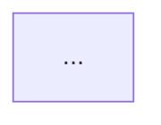

# Chalo KMP Codebase Documentation Suite — Phased Roadmap

## Executive Summary

Add a comprehensive, browsable, and searchable documentation suite for `chalo-app-kmp` to this dashboard. Documentation will include project-level overviews, per-feature HLDs (High-Level Design), and per-feature LLDs (Low-Level Design at Component, UseCase, and Repository layers). An updater pipeline (similar to `analytics-updater`) will keep docs in sync with upstream changes.

### Key Decisions (User Input)
- **Scope**: All user-facing features (not just analytics flows) — includes settings, profile, deeplinks, etc.
- **Sequencing**: HLDs breadth-first for all features, then LLDs depth
- **Initial seed**: LLM-generated with human review pass
- **Cross-platform**: Full iOS/Android coverage with platform-specific sections where implementations differ
- **Documentation style**: Prose-heavy, diagram-rich, code-light (no code blocks in docs)

**Scale estimate:**
- 26 analytics flows + ~10-15 additional features = **~40 features**
- Per feature: 1 HLD + 3 LLDs = 4 documents × 40 = **160 feature documents**
- Overview docs: ~10-12 documents
- Platform-specific addenda: ~20-30 documents
- Total: **~200+ documentation files**

### Phase Overview
| Phase | Description |
|-------|-------------|
| 0 | Foundation & Schema Design |
| 0.5 | Feature Discovery |
| 1 | Overview Documentation |
| 2 | HLDs for all features |
| 3 | LLDs for all features |
| 4 | Dashboard UI (can parallelize with Phase 3) |
| 5 | Docs Updater Pipeline |
| 6 | Enhancement & Polish |

### Current Progress

| Phase | Status | Notes |
|-------|--------|-------|
| 0 | ✅ Complete | TypeScript types, folder structure, catalog schema |
| 0.5 | ✅ Complete | 31 features discovered and cataloged |
| 1 | ✅ Complete | 8 overview docs created |
| 2 | ✅ Complete | 28 HLD files for all features |
| 3 | ✅ Complete | 28/28 features with LLDs generated via KMP code exploration (3 features without HLDs: tito, product-activation, webview) |
| 4 | ⬜ Not Started | — |
| 5 | ⬜ Not Started | — |
| 6 | ⬜ Not Started | — |

**Phase 3 Detail:**

All LLDs generated via agents that explored the actual KMP codebase at `~/Developer/chalo/chalo-app-kmp/`, tracing real component implementations, use cases, and repositories. Each feature has 3 LLD files: `components.md`, `usecases.md`, `repositories.md`.

**Batch 1 (initial):** bills, help, ads, profile, authentication, onboarding, search, payment, mticket, card, chalo-wallet, premium-bus-booking, validation, notifications, lifecycle

**Batch 2 (KMP exploration):** history, home, instant-ticket, live-tracking, metro, network, ondc-bus, premium-bus-activation-tracking

**Batch 3 (KMP exploration):** premium-bus-bulk-booking, report-problem, sos, super-pass, trip-planner

Total: 28 features × 3 LLDs = **84 LLD files**

---

## Phase 0: Foundation & Schema Design

**Goal:** Define the content schema, folder structure, and type system before generating any content.

### Deliverables

1. **Content schema design** (`content/docs/` structure)
   ```
   content/docs/
   ├── catalog.json                    # Master catalog of all features
   ├── feature-slug-map.json           # Maps folder slugs to catalog keys
   ├── overview/
   │   ├── project-structure.md        # Module hierarchy, layers
   │   ├── tech-stack.md               # Dependencies, KMP specifics
   │   ├── architecture.md             # Clean architecture overview
   │   ├── navigation-guide.md         # How to find things
   │   ├── build-setup.md              # Dev environment
   │   ├── conventions.md              # Naming, patterns
   │   ├── ios-specifics.md            # iOS-specific patterns, SwiftUI
   │   └── android-specifics.md        # Android-specific patterns, Compose
   └── features/
       └── <feature-slug>/
           ├── hld.md                  # High-level design
           ├── components.md           # LLD: UI components (shared)
           ├── components-android.md   # LLD: Android-specific UI (if differs)
           ├── components-ios.md       # LLD: iOS-specific UI (if differs)
           ├── usecases.md             # LLD: Domain use cases
           └── repositories.md         # LLD: Data layer
   ```

2. **TypeScript types** (`src/lib/docs/types.ts`)
   - `DocsFlow`, `DocsOverview`, `DocsSnapshot`
   - Align with analytics pattern for consistency

3. **Catalog schema** (`content/docs/catalog.json`)
   - Map flow slugs to HLD/LLD paths
   - Track `lastUpdated`, `sourceCommit`, `status` (draft/reviewed/stale)

4. **Conventions document** (`.ai/codex/codebase-docs.md`)
   - LLM instructions for generating/updating docs
   - HLD template, LLD templates for each layer
   - Code tracing methodology

### Open Questions
- Markdown-only or structured JSON + Markdown hybrid? (Recommend: Markdown with YAML frontmatter for metadata)

---

## Phase 0.5: Feature Discovery

**Goal:** Enumerate all user-facing features beyond the 26 analytics flows.

### Process
1. **Scan KMP feature modules**: List all `feature/*` directories
2. **Identify entry points**: Activities, Fragments, Composables, SwiftUI Views
3. **Map to user journeys**: Group related screens into features
4. **Cross-reference analytics**: Match with existing 26 flows where applicable
5. **Discover non-analytics features**: Settings, profile, deeplinks, permissions, etc.

### Expected Additional Features (beyond analytics 26)
| Feature | Description |
|---------|-------------|
| `settings` | App settings, preferences, language, notifications |
| `profile` | User profile, edit profile, account management |
| `deeplinks` | Deeplink handling, routing, universal links |
| `permissions` | Runtime permissions flow (location, camera, etc.) |
| `referral` | Referral program, invite friends |
| `rewards` | Rewards/loyalty program if separate from wallet |
| `feedback` | In-app feedback, surveys |
| `crash-recovery` | Error states, retry flows, offline mode |

### Deliverable
- `content/docs/catalog.json` with complete feature inventory
- Each feature tagged with: `hasAnalyticsFlow: true/false`, `platforms: ["android", "ios", "shared"]`

---

## Phase 1: Overview Documentation

**Goal:** Create foundational project docs that provide context for flow-specific documentation.

### Deliverables (Manual/LLM-assisted seeding)

| Document | Content |
|----------|---------|
| `project-structure.md` | Module tree, Gradle structure, KMP targets (Android/iOS), feature modules |
| `tech-stack.md` | Kotlin, Ktor, Koin, SQLDelight, Compose Multiplatform, dependencies |
| `architecture.md` | Clean Architecture layers, data flow, DI setup, navigation |
| `navigation-guide.md` | How to find: screens → features → use cases → repos |
| `build-setup.md` | Prerequisites, IDE setup, running on Android/iOS emulators |
| `conventions.md` | Naming (UseCase suffix, Repository suffix), package structure |
| `testing.md` | Test structure, mocking, test fixtures |
| `shared-infra.md` | Networking, error handling, logging, analytics SDK |

### Process
1. LLM analyzes `chalo-app-kmp` top-level structure
2. Generate draft docs with explicit "needs verification" markers
3. Human review and iteration
4. Commit as baseline

---

## Phase 2: Feature Documentation Seeding — HLDs

**Goal:** Generate High-Level Design documents for all ~40 features (26 analytics flows + additional features).

### HLD Template Structure
```markdown
---
feature: {feature-slug}
lastUpdated: YYYY-MM-DD
sourceCommit: {sha}
platforms: [android, ios, shared]
hasAnalyticsFlow: true/false
---

# {Feature Name} — High-Level Design

## Overview
Brief description of the user journey and business purpose.

## User Journey
1. Entry points (how users reach this feature)
2. Key screens/states
3. Exit points (completion, abandonment, navigation away)

## Architecture Diagram


## Key Components
| Component | Platform | Responsibility |
|-----------|----------|----------------|
| ... | Shared/Android/iOS | ... |

## Data Flow
1. User action → ViewModel → UseCase → Repository → API/DB
2. Response path back to UI

## Platform Differences
### Android-Specific
- Compose UI considerations
- Android-only dependencies
- Platform-specific behavior

### iOS-Specific
- SwiftUI/UIKit considerations
- iOS-only dependencies
- Platform-specific behavior

## Integration Points
- Analytics events fired (link to analytics docs)
- Shared services used (auth, wallet, payment)
- Navigation targets

## Edge Cases & Error Handling
- Network failures
- Validation errors
- Session expiry
```

### Process (Per Flow)
1. **Code path tracing**: LLM reads entry points (Activity/Fragment/Composable)
2. **ViewModel analysis**: Identify state management, effects
3. **UseCase enumeration**: List domain operations
4. **Repository mapping**: Identify data sources
5. **Generate HLD**: Using template above
6. **Cross-link**: Reference analytics events from `content/analytics/<flow>/events.json`

### Execution Strategy
- **Batch 1 (Simple)**: `bills`, `help`, `ads`, `settings`, `feedback`
- **Batch 2 (Medium)**: `authentication`, `onboarding`, `search`, `profile`, `permissions`
- **Batch 3 (Complex)**: `payment`, `premium-bus-booking`, `mticket`, `chalo-wallet`, `card`
- **Batch 4 (Cross-flow)**: `deeplinks`, `notifications`, `validation`
- Human review after each batch before proceeding
- Platform-specific sections filled based on code inspection

---

## Phase 3: Feature Documentation Seeding — LLDs

**Goal:** Generate Low-Level Design documents at Component, UseCase, and Repository levels for all ~40 features. Platform-specific component docs generated where implementations differ significantly.

### Documentation Principles

LLDs follow a **prose-heavy, diagram-rich, code-light** approach:

| Element | Use | Avoid |
|---------|-----|-------|
| **Prose** | Describe architecture, flows, decisions | Dry lists of file paths |
| **Mermaid diagrams** | Flowcharts, sequence diagrams, state diagrams | ASCII art |
| **Tables** | Structured data (fields, errors, operations) | Inline lists |
| **Code blocks** | — | Class definitions, method signatures, data classes |

**Rationale:** This documentation site is decoupled from the source codebase with no IDE integration or backlinks. Code in docs becomes stale, can't be verified, and duplicates the source of truth.

### LLD Templates

**components.md (Presentation Layer)**

Structure:
- Architecture overview with Mermaid diagram
- Screen inventory table
- Per-screen sections with:
  - User journey (numbered steps)
  - State flow diagram (stateDiagram-v2)
  - Key behaviors as tables
- State management summary (intents, side effects as tables)
- Navigation flow
- Analytics events table
- Error handling table

**usecases.md (Domain Layer)**

Structure:
- Domain layer overview with Mermaid diagram
- Use case inventory table
- Per-usecase sections with:
  - Responsibility description (prose)
  - Flow diagram (flowchart)
  - Input/output as tables
  - Error mapping tables
- Domain models as field tables (not data class code)
- Business rules table
- Sequence diagrams for key interactions

**repositories.md (Data Layer)**

Structure:
- Data layer overview with Mermaid diagram
- Repository operations table
- API endpoints as property tables (endpoint, method, auth, body fields)
- Data flow sequence diagrams
- Data transformation mapping tables
- Exception handling flow diagram
- Local storage description (prose, not code)
- Dependency injection as tables

### Execution Strategy
- Can begin after HLD batch completes
- Prioritize features with complex data requirements first
- Complete full LLD set (3 docs) per feature before moving to next

---

## Phase 4: Dashboard UI

**Goal:** Build browsable, searchable UI for codebase documentation.

### Routes
```
/docs                           # Landing page
/docs/overview                  # Overview docs listing
/docs/overview/[slug]           # Individual overview doc
/docs/flows                     # Flow grid (mirrors /analytics/flows)
/docs/flows/[flowSlug]          # Flow detail with HLD/LLD tabs
/docs/search                    # Full-text search
```

### Components
| Component | Purpose |
|-----------|---------|
| `DocsShell` | Layout with sidebar navigation |
| `DocsFlowsGrid` | Card grid of documented flows |
| `DocsFlowDetail` | Tabbed view: HLD, Components, UseCases, Repositories |
| `DocsMarkdownViewer` | Render markdown with syntax highlighting |
| `DocsSearch` | Full-text search across all docs |
| `DocsOverviewNav` | Overview docs navigation |

### Data Layer
- `src/lib/docs/fs-source.ts` — Filesystem adapter (mirrors analytics pattern)
- `src/lib/docs/types.ts` — Type definitions
- `src/lib/docs/search.ts` — Search implementation

### Cross-Linking
- Flow docs link to corresponding analytics flow (`/analytics/flows/<slug>`)
- Analytics events can link to code documentation
- Bidirectional navigation

---

## Phase 5: Docs Updater Pipeline

**Goal:** Automated pipeline to keep documentation in sync with upstream code changes.

### Architecture (mirrors `analytics-updater`)
```
scripts/docs-updater/
├── run-once.js                 # Entry point
├── src/
│   ├── config.js               # Environment config
│   ├── state.js                # State persistence
│   ├── lock.js                 # Concurrency guard
│   ├── git.js                  # Git operations
│   ├── git-dashboard.js        # Worktree management
│   ├── codex.js                # LLM integration
│   ├── validate-content.js     # Schema validation
│   ├── gh.js                   # PR creation
│   └── diff-analyzer.js        # Determine affected flows
└── test/
    └── *.test.js
```

### Workflow
1. Poll upstream `chalo-app-kmp` for new commits
2. Analyze diff to identify affected flows/modules
3. Run LLM to update only affected documentation
4. Validate generated content
5. Create PR for review

### Key Differences from Analytics Updater
- **Scope detection**: Must map code changes → affected flows (more complex)
- **Partial updates**: Only regenerate docs for changed flows
- **Staleness tracking**: Mark docs as "stale" if source changed but not yet updated

### LLM Instructions (`.ai/codex/codebase-docs-updater.md`)
- How to trace code changes to documentation impact
- Templates for each doc type
- Constraints (preserve manual edits, mark generated sections)

---

## Phase 6: Enhancement & Polish

**Goal:** Improve UX, add advanced features.

### Enhancements
1. **Architecture diagrams**: Auto-generate from code structure
2. **Dependency graphs**: Visualize module dependencies
3. **Version tracking**: Show doc version vs source commit
4. **Diff view**: Show what changed between doc versions
5. **Global search**: Unified search across analytics + docs
6. **API reference**: Auto-extract from KDoc comments (optional, separate section)

### Quality Improvements
- Human review workflow for generated docs
- "Verified" badge for reviewed documentation
- Feedback mechanism for doc corrections

---

## Implementation Considerations

### Content Generation Strategy
- **Initial seed**: Human-in-the-loop with LLM assistance
- **Ongoing updates**: Fully automated with PR review
- **Quality gates**: Validation before merge

### LLM Model Selection
- GPT-5.2 (consistent with analytics-updater)
- High reasoning effort for code tracing
- Structured output for consistent formatting

### State Management
- Separate state file: `~/.local/state/chalo-dashboard/docs-updater/state.json`
- Track per-flow `lastSourceCommit` for granular staleness

### Cross-Reference Integration
- Analytics events → Code location (where event is fired)
- Code components → Analytics events (what events a component fires)
- Requires linking data in both directions

---

## Risk & Mitigation

| Risk | Impact | Mitigation |
|------|--------|------------|
| KMP codebase structure changes | Docs become stale | Updater pipeline + staleness indicators |
| LLM hallucinations | Incorrect documentation | Human review, verification links to source |
| Scale overwhelming | Never complete initial seed | Prioritize by flow usage/importance |
| Cross-platform complexity | iOS-specific code missed | Explicit iOS/Android sections in templates |

---

## Success Metrics

- [ ] All ~40 features have HLD documentation
- [ ] All ~40 features have Component, UseCase, Repository LLDs
- [ ] Platform-specific docs exist where Android/iOS implementations differ
- [ ] Overview docs cover project structure comprehensively (including iOS/Android specifics)
- [ ] Search returns relevant results in <500ms
- [ ] Cross-linking between analytics events and code documentation works
- [ ] Updater pipeline automatically processes upstream changes
- [ ] <5% of docs marked "stale" at any time

---

## Immediate Next Steps

1. **Create Phase 0 deliverables**: TypeScript types, content schema, folder structure
2. **Write LLM instruction document** (`.ai/codex/codebase-docs.md`) with HLD/LLD templates
3. **Explore `chalo-app-kmp`** structure to inform feature discovery
4. **Pilot with `bills` flow**: Generate complete HLD + LLDs to validate templates
5. **Iterate on templates** based on pilot feedback before scaling to other features

---

## All Decisions (Resolved)

| Question | Decision |
|----------|----------|
| Flow scope | All user-facing features (not just analytics flows) |
| Depth priority | HLDs breadth-first, then LLDs |
| Cross-platform | Full iOS/Android coverage with platform-specific sections |
| Initial seed approach | LLM-generated with human review |
| Shared infrastructure | Dedicated overview section under `/docs/overview/` |
| Doc format | Markdown with YAML frontmatter for metadata |
| Pilot feature | `bills` — simple, isolated, validates templates |
| Documentation style | Prose + diagrams + tables; no code blocks (decoupled from IDE) |
