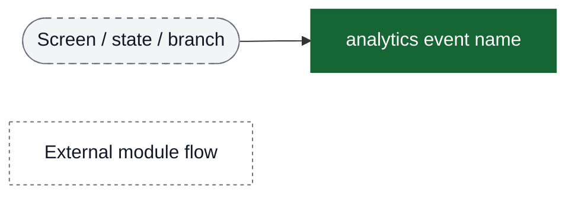
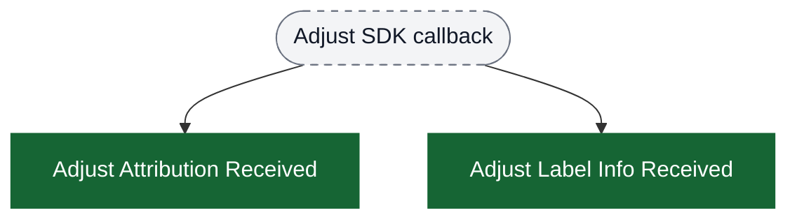
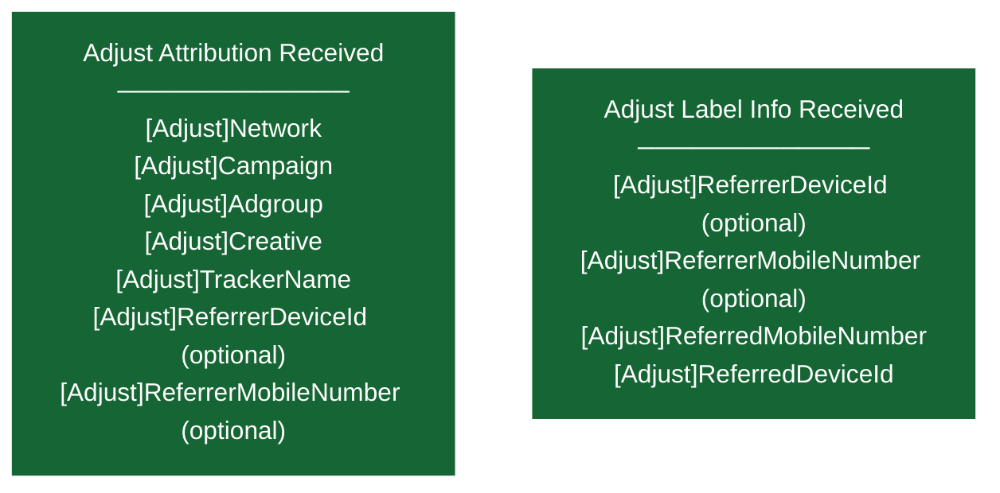
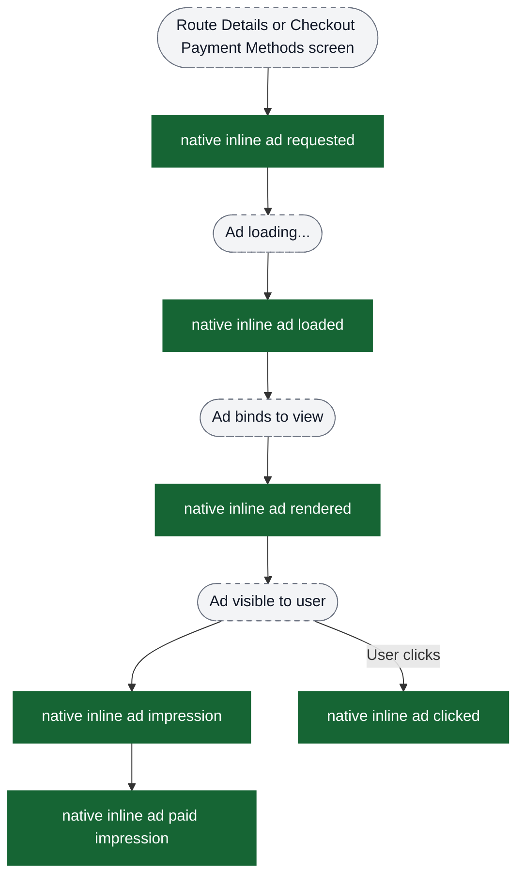
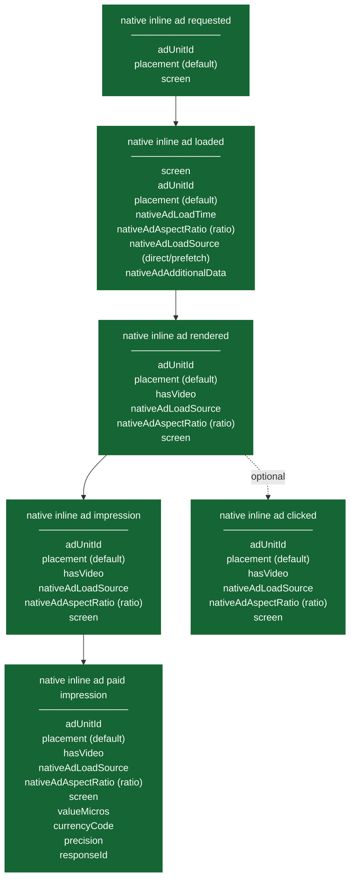
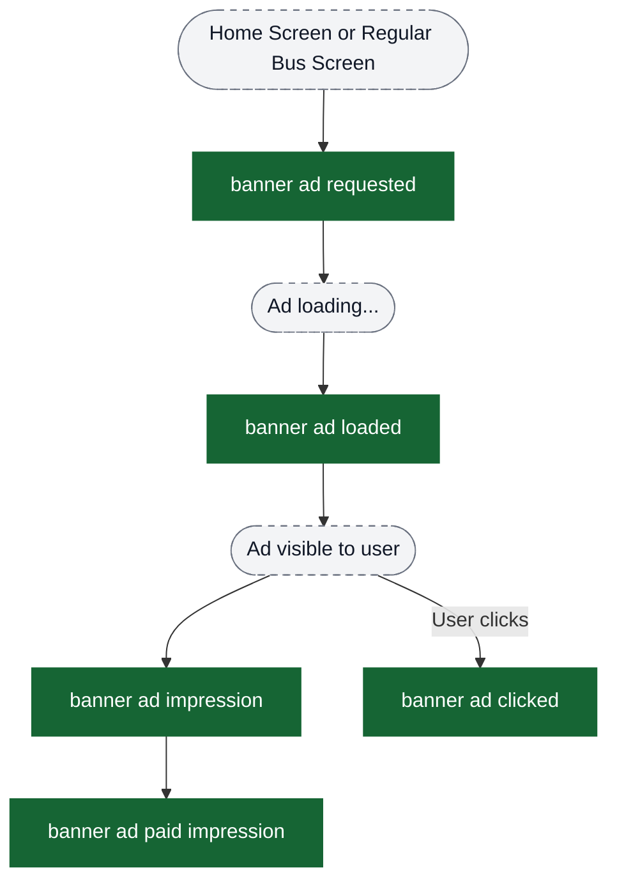
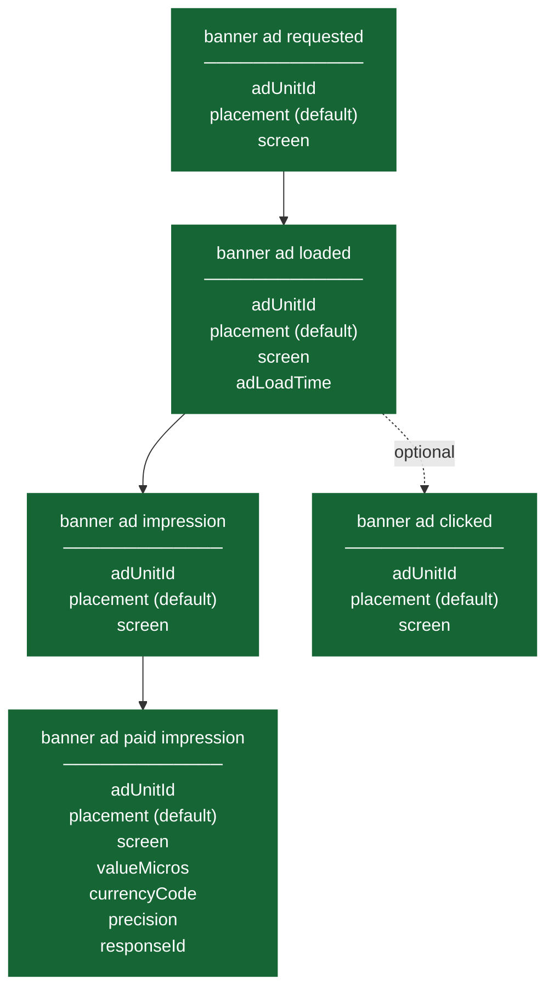

# Ads analytics event flow diagrams

These diagrams exist to help build funnels in analytics dashboards. Green nodes are the exact event strings emitted by the app; grey nodes are non-analytics context (screens/states/branches). Edges show the typical order and major forks.

Notes:
- All ad events are tracked with `sendToPlotline = false` and `frequency = Always`
- Native inline ads support prefetching, indicated by `nativeAdLoadSource` attribute
- Ad targeting parameters (city, language, location) are added to all ad requests
- Revenue tracking happens via paid impression events with `valueMicros`, `currencyCode`, `precision`, and `responseId`

Visual key:
- Green solid boxes: analytics events (exact strings from `events.json`)
- Grey dashed pills: screens/states/branches (not analytics events)
- Grey dotted boxes: external flows instrumented elsewhere



## Funnel: Adjust Attribution Callbacks

Adjust SDK callbacks received by the app (used for attribution diagnostics).



### Adjust Attribution Attributes by Event



## Ad Placements Overview

The app uses two types of ads across four placements:

**Native Inline Ads:**
- Route Details screen (`screen = "route details"`, `source = "route details"`)
- Checkout Payment Methods screen (`screen = "checkout payment methods"`, `source = "checkoutPaymentActivity"`)

**Banner Ads:**
- Home Screen (`screen = "home screen"`, `source = "homeScreenTab"`)
- Regular Bus Screen (`screen = "regular bus screen"`, `source = "regularBusScreenTab"`)

## Native Inline Ad Flow (Route Details & Checkout Payment Methods)

Complete lifecycle from request to revenue tracking.



### Native Inline Ad Attributes by Event



## Banner Ad Flow (Home Screen & Regular Bus Screen)

Complete lifecycle from request to revenue tracking.



### Banner Ad Attributes by Event



## Building Funnels

### Native Inline Ad Performance Funnel

For analyzing native ad performance on Route Details or Checkout Payment Methods:

```
native inline ad requested
  → native inline ad loaded (measure load success rate, load time)
  → native inline ad rendered (measure render success rate)
  → native inline ad impression (measure impression rate)
  → native inline ad clicked (measure CTR)
  → native inline ad paid impression (measure revenue)
```

**Key Metrics:**
- **Load Success Rate**: `loaded / requested`
- **Render Success Rate**: `rendered / loaded`
- **Impression Rate**: `impression / rendered`
- **Click-Through Rate (CTR)**: `clicked / impression`
- **Average Load Time**: `avg(nativeAdLoadTime)` from loaded events
- **Prefetch Effectiveness**: Compare `nativeAdLoadTime` by `nativeAdLoadSource`
- **Revenue per Impression**: `sum(valueMicros) / count(impression)`

**Segmentation:**
- By `screen` (route details vs checkout payment methods)
- By `nativeAdLoadSource` (direct vs prefetch)
- By `nativeAdAspectRatio` (ratio buckets; e.g., `>= 1.6` ≈ landscape)
- By `hasVideo` (video ads vs non-video ads)

### Banner Ad Performance Funnel

For analyzing banner ad performance on Home Screen or Regular Bus Screen:

```
banner ad requested
  → banner ad loaded (measure load success rate, load time)
  → banner ad impression (measure impression rate)
  → banner ad clicked (measure CTR)
  → banner ad paid impression (measure revenue)
```

**Key Metrics:**
- **Load Success Rate**: `loaded / requested`
- **Impression Rate**: `impression / loaded`
- **Click-Through Rate (CTR)**: `clicked / impression`
- **Average Load Time**: `avg(adLoadTime)` from loaded events
- **Revenue per Impression**: `sum(valueMicros) / count(impression)`

**Segmentation:**
- By `screen` (home screen vs regular bus screen)

### Cross-Ad Comparison

Compare performance across all ad placements:

**By Screen:**
- Route Details (native inline)
- Checkout Payment Methods (native inline)
- Home Screen (banner)
- Regular Bus Screen (banner)

**By Ad Type:**
- Native Inline Ads (more attributes, prefetch support)
- Banner Ads (simpler lifecycle)

### Revenue Analysis

Use paid impression events for revenue tracking:

```
Filter: event = "native inline ad paid impression" OR "banner ad paid impression"

Metrics:
- Total Revenue: sum(valueMicros) / 1,000,000 grouped by currencyCode
- Revenue by Screen: sum(valueMicros) grouped by screen
- Revenue by Ad Type: sum(valueMicros) grouped by event type
- Average Revenue per Impression: sum(valueMicros) / count(impressions)
```

## Important Notes for PM Dashboards

1. **All events have `placement = "default"`**: This attribute doesn't segment ads; use `screen` instead.

2. **Native ads have unique attributes**:
   - `nativeAdLoadSource`: Distinguish direct loads vs prefetched ads
   - `nativeAdAspectRatio`: Raw aspect ratio float (bucket in dashboards if needed)
   - `hasVideo`: Identify video vs static ads
   - `nativeAdAdditionalData`: Optional custom metadata from components

3. **Load time tracking**:
   - Native ads: `nativeAdLoadTime` in "native inline ad loaded"
   - Banner ads: `adLoadTime` in "banner ad loaded"

4. **Click events are optional**: Not all impressions result in clicks; use impression events as the denominator for CTR.

5. **Paid impressions contain revenue data**: Use `valueMicros`, `currencyCode`, `precision`, and `responseId` for monetization analysis.

6. **Source attribution**:
   - Route Details: `source = "route details"`
   - Checkout Payment Methods: `source = "checkoutPaymentActivity"`
   - Home Screen: `source = "homeScreenTab"`
   - Regular Bus Screen: `source = "regularBusScreenTab"`

7. **Event frequency**: All events are tracked with `frequency = Always` (not sampled).

8. **Plotline integration**: All ad events have `sendToPlotline = false`.
