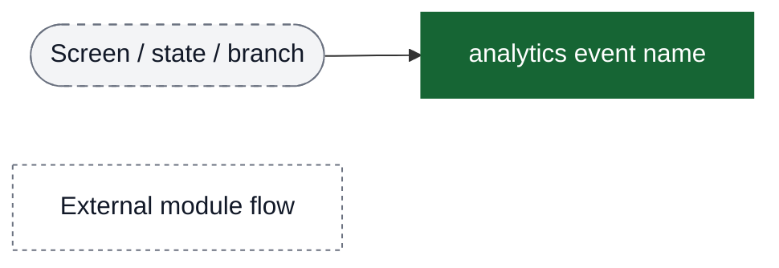
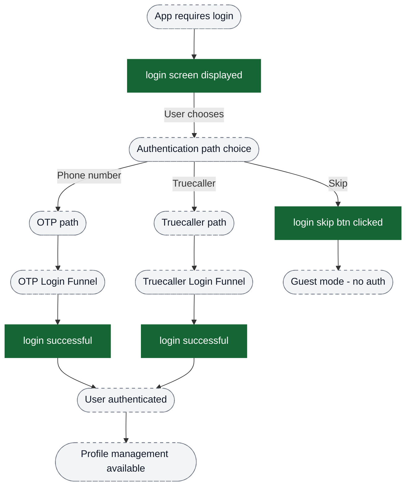
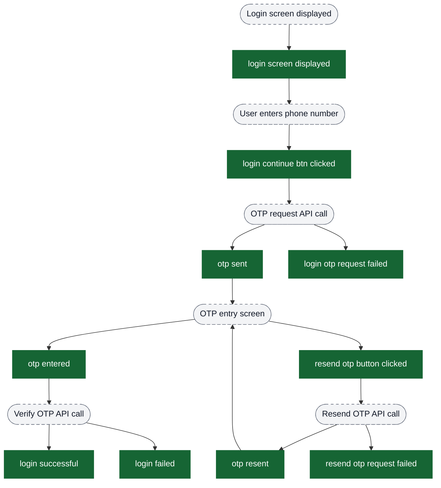
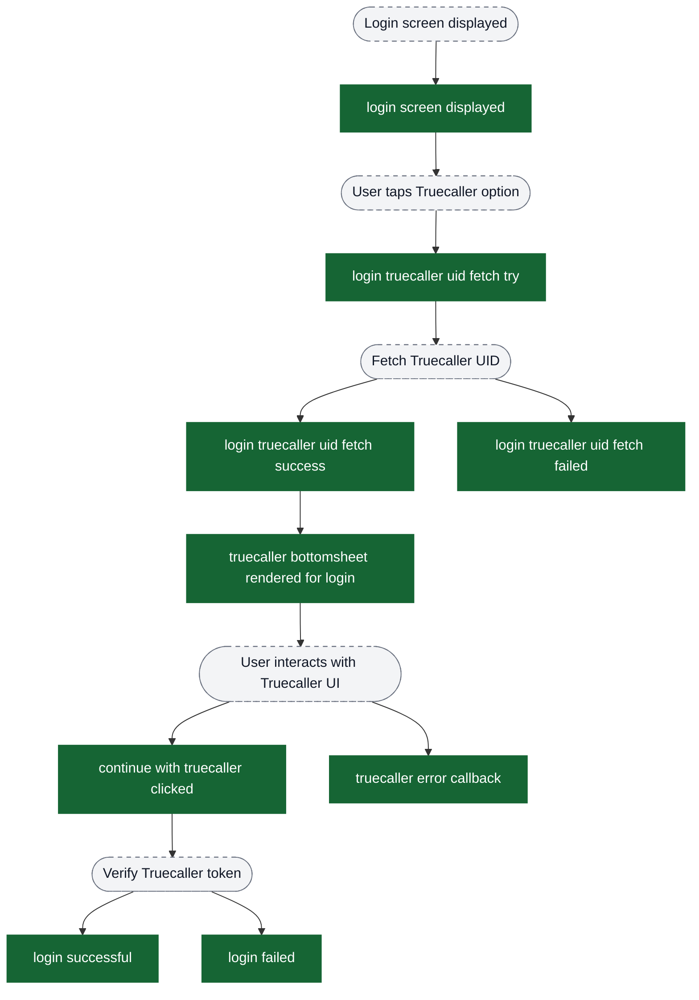
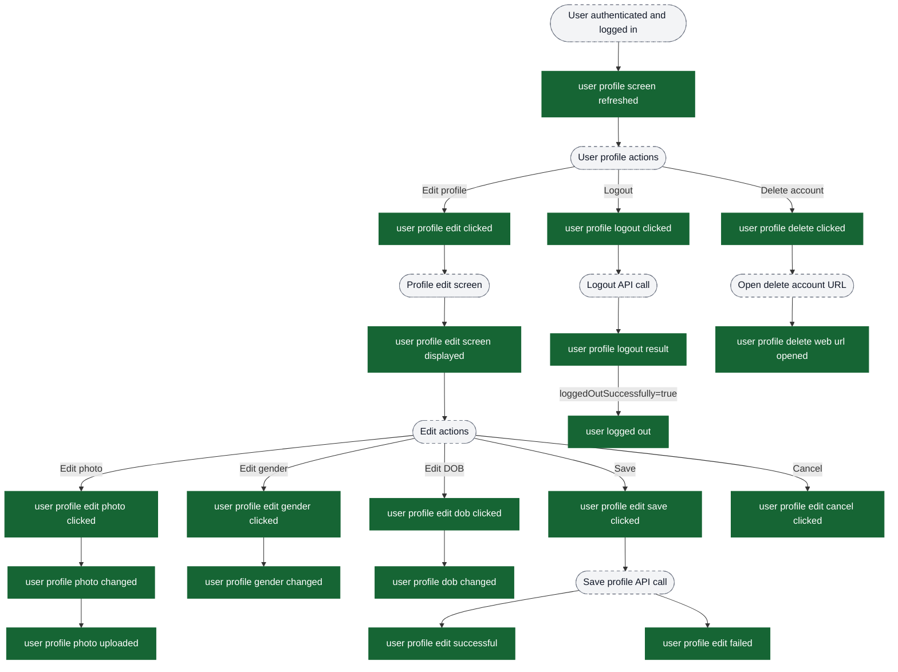
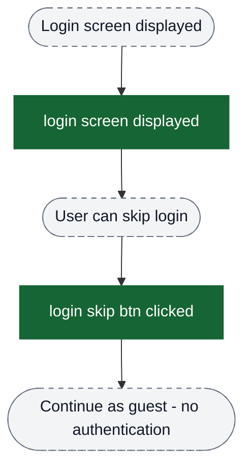

# Authentication flow analytics event flow diagrams

These diagrams exist to help build funnels in analytics dashboards. Green nodes are the exact event strings emitted by the app; grey nodes are non-analytics context (screens/states/branches). Edges show the typical order and major forks.

Notes:
- Authentication has two primary paths: **OTP-based login** (phone number) and **Truecaller login**
- Users can skip login entirely via the "skip" button
- Profile management events are logged post-authentication
- `login successful` and `login failed` can be emitted from either the login options screen (Truecaller path) or OTP verification screen (OTP path)

Visual key:
- Green solid boxes: analytics events (exact strings from `events.json`)
- Grey dashed pills: screens/states/branches (not analytics events)
- Grey dotted boxes: external flows instrumented elsewhere



## Overall authentication flow structure



## Funnel 1: OTP-based login (phone number)



### Key metrics for OTP funnel:
- **Conversion rate**: `login screen displayed` → `login continue btn clicked` → `otp sent` → `otp entered` → `login successful`
- **Failure points**: Track `login otp request failed` (network/API issues) vs `login failed` (invalid OTP)
- **Resend rate**: `resend otp button clicked` / `otp sent` (indicates OTP delivery issues)

## Funnel 2: Truecaller login



### Key metrics for Truecaller funnel:
- **Availability**: `login truecaller uid fetch try` → `login truecaller uid fetch success` (Truecaller availability rate)
- **Conversion rate**: `truecaller bottomsheet rendered for login` → `continue with truecaller clicked` → `login successful`
- **Failure points**: Track `login truecaller uid fetch failed` (app not installed) vs `truecaller error callback` (user cancelled) vs `login failed` (verification failed)

## Funnel 3: User profile management (post-authentication)



### Key metrics for profile management:
- **Profile completion rate**: Track which fields users update (`user profile photo changed`, `user profile gender changed`, `user profile dob changed`)
- **Edit success rate**: `user profile edit save clicked` → `user profile edit successful` vs `user profile edit failed`
- **Logout success**: Track `user profile logout result` with `loggedOutSuccessfully` attribute
- **Account deletion intent**: `user profile delete clicked` → `user profile delete web url opened` (funnel drop-off indicates friction)

## Skip login path



### Key metrics for skip login:
- **Skip rate**: `login skip btn clicked` / `login screen displayed` (indicates authentication friction or value proposition issues)

## Property usage guide

### method property (login successful / login failed)
Used to segment authentication success/failure by method:
- `"otp"` - Phone number + OTP verification
- `"trueCaller"` - Truecaller authentication

Example funnel filter: `login successful WHERE method = "otp"` vs `login successful WHERE method = "trueCaller"`

### countryCallingCode property
Tracks international user distribution and can identify country-specific OTP delivery issues.

Example: `otp sent WHERE countryCallingCode = "+91"` (India) vs `"+1"` (US/Canada)

### reason property
Critical for debugging failures. Used in:
- `login failed` - Indicates why authentication failed (e.g., "Invalid otp entered", network errors)
- `truecaller error callback` - Truecaller-specific errors (user cancelled, network issues, etc.)
- `user profile edit failed` - Profile update failure reasons

### loggedOutSuccessfully property
Boolean flag on `user profile logout result` to distinguish successful vs failed logout attempts.

Example: `user profile logout result WHERE loggedOutSuccessfully = false` (to investigate logout issues)

## Common funnel patterns for PMs

### 1. Overall authentication conversion
```
login screen displayed
  → login continue btn clicked OR continue with truecaller clicked
  → otp sent OR truecaller bottomsheet rendered for login
  → login successful
```

### 2. OTP delivery success
```
login continue btn clicked
  → otp sent (success)
  → login otp request failed (failure)
```

### 3. OTP verification success
```
otp entered
  → login successful (success)
  → login failed (failure)
```

### 4. Truecaller availability and conversion
```
login truecaller uid fetch try
  → login truecaller uid fetch success (Truecaller available)
  → truecaller bottomsheet rendered for login
  → continue with truecaller clicked
  → login successful
```

### 5. Profile edit completion
```
user profile edit clicked
  → user profile edit screen displayed
  → user profile edit save clicked
  → user profile edit successful
```

### 6. Account deletion funnel
```
user profile delete clicked
  → user profile delete web url opened
```
(Drop-off between these two events indicates issues opening the deletion URL)
