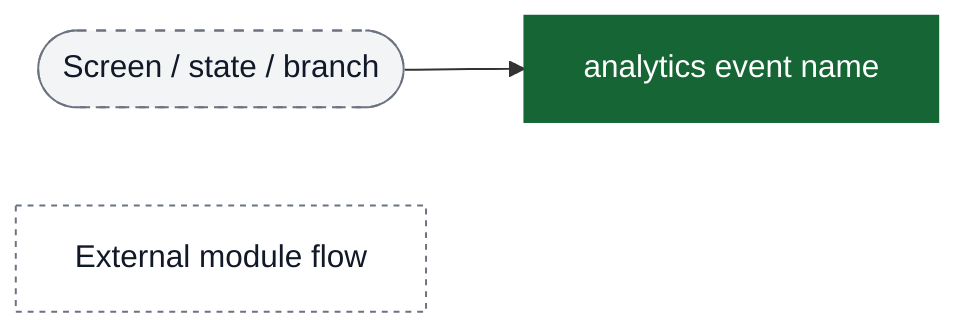
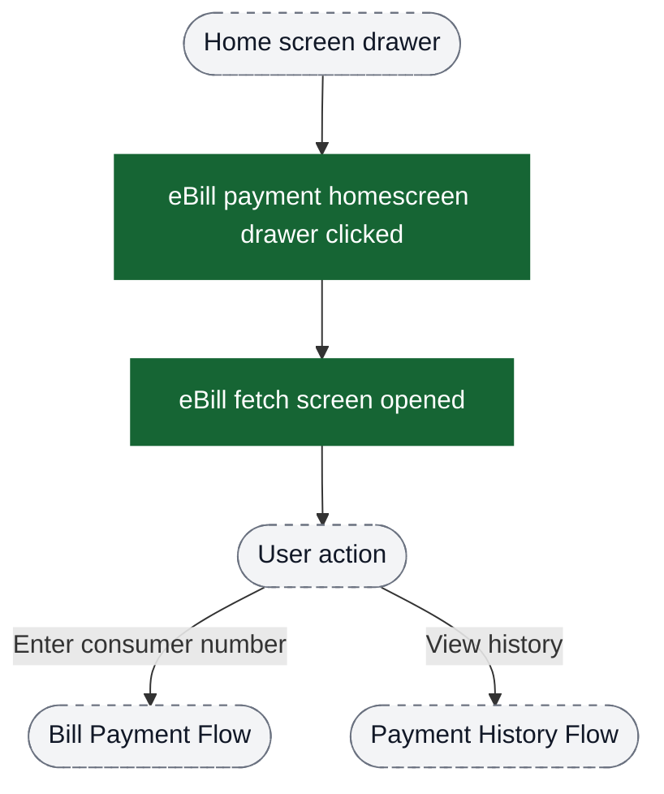
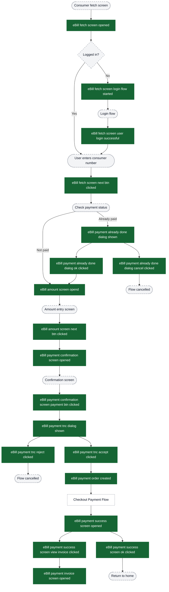
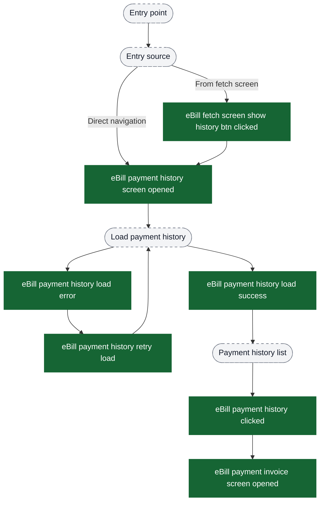
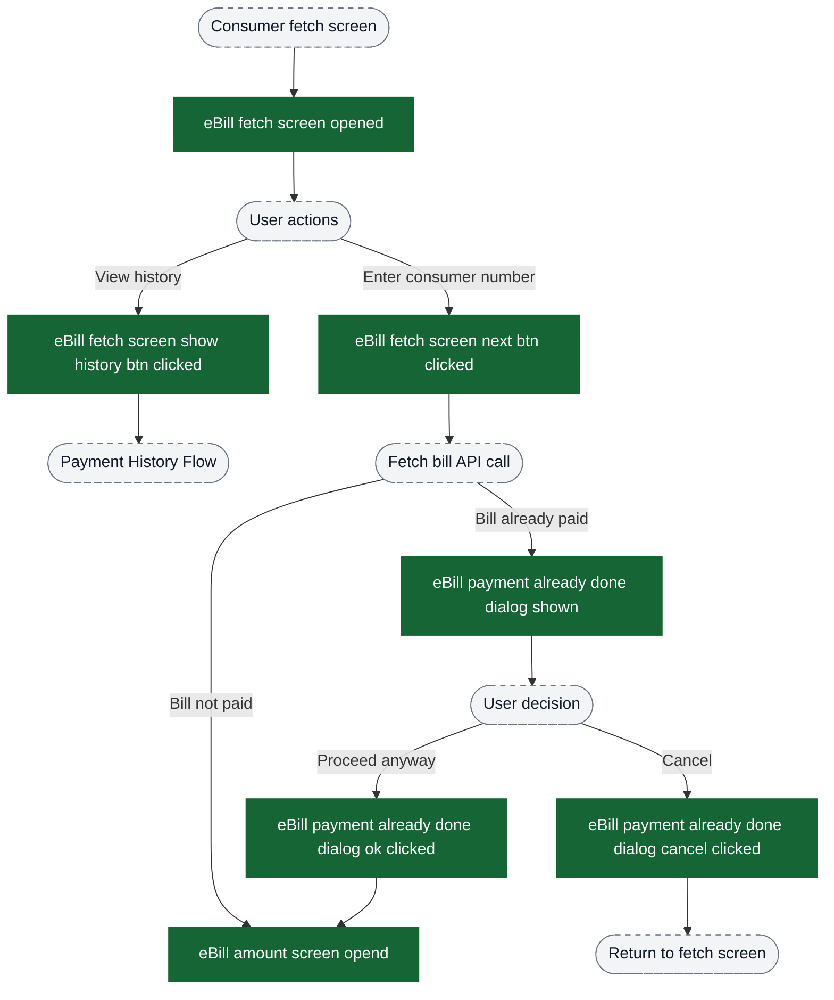
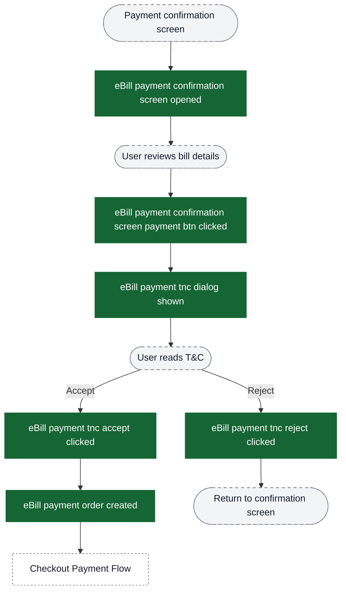
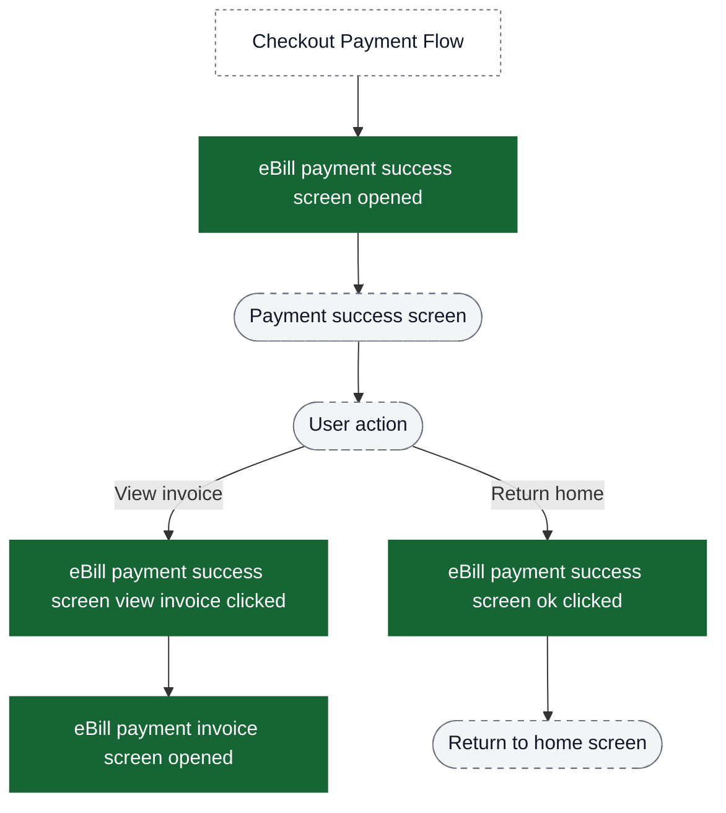

# Bills analytics event flow diagrams

These diagrams exist to help build funnels in analytics dashboards. Green nodes are the exact event strings emitted by the app; grey nodes are non-analytics context (screens/states/branches). Edges show the typical order and major forks.

Notes:
- The Bills flow has two main paths: **Bill Payment** (consumer number → amount → confirmation → payment) and **Payment History** (view past payments → view invoice)
- Users can enter from home screen drawer
- After payment completion, flow connects with Checkout payment flow (instrumented in payment module)
- Payment history can be accessed from fetch screen or as a standalone feature

Visual key:
- Green solid boxes: analytics events (exact strings from `events.json`)
- Grey dashed pills: screens/states/branches (not analytics events)
- Grey dotted boxes: external flows instrumented elsewhere



## Entry point → Bill Payment or Payment History



## Funnel: Complete Bill Payment Flow



## Funnel: Payment History Flow



## Funnel: Consumer Fetch with Already-Paid Dialog



## Funnel: Payment Confirmation with T&C



## Funnel: Payment Success and Invoice



## Key Conversion Funnels for PMs

### Primary Payment Funnel (End-to-End)
```
1. eBill payment homescreen drawer clicked
2. eBill fetch screen opened
3. eBill fetch screen next btn clicked
4. eBill amount screen opend
5. eBill amount screen next btn clicked
6. eBill payment confirmation screen opened
7. eBill payment confirmation screen payment btn clicked
8. eBill payment tnc dialog shown
9. eBill payment tnc accept clicked
10. eBill payment order created
11. [Checkout Payment Flow - external]
12. eBill payment success screen opened
```

**Drop-off points to monitor:**
- Fetch screen → Amount screen (consumer number validation failures)
- Confirmation screen → T&C acceptance (user hesitation)
- T&C acceptance → Order creation (order creation API failures)
- Order creation → Success screen (payment gateway failures - tracked in checkout flow)

### Payment History Funnel
```
1. eBill fetch screen show history btn clicked (or direct navigation)
2. eBill payment history screen opened
3. eBill payment history load success
4. eBill payment history clicked
5. eBill payment invoice screen opened
```

**Drop-off points to monitor:**
- History screen → Load success (API failures)
- Load success → History item click (empty history or UX issues)

### Already-Paid Dialog Funnel
```
1. eBill fetch screen next btn clicked
2. eBill payment already done dialog shown
3. eBill payment already done dialog ok clicked (vs cancel clicked)
4. eBill amount screen opend
```

**Metrics to track:**
- Dialog shown rate (indicates repeat payment attempts)
- OK vs Cancel click rate (user intent to pay again)
