# Card analytics event flow diagrams

These diagrams exist to help build funnels in analytics dashboards. Green nodes are the exact event strings emitted by the app; grey nodes are non-analytics context (screens/states/branches). Edges show the typical order and major forks.

Notes:
- The Card flow has multiple independent paths: **Chalo Card** operations, **NCMC** operations, and **Tap** operations
- Users can enter from multiple entry points (home screen, drawer)
- Chalo Card and NCMC have different recharge flows
- Not all events fire in sequence - some are parallel or conditional based on card type

Visual key:
- Green solid boxes: analytics events (exact strings from `events.json`)
- Grey dashed pills: screens/states/branches (not analytics events)
- Grey dotted boxes: external flows instrumented elsewhere

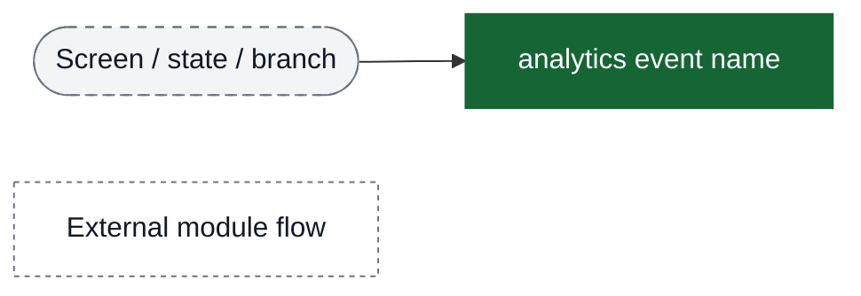

## Entry points → card type branches

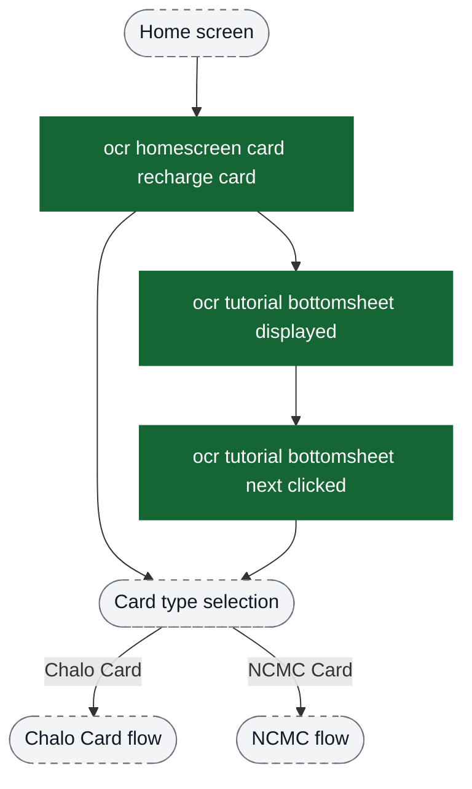

## Funnel: Chalo Card info → link or recharge

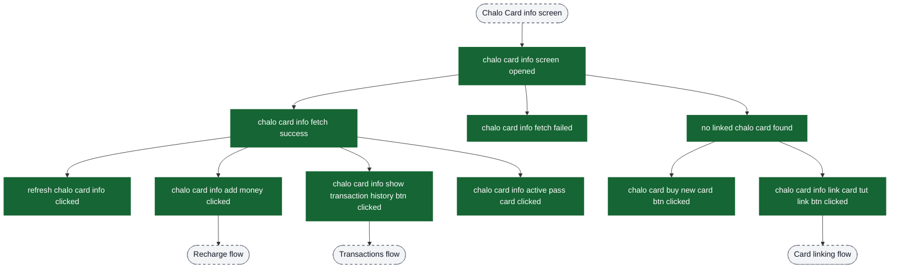

## Funnel: Chalo Card linking

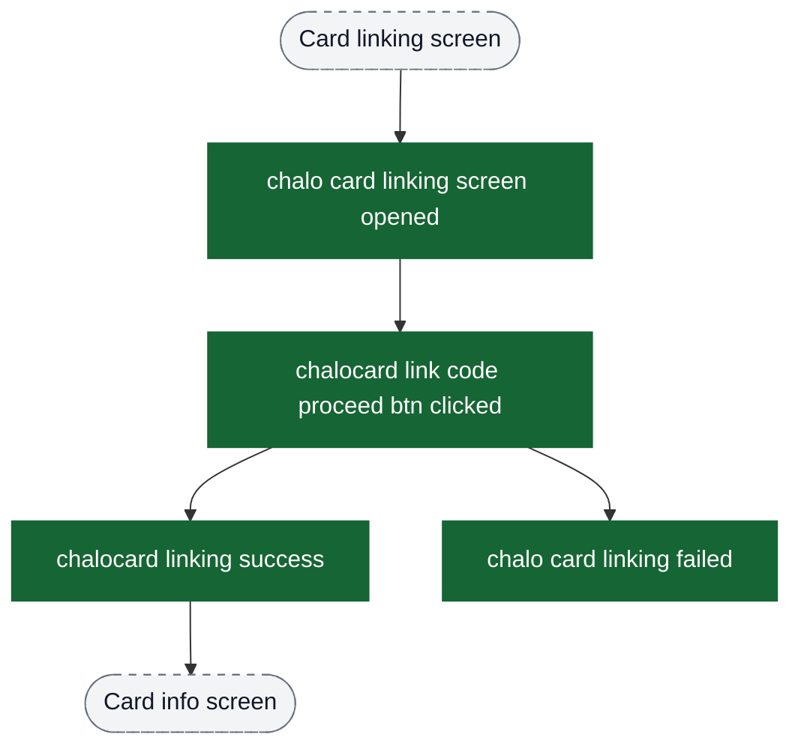

## Funnel: Chalo Card recharge → payment → success

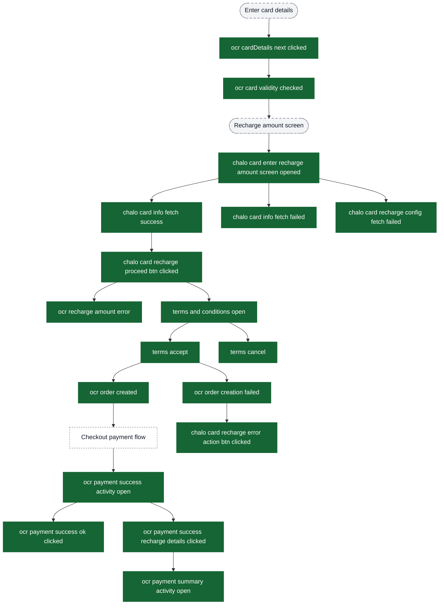

## Funnel: Card transactions history

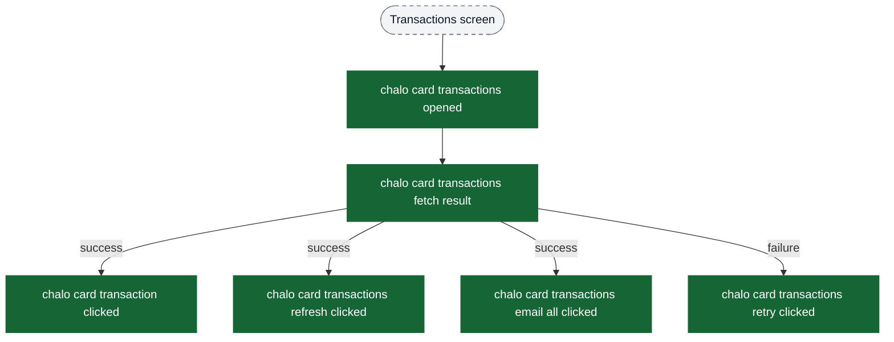

## Funnel: NCMC online recharge

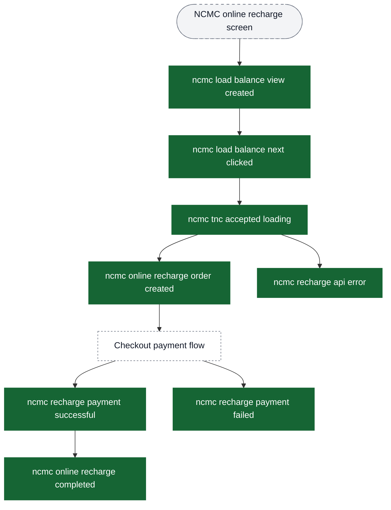

## Funnel: NCMC offline recharge

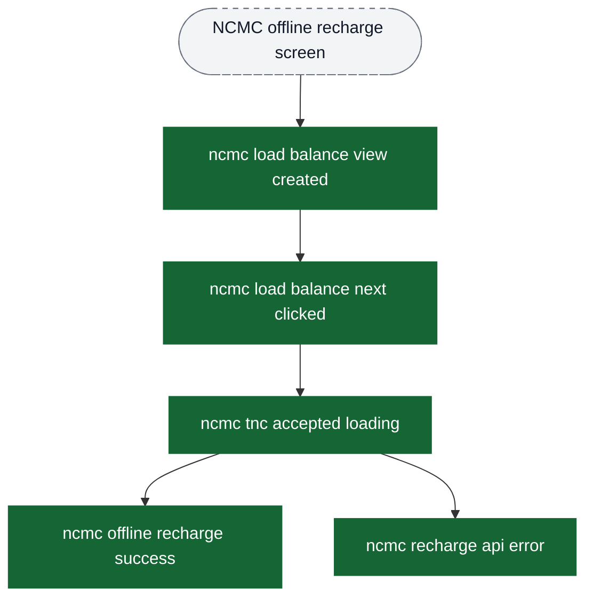

## Funnel: NCMC tap operations (NFC)

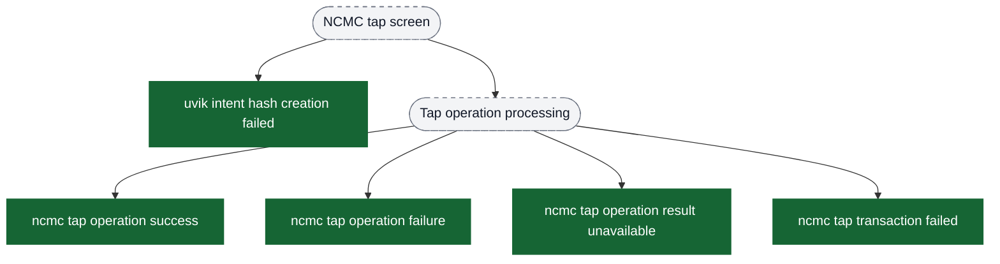

## Checkout payment events (shared across card types)

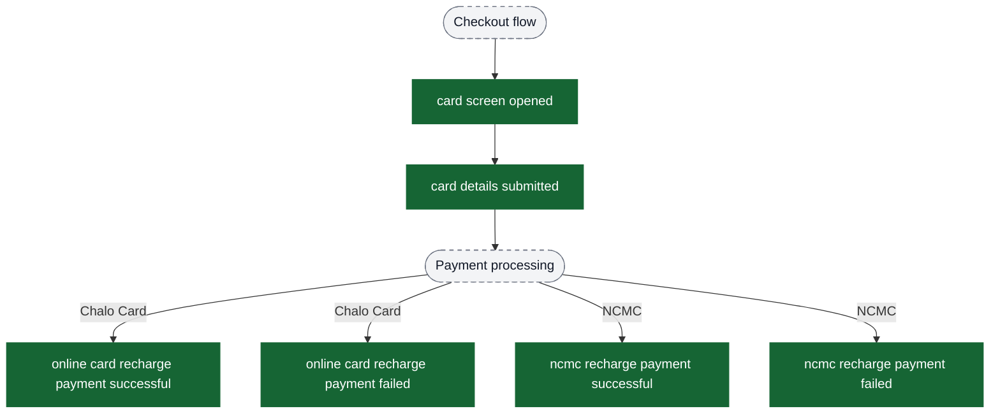

## Global events (can fire from anywhere)

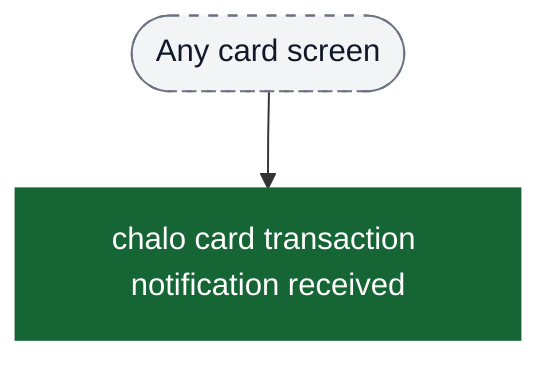

## Complete flow overview

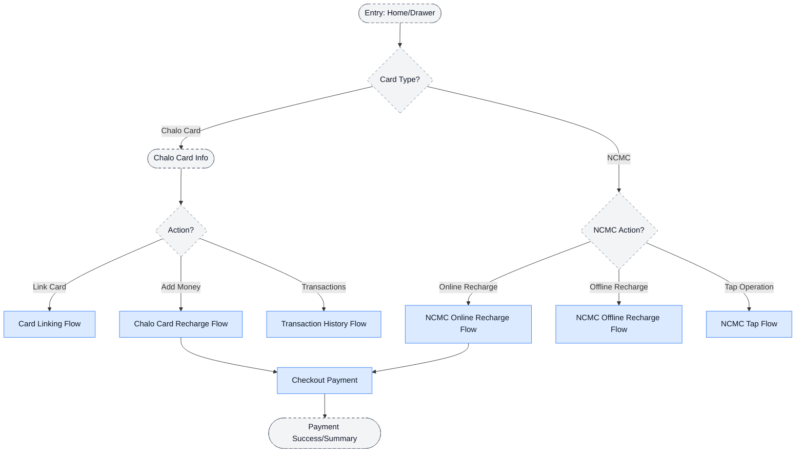
