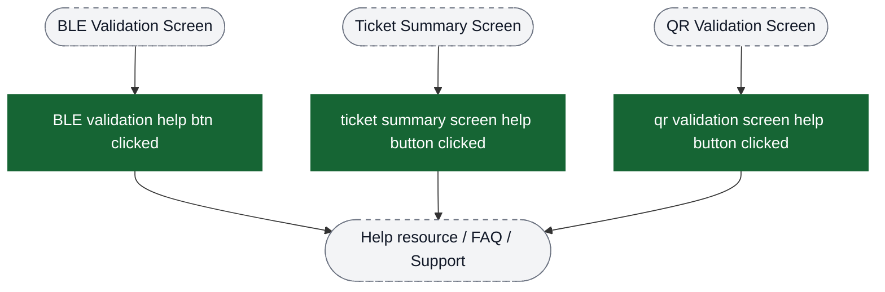

# Help & Support analytics event flow diagrams

These diagrams exist to help build funnels in analytics dashboards. Green nodes are the exact event strings emitted by the app; grey nodes are non-analytics context (screens/states/branches). Edges show the typical order and major forks.

Notes:
- The help flow has three main branches: **Booking Help**, **SOS Emergency Alert**, and **Report Problem**
- Each branch operates independently with its own entry points and flows
- Context-specific help buttons can appear throughout the app and are tracked separately

Visual key:
- Green solid boxes: analytics events (exact strings from `events.json`)
- Grey dashed pills: screens/states/branches (not analytics events)
- Grey dotted boxes: external flows instrumented elsewhere


## Entry Points: Three Main Help Branches

Help & support functionality is accessed through three independent entry points.


## Funnel 1: Booking Help → FAQ → Cancellation

This funnel tracks users who access booking-specific help and potentially cancel their bookings.


## Funnel 2: SOS Emergency Alert → Contact Management → Alert Sending

This funnel tracks emergency SOS alert functionality including contact management and alert transmission.


## Funnel 3: Report Problem → Reclaim Operations

This funnel tracks general issue reporting and pass reclaim operations.


## Context-Specific Help Buttons (Global)

Help buttons appear throughout the app on various screens. These are tracked independently.



## Funnel: Report Problem Feature (In-Flow Help)

Some flows use the shared Report Problem feature, which emits its own instrumentation when the list is rendered and when the user selects a problem.


## Funnel: Chat Support (Freshchat)


## Funnel: Auto Reclaim (Background)


## Property Usage Patterns

### Booking Help Events
All booking help events include:
- `bookingId` - To track which booking the help request relates to
- `bookingHelpFaqCount` - Number of FAQs shown (on screen open)
- `bookingHelpFaqActionType` - Action selected (CANCEL_BOOKING, NONE)
- `bottomSheetType` - Type of bottom sheet for button clicks
- `pass status` / `message` - API response details for cancellation

### SOS Events
All SOS alert events include location and user context:
- `userMobile` - User's mobile number
- `lat` / `long` - Current GPS coordinates
- `timeStamp` - When the event occurred
- `sosSentSuccessfully` - Whether message sent to contacts (on confirm)
- `errorType` - Type of error (on failure events)

### Report Problem Events
Most events have minimal properties:
- `ss reclaim type` - For super saver reclaim operations
- `isDeviceAutoLinked` - For auto-link device scenarios

## Building Funnels

### Recommended Funnels

**1. Booking Cancellation Funnel:**
```
booking help screen opened
  → booking help faq action clicked (filter: actionType = CANCEL_BOOKING)
    → booking cancel api success OR booking cancel api failure
      → booking help bottom sheet positive/negative button clicked
```

**2. SOS Alert Success Funnel:**
```
sos screen open
  → sos send alert clicked
    → sos confirm send alert clicked (filter: sosSentSuccessfully = true)
      → raise SOS success
```

**3. SOS Alert Failure Funnel:**
```
sos screen open
  → sos send alert clicked
    → sos confirm send alert clicked (filter: sosSentSuccessfully = false)
      → raise SOS failed
```

**4. Reclaim Operations Funnel:**
```
reclaim card shown
  → reclaim card button clicked
    → reclaim dialog positive button clicked
```

### Segmentation Recommendations

- **Booking Help**: Segment by `bookingHelpFaqActionType` to see which actions are most common
- **SOS**: Segment by `errorType` to identify common failure modes
- **Cancellation**: Segment by `pass status` (Success vs Failed) to track API reliability
- **Help Buttons**: Track click-through rates by screen type to identify where users need most help
