# History flow analytics event flow diagrams

These diagrams exist to help build funnels in analytics dashboards. Green nodes are the exact event strings emitted by the app; grey nodes are non-analytics context (screens/states/branches). Edges show the typical order and major forks.

Notes:
- The History flow encompasses both the **Active** and **Expired/History** tabs within the My Tickets screen
- Events track tab selection, page rendering with booking counts, individual product interactions, and flows like activation, renewal, reclaim, and purchase
- My Tickets tab events originate from `Source.MY_TICKETS_SCREEN_TAB`
- Ticket Summary screen events originate from `Source.TICKET_SUMMARY_SCREEN` (except `ticket summary screen opened`, whose `source` varies by entrypoint)

Visual key:
- Green solid boxes: analytics events (exact strings from `events.json`)
- Grey dashed pills: screens/states/branches (not analytics events)
- Grey dotted boxes: external flows instrumented elsewhere

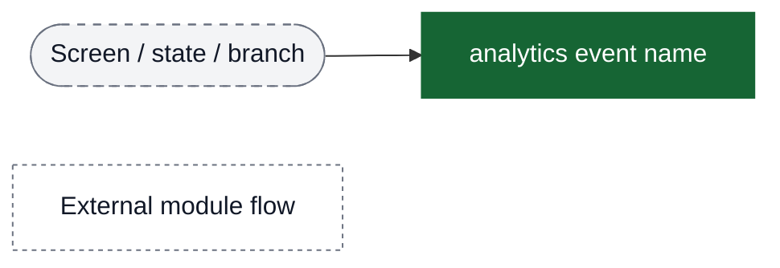

## Entry → Tab Selection → Page Rendering

The primary funnel starts with tab selection and page rendering events that include booking counts.

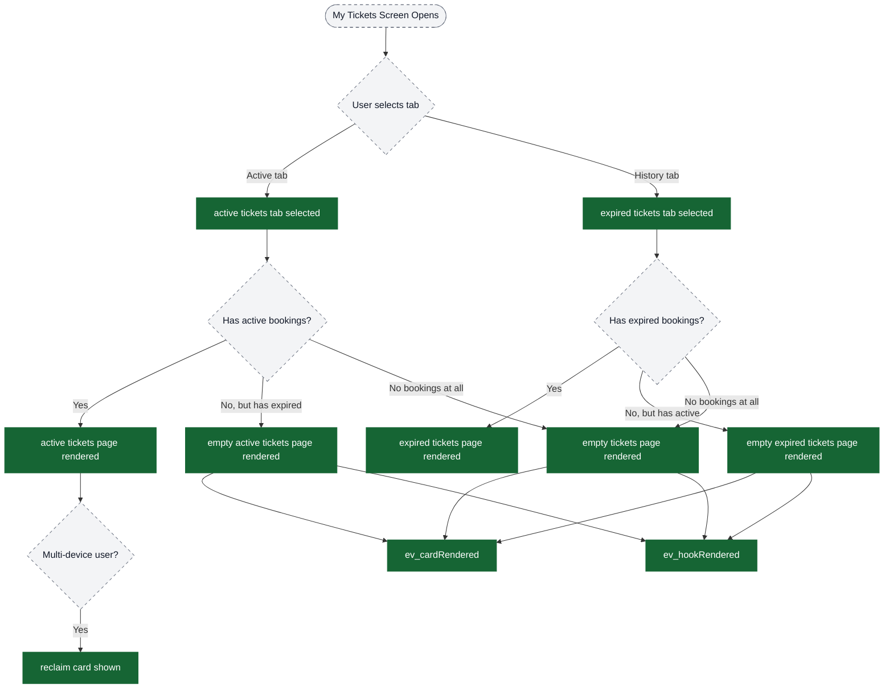

## Funnel: Product Card Interactions → Use/View/Renew

Users interact with product cards to activate, view details, or renew passes.

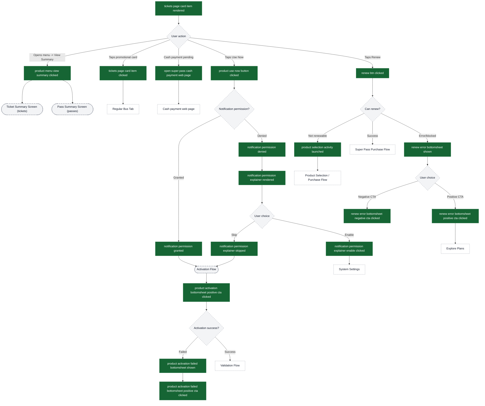

## Funnel: View Summary → Ticket Summary (Data Fetch → Actions)

This funnel is what PMs typically use to build “opened summary → loaded → acted” funnels.

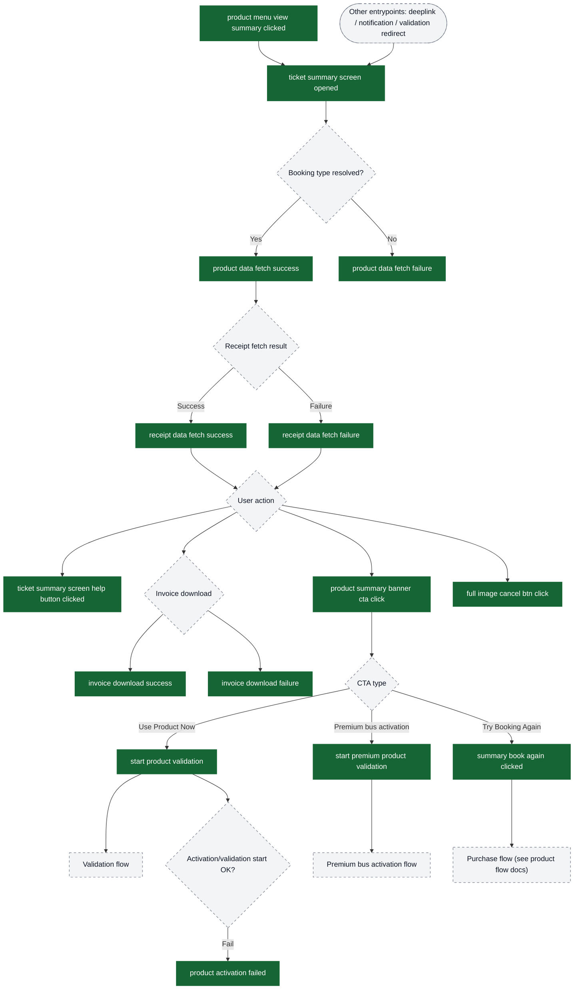
External modules referenced here:
- Validation: `docs/analytics/validation/`
- Premium bus activation: `content/analytics/premium-bus-activation-tracking/`

## Funnel: Promotional Hooks → Purchase Flow

Users can discover and purchase products through promotional hooks and dedicated purchase CTAs.

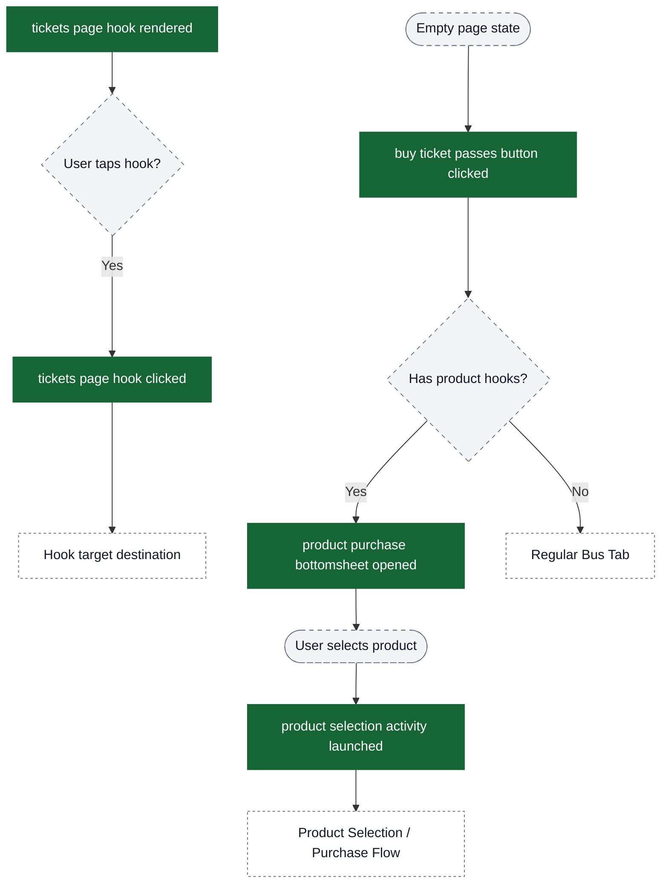

## Funnel: Product Reclaim (Multi-Device)

Users with products on multiple devices see a reclaim card and can link devices to access all bookings.

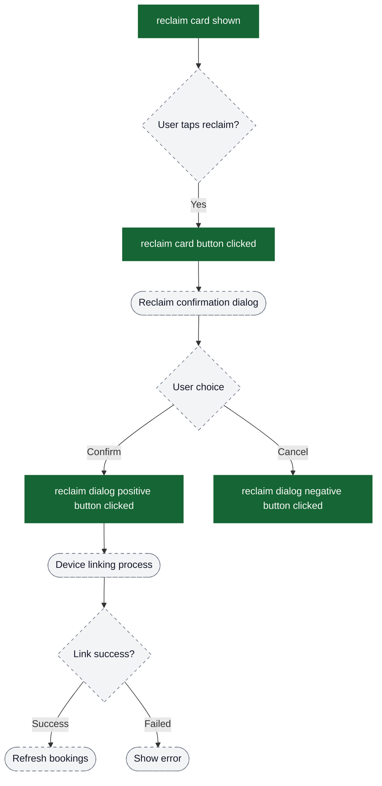

## Global: Support & Help

The report problem flow is accessible from anywhere within the history screen.

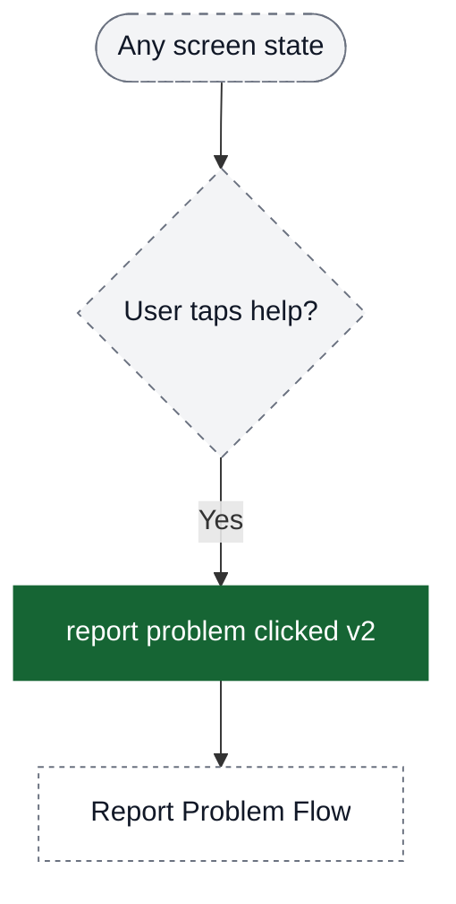

## Funnel: History Sync (Background)

History sync runs in the background to refresh bookings. These events help diagnose sync reliability.

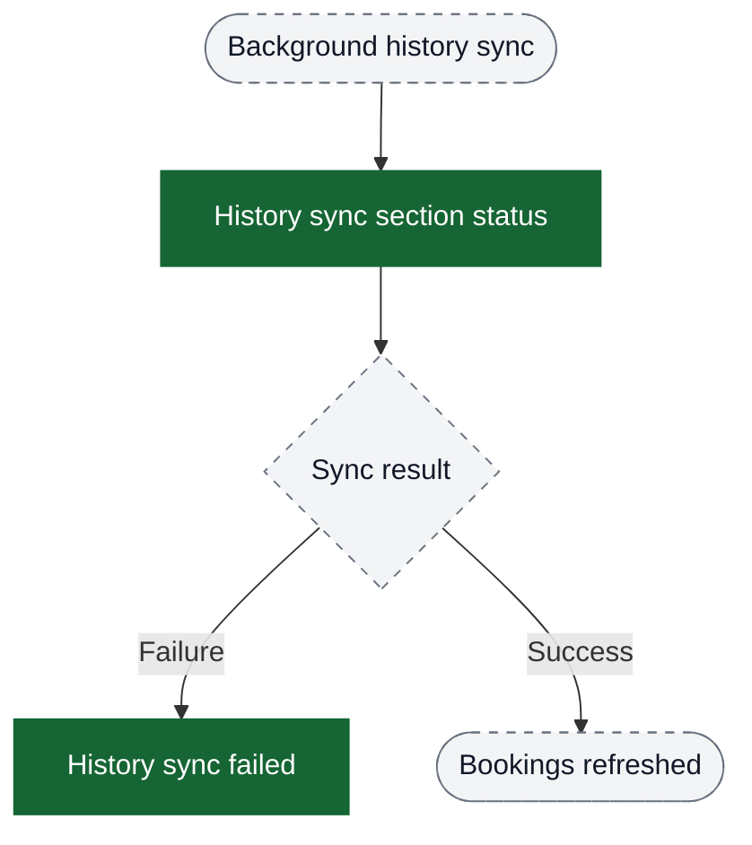

## Funnel: Product Status & Renew Disabled

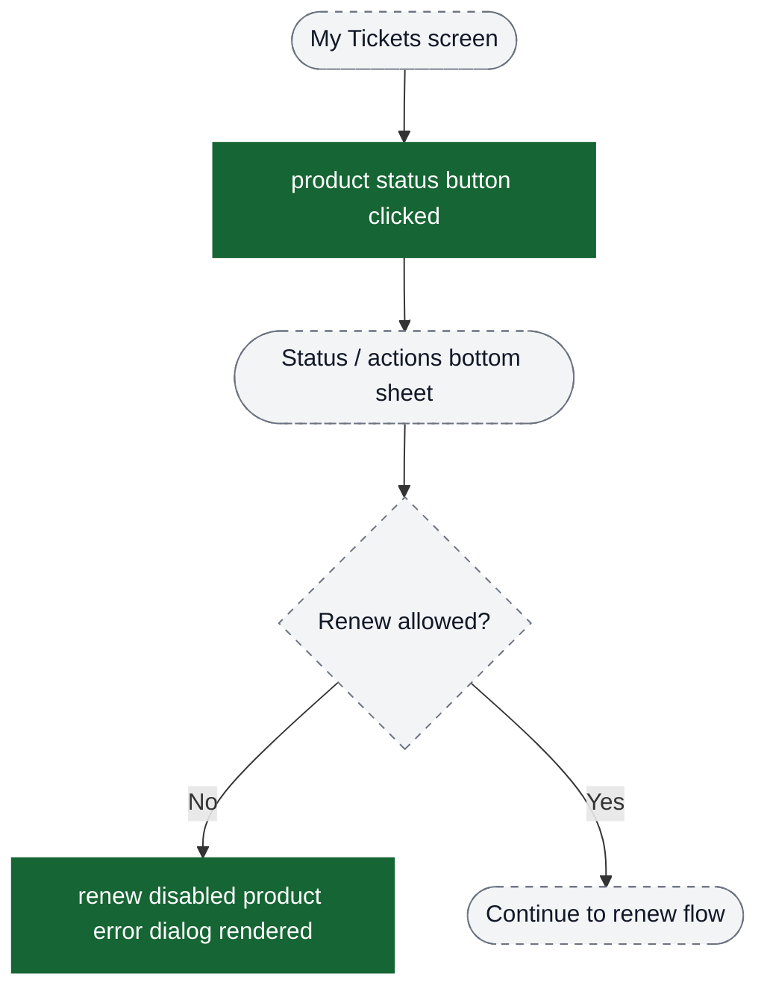

## Funnel: View Summary → Pass Summary → Trip Receipt

This funnel covers pass summary and trip receipt discovery from a booking.

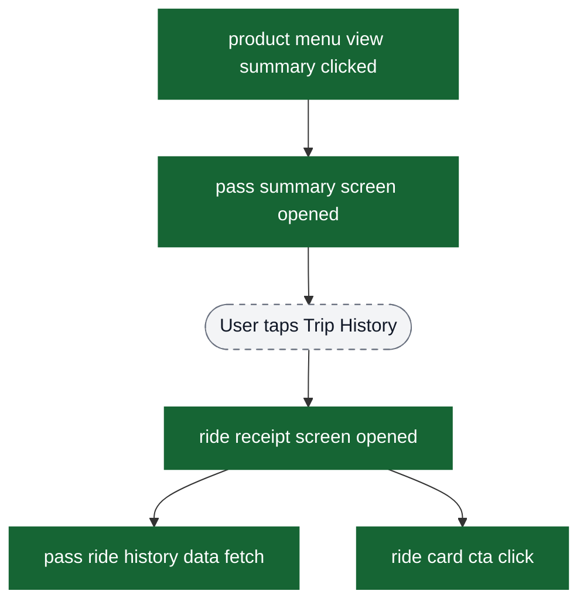

## Funnel: Activation Merge (Super Pass)

This is the post-purchase activation/update surface that can be reached from History flows.

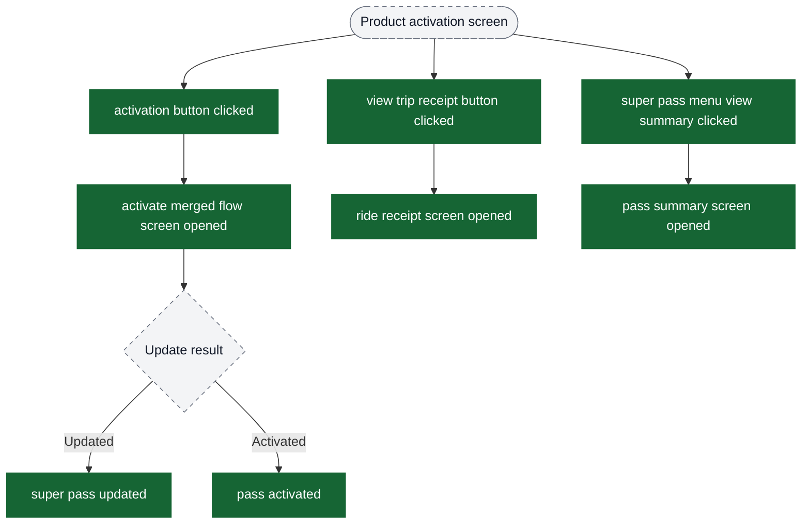

## Funnel: Ride Feedback

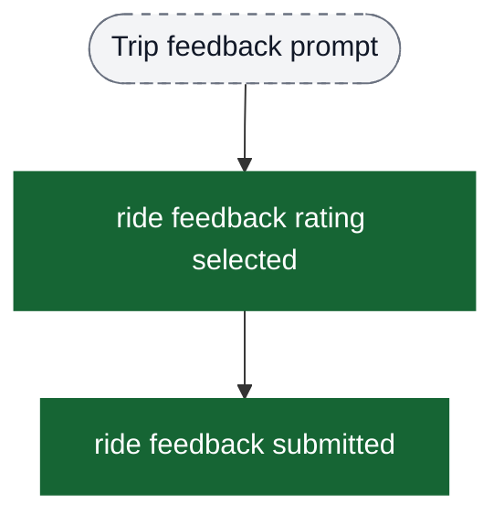

## Key Analytics Properties by Stage

### Page Rendering Events
All page rendering events that show bookings include these counts:
- `ride based pass booking count`
- `magic pass booking count`
- `super pass application booking count`
- `pending super pass application booking count`
- `quick pay booking count`
- `mobile ticket booking count`
- `instant ticket booking count`
- `premium bus booking count`

### Product Interaction Events
Events like `product use now button clicked`, `product menu view summary clicked`, and activation/renewal CTAs include:
- `productType`
- `productSubType`
- `bookingId`

### Ticket Summary Events
The Ticket Summary screen adds these properties:
- `ticketRequestType` + `bookingId` on `ticket summary screen opened`, `product data fetch success/failure`, `receipt data fetch success/failure`
- `bannerCtaType` on `product summary banner cta click`
- `errorMessage` on `invoice download failure`
- `passRequestType` on `summary book again clicked` (currently carries booking id string)

### Renew Button Clicked
The `renew btn clicked` event includes comprehensive super pass metadata:
- `isSuperPass` (always true)
- `passId`, `productId`, `productName`
- `categoryId`, `fareMappingId`
- `pass status`, `verificationFlag`, `verificationExpiryTime`, `expiry time`
- `paymentMode`, `transaction id`, `startDate`
- `isRenewFromProductStatusCard` (boolean flag)

### Hook Events
Both `tickets page hook rendered` and `tickets page hook clicked` include:
- `type` (hook feature type)
- `position` (zero-indexed)
- `title`
- `desc list` (array)
- `tag list` (array)
- `image url`

## Funnel Building Tips

1. **Tab-specific funnels**: Use `active tickets tab selected` or `expired tickets tab selected` as funnel start
2. **Booking type funnels**: Filter by specific booking count properties (e.g., `magic pass booking count > 0`)
3. **Activation funnels**: Track from `product use now button clicked` → notification flow → activation result
4. **Renewal funnels**: Track from `renew btn clicked` → error handling → purchase completion
5. **Multi-device funnels**: Track from `reclaim card shown` → reclaim dialog → device linking
6. **Purchase funnels**: Track from empty states → `buy ticket passes button clicked` → bottom sheet → purchase
7. **Hook engagement**: Track `tickets page hook rendered` → `tickets page hook clicked` with `position` and `type` properties
