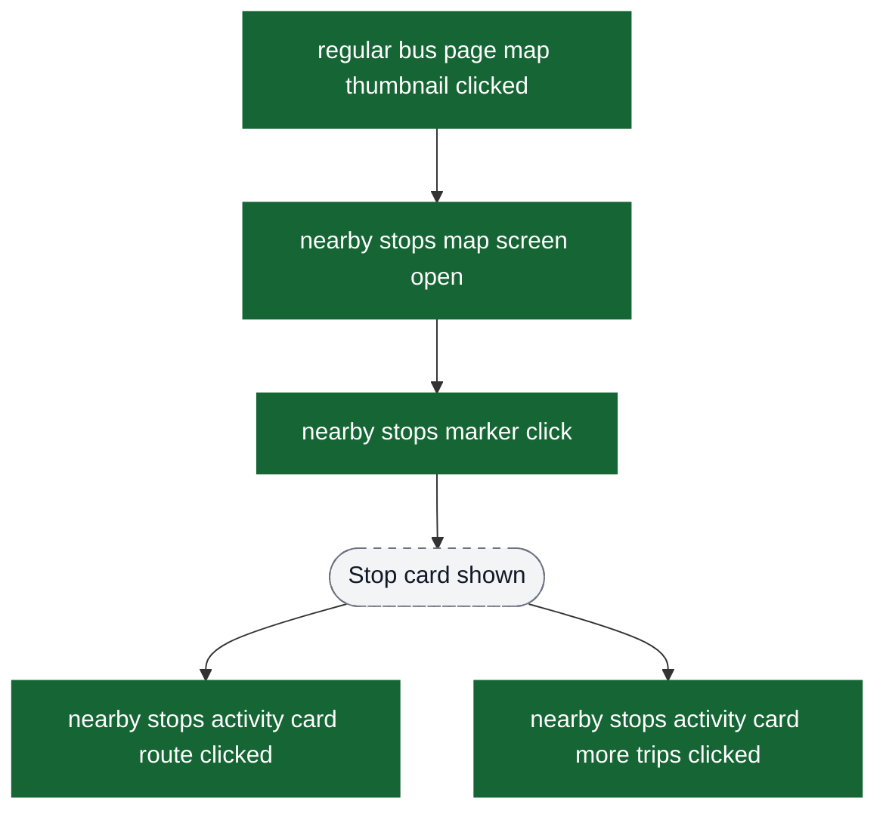

# Home Flow Analytics Event Flow Diagrams

These diagrams exist to help build funnels in analytics dashboards. Green nodes are the exact event strings emitted by the app; grey nodes are non-analytics context (screens/states/branches). Edges show the typical order and major forks.

Notes:
- The home flow spans **5 main tabs**: Home, Regular Bus, Chalo Bus, Profile, and Tickets
- Location-related events (`gps request on`, `location update received`, etc.) fire across multiple tabs
- Each tab has its own `rendered` event as the entry point

Visual key:
- Green solid boxes: analytics events (exact strings from `events.json`)
- Grey dashed pills: screens/states/branches (not analytics events)
- Grey dotted boxes: external flows instrumented elsewhere

## Entry: Bottom Navigation & Tab Selection

Use `bottom nav item clicked` to track which tab the user navigates to.

## Tab 1: Home Screen Tab

Main landing screen with premium bus cards, search, and profile access.

## Tab 2: Regular Bus Tab

Nearby stops, passes, map, and bus tracking.

## Tab 3: Chalo Bus (Premium Bus) Tab

Premium bus landing with routes, passes, trip submission.

## Tab 4: Profile Tab

User profile with menu options.

## Tab 5: Tickets/History Tab

User tickets and booking history.

## Shared Flow: Location & GPS (All Tabs)

Location-related events fire across multiple tabs (Home & Regular Bus).

## Funnel: Nearby Stops Map (From Regular Bus)

The map view has its own event set. This is useful to build a map engagement funnel.

## Funnel: Live Vehicles (Home Map)

These events power funnels like “loaded live vehicles → clicked a vehicle”.

## Funnel: Notification Permission Prompt (Home)

## Funnel: Boost Ratings Prompt (Home)

## Funnel: Super Pass Status Prompt (Home)

## WebView Failures

## Funnel: Home Screen → Premium Bus Booking

Typical flow for premium bus bookings from home screen.

## Funnel: Regular Bus Tab → Route Details

Typical flow for viewing route details from nearby stops.

## Funnel: Chalo Bus Tab → Trip Details

Premium bus trip details submission flow.

