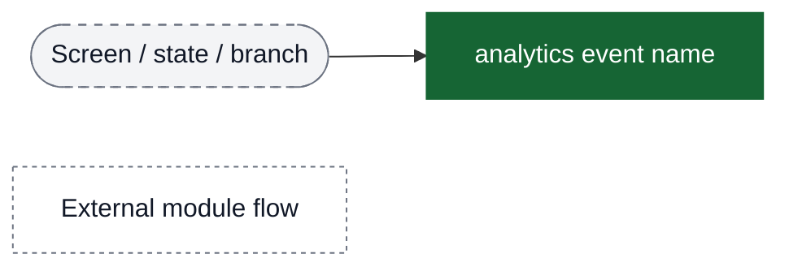
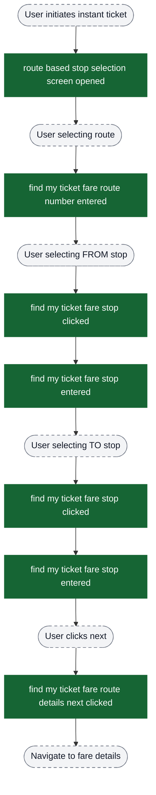
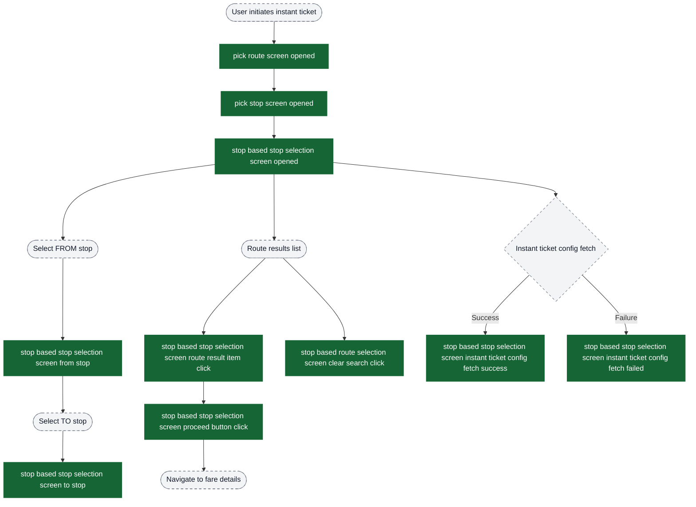
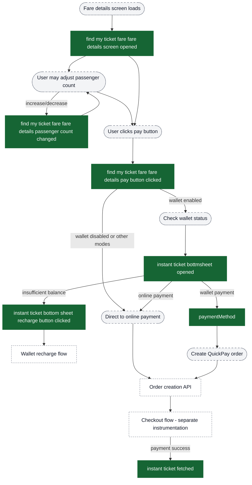
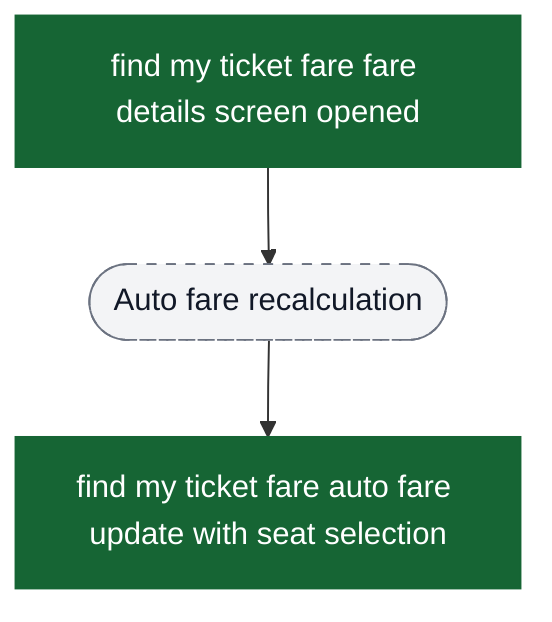
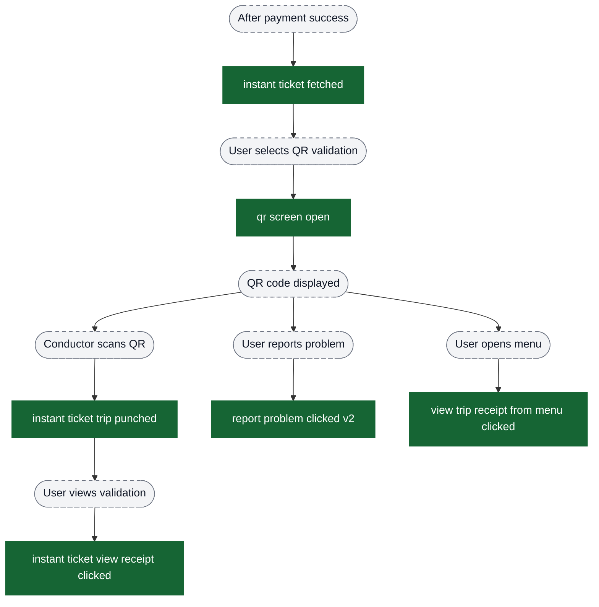
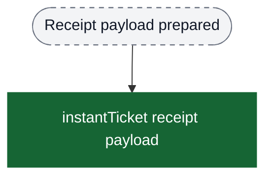
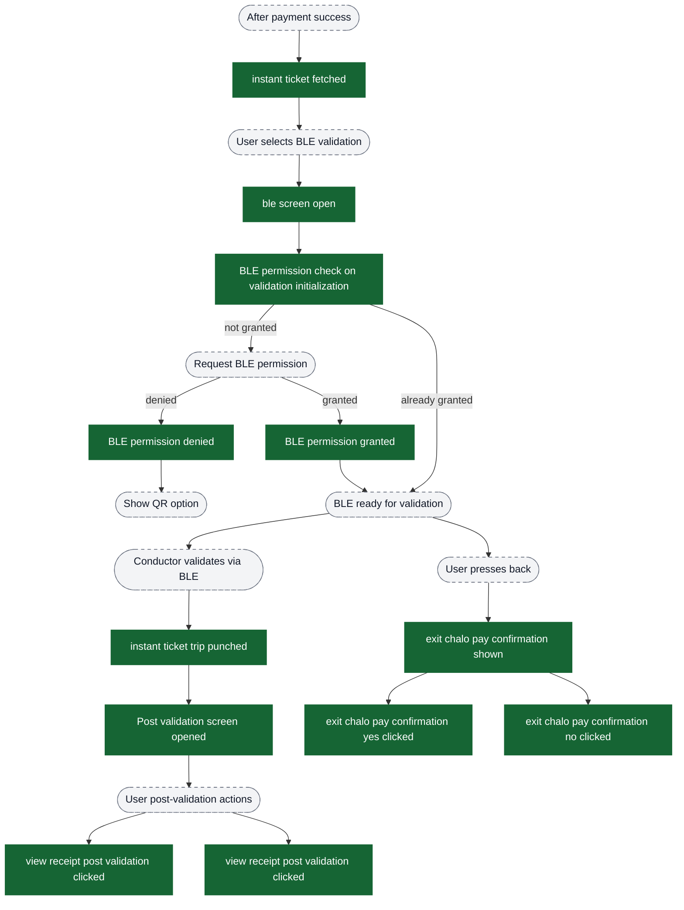
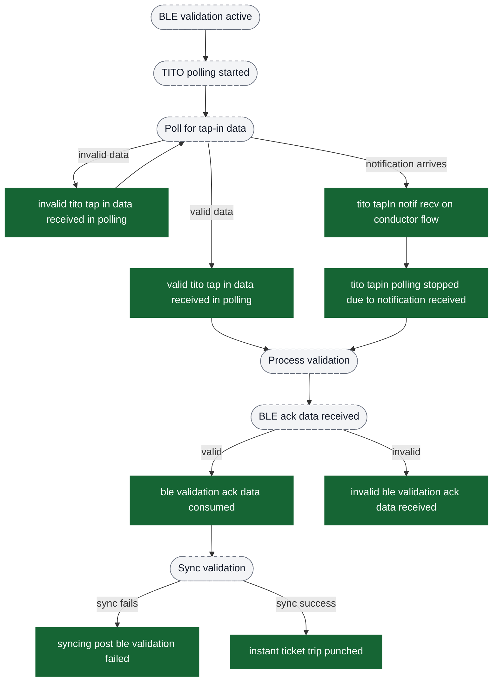
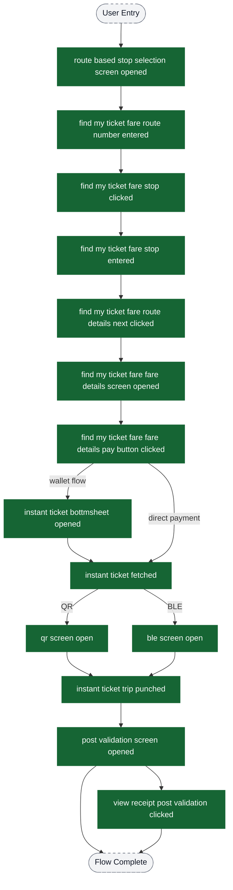

# Instant Ticket purchase analytics event flow diagrams

These diagrams exist to help build funnels in analytics dashboards. Green nodes are the exact event strings emitted by the app; grey nodes are non-analytics context (screens/states/branches). Edges show the typical order and major forks.

Notes:
- The instant ticket flow supports route-based selection where users select route and stops before seeing fare
- Wallet integration is optional based on city configuration
- Validation can happen via QR or BLE depending on availability and permissions
- All events include `isInstantTicket: true` property to allow filtering in dashboards

Visual key:
- Green solid boxes: analytics events (exact strings from `events.json`)
- Grey dashed pills: screens/states/branches (not analytics events)
- Grey dotted boxes: external flows instrumented elsewhere

## Entry → Route & Stop Selection

The instant ticket flow starts with route-based stop selection where users first select their journey details.

## Alternate Entry: Stop-Based Route Selection

Some cities/products use a stop-based route selection surface before fare details.

## Fare Details → Passenger Selection → Payment

After route selection, users see fare details, can adjust passenger count, and proceed to payment.

## Fare Details: Auto Fare Updates (Seat Selection)

## Ticket Validation → QR Flow

After successful payment, ticket can be validated via QR code.

## Receipt Payload (Debug/Diagnostics)

## Ticket Validation → BLE Flow

Alternative validation via Bluetooth with permission handling.

## TITO (Tap-In Tap-Out) Validation Events

Advanced validation flow for TITO-enabled routes with polling and notification mechanisms.

## Complete Funnel Overview

Use this diagram to build complete conversion funnels from entry to validation.

## Key Funnel Metrics

### Primary Conversion Funnel
Track the core conversion from entry to payment:

1. `route based stop selection screen opened` - Entry point
2. `find my ticket fare route number entered` - Route selected
3. `find my ticket fare route details next clicked` - Journey configured
4. `find my ticket fare fare details screen opened` - Fare displayed
5. `find my ticket fare fare details pay button clicked` - Payment initiated
6. `instant ticket fetched` - Payment success

**Drop-off Analysis**: Monitor drop-offs between each step to identify friction points.

### Validation Funnel
Track validation completion:

1. `instant ticket fetched` - Ticket ready
2. `qr screen open` OR `ble screen open` - Validation started
3. `instant ticket trip punched` - Validation success

**Split by**: `validationFlowType` to compare QR vs BLE success rates.

### Wallet Adoption Funnel
Track wallet usage:

1. `instant ticket bottmsheet opened` - Wallet option shown
2. Filter by `isChalowWalletActivated: true` - Wallet activated users
3. Filter by `balanceAmount > amount` - Sufficient balance
4. `instant ticket fetched` where payment via wallet - Wallet payment success

**Cohorts**:
- `isQuickPayBoughtOnce: false` - First-time QuickPay users
- `isRechargeDoneOnce: false` - Users who haven't recharged

### Permission Funnel (BLE)
Track BLE permission handling:

1. `ble screen open` - BLE validation attempted
2. `BLE permission check on validation initialization` - Permission status checked
3. `BLE permission granted` - Permission granted rate
4. `BLE permission denied` - Permission denied rate
5. `instant ticket trip punched` where BLE - Successful BLE validation

**Metrics**:
- Permission grant rate
- Validation success rate with/without permission

### TITO Performance Metrics
For TITO-enabled routes:

1. `tito tapIn notif recv on conductor flow` - TITO notification received
2. Split by `notificationDeliveryMedium` - INTERNET vs BLE delivery
3. `valid tito tap in data received in polling` vs `invalid tito tap in data received in polling` - Data quality
4. `ble validation ack data consumed` - Processing success
5. `syncing post ble validation failed` - Sync failure rate

## Dashboard Segments

### By Flow Type
All events include `flowType: "Instant Ticket"` - use this to isolate instant ticket analytics from other ticketing products.

### By Product Type
All events include:
- `productType: "mobileTicket"`
- `productSubType: "instantTicket"`
- `isInstantTicket: true`

Use any of these properties to filter instant ticket events.

### By Validation Method
Segment validation events by:
- QR: Events starting with `qr screen open`
- BLE: Events starting with `ble screen open`
- TITO: Events containing `tito` in the name

### By Payment Method
Track payment method via:
- `paymentMethod` property in relevant events
- Presence of `instant ticket bottmsheet opened` indicates wallet flow attempted

### By User Journey
Track different user segments:
- New users: `isQuickPayBoughtOnce: false`
- Wallet users: `isChalowWalletActivated: true`
- High-value users: Filter by `amount` ranges

## Common Analytics Questions

### Q: What's the conversion rate from entry to payment?
**Answer**: Create funnel from `route based stop selection screen opened` → `instant ticket fetched`

### Q: Why do users drop off at fare details?
**Answer**: Compare users who reach `find my ticket fare fare details screen opened` vs those who click `find my ticket fare fare details pay button clicked`. Check `amount` distribution and passenger count patterns.

### Q: Is wallet adoption increasing?
**Answer**: Track `instant ticket bottmsheet opened` over time, segment by `isChalowWalletActivated` and measure conversion to wallet payment.

### Q: Which validation method is more successful?
**Answer**: Compare time from validation screen open to `instant ticket trip punched` for QR vs BLE. Check `BLE permission denied` rate for BLE friction.

### Q: What's the TITO failure rate?
**Answer**: Count `invalid tito tap in data received in polling` and `syncing post ble validation failed` as failures. Compare to successful `instant ticket trip punched` events.

### Q: Do users with higher balance use wallet more?
**Answer**: Segment `instant ticket bottmsheet opened` by `balanceAmount` ranges and measure conversion to wallet payment.

### Q: What's the passenger count distribution?
**Answer**: Analyze `find my ticket fare fare details passenger count changed` events and final values in `find my ticket fare fare details pay button clicked`.

### Q: How many users need to adjust passenger count?
**Answer**: Count unique users with `find my ticket fare fare details passenger count changed` events vs total users reaching fare details.
