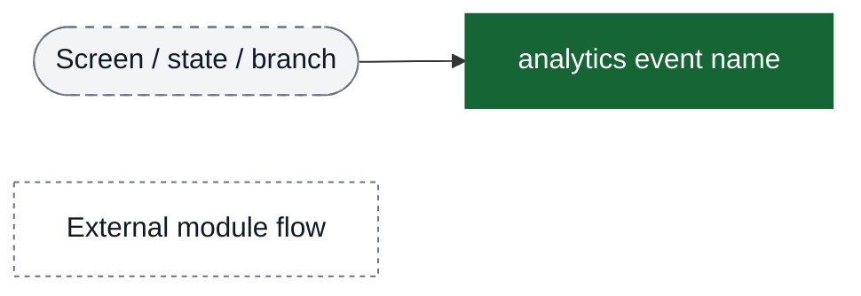
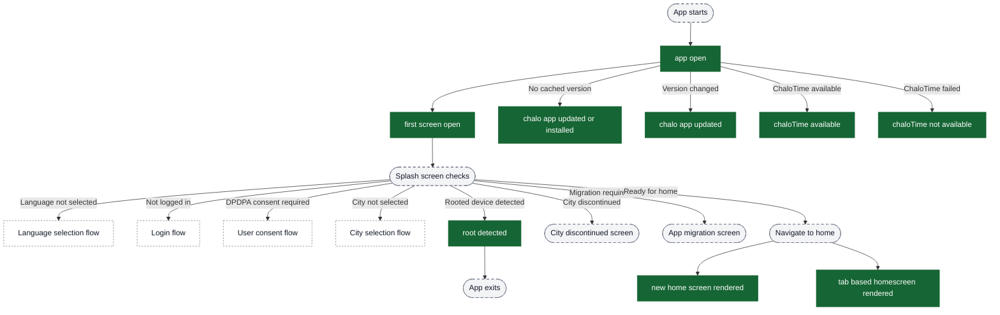
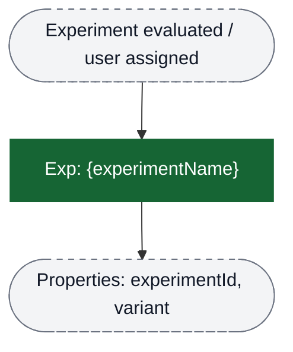
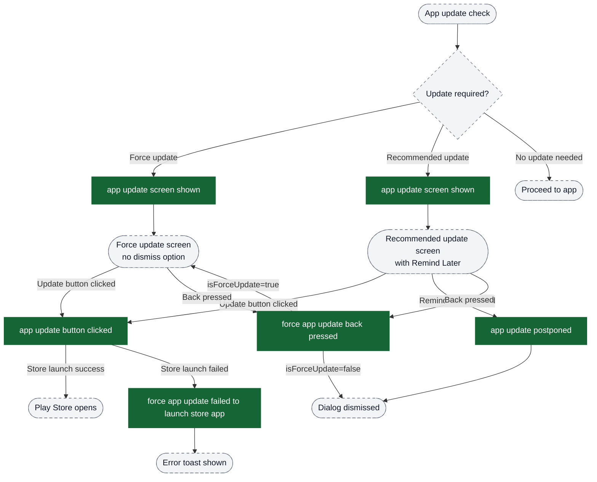
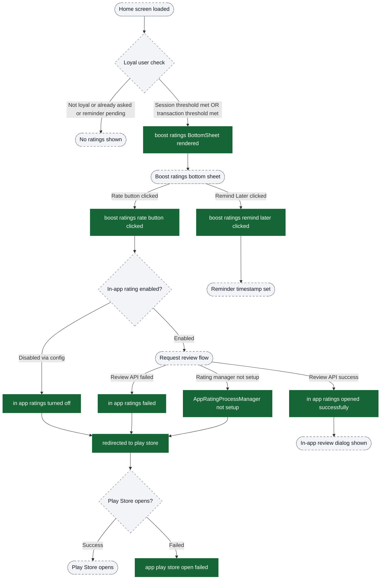
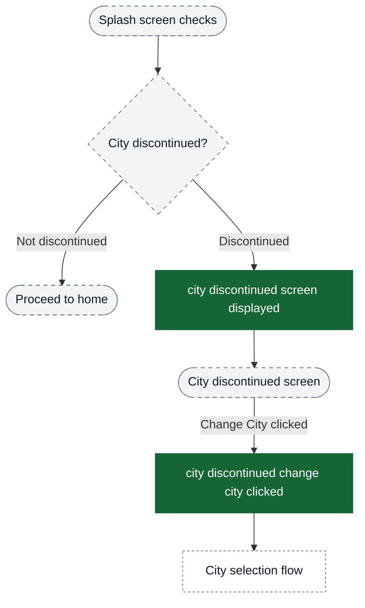
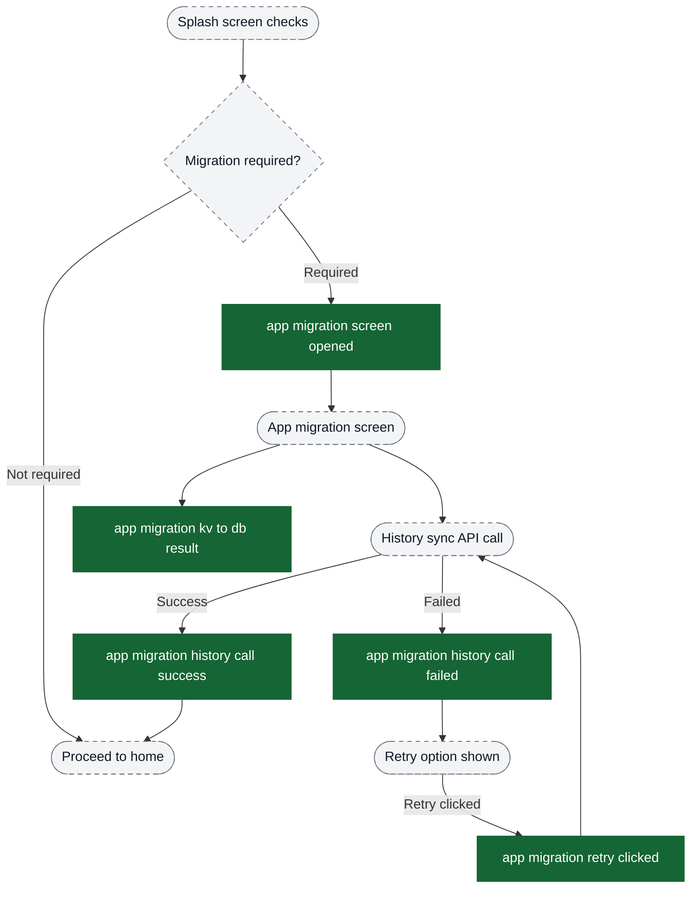
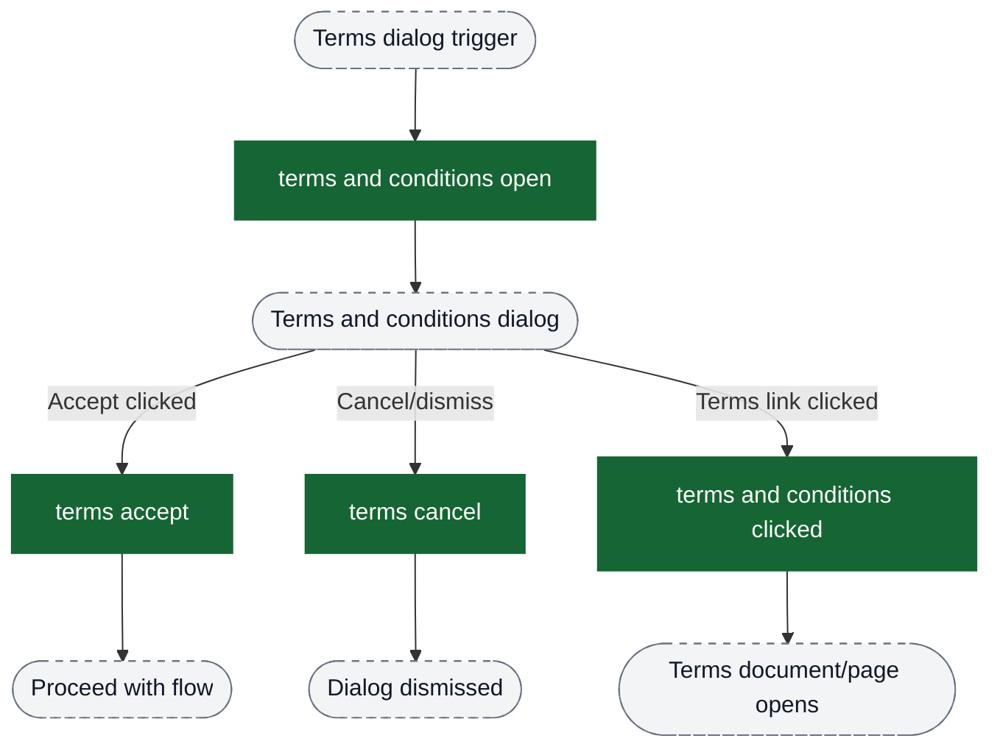
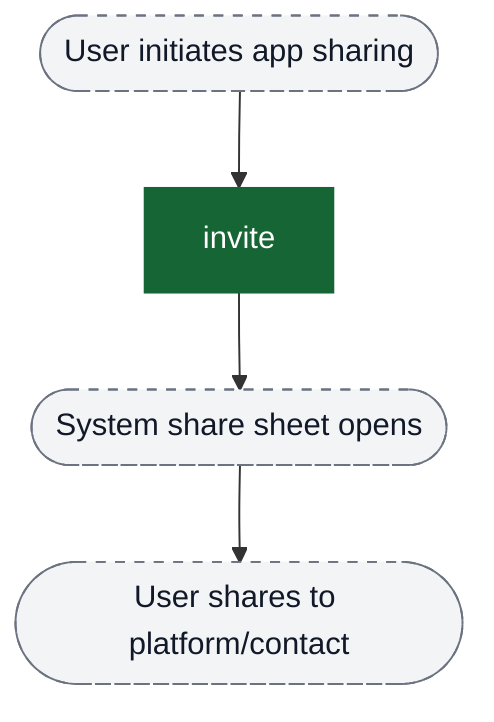

# App Lifecycle analytics event flow diagrams

These diagrams exist to help build funnels in analytics dashboards. Green nodes are the exact event strings emitted by the app; grey nodes are non-analytics context (screens/states/branches). Edges show the typical order and major forks.

Visual key:
- Green solid boxes: analytics events (exact strings from `events.json`)
- Grey dashed pills: screens/states/branches (not analytics events)
- Grey dotted boxes: external flows instrumented elsewhere



## App Launch & Session Flow



## AB Experiment Exposure (Dynamic Event Name Family)

These events are emitted as a dynamic event-name family: the exact event name is `Exp: ` + the experiment name.



## Force Update Flow



## Boost Ratings Flow (In-App Rating)



## City Discontinued Flow



## App Migration Flow



## Terms & Conditions Flow



## App Sharing Flow



## Funnel Recommendations

### App Launch Funnel
Track app initialization and first screen rendering:
```
app open → first screen open → [new home screen rendered OR language selection OR login options]
```
This helps measure:
- App initialization success rate
- Percentage of users reaching home vs needing onboarding

### Force Update Funnel (Blocking)
Track forced update completion:
```
app update screen shown (isForceUpdate=true) → app update button clicked → [Play Store launch]
```
Drop-off analysis:
- Users who see force update but don't click update
- Store launch failures

### Recommended Update Funnel
Track update adoption rate:
```
app update screen shown (isForceUpdate=false) → [app update button clicked OR app update postponed]
```
Metrics:
- Update acceptance rate
- Postponement rate

### Boost Ratings Funnel
Track rating prompt effectiveness:
```
boost ratings BottomSheet rendered → [boost ratings rate button clicked OR boost ratings remind later clicked]
→ [in app ratings opened successfully OR redirected to play store]
```
Conversion metrics:
- Prompt → Rate button click rate
- Rate button → Successful in-app rating rate
- Remind later usage rate

### App Migration Funnel
Track migration success:
```
app migration screen opened → [app migration history call success OR app migration history call failed]
→ [app migration retry clicked if failed]
```
Critical metrics:
- First-attempt success rate
- Retry success rate
- Total migration completion rate

### City Discontinued Funnel
Track city change flow:
```
city discontinued screen displayed → city discontinued change city clicked → [city selection flow]
```

### Terms Acceptance Funnel
Track terms acceptance:
```
terms and conditions open → [terms accept OR terms cancel]
```
Acceptance rate metric
