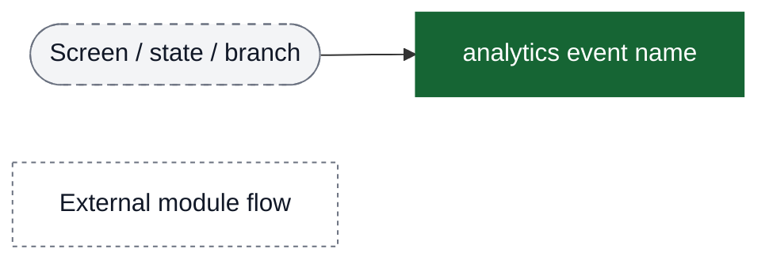
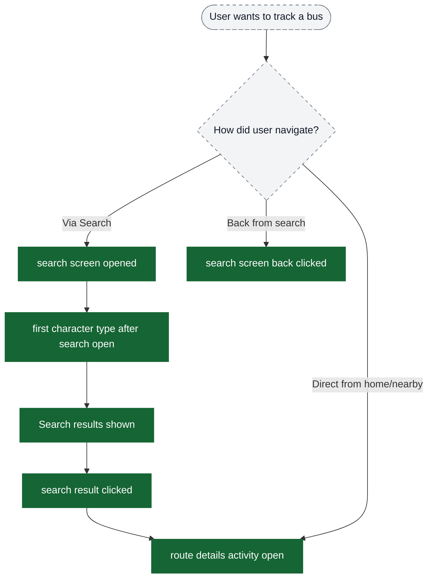
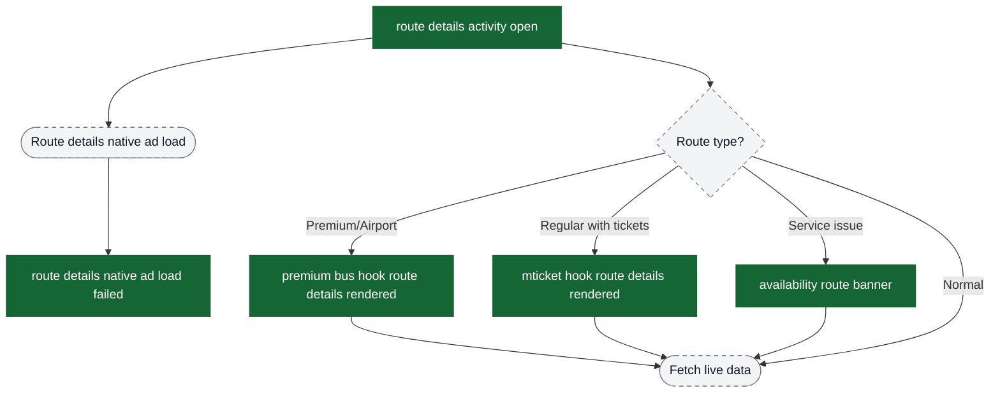
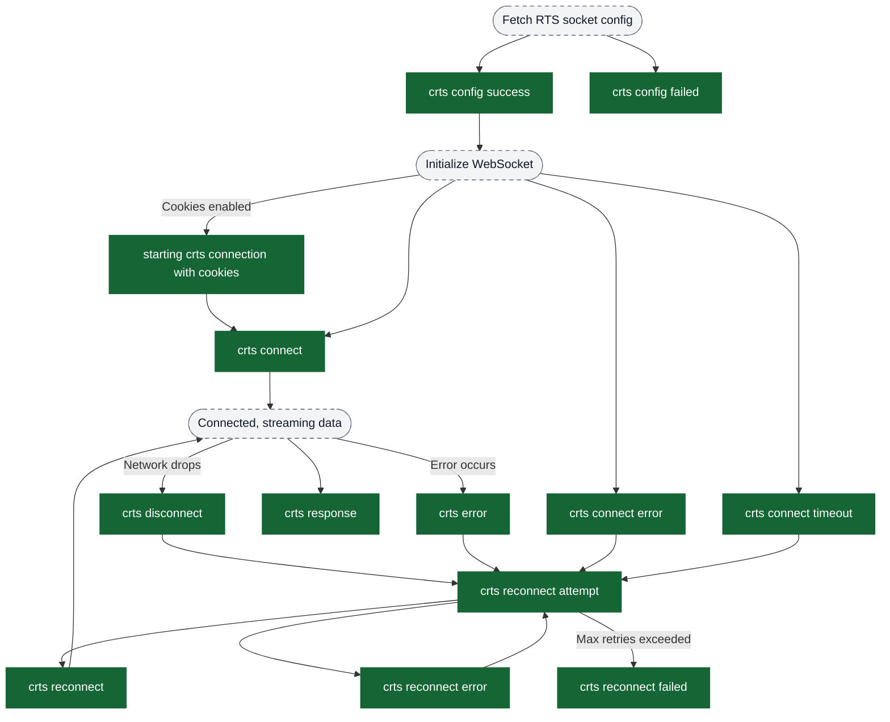
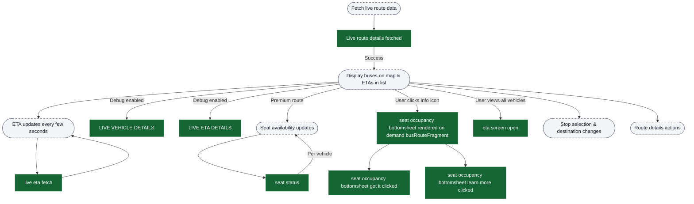
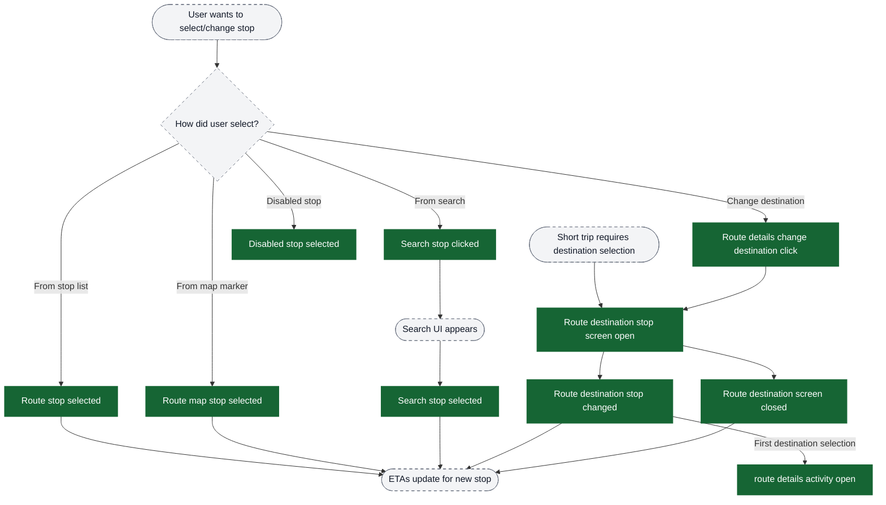
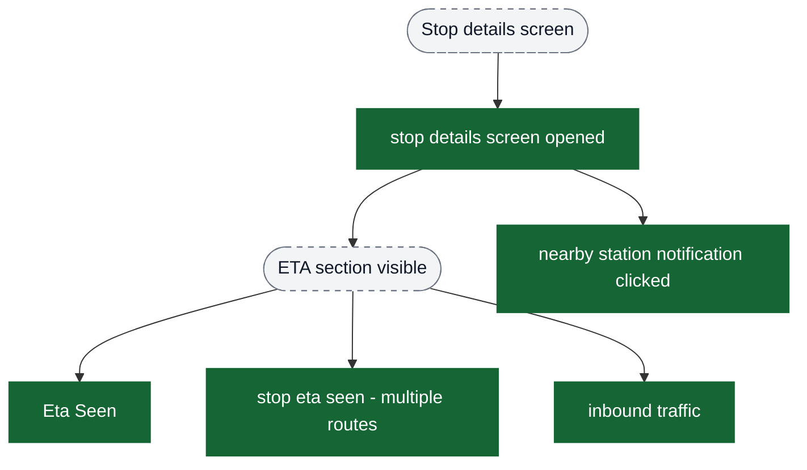
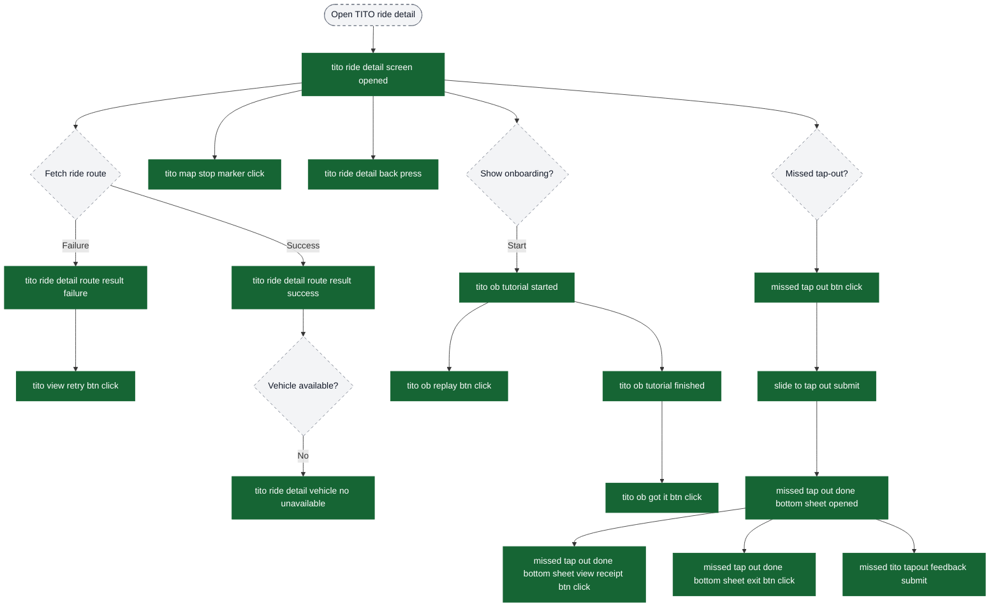
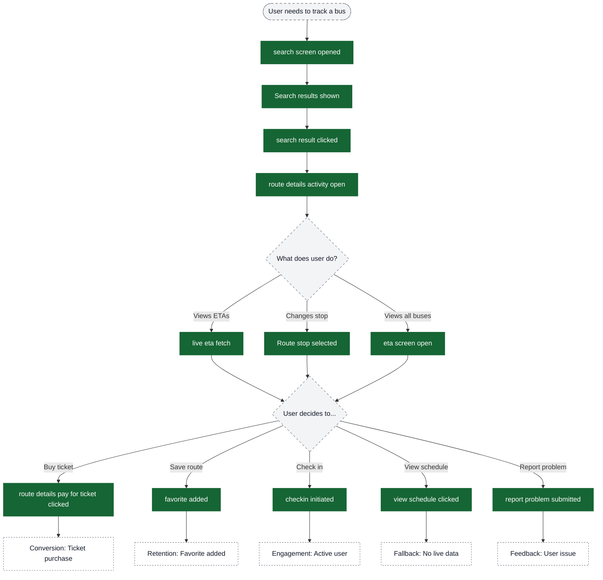

# Live Tracking analytics event flow diagrams

These diagrams exist to help build funnels in analytics dashboards. Green nodes are the exact event strings emitted by the app; grey nodes are non-analytics context (screens/states/branches). Edges show the typical order and major forks.

Notes:
- The live tracking flow can start from multiple entry points: search, home screen, nearby stops, or deep links.
- WebSocket config + connection events (`crts_*`, plus config/handshake events) run continuously in the background throughout the tracking session.
- Seat availability events only fire for premium/airport routes where seat occupancy data is available.
- Search events are optional if user enters route details directly from home or nearby stops.

Visual key:
- Green solid boxes: analytics events (exact strings from `events.json`)
- Grey dashed pills: screens/states/branches (not analytics events)
- Grey dotted boxes: external flows instrumented elsewhere



## Entry flow: Search → Route Selection → Route Details



## Route Details screen open & hooks



## WebSocket connection lifecycle (background)

This flow runs in parallel with the main route details flow throughout the session.



## Live data fetching & display



## Stop selection funnel



## User action events (from route details)

```mermaid
flowchart TD
  %%chalo:diagram-link ext_checkout -> title:External: Checkout flow (Payment module)
  %%chalo:diagram-link ext_premiumBooking -> title:External: Premium bus booking flow
  ui_routeDetails([Route details screen displayed]) --> ui_userAction{User action?}

  ui_userAction -->|Add to favorites| ev_favAdded["favorite added"]
  ui_userAction -->|Remove from favorites| ev_favDeleted["favorite deleted"]

  ui_userAction -->|View schedule| ev_scheduleClick["view schedule clicked"]

  ui_userAction -->|Buy ticket/pass| ev_payTicketClick["route details pay for ticket clicked"]
  ui_userAction -->|View existing pass| ev_passBookedClick["route details pass booked clicked"]
  ui_userAction -->|Reserve seat (premium)| ev_reserveSeatClick["route details reserve seat btn clicked"]

  ev_payTicketClick --> ext_checkout[Checkout flow]
  ev_reserveSeatClick --> ext_premiumBooking[Premium bus booking flow]

  ui_userAction -->|Check in| ev_checkin["checkin initiated"]

  ui_userAction -->|Report problem| ev_reportClick["report problem clicked"]
  ui_userAction -->|Report issue (with ETA context)| ev_reportHookClick["Report issue hook clicked"]

  ev_reportClick --> ui_reportUI([Report problem UI])
  ev_reportHookClick --> ui_reportUI
  ui_reportUI --> ev_reportSubmit["report problem submitted"]

  classDef event fill:#166534,stroke:#166534,color:#ffffff;
  classDef ui fill:#f3f4f6,stroke:#6b7280,stroke-dasharray: 5 5,color:#111827;
  classDef external fill:#ffffff,stroke:#6b7280,stroke-dasharray: 3 3,color:#111827;

  class ev_favAdded,ev_favDeleted,ev_scheduleClick,ev_payTicketClick,ev_passBookedClick,ev_reserveSeatClick,ev_checkin,ev_reportClick,ev_reportHookClick,ev_reportSubmit event;
  class ui_routeDetails,ui_userAction,ui_reportUI ui;
  class ext_checkout,ext_premiumBooking external;
```

## Funnel: Stop Details & ETA Insights

Events emitted on stop details surfaces (ETA viewing, traffic, and nearby station notifications).



## Funnel: TITO Ride Detail (Tap-In/Tap-Out) & Missed Tap-Out



## Complete funnel: Search → Track → Act

This is the recommended funnel for PMs to measure user engagement with live tracking.



## Suggested funnels for dashboards

### Funnel 1: Search to Track (Discovery)
Measure how effectively users find and access live tracking.

```
search screen opened
  → Search results shown
    → search result clicked
      → route details activity open
        → live eta fetch (success indicator)
```

**Drop-off analysis:**
- High drop at "Search results shown" → Search not returning relevant results
- High drop at "search result clicked" → Results not compelling enough
- High drop at "route details activity open" → Navigation/loading issues
- High drop at "live eta fetch" → Live data unavailability

### Funnel 2: Track to Act (Engagement)
Measure user actions after viewing live tracking.

```
route details activity open
  → live eta fetch
    → [User action events]:
      - route details pay for ticket clicked (conversion)
      - favorite added (retention)
      - checkin initiated (engagement)
      - view schedule clicked (fallback)
```

**Conversion metrics:**
- % who buy tickets after tracking
- % who add to favorites
- % who check in
- % who view schedule (indicates live data insufficient)

### Funnel 3: Stop Selection (Navigation)
Measure how users navigate stops within route.

```
route details activity open
  → Route stop selected / Route map stop selected / Search stop selected
    → live eta fetch (ETA updates for new stop)
```

**Engagement metrics:**
- Average number of stop selections per session
- % using map vs list vs search
- Most frequently selected stops

### Funnel 4: Premium Bus Conversion
Measure seat selection and premium booking.

```
route details activity open
  → premium bus hook route details rendered
    → seat status (seat availability shown)
      → route details reserve seat btn clicked
        → [Premium booking flow]
```

**Conversion metrics:**
- % of premium route views leading to seat reservations
- Impact of seat availability on conversions

## External: Checkout flow (Payment module)

See `content/analytics/payment/flow-diagrams.md` for the full checkout/payment instrumentation.

## External: Premium bus booking flow

See:
- `content/analytics/premium-bus-booking/flow-diagrams.md` (booking conversion)
- `content/analytics/premium-bus-bulk-booking/flow-diagrams.md` (manage rides + bulk booking)
- `content/analytics/premium-bus-activation-tracking/flow-diagrams.md` (post-booking activation + live tracking)

### Funnel 5: Problem Reporting (Feedback)
Measure user feedback submission rate.

```
route details activity open
  → report problem clicked / Report issue hook clicked
    → report problem submitted
```

**Quality metrics:**
- % of tracking sessions with problems reported
- Most common problem types
- Correlation with ETA accuracy

### Funnel 6: WebSocket Reliability (Technical)
Monitor real-time connection health.

```
crts connect / crts connect error
  → crts disconnect (if occurs)
    → crts reconnect attempt
      → crts reconnect / crts reconnect failed
```

**Health metrics:**
- Connection success rate
- Average reconnection time
- Network-specific failure rates
- Impact on user engagement
