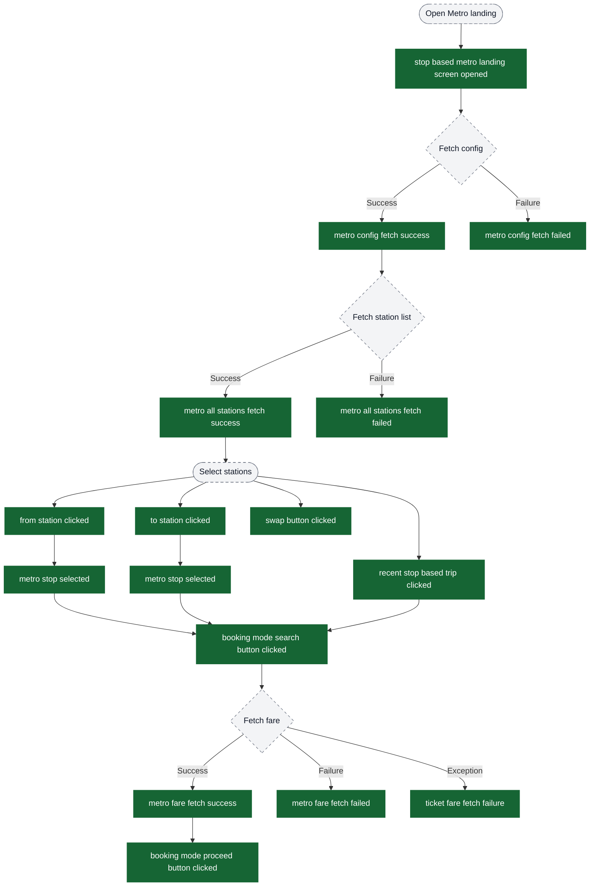
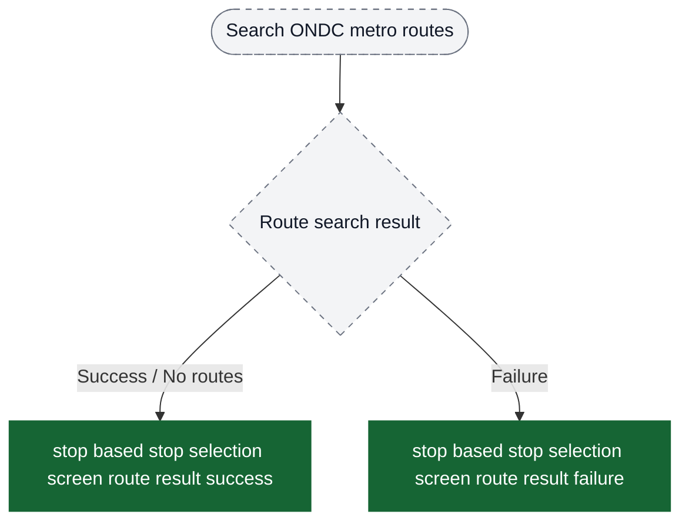
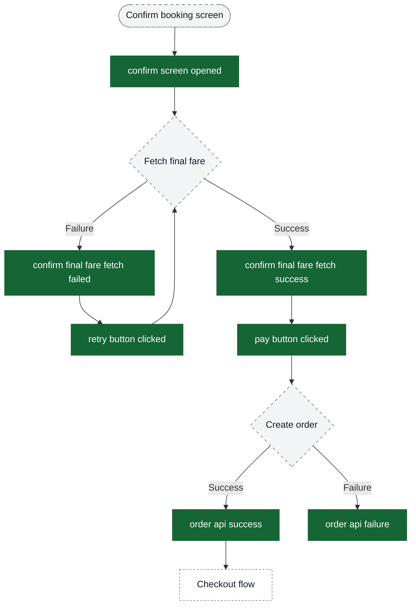
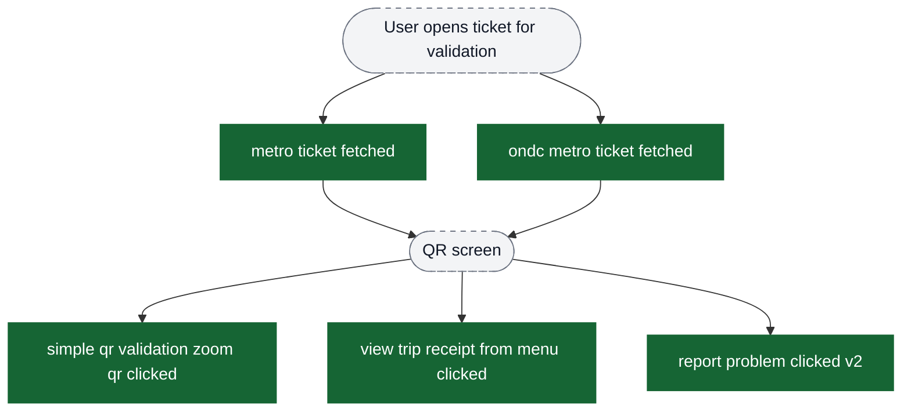
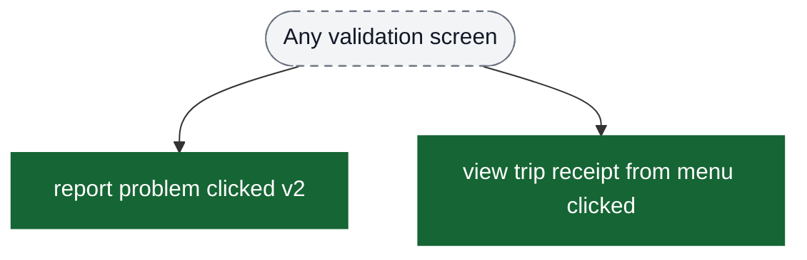

# Metro flow analytics event flow diagrams

These diagrams exist to help build funnels in analytics dashboards. Green nodes are the exact event strings emitted by the app; grey nodes are non-analytics context (screens/states/branches). Edges show the typical order and major forks.

Notes:
- The metro flow includes both regular metro tickets and ONDC metro tickets.
- Some ONDC metro events are `ondc`-prefixed (e.g., payment/booking confirmed/ticket fetched), but others are shared (e.g., stop selection route-result events) and are not prefixed.
- Metro tickets only support static QR validation (no BLE or TITO).

Visual key:
- Green solid boxes: analytics events (exact strings from `events.json`)
- Grey dashed pills: screens/states/branches (not analytics events)
- Grey dotted boxes: external flows instrumented elsewhere


## Funnel: Landing Screen to Fare Discovery

This funnel covers the metro landing screen from screen open through station selection to fare fetch.



## Funnel: ONDC Route Search Results

This funnel covers the ONDC route search result events emitted during ONDC metro route discovery.



## Funnel: Confirm Booking to Order Creation

This funnel covers the booking confirmation screen through payment initiation.



## Funnel: Payment to Booking Success

This funnel covers payment completion and booking confirmation.

```mermaid
flowchart TD
  ext_checkout[Checkout flow] --> ui_paymentResult{Payment result}

  ui_paymentResult -->|Success| ev_paymentOk["metro ticket payment successful"]
  ui_paymentResult -->|Failure| ev_paymentFail["metro ticket payment failed"]
  ui_paymentResult -->|ONDC Success| ev_ondcPaymentOk["ondc metro ticket payment successful"]
  ui_paymentResult -->|ONDC Failure| ev_ondcPaymentFail["ondc metro ticket payment failed"]

  ev_paymentOk --> ui_fetchTicketDetails{Fetch ticket details}
  ev_ondcPaymentOk --> ui_fetchTicketDetails

  ui_fetchTicketDetails -->|Success| ui_successScreen([Booking success screen])
  ui_fetchTicketDetails -->|Failure| ext_postPaymentFail[Post-payment history call failure (checkout flow)]

  ui_successScreen --> ev_bookingConfirmed["metro booking confirmed"]
  ui_successScreen --> ev_ondcBookingConfirmed["ondc metro booking confirmed"]

  classDef event fill:#166534,stroke:#166534,color:#ffffff;
  classDef ui fill:#f3f4f6,stroke:#6b7280,stroke-dasharray: 5 5,color:#111827;
  classDef external fill:#ffffff,stroke:#6b7280,stroke-dasharray: 3 3,color:#111827;

  class ev_paymentOk,ev_paymentFail,ev_ondcPaymentOk,ev_ondcPaymentFail,ev_bookingConfirmed,ev_ondcBookingConfirmed event;
  class ui_paymentResult,ui_fetchTicketDetails,ui_successScreen ui;
  class ext_checkout,ext_postPaymentFail external;
```

## Funnel: Ticket Validation - QR Flow

This funnel covers the static QR validation path events that are currently emitted for metro tickets.



## Global Events

Events that can fire from multiple screens in the metro flow.



## Complete Happy Path: Discovery to Validation

End-to-end funnel for the complete metro booking journey using static QR validation.

```mermaid
flowchart TD
  ui_start([User opens metro]) --> ev_landingOpen["stop based metro landing screen opened"]
  ev_landingOpen --> ev_configOk["metro config fetch success"]
  ev_configOk --> ev_stationsOk["metro all stations fetch success"]
  ev_stationsOk --> ev_fromClick["from station clicked"]
  ev_fromClick --> ev_stopFrom["metro stop selected"]
  ev_stopFrom --> ev_toClick["to station clicked"]
  ev_toClick --> ev_stopTo["metro stop selected"]
  ev_stopTo --> ev_searchBtn["booking mode search button clicked"]
  ev_searchBtn --> ev_fareOk["metro fare fetch success"]
  ev_fareOk --> ev_proceedBtn["booking mode proceed button clicked"]

  ev_proceedBtn --> ev_confirmOpen["confirm screen opened"]
  ev_confirmOpen --> ev_finalFareOk["confirm final fare fetch success"]
  ev_finalFareOk --> ev_payBtn["pay button clicked"]
  ev_payBtn --> ev_orderOk["order api success"]

  ev_orderOk --> ext_checkout[Checkout flow]
  ext_checkout --> ev_paymentOk["metro ticket payment successful"]

  ev_paymentOk --> ev_bookingConfirmed["metro booking confirmed"]
  ev_bookingConfirmed --> ev_ticketFetched["metro ticket fetched"]
  ev_ticketFetched --> ui_qr([QR screen])
  ui_qr --> ev_qrZoom["simple qr validation zoom qr clicked"]

  classDef event fill:#166534,stroke:#166534,color:#ffffff;
  classDef ui fill:#f3f4f6,stroke:#6b7280,stroke-dasharray: 5 5,color:#111827;
  classDef external fill:#ffffff,stroke:#6b7280,stroke-dasharray: 3 3,color:#111827;

  class ev_landingOpen,ev_configOk,ev_stationsOk,ev_fromClick,ev_stopFrom,ev_toClick,ev_stopTo,ev_searchBtn,ev_fareOk,ev_proceedBtn,ev_confirmOpen,ev_finalFareOk,ev_payBtn,ev_orderOk,ev_paymentOk,ev_bookingConfirmed,ev_ticketFetched,ev_qrZoom event;
  class ui_start,ui_qr ui;
  class ext_checkout external;
```


