# mTicket purchase analytics event flow diagrams

These diagrams exist to help build funnels in analytics dashboards. Green nodes are the exact event strings emitted by the app; grey nodes are non-analytics context (screens/states/branches). Edges show the typical order and major forks.

Notes:
- The mTicket flow starts from route selection and goes through payment to validation.
- Validation can happen via BLE (Bluetooth) or QR code depending on device capabilities and user choice.
- TITO (Tap-In/Tap-Out) events are specific to conductor-based validation flows.

Visual key:
- Green solid boxes: analytics events (exact strings from `events.json`)
- Grey dashed pills: screens/states/branches (not analytics events)
- Grey dotted boxes: external flows instrumented elsewhere

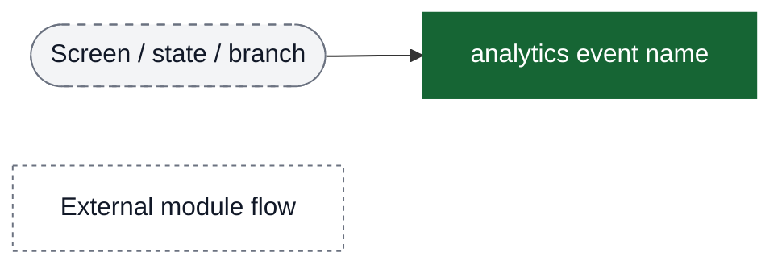

## Complete Purchase Flow (Main Funnel)

Use this diagram to build the primary mTicket purchase funnel from selection to validation.

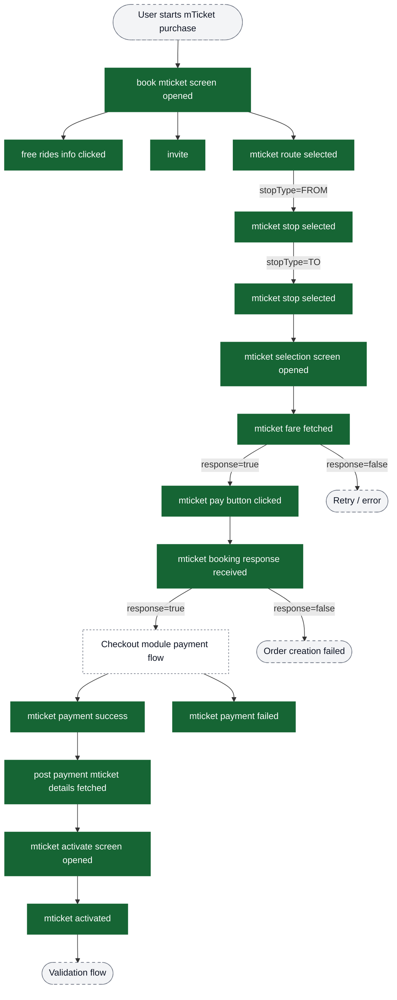

## Route & Stop Selection Flow

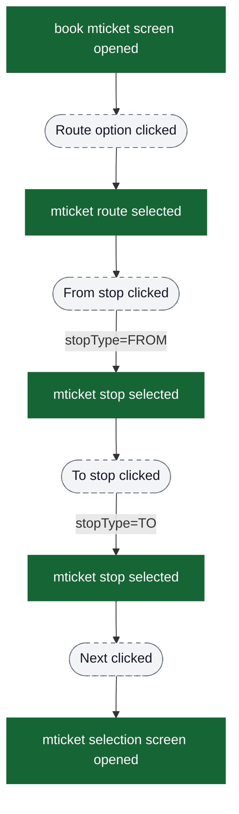

## Passenger Selection & Order Creation Flow

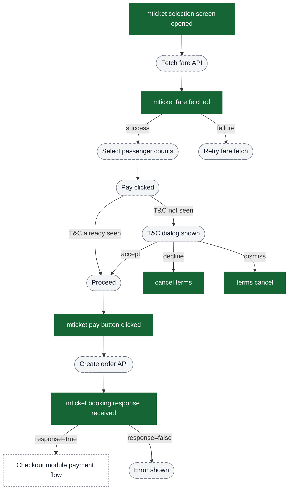

## Fare Changed Dialog Flow

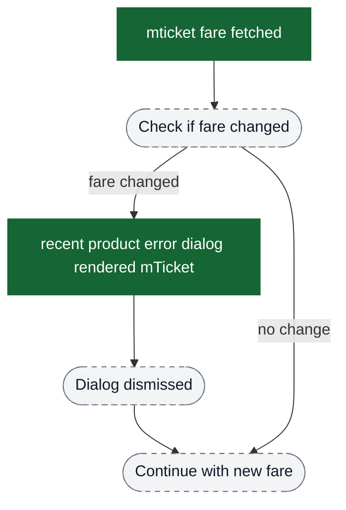

## Payment Flow (Checkout Module)

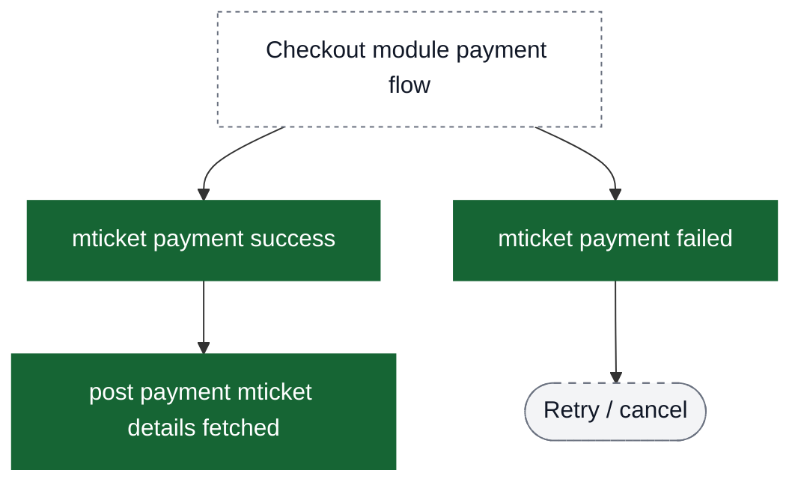

## Activation Flow

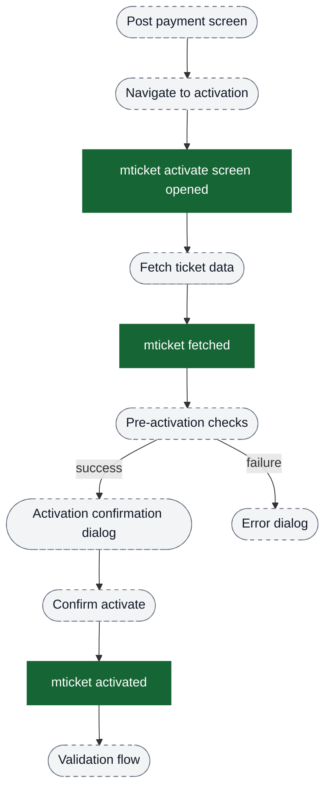

## Validation Flow - BLE vs QR Decision

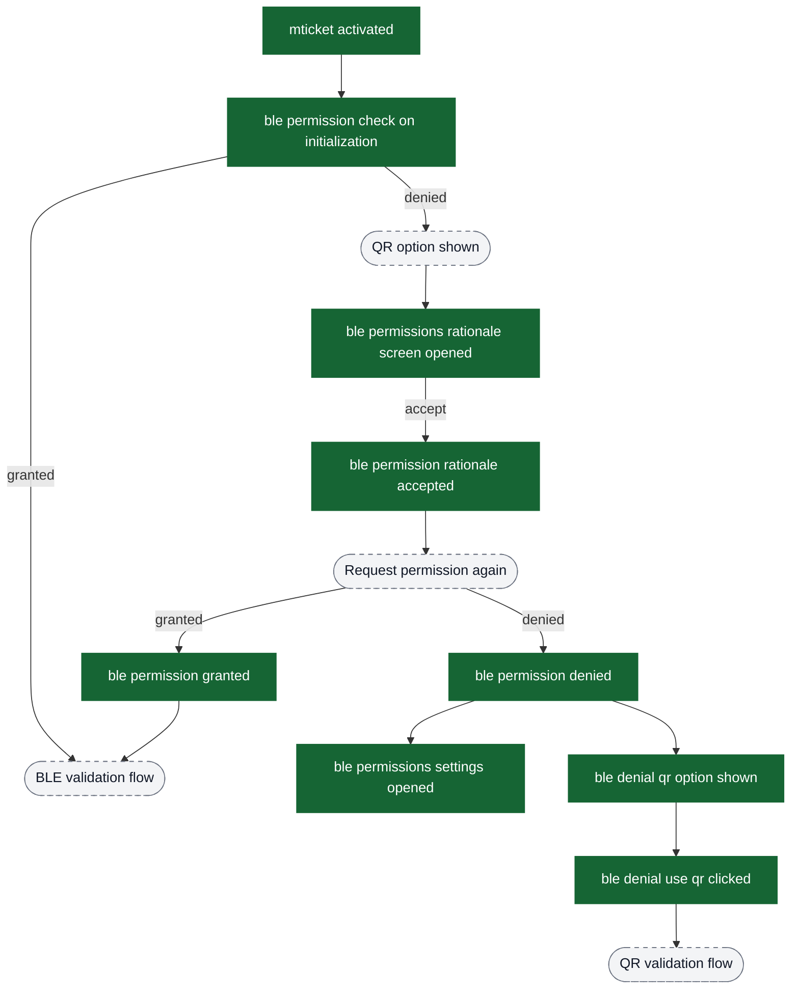

## BLE Validation Flow

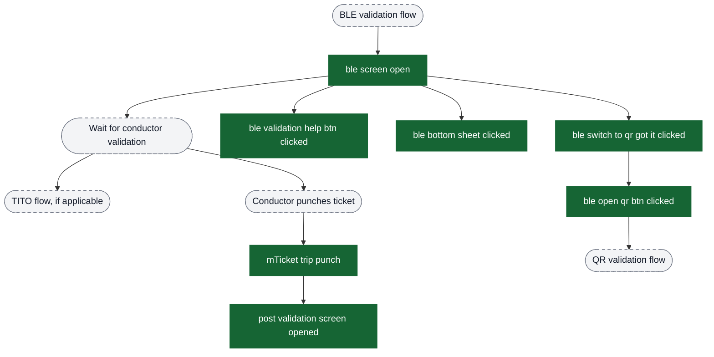

## QR Validation Flow

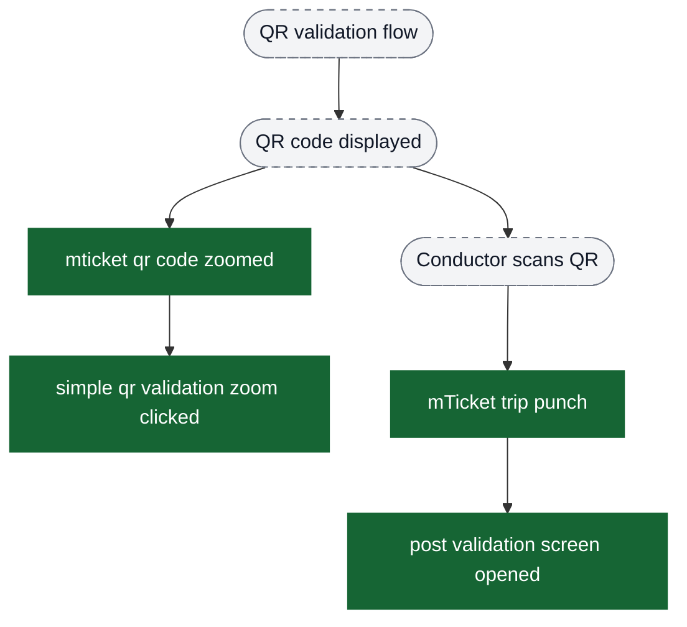

## TITO (Tap-In/Tap-Out) Validation Flow

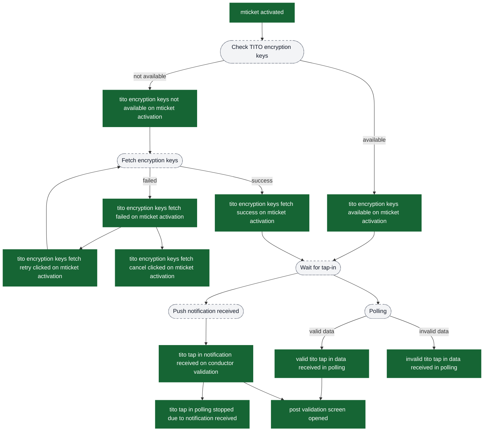

## BLE Validation Acknowledgment Flow

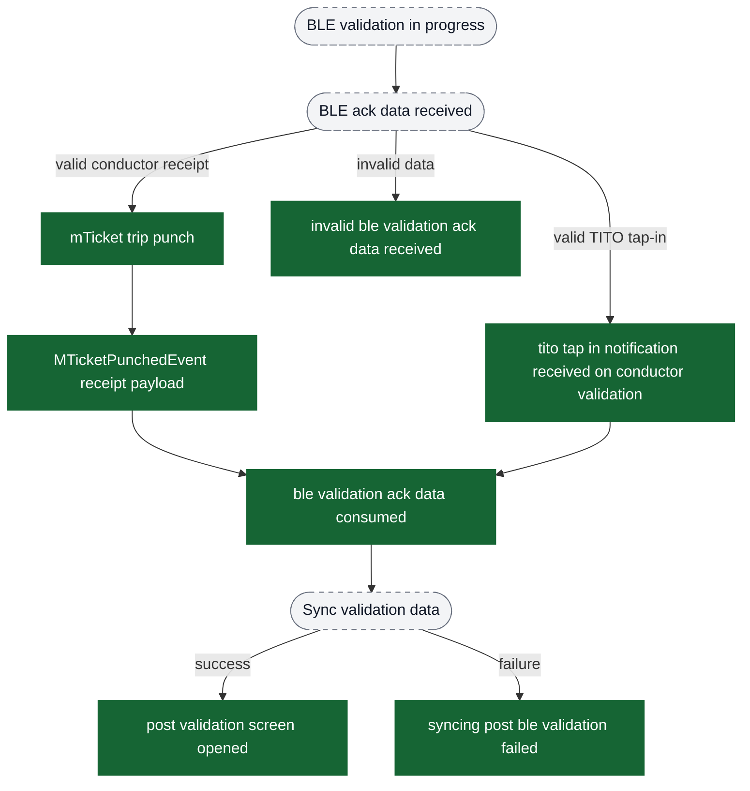

## Post Validation Flow

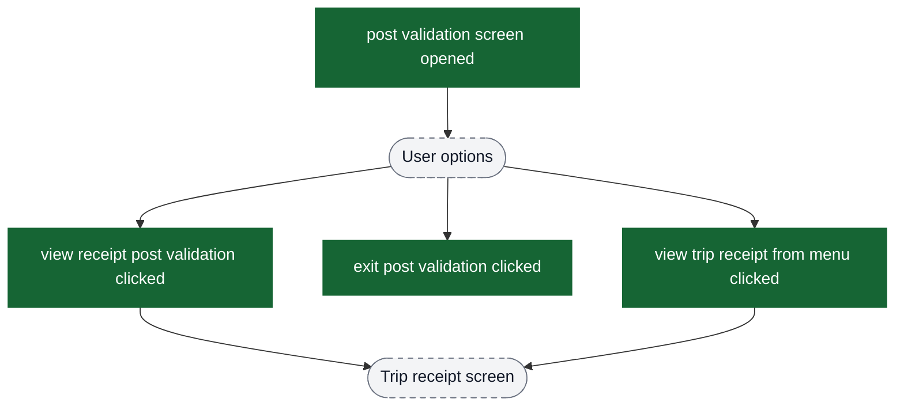

## Back Press Confirmation Flow (During Validation)

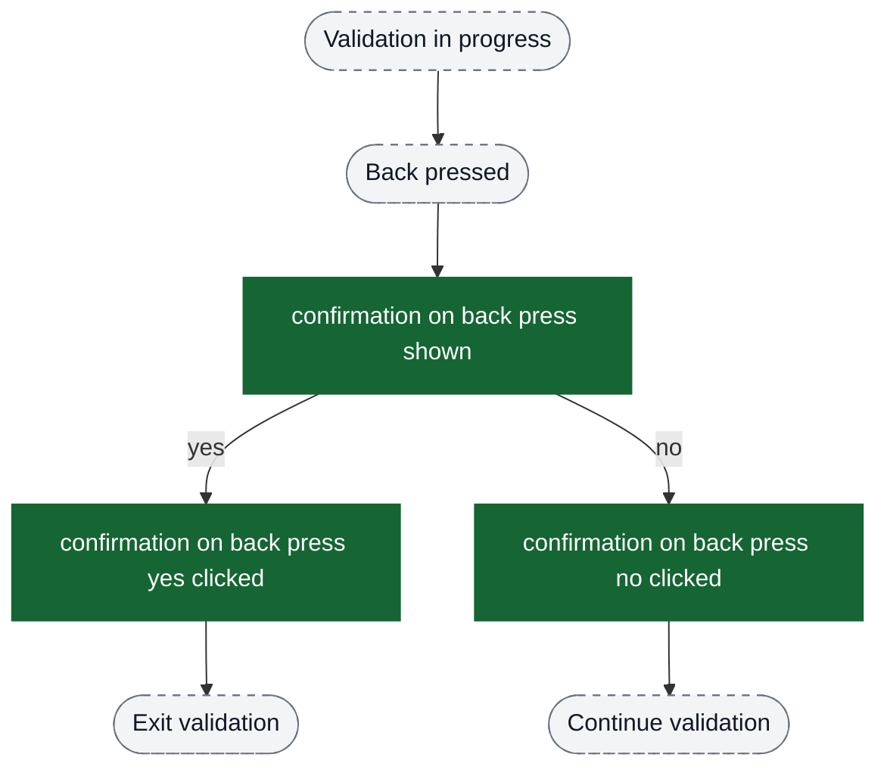

## Entry Points to mTicket Purchase

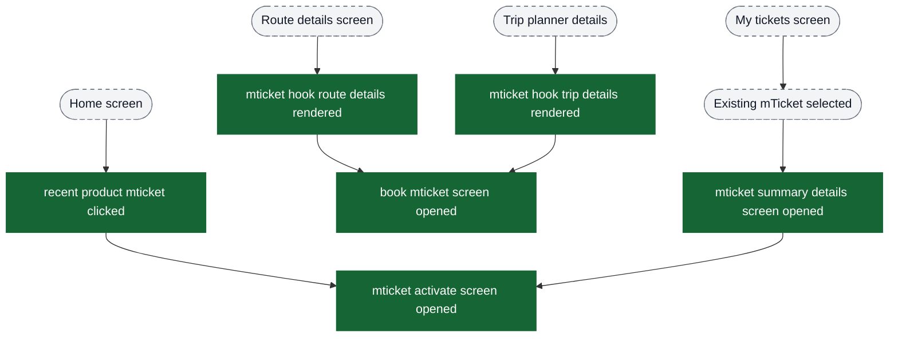

## Report Problem Flow (Global)

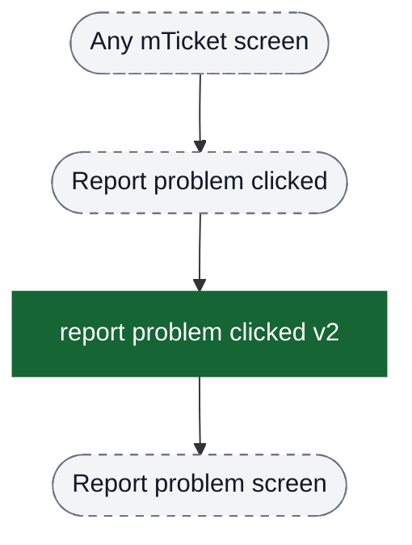
