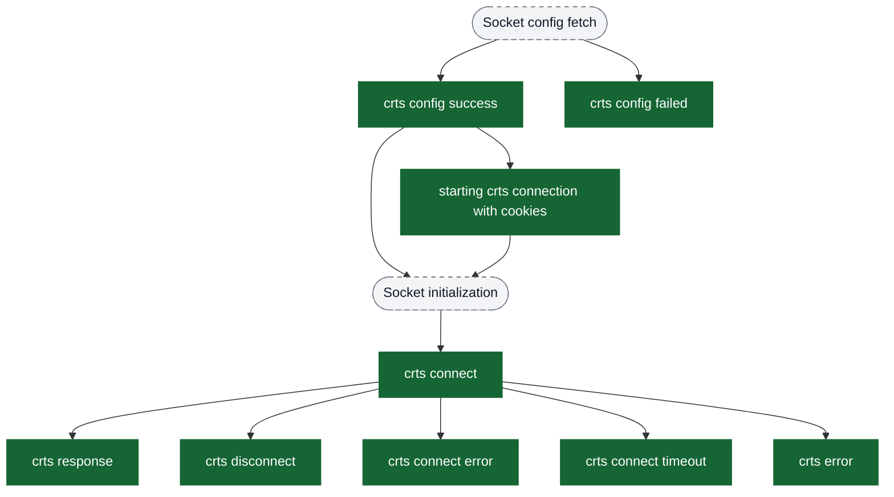
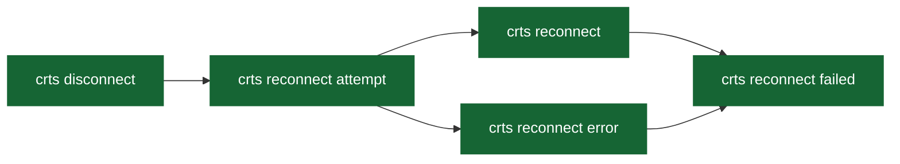
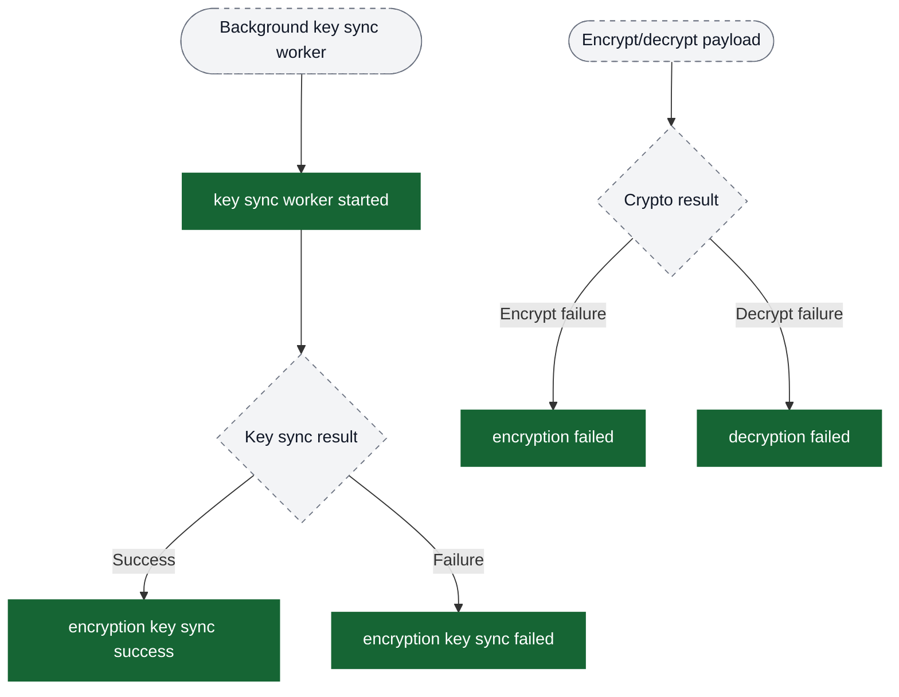
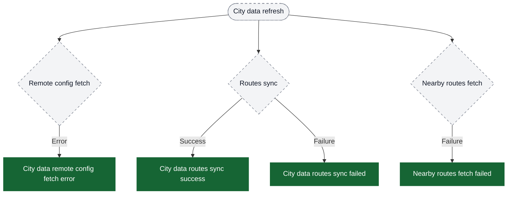
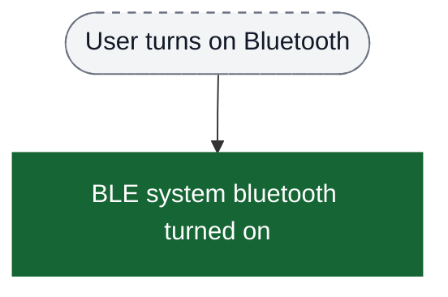

# Network analytics event flow diagrams

These diagrams help PMs and analysts stitch funnels for RTS socket behavior. Green boxes are the exact event strings emitted by the app; grey boxes are contextual states or external handshakes. Edges show the typical progression.

Visual key:
- Green solid boxes: analytics events (exact strings from `events.json`)
- Grey dashed pills: screens/states
- Grey dotted boxes: external hints or non-analytics steps

Notes:
- `crts_*` events flow continuously in the background while RTS subscriptions are active, so reconnection events accompany every long-running tracking session.
- `crts response` fires only once per subscription when the view model receives its first payload (see the `reference type` property for the originating request).

## Key Sync & Encryption

## City Data Sync (Routes & Config)

## Bluetooth (BLE)

