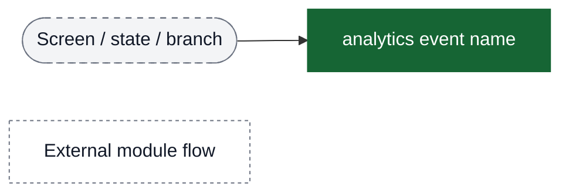
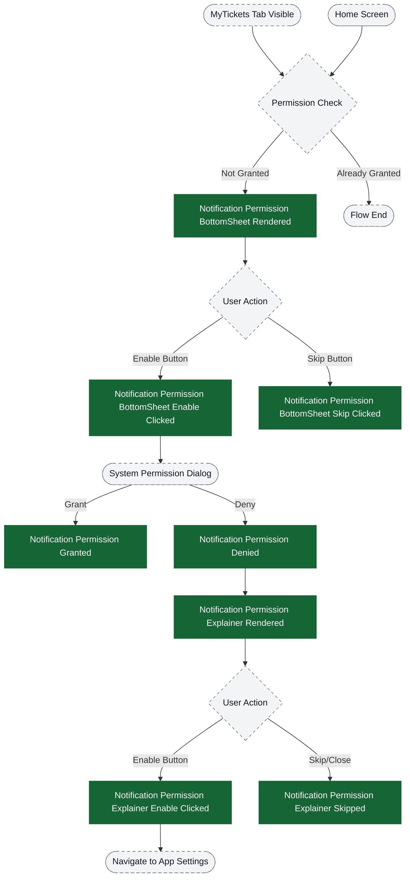
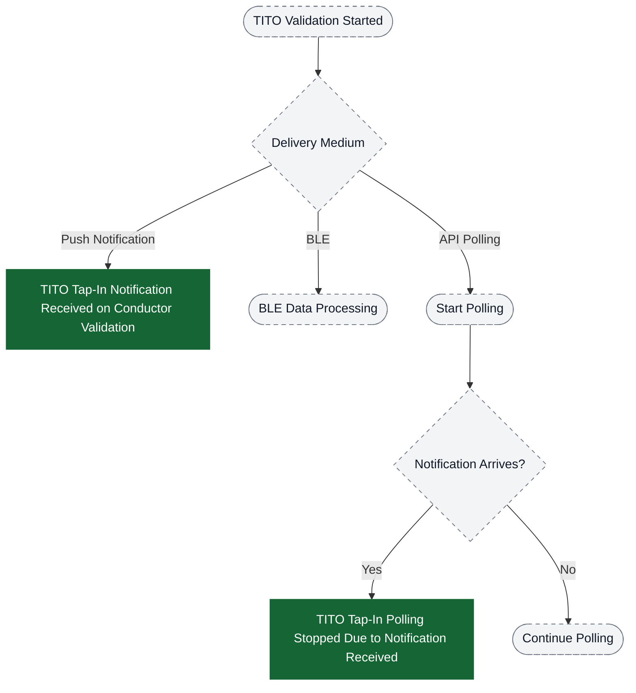
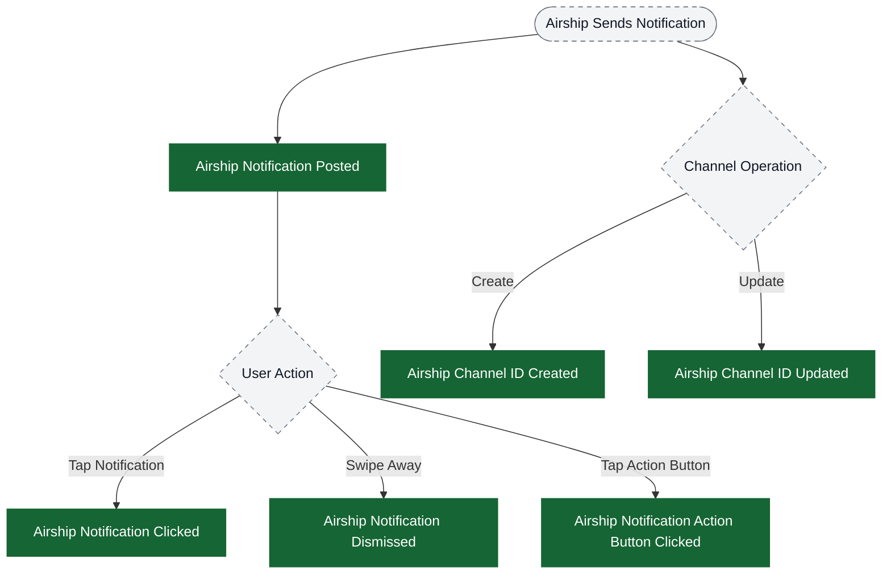
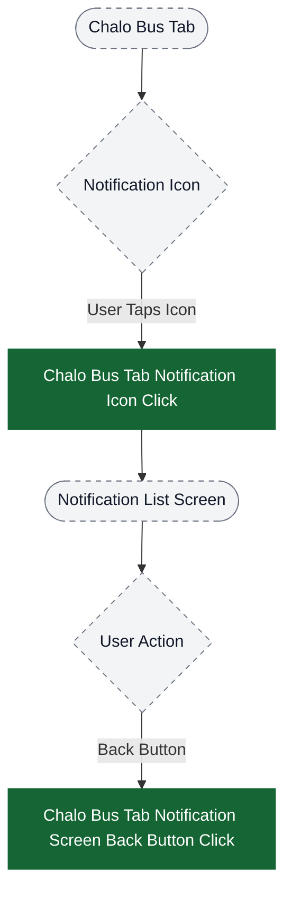
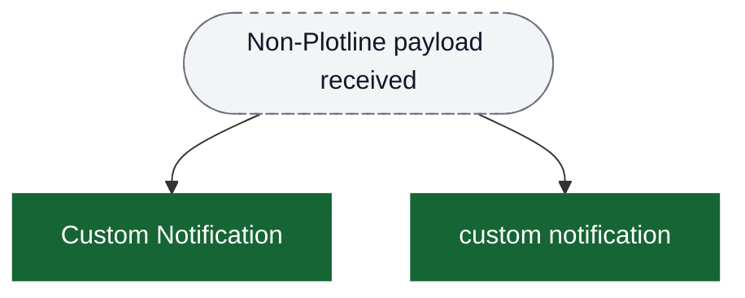

# Notifications analytics event flow diagrams

These diagrams exist to help build funnels in analytics dashboards. Green nodes are the exact event strings emitted by the app; grey nodes are non-analytics context (screens/states/branches). Edges show the typical order and major forks.

Notes:
- Notification permission events can be triggered from multiple entry points (Home screen, MyTickets tab)
- Push notification events fire independently based on backend triggers
- Punch notifications have delay tracking to measure delivery performance

Visual key:
- Green solid boxes: analytics events (exact strings from `events.json`)
- Grey dashed pills: screens/states/branches (not analytics events)
- Grey dotted boxes: external flows instrumented elsewhere



## Notification Permission Flow

This flow tracks the user journey for granting notification permissions, which is critical for receiving push notifications.



## FCM & Plotline Push Notification Reception Flow

This flow tracks when push notifications are received from Firebase Cloud Messaging and Plotline.

```mermaid
flowchart TD
  ui_fcmReceive([FCM Message Received]) --> ev_fcmReceived["FCM Notification Received"]

  ev_fcmReceived --> ui_plotlineCheck{Is Plotline?}

  ui_plotlineCheck -->|Yes| ev_plotlineReceived["Plotline Notification Received"]
  ui_plotlineCheck -->|No| ui_regularProcess([Regular Notification Processing])

  ev_plotlineReceived --> ui_plotlineShow([Show Plotline Notification])

  ui_plotlineShow --> ui_plotlineInteraction{User Interaction}
  ui_plotlineInteraction -->|Tap| ev_plotlineClickedUpper["Plotline Notification Clicked"]
  ui_plotlineInteraction -->|Tap (legacy name)| ev_plotlineClickedLower["Plotline notification clicked"]
  ui_plotlineInteraction -->|Tap triggers deep link| ev_plotlineRedirect["Plotline Redirect Received"]

  ui_fcmReceive --> ui_exception{Exception?}
  ui_exception -->|Error Occurs| ev_plotlineException["Plotline Notification Exception"]

  classDef event fill:#166534,stroke:#166534,color:#ffffff;
  classDef ui fill:#f3f4f6,stroke:#6b7280,stroke-dasharray: 5 5,color:#111827;

  class ev_fcmReceived,ev_plotlineReceived,ev_plotlineClickedUpper,ev_plotlineClickedLower,ev_plotlineRedirect,ev_plotlineException event;
  class ui_fcmReceive,ui_plotlineCheck,ui_regularProcess,ui_plotlineShow,ui_plotlineInteraction,ui_exception ui;
```

## Punch Notification Flow (Ticket/Pass Validation)

This flow tracks notifications received when tickets or passes are validated (punched) by conductors.

```mermaid
flowchart TD
  ui_validation([Conductor Validates Ticket/Pass]) --> ui_productType{Product Type}

  ui_productType -->|Super Pass| ev_superPassPunchReceivedUpper["Super Pass Punch Notification Received"]
  ui_productType -->|Super Pass (legacy name)| ev_superPassPunchReceivedLower["superPass punch notification received"]
  ui_productType -->|M-Ticket| ev_mTicketPunchReceivedUpper["M-Ticket Punch Notification Received"]
  ui_productType -->|M-Ticket (legacy name)| ev_mTicketPunchReceivedLower["mTicket punch notification received"]
  ui_productType -->|Quick Pay| ev_quickPayPunchReceivedUpper["Chalo Pay Punch Received"]
  ui_productType -->|Quick Pay (legacy name)| ev_quickPayPunchReceivedLower["chalo pay punch received"]
  ui_productType -->|Premium Bus| ev_premiumPunchReceivedUpper["Premium Reserve Ticket Punch Received"]
  ui_productType -->|Premium Bus (legacy name)| ev_premiumPunchReceivedLower["premium reserve ticket punch received"]
  ui_productType -->|Chalo Card| ev_cardTransactionReceivedUpper["Chalo Card Transaction Notification Received"]

  ev_superPassPunchReceivedUpper --> ui_displayDecision{Should Display?}
  ev_mTicketPunchReceivedUpper --> ui_displayDecision

  ui_displayDecision -->|Yes| ev_superPassPostedUpper["Super Pass Punch Notification Posted"]
  ui_displayDecision -->|Yes| ev_superPassPostedLower["superPass punch notification posted"]
  ui_displayDecision -->|Yes| ev_mTicketPostedUpper["M-Ticket Punch Notification Posted"]
  ui_displayDecision -->|Yes| ev_mTicketPostedLower["mTicket punch notification posted"]

  ev_mTicketPostedUpper --> ui_userInteraction{User Interaction}
  ui_userInteraction -->|Opens Notification| ev_notificationRead["M-Ticket Notification Read"]

  classDef event fill:#166534,stroke:#166534,color:#ffffff;
  classDef ui fill:#f3f4f6,stroke:#6b7280,stroke-dasharray: 5 5,color:#111827;

  class ev_superPassPunchReceivedUpper,ev_superPassPunchReceivedLower,ev_mTicketPunchReceivedUpper,ev_mTicketPunchReceivedLower,ev_quickPayPunchReceivedUpper,ev_quickPayPunchReceivedLower,ev_premiumPunchReceivedUpper,ev_premiumPunchReceivedLower,ev_cardTransactionReceivedUpper,ev_superPassPostedUpper,ev_superPassPostedLower,ev_mTicketPostedUpper,ev_mTicketPostedLower,ev_notificationRead event;
  class ui_validation,ui_productType,ui_displayDecision,ui_userInteraction ui;
```

## TITO Tap-In/Tap-Out Notification Flow

This flow tracks TITO (Tap-In Tap-Out) validation notifications with fallback polling mechanism.



## Airship Notification Interaction Flow

This flow tracks Airship push notifications and user interactions.



## Notification Icon & List Screen Flow

This flow tracks navigation to notification list screen from home tabs.



## Key Funnel Definitions for PMs

### Permission Funnel (Conversion Tracking)
Track the conversion rate from permission request to grant:

1. **Entry Point**: `notification permission bottomsheet rendered`
2. **User Intent**: `notification permission bottomsheet enable clicked`
3. **Success**: `notification permission granted`
4. **Drop-off Points**:
   - `notification permission bottomsheet skip clicked`
   - `notification permission denied` → `notification permission explainer skipped`

**KPIs to Track**:
- Bottomsheet → Enable click rate
- Enable click → Permission grant rate
- Denial → Explainer enable rate

### Push Notification Delivery & Engagement Funnel
Track notification delivery and user engagement:

1. **Delivery**: `FCM Notification Received`
2. **Display**: Product-specific "posted" events (e.g., `superPass punch notification posted`)
3. **Engagement**: Product-specific interaction events (e.g., `mticket notification is read`)

**KPIs to Track**:
- Notification delivery rate (received vs expected)
- Display rate (posted vs received)
- Engagement rate (read/clicked vs posted)
- Punch notification delay (median, p95, p99)

### TITO Notification Performance Funnel
Track TITO notification delivery performance:

1. **Validation Started**: (from validation flow)
2. **Notification Received**: `tito tapIn notif recv on conductor flow`
3. **Polling Stopped**: `tito tapin polling stopped due to notification received`

**KPIs to Track**:
- Push vs Polling ratio
- Time to notification delivery
- Polling success rate when push fails

### Plotline Campaign Engagement Funnel
Track Plotline campaign performance:

1. **Received**: `Plotline Notification Received`
2. **Delivered**: (tracked by Plotline SDK)
3. **Clicked**: `Plotline notification clicked`
4. **Errors**: `Plotline Notification Exception`

**KPIs to Track**:
- Campaign reach (received count)
- Click-through rate
- Error rate

## Custom Notification (Non-Plotline)


