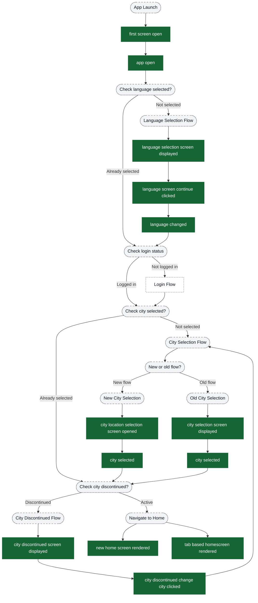
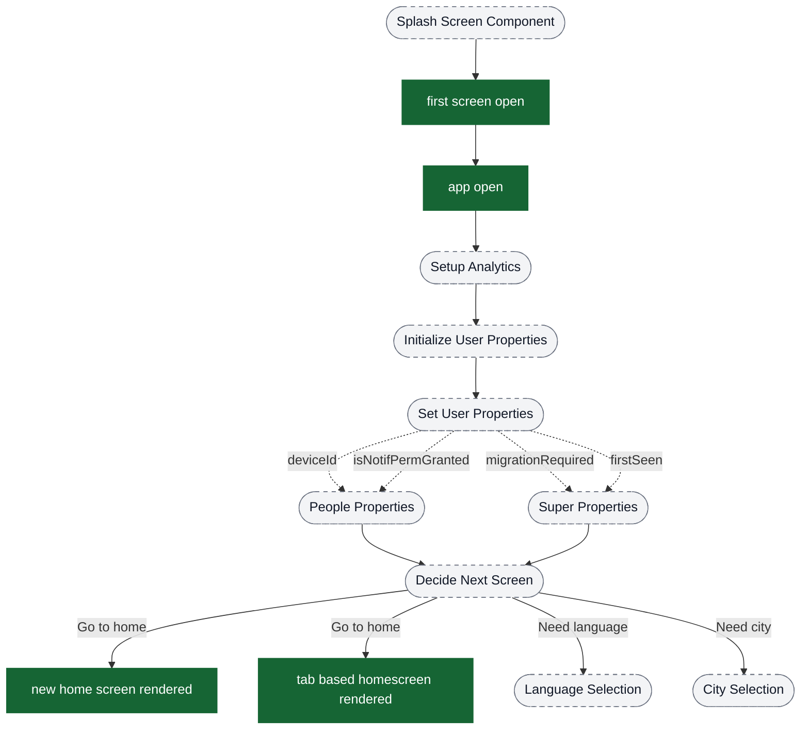
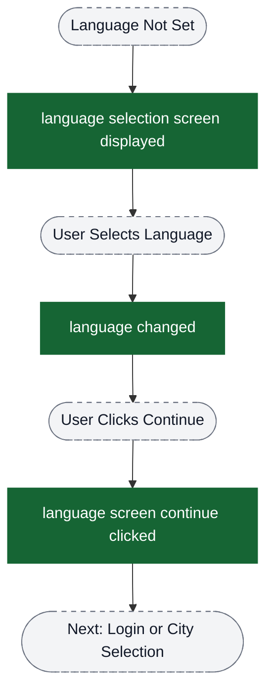

# Onboarding analytics event flow diagrams

These diagrams exist to help build funnels in analytics dashboards. Green nodes are the exact event strings emitted by the app; grey nodes are non-analytics context (screens/states/branches). Edges show the typical order and major forks.

Notes:
- The onboarding flow branches based on user state: first-time users go through language + city selection, returning users may skip directly to home
- There are two city selection implementations: old flow (CitySelectionComponent) and new flow (CityLocationSelectionComponent) - both emit some events with the same name but different source values
- User properties (deviceId, isNotifPermGranted, migrationRequired, firstSeen) are set during splash screen but are not analytics events

Visual key:
- Green solid boxes: analytics events (exact strings from `events.json`)
- Grey dashed pills: screens/states/branches (not analytics events)
- Grey dotted boxes: external flows instrumented elsewhere

## Complete onboarding journey (high-level overview)

This diagram shows the complete onboarding flow from app launch to home screen.

## Funnel: Splash Screen → App Initialization

This is the entry point for all users. These events fire on every app launch.

## Funnel: Language Selection

This flow occurs when the user has not previously selected a language.

## Funnel: City Selection (New Flow) - Device Location Path

This is the primary city selection flow using device location.

## Funnel: City Selection (New Flow) - GPS Permission Refusals

This diagram shows the permission-related events in detail.

## Location Disclaimer (Post-Onboarding / Recovery)

Some cities require location to proceed. When location is mandatory but missing, the app can route the user through the Location Disclaimer screen.

## Funnel: City Selection (Old Flow)

This is the legacy city selection implementation, still present in the codebase.

## Funnel: City Discontinued Flow

This flow handles users who have selected a discontinued city.

## Event Source Comparison: Old vs New City Selection

This table helps identify which city selection flow is being used based on the source property:

| Event Name | Old Flow Source | New Flow Source | Notes |
|------------|----------------|-----------------|-------|
| city selection screen displayed | CITY_SELECTION_FRAGMENT | (not used) | Old flow only |
| city selection search icon clicked | CITY_SELECTION_FRAGMENT | (not used) | Old flow only |
| permission_popup | CITY_SELECTION_FRAGMENT | (not used) | Old flow only |
| city selected | CITY_SELECTION_FRAGMENT_SPACED | CITY_SELECTION_SCREEN | Used in both flows |
| city location selection screen opened | (not used) | CITY_SELECTION_SCREEN | New flow only |
| enable device location clicked | (not used) | CITY_SELECTION_SCREEN | New flow only |
| enter location manually clicked | (not used) | CITY_SELECTION_SCREEN | New flow only |
| retry city fetch clicked | (not used) | CITY_SELECTION_SCREEN | New flow only |
| change location clicked | (not used) | CITY_SELECTION_SCREEN | New flow only |
| explore chalo cities clicked | (not used) | CITY_SELECTION_SCREEN | New flow only |
| user refused location permission | (not used) | CITY_SELECTION_SCREEN | New flow only |
| user refused location permission via settings | (not used) | CITY_SELECTION_SCREEN | New flow only |
| user refused to turn gps on | (not used) | CITY_SELECTION_SCREEN | New flow only |
| city not serviceable screen | (not used) | CITY_SELECTION_SCREEN | New flow only |
| city fetch from location failed | (not used) | CITY_SELECTION_SCREEN | New flow only |

## User Properties Set During Onboarding

These are not events but user-level properties set during the onboarding flow:

## Key Insights for Funnel Building

1. **Entry Point Detection**: Use `first screen open` as the universal entry point for all users
2. **Flow Branching**:
   - Language selection occurs only for first-time users or users who haven't set language
   - City selection has two implementations - filter by `source` property to identify which flow
3. **Permission Funnels**: Track the new flow's permission journey using the three refusal events
4. **Completion Markers**:
   - Language selection completes with `language screen continue clicked`
   - City selection completes with `city selected` (check source to identify flow)
   - Onboarding completes with `new home screen rendered` or `tab based homescreen rendered`
5. **Error Tracking**: Use `city fetch from location failed` with `reason` property to diagnose city detection issues
6. **Deprecated Flow Detection**: Events with `CITY_SELECTION_FRAGMENT` source indicate old flow usage
