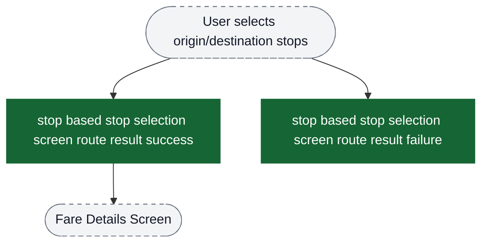
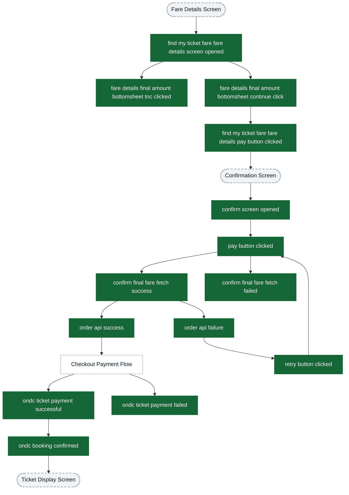
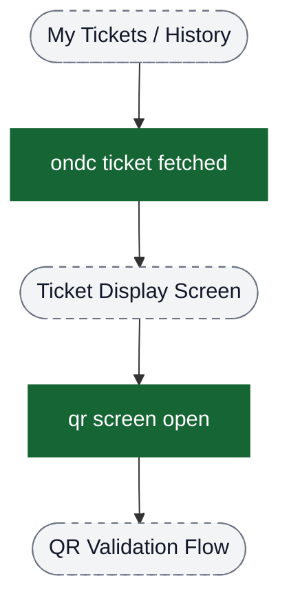
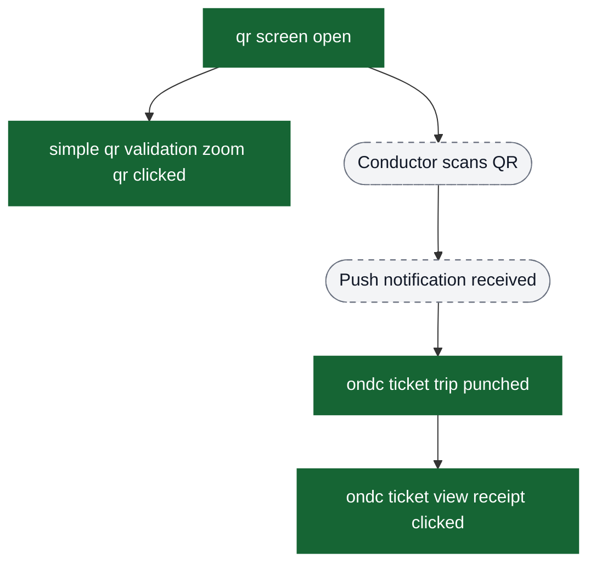
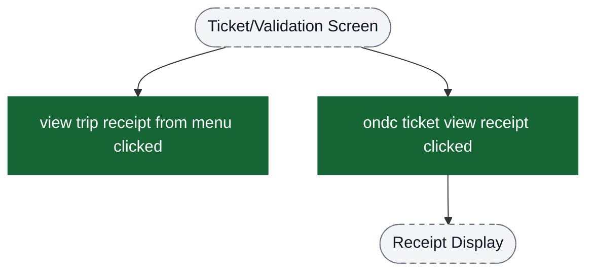
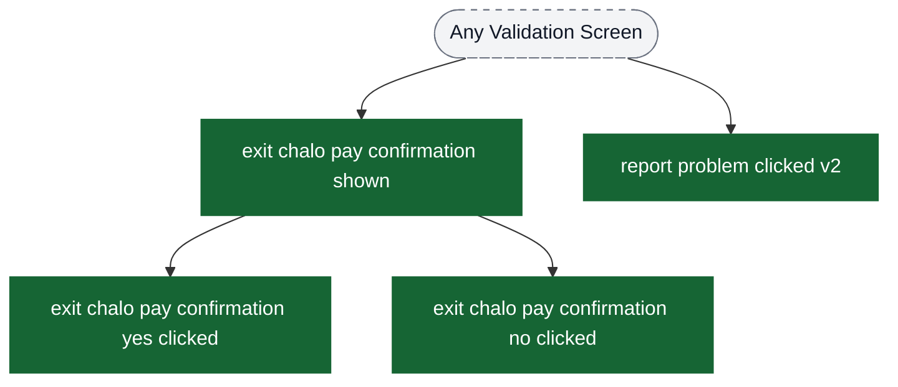
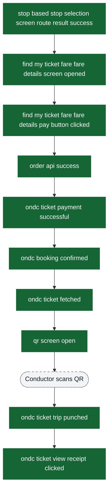

# ONDC Bus Ticket Booking & Validation Analytics Event Flow Diagrams

These diagrams exist to help build funnels in analytics dashboards. Green nodes are the exact event strings emitted by the app; grey nodes are non-analytics context (screens/states/branches). Edges show the typical order and major forks.

Notes:
- All ONDC bus events include `isOndcTicketOrder: true` as a common property to filter this flow family.
- The checkout payment processing UI lives in the Checkout module; this doc only shows ONDC-specific instrumentation.
- ONDC bus tickets use QR-based validation only. Conductor scans the QR code and ticket punch receipt is delivered via push notification.

Visual key:
- Green solid boxes: analytics events (exact strings from `events.json`)
- Grey dashed pills: screens/states/branches (not analytics events)
- Grey dotted boxes: external flows instrumented elsewhere

## Entry: Route Search & Discovery

Use `stop based stop selection screen route result success` as the primary entry point for ONDC bus booking funnel.

## Funnel: Fare Details → Order Creation → Payment → Success

## Funnel: Ticket Display → QR Validation

## Funnel: QR Validation → Punch Receipt

## Funnel: Receipt & Menu Actions

## Global Events (Can Fire From Multiple Locations)

## Error Events (Side Paths)

## Complete End-to-End Funnel Summary

## Key Analytics Insights for Funnel Building

### Primary Conversion Funnel
1. **Route Search Success** → `stop based stop selection screen route result success`
2. **Fare Details View** → `find my ticket fare fare details screen opened`
3. **Payment Intent** → `find my ticket fare fare details pay button clicked`
4. **Order Created** → `order api success`
5. **Payment Success** → `ondc ticket payment successful`
6. **Booking Confirmed** → `ondc booking confirmed`
7. **Ticket Fetched** → `ondc ticket fetched`
8. **QR Validation Started** → `qr screen open`
9. **Trip Punched** → `ondc ticket trip punched` (via push notification after conductor scans QR)
10. **Receipt Viewed** → `ondc ticket view receipt clicked`

### Drop-off Analysis Points
- **Route Search Failure**: `stop based stop selection screen route result failure`
- **Fare Fetch Failure**: `ondc ticket fare fetch failure`
- **Order Creation Failure**: `order api failure`
- **Payment Failure**: `ondc ticket payment failed`
- **Post-Payment Sync Failure**: `post payment history call use case failure`

### QR Validation Flow
ONDC bus tickets use QR-based validation only:
- **QR Screen Opened**: `qr screen open`
- **QR Zoom for Better Scanning**: `simple qr validation zoom qr clicked`
- **Punch Received via Push Notification**: `ondc ticket trip punched`
- **Receipt Viewed**: `ondc ticket view receipt clicked`

### Common Filter Property
All events include `isOndcTicketOrder: true` - use this to create ONDC-specific dashboards and filter out other ticket types (mticket, metro, premium bus, etc.).
