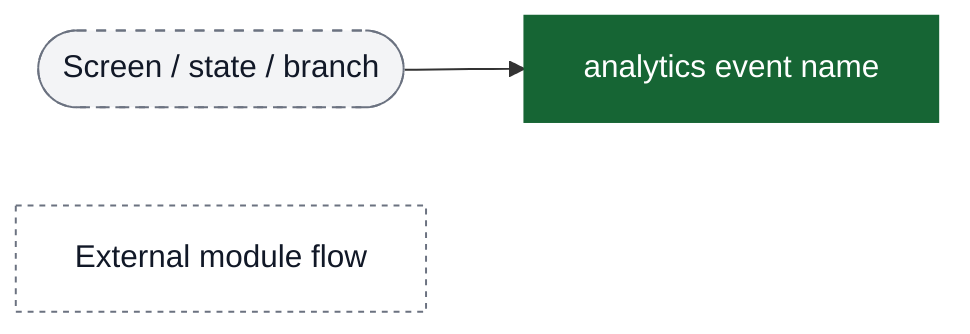
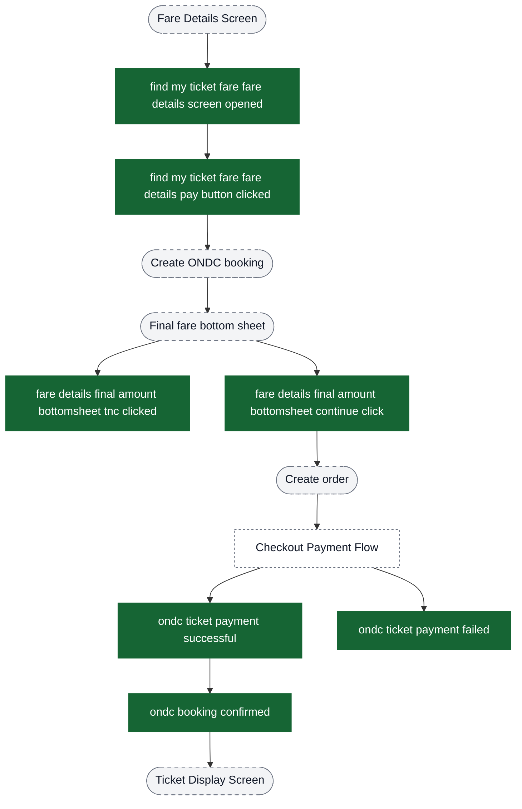
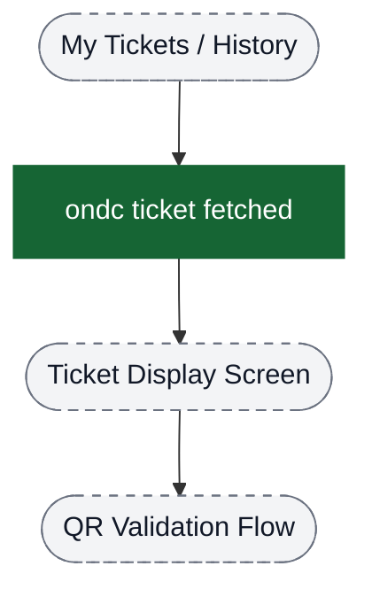
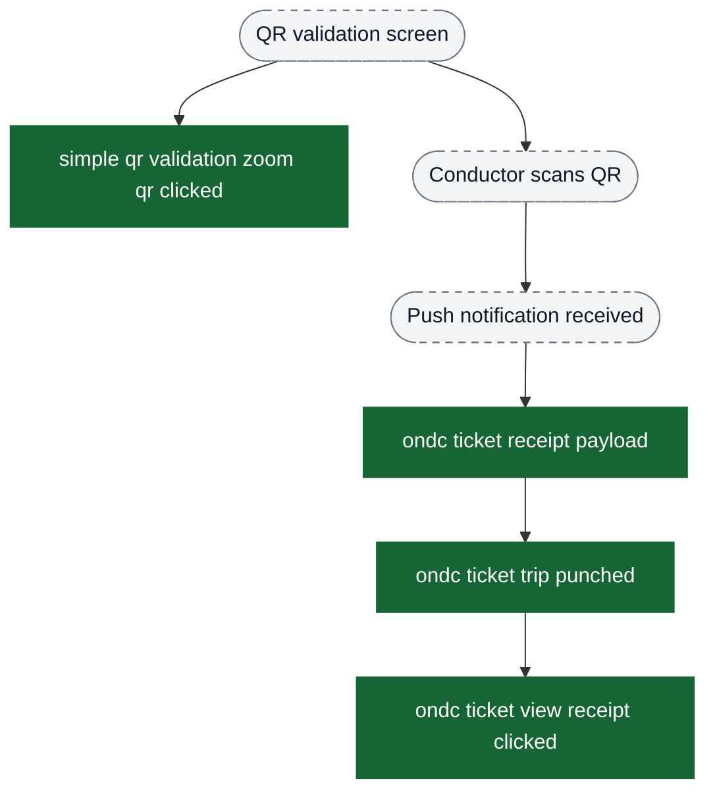
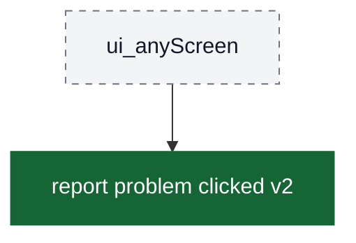
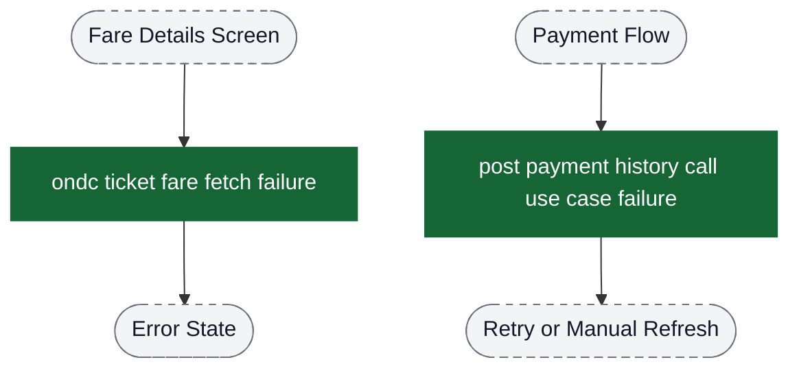
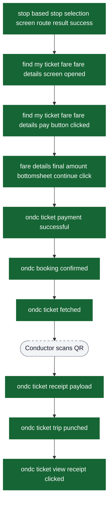

# ONDC Bus Ticket Booking & Validation Analytics Event Flow Diagrams

These diagrams exist to help build funnels in analytics dashboards. Green nodes are the exact event strings emitted by the app; grey nodes are non-analytics context (screens/states/branches). Edges show the typical order and major forks.

Notes:
- `isOndcTicketOrder: true` is added by the ONDC validation analytics manager (ticket fetched/validation/receipt/report-problem). Booking and payment events do not include it.
- The checkout payment processing UI lives in the Checkout module; this doc only shows ONDC-specific instrumentation.
- ONDC bus tickets use QR-based validation only. Conductor scans the QR code and ticket punch receipt is delivered via push notification.

Visual key:
- Green solid boxes: analytics events (exact strings from `events.json`)
- Grey dashed pills: screens/states/branches (not analytics events)
- Grey dotted boxes: external flows instrumented elsewhere



## Entry: Route Search & Discovery

Use `stop based stop selection screen route result success` as the primary entry point for ONDC bus booking; multi-route selections also emit `stop based stop selection screen route result item click`.

```mermaid
flowchart TD
  %%chalo:diagram-link ev_routeItemClick -> title:Funnel: Fare Details → Booking → Payment → Success
  ui_search([Stop-based route search screen]) --> ui_results{Route search result}

  ui_results -->|Success (routes available)| ev_searchSuccess["stop based stop selection screen route result success"]
  ui_results -->|No routes| ev_searchSuccess
  ui_results -->|Failure| ev_searchFailure["stop based stop selection screen route result failure"]

  ev_searchSuccess -->|Single route| ui_fareDetails([Fare Details Screen])
  ev_searchSuccess -->|Multiple routes| ui_routes([Route list bottom sheet])
  ui_routes --> ev_routeItemClick["stop based stop selection screen route result item click"]
  ev_routeItemClick --> ui_fareDetails

  classDef event fill:#166534,stroke:#166534,color:#ffffff;
  classDef ui fill:#f3f4f6,stroke:#6b7280,stroke-dasharray: 5 5,color:#111827;

  class ev_searchSuccess,ev_searchFailure,ev_routeItemClick event;
  class ui_search,ui_results,ui_routes,ui_fareDetails ui;
```

## Funnel: Fare Details → Booking → Payment → Success



## Funnel: Ticket Display → QR Validation



## Funnel: QR Validation → Punch Receipt



## Funnel: Receipt & Menu Actions


## Global Events (Can Fire From Multiple Locations)



## Error Events (Side Paths)



## Complete End-to-End Funnel Summary



## Key Analytics Insights for Funnel Building

### Primary Conversion Funnel
1. **Route Search Success** → `stop based stop selection screen route result success`
2. **Route Selected (Multi-route)** → `stop based stop selection screen route result item click`
3. **Fare Details View** → `find my ticket fare fare details screen opened`
4. **Payment Intent** → `find my ticket fare fare details pay button clicked`
5. **Final Fare Confirmed** → `fare details final amount bottomsheet continue click`
6. **Payment Success** → `ondc ticket payment successful`
7. **Booking Confirmed** → `ondc booking confirmed`
8. **Ticket Fetched** → `ondc ticket fetched`
9. **Trip Punched** → `ondc ticket trip punched` (via push notification after conductor scans QR)
10. **Receipt Viewed** → `ondc ticket view receipt clicked`

### Drop-off Analysis Points
- **Route Search Failure**: `stop based stop selection screen route result failure`
- **Fare Fetch Failure**: `ondc ticket fare fetch failure`
- **Payment Failure**: `ondc ticket payment failed`
- **Post-Payment Sync Failure**: `post payment history call use case failure`

### QR Validation Flow
ONDC bus tickets use QR-based validation only:
- **QR Zoom for Better Scanning**: `simple qr validation zoom qr clicked`
- **Punch Received via Push Notification**: `ondc ticket trip punched`
- **Receipt Viewed**: `ondc ticket view receipt clicked`

### Common Filter Property
Validation and receipt events include `isOndcTicketOrder: true` - use this to create ONDC-specific dashboards and filter out other ticket types (mticket, metro, premium bus, etc.).
