# Payment flow analytics event flow diagrams

These diagrams exist to help build funnels in analytics dashboards. Green nodes are the exact event strings emitted by the app; grey nodes are non-analytics context (screens/states/branches). Edges show the typical order and major forks.

Notes:
- Payment flows vary significantly based on product type (mticket, super pass, wallet, card recharge, bills, etc.)
- Each product type has its own success/failure events (e.g., "mticket payment success", "pass booked")
- Payment method selection determines which checkout flow is used (native UPI apps, Razorpay, Inai, Juspay, Chalo Pay wallet)
- Event semantics matter for funnels:
  - `mticket payment success` / `pass booked` / other product-specific `*payment successful*` events are raised on **payment provider SDK callback** (gateway-level success). These can occur **before** `payment status response`, and do not necessarily mean the backend booking was confirmed.
  - `payment status response` is raised when the app polls backend for the order/payment status (values: `SUCCESS`/`FAILED`/`PENDING`/`UNKNOWN`).
  - `checkout post payment screen opened` is the safest **business-confirmed success** indicator in this flow, because the app navigates to post-payment only after `payment status response` returns `SUCCESS` (Chalo Pay is a separate flow).

Visual key:
- Green solid boxes: analytics events (exact strings from `events.json`)
- Grey dashed pills: screens/states/branches (not analytics events)
- Grey dotted boxes: external flows instrumented elsewhere

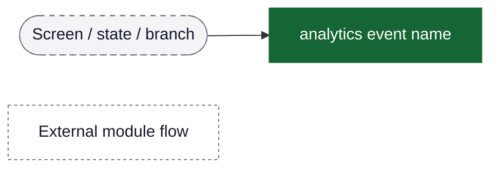

## Main payment flow: Entry → Payment Method → Checkout → (Gateway callback & Status polling) → Post-payment

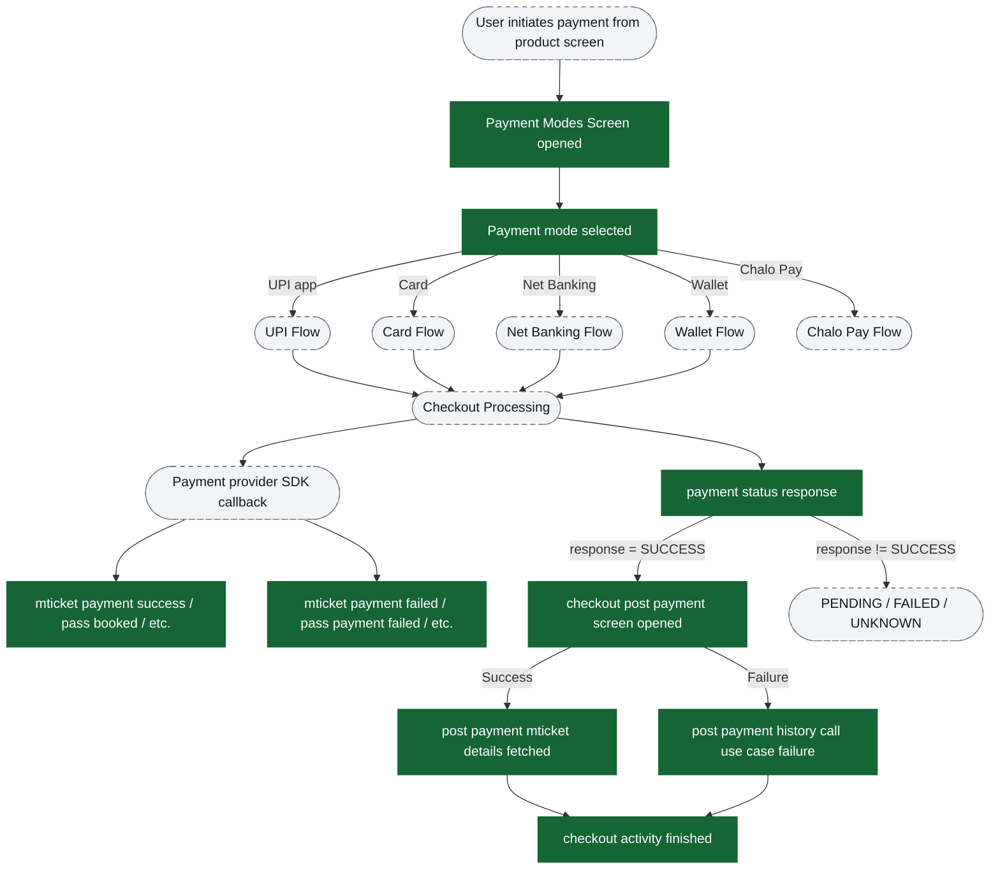

## Funnel: UPI payment method flow

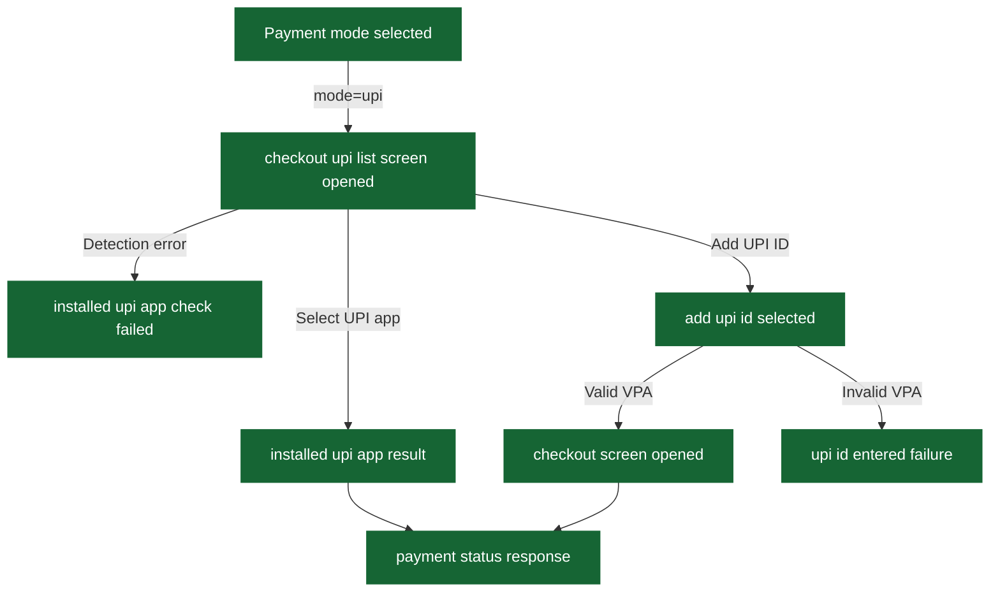

## Funnel: Card payment method flow

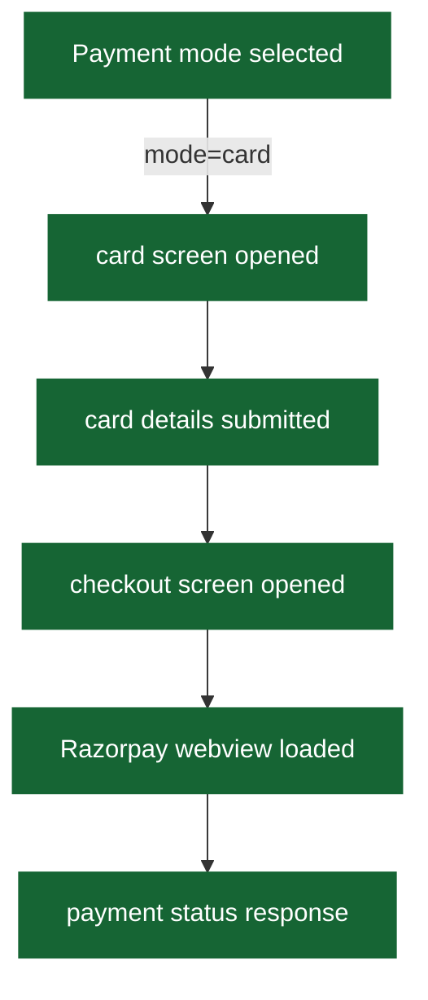

## Funnel: Net Banking & Wallet flows

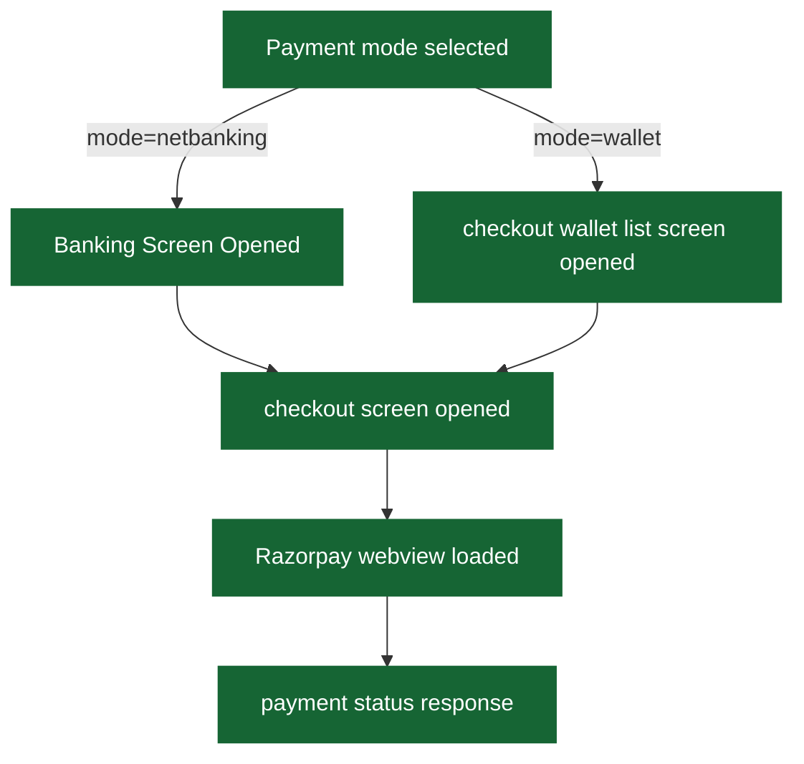

## Funnel: Chalo Pay wallet flow

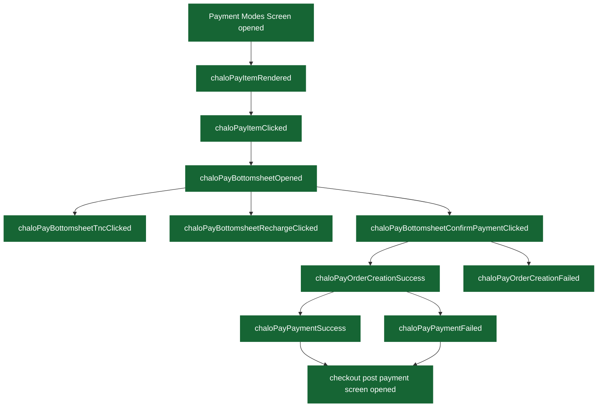

## Funnel: Juspay SDK flow (UPI Autopay)

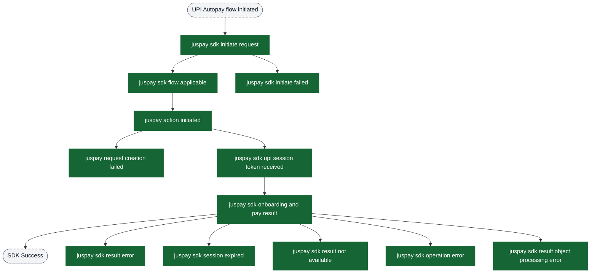

## Funnel: Custom URL checkout flow

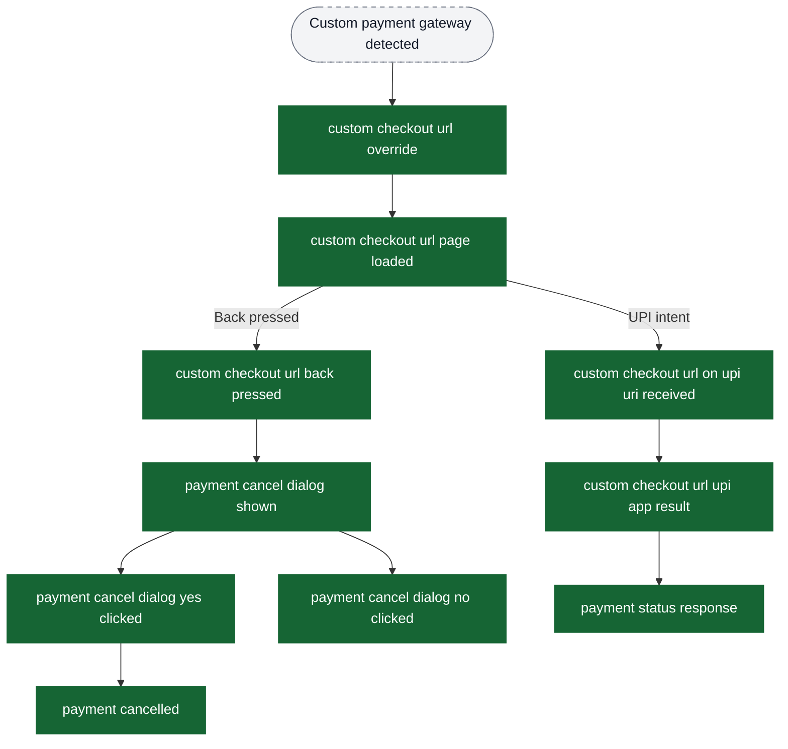

## Payment status polling and result handling

```mermaid
flowchart TD
  ui_paymentSubmitted([Payment submitted to gateway]) --> ev_orderStatus["order status response"]

  ev_orderStatus --> ev_paymentStatus["payment status response"]

  %% Backend-confirmed status (recommended for "purchase success" funnels)
  ev_paymentStatus -->|response = SUCCESS| ev_postPaymentOpen["checkout post payment screen opened"]
  ev_paymentStatus -->|response != SUCCESS| ev_cancelled["payment cancelled / failed / pending / unknown"]

  %% Gateway callback events (SDK-level). These may occur before status polling.
  ui_paymentSubmitted --> ui_gatewayCallback([Payment provider SDK callback])
  ui_gatewayCallback --> ev_mticketSuccess["mticket payment success"]
  ui_gatewayCallback --> ev_passSuccess["pass booked"]
  ui_gatewayCallback --> ev_walletSuccess["wallet load balance payment successful"]
  ui_gatewayCallback --> ev_cardSuccess["online card recharge payment successful"]
  ui_gatewayCallback --> ev_billSuccess["electricity bill payment successful"]
  ui_gatewayCallback --> ev_ncmcSuccess["ncmc recharge payment successful"]
  ui_gatewayCallback --> ev_instantSuccess["instant ticket payment successful"]
  ui_gatewayCallback --> ev_premiumSuccess["premium bus ticket payment successful"]
  ui_gatewayCallback --> ev_ondcSuccess["ondc ticket payment successful"]
  ui_gatewayCallback --> ev_ondcMetroSuccess["ondc metro ticket payment successful"]
  ui_gatewayCallback --> ev_metroSuccess["metro ticket payment successful"]

  ui_gatewayCallback --> ev_mticketFailed["mticket payment failed"]
  ui_gatewayCallback --> ev_passFailed["pass payment failed"]
  ui_gatewayCallback --> ev_walletFailed["wallet load balance payment failed"]
  ui_gatewayCallback --> ev_otherFailed["... payment failed"]

  classDef event fill:#166534,stroke:#166534,color:#ffffff;
  classDef ui fill:#f3f4f6,stroke:#6b7280,stroke-dasharray: 5 5,color:#111827;
  classDef external fill:#ffffff,stroke:#6b7280,stroke-dasharray: 3 3,color:#111827;

  class ev_orderStatus,ev_paymentStatus,ev_postPaymentOpen,ev_cancelled,ev_mticketSuccess,ev_passSuccess,ev_walletSuccess,ev_cardSuccess,ev_billSuccess,ev_ncmcSuccess,ev_instantSuccess,ev_premiumSuccess,ev_ondcSuccess,ev_ondcMetroSuccess,ev_metroSuccess,ev_mticketFailed,ev_passFailed,ev_walletFailed,ev_otherFailed event;
  class ui_paymentSubmitted,ui_gatewayCallback ui;
```

## Post-payment screen and booking details fetching

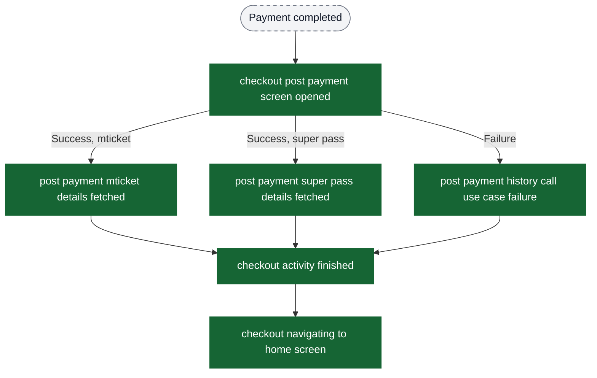

---

# Funnel Building Guide for PMs

## Quick Reference: Key Funnel Events

| Stage | Event Name | Purpose |
|-------|------------|---------|
| Entry | `Payment Modes Screen opened` | Funnel start - user reached payment |
| Method Selection | `Payment mode selected` | User chose a payment method |
| Checkout | `checkout screen opened` | User entered checkout flow |
| Gateway Load | `Razorpay webview loaded` | Payment gateway ready |
| Status (backend) | `payment status response` | Backend status poll result (`response` = `SUCCESS`/`FAILED`/`PENDING`/`UNKNOWN`) |
| Success (business) | `checkout post payment screen opened` | User reached post-payment after backend-confirmed `SUCCESS` |
| Success (gateway) | `mticket payment success` (or product-specific) | Provider SDK callback success (can occur before backend status; use primarily for diagnostics) |
| Failure | `mticket payment failed` (or product-specific) | Payment failed |
| Exit | `checkout activity finished` | User left checkout |

---

## Ready-to-Use Funnel Definitions

### Funnel 1: Overall Payment Conversion (All Products)

**Purpose:** Measure overall payment success rate across all products

**Events (in order):**
1. `Payment Modes Screen opened`
2. `Payment mode selected`
3. `payment status response` (filter: `response` = "SUCCESS")
4. `checkout post payment screen opened`

**Conversion calculation:**
- **Payment method selection rate:** Event 2 / Event 1
- **Payment success rate:** Event 3 (SUCCESS) / Event 2
- **Overall conversion:** Event 4 / Event 1

---

### Funnel 2: UPI Payment Conversion

**Purpose:** Measure UPI-specific payment funnel

**Events (in order):**
1. `Payment mode selected` (filter: `mode` = "upi")
2. `checkout upi list screen opened`
3. `installed upi app result` (filter: `resultStatus` = "SUCCESS")
4. `payment status response` (filter: `response` = "SUCCESS")

**Alternative path (manual VPA entry):**
1. `Payment mode selected` (filter: `mode` = "upi")
2. `add upi id selected`
3. `checkout screen opened`
4. `payment status response` (filter: `response` = "SUCCESS")

**Drop-off analysis:**
- `upi id entered failure` → VPA validation issues
- `installed upi app check failed` → System error detecting UPI apps
- `installed upi app result` with `isOperationCancelled` = "true" → User cancelled in UPI app

---

### Funnel 3: Card Payment Conversion

**Purpose:** Measure card payment funnel

**Events (in order):**
1. `Payment mode selected` (filter: `mode` = "card")
2. `card screen opened`
3. `card details submitted`
4. `checkout screen opened`
5. `Razorpay webview loaded`
6. `payment status response` (filter: `response` = "SUCCESS")

**Drop-off analysis:**
- Drop between 2→3: Card details entry abandonment
- Drop between 5→6: Gateway/bank failure

---

### Funnel 4: Chalo Pay Wallet Conversion

**Purpose:** Measure Chalo Pay wallet payment funnel

**Events (in order):**
1. `chaloPayItemRendered`
2. `chaloPayItemClicked`
3. `chaloPayBottomsheetOpened`
4. `chaloPayBottomsheetConfirmPaymentClicked`
5. `chaloPayOrderCreationSuccess`
6. `chaloPayPaymentSuccess`

**Drop-off analysis:**
- `chaloPayBottomsheetRechargeClicked` → Insufficient balance
- `chaloPayOrderCreationFailed` → Backend order creation issue
- `chaloPayPaymentFailed` → Wallet deduction failed

---

### Funnel 5: Product-Specific Payment (M-Ticket Example)

**Purpose:** Measure M-Ticket payment conversion

**Events (in order):**
1. `Payment Modes Screen opened`
2. `Payment mode selected`
3. `payment status response` (filter: `response` = "SUCCESS")
4. `checkout post payment screen opened`
5. `post payment mticket details fetched`

**Failure path:**
- `mticket payment failed` → Capture `error`, `description`, `reason` for failure analysis

---

## Segmentation Guide

### By Payment Method

Use `Payment mode selected` event with `mode` property:

| `mode` value | Payment Method |
|--------------|----------------|
| `upi` | UPI (GPay, PhonePe, etc.) |
| `card` | Credit/Debit Card |
| `netbanking` | Net Banking |
| `wallet` | Third-party Wallets (Paytm, etc.) |

For Chalo Pay, use separate events starting with `chaloPay*`.

### By Product Type

Filter success/failure events by product:

| Product | Success Event | Failure Event |
|---------|---------------|---------------|
| M-Ticket | `mticket payment success` | `mticket payment failed` |
| Super Pass | `pass booked` | `pass payment failed` |
| Wallet Recharge | `wallet load balance payment successful` | `wallet load balance payment failed` |
| Card Recharge | `online card recharge payment successful` | `online card recharge payment failed` |
| Electricity Bill | `electricity bill payment successful` | `electricity bill payment failed` |
| NCMC | `ncmc recharge payment successful` | `ncmc recharge payment failed` |
| Instant Ticket | `instant ticket payment successful` | `instant ticket payment failed` |
| Premium Bus | `premium bus ticket payment successful` | `premium bus ticket payment failed` |
| ONDC Bus | `ondc ticket payment successful` | `ondc ticket payment failed` |
| ONDC Metro | `ondc metro ticket payment successful` | `ondc metro ticket payment failed` |
| Metro | `metro ticket payment successful` | `metro ticket payment failed` |

### By UPI App

Use `Payment mode selected` event with `payment app name` property:
- "Google Pay", "PhonePe", "Paytm", "Amazon Pay", etc.

### By Time of Day

Use `hourOfEvent` property on success/failure events (0-23) to analyze payment patterns.

---

## Drop-off Analysis Guide

### Key Drop-off Points

1. **Entry → Method Selection**
   - Compare: `Payment Modes Screen opened` → `Payment mode selected`
   - Issue: Users not finding preferred payment method

2. **Method Selection → Checkout**
   - Compare: `Payment mode selected` → `checkout screen opened`
   - Issue: Card details entry friction, UPI validation failures

3. **Checkout → Gateway Load**
   - Compare: `checkout screen opened` → `Razorpay webview loaded`
   - Issue: Slow gateway load, network issues

4. **Gateway → Payment Status**
   - Compare: `Razorpay webview loaded` → `payment status response`
   - Issue: User abandonment during payment, bank OTP issues

5. **Payment Status → Success**
   - Compare: `payment status response` (all) → `payment status response` (SUCCESS)
   - Issue: Payment failures, declined transactions

### Cancellation Analysis

Track `payment cancelled` event with `paymentProvider` property to identify which gateway has higher cancellation rates.

Track `payment cancel dialog yes clicked` vs `payment cancel dialog no clicked` for cancellation intent vs recovery.

---

## Error Analysis

### Razorpay Failures

Filter `*payment failed` events and analyze:
- `errorCode` - Error code
- `description` - Human-readable error
- `source` - Error source (bank, network, etc.)
- `step` - Step where failure occurred
- `reason` - Detailed reason

### Inai Failures

Filter `*payment failed` events and analyze:
- `errorCode` - Error code
- `transactionId` - Transaction id (when available)
- `description` - Error description (when available)
- `reason` - Error reason/type (when available)

### Juspay SDK Failures

Track these events for SDK issues:
- `juspay sdk initiate failed`
- `juspay request creation failed`
- `juspay sdk result error`
- `juspay sdk session expired`
- `juspay sdk operation error`

---

## Funnel: Payment Reliability & Diagnostics

These events help monitor payment module health (method fetch failures, SDK management, eligibility/url failures).

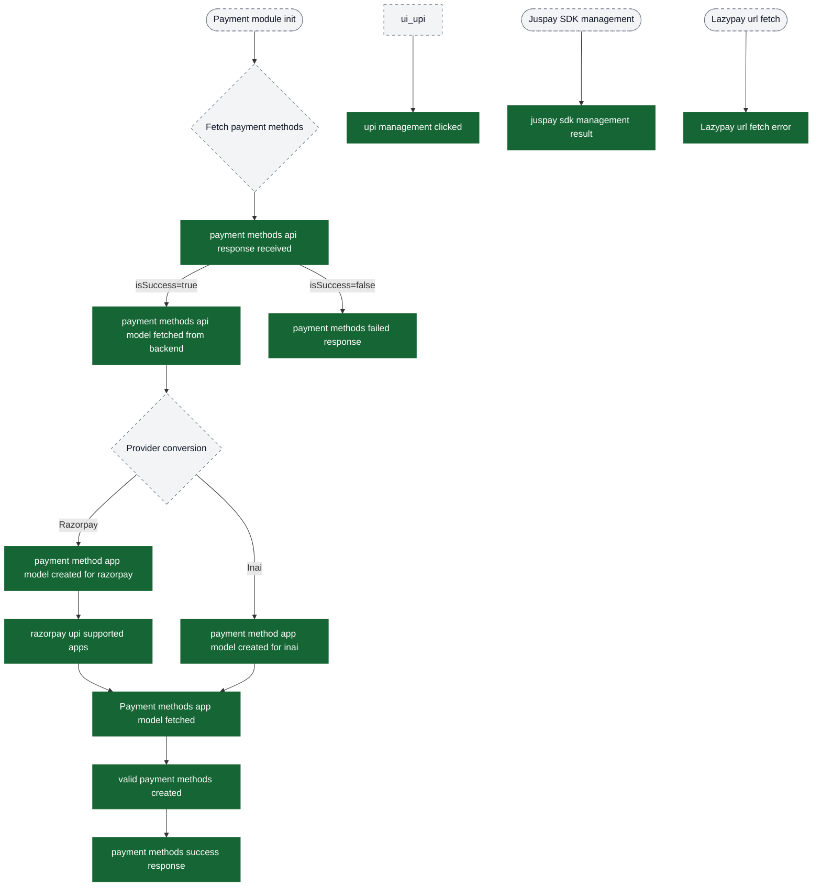

## Property Definitions for Funnel Filters

### Payment Modes Screen opened

| Property | Type | Description | Example Values |
|----------|------|-------------|----------------|
| `preferred mode` | number | Count of recent payment modes | 3 |
| `popular mode` | number | Count of popular modes | 5 |
| `installedUpiAppFlow` | string | Native UPI available | "true", "false" |
| `installedUpiAppsCount` | string | Number of UPI apps | "4" |
| `installedUpiApps` | string | UPI app names | "Google Pay,PhonePe,Paytm" |

### Payment mode selected

| Property | Type | Description | Example Values |
|----------|------|-------------|----------------|
| `mode` | string | Payment method code | "upi", "card", "netbanking" |
| `payment app name` | string | Display name | "Google Pay", "HDFC Bank" |
| `top mode` | boolean | Featured mode | true, false |
| `preferred mode` | boolean | User's preferred | true, false |

### payment status response

| Property | Type | Description | Example Values |
|----------|------|-------------|----------------|
| `response` | string | Status | "SUCCESS", "FAILURE", "PENDING" |
| `orderId` | string | Gateway order ID | "order_xyz123" |
| `chaloOrderId` | string | Chalo order ID | "CHO123456" |
| `bookingId` | string | Booking ID | "BK987654" |
| `reason` | string | Status reason | "Payment successful" |

### Product success events (e.g., mticket payment success)

| Property | Type | Description |
|----------|------|-------------|
| `paymentId` | string | Transaction ID |
| `hourOfEvent` | string | Hour (0-23) |
| `agency` | string | Transit agency |
| `bookingId` | string | Booking ID |
| `fare` | string | Amount paid |
| `isFreeRide` | string | Free ride flag |

**Important:** These events are emitted on the payment provider SDK callback (gateway-level success/failure). For business-confirmed success funnels, prefer `payment status response` with `response = "SUCCESS"` and/or `checkout post payment screen opened`.

---

## Example Dashboard Queries

### Payment Success Rate by Method (Last 7 Days)

```
Event: "payment status response"
Filter: response = "SUCCESS"
Group by: (join with "Payment mode selected" on session) mode
Time: Last 7 days
```

### UPI App Performance Comparison

```
Event: "installed upi app result"
Filter: resultStatus = "SUCCESS"
Group by: (from "Payment mode selected") payment app name
Calculate: Success rate = SUCCESS / Total
```

### Payment Failure Reasons

```
Event: "mticket payment failed" OR "pass payment failed" OR ...
Group by: error, description
Sort by: Count DESC
```

### Chalo Pay Adoption Funnel

```
Step 1: "chaloPayItemRendered" (impressions)
Step 2: "chaloPayItemClicked" (clicks)
Step 3: "chaloPayPaymentSuccess" (conversions)

CTR = Step 2 / Step 1
Conversion = Step 3 / Step 2
```
