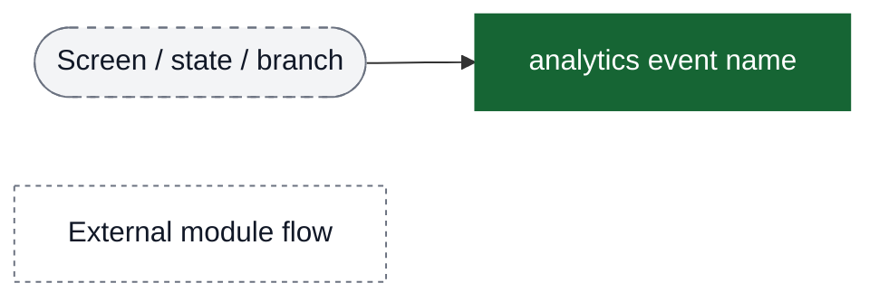
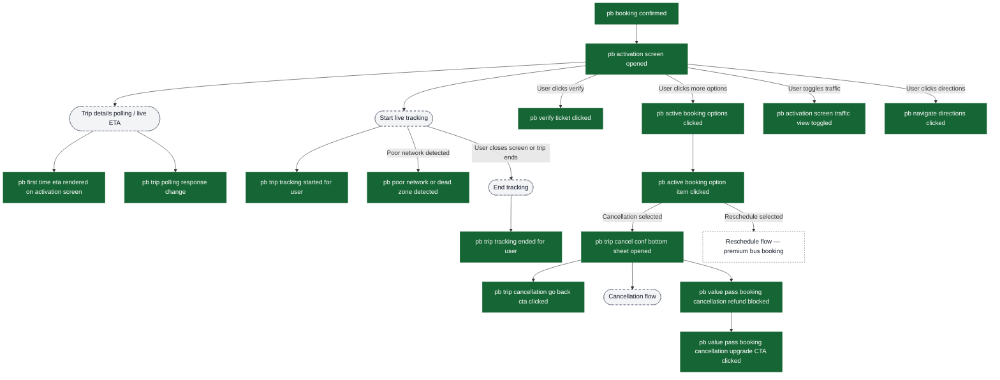
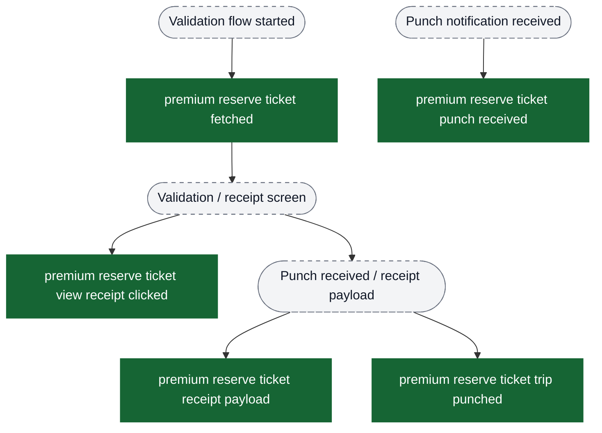
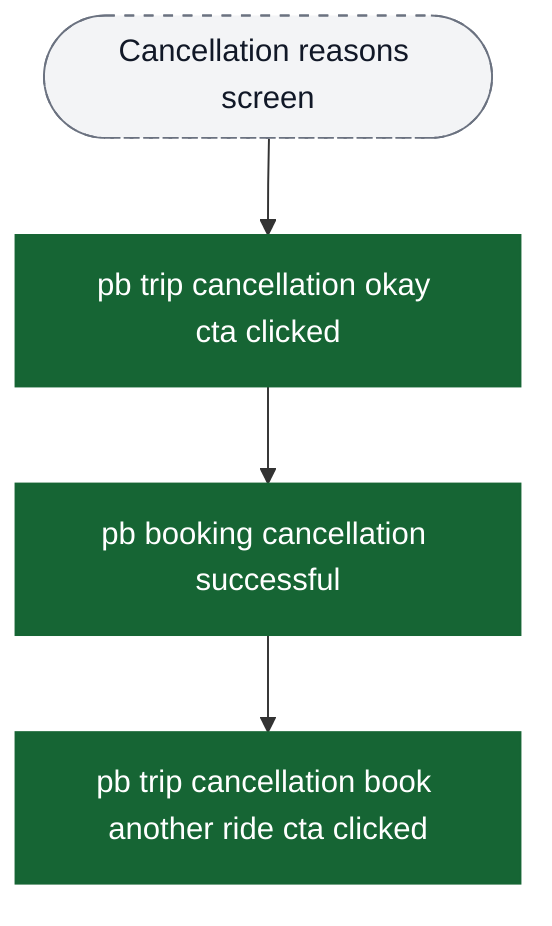
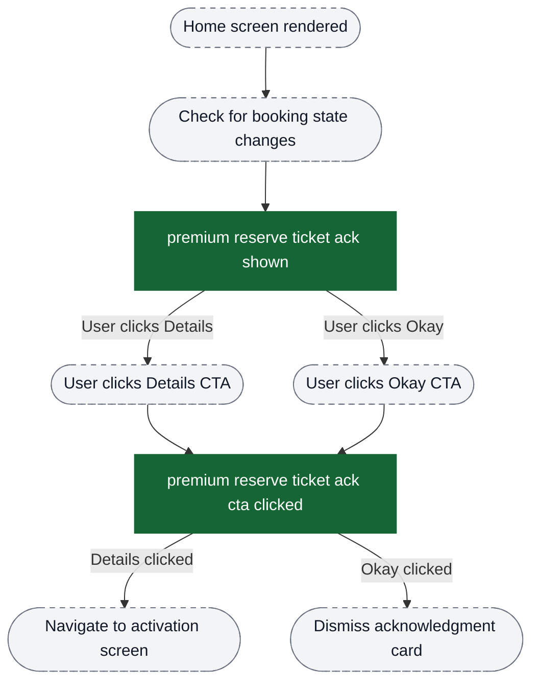

# Premium Bus — Activation & Tracking Analytics Event Flow Diagrams

These diagrams help build funnels in analytics dashboards. Green nodes are exact event strings emitted by the app; grey nodes are non-analytics context (screens/states/branches). Edges show typical order and major forks.

Notes:
- This flow starts **after a booking is confirmed** and the user enters activation / live tracking.
- It applies to fresh bookings, pass-based bookings, and bulk bookings.
- Booking conversion is documented in `content/analytics/premium-bus-booking/flow-diagrams.md`.
- Bulk booking / manage rides is documented in `content/analytics/premium-bus-bulk-booking/flow-diagrams.md`.

Visual key:
- Green solid boxes: analytics events (exact strings from `events.json`)
- Grey dashed pills: screens/states/branches (not analytics events)
- Grey dotted boxes: external flows instrumented elsewhere



## Funnel: Booking Confirmed → Ticket Activation & Live Tracking



## Validation & Receipt (Premium Reserve Ticket)



## Cancellation Flow (Premium Bus Product Modification)



## Home Screen Acknowledgment Cards

Shows premium bus acknowledgment cards shown on home screen after booking state changes.



## Key Funnel Construction Guidelines for PMs

### Activation & Tracking Engagement
```
pb activation screen opened
  → pb first time eta rendered on activation screen
  → pb trip tracking started for user
  (Actions: pb verify ticket clicked, pb navigate directions clicked)
  → pb trip tracking ended for user
```

## Monitoring Signals

These events can be useful as leading indicators / quality signals:
- `pb trip polling response change`
- `pb poor network or dead zone detected`
