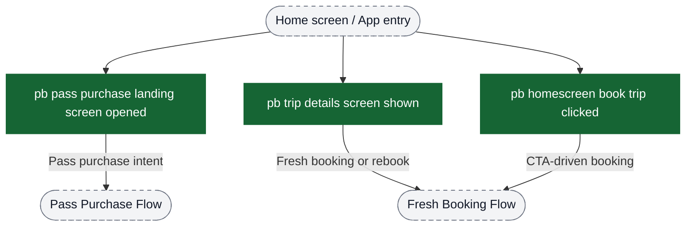
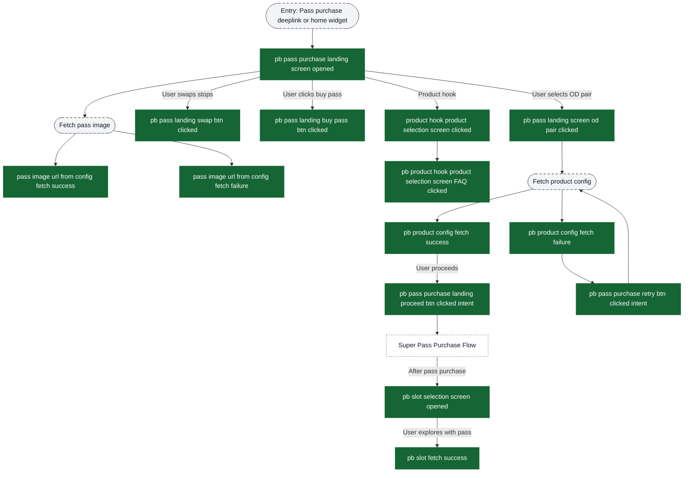
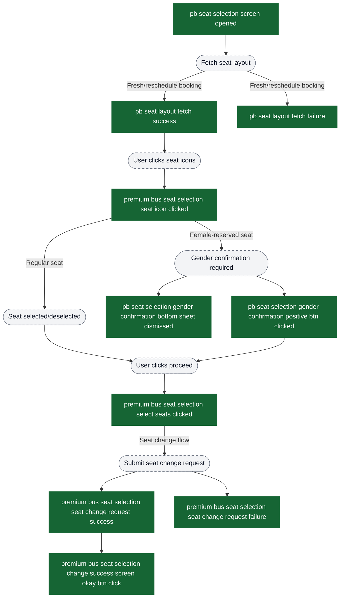
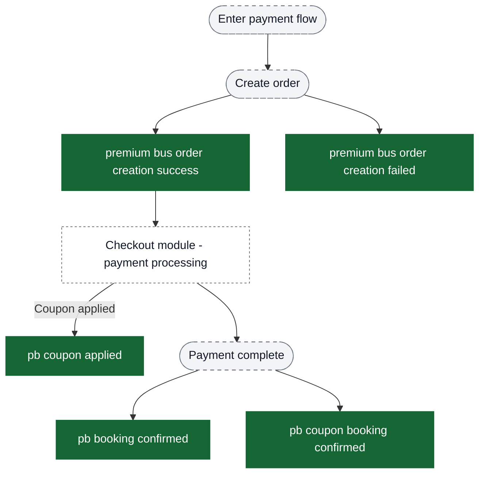

# Premium Bus — Booking Analytics Event Flow Diagrams

These diagrams help build funnels in analytics dashboards. Green nodes are exact event strings emitted by the app; grey nodes are non-analytics context (screens/states/branches). Edges show typical order and major forks.

Notes:
- Premium bus booking has **multiple entry points**: direct trip search, pass purchase landing, home screen widgets, and deeplinks.
- The booking flow branches based on whether the user is purchasing fresh, rescheduling, or booking via a pass.
- Bulk booking / manage rides is documented in `content/analytics/premium-bus-bulk-booking/flow-diagrams.md`.
- Post-booking activation & tracking is documented in `content/analytics/premium-bus-activation-tracking/flow-diagrams.md`.

Visual key:
- Green solid boxes: analytics events (exact strings from `events.json`)
- Grey dashed pills: screens/states/branches (not analytics events)
- Grey dotted boxes: external flows instrumented elsewhere


## Entry Points → Booking Funnel Decision

Use the initial events to identify which funnel path the user takes.



## Funnel 1: Fresh Booking (No Pass) - Complete Journey

```mermaid
flowchart TD
  ui_entry([Entry: Trip search or deeplink]) --> ev_tripDetailsShown["pb trip details screen shown"]

  ev_tripDetailsShown -->|User explores routes| ev_landingRouteClicked["pb landing route clicked"]
  ev_tripDetailsShown -->|View all routes| ev_viewAllClicked["pb landing screen route view all clicked"]
  ev_tripDetailsShown -->|Click rebook card| ev_rebookClicked["pb rebook card clicked"]
  ev_tripDetailsShown -->|Explore available routes| ev_exploreRoutesBtnClicked["pb explore available routes button clicked"]
  ev_tripDetailsShown -->|View all routes (alt)| ev_viewAllClicked2["pb landing screen route view all clicked"]
  ev_tripDetailsShown -->|Rebook card (alt)| ev_rebookClicked2["pb rebook card clicked"]

  ev_viewAllClicked --> ui_allRoutes([All routes list])
  ev_viewAllClicked2 --> ui_allRoutes
  ev_exploreRoutesBtnClicked --> ui_allRoutes
  ui_allRoutes --> ev_allRoutesRouteClicked["pb all routes route clicked"]
  ev_allRoutesRouteClicked --> ev_landingRouteClicked

  ev_tripDetailsShown -->|Stop suggestion| ev_newStopSuggestion["pb stop suggestion submitted"]
  ev_newStopSuggestion --> ev_stopSuggestionSubmitted["pb stop suggestion submitted"]

  ev_tripDetailsShown --> ui_preferredTime([Preferred time selection])
  ui_preferredTime --> ev_preferredTimeSubmitted["premium bus preferred time submitted"]

  ev_tripDetailsShown --> ui_odFetch([Fetch OD pairs for source/destination])
  ui_odFetch --> ev_odFetchSuccess["pb pickup drop options fetched"]
  ui_odFetch --> ev_odFetchFailed["pb pickup drop options fetched result failed"]
  ui_odFetch --> ev_odFetchSuccess2["pb pickup drop options fetched"]
  ui_odFetch --> ev_odFetchFailed2["pb pickup drop options fetched result failed"]

  ev_odFetchSuccess --> ui_userSelectsOD([User selects pickup/drop])
  ui_userSelectsOD --> ev_odSelected["pb pickup drop selected"]
  ui_userSelectsOD --> ev_odSelected2["pb pickup drop selected"]

  ev_odSelected --> ui_configFetch([Fetch product config])
  ui_configFetch --> ev_configSuccess["pb fetch complete product config success"]
  ui_configFetch --> ev_configFailed["pb fetch complete product config failed"]
  ui_configFetch --> ev_configSuccess2["pb fetch complete product config success"]
  ui_configFetch --> ev_configFailed2["pb fetch complete product config failed"]
  ev_configFailed --> ev_noRouteError["pb no route error displayed"]
  ev_configFailed2 --> ev_noRouteError

  ev_configSuccess --> ev_slotScreenOpen["pb slot selection screen opened"]
  ev_configSuccess2 --> ev_slotScreenOpen2["pb slot selection screen opened"]
  ev_slotScreenOpen2 --> ui_slotFetch

  ev_slotScreenOpen --> ui_slotFetch([Fetch available slots])
  ui_slotFetch --> ev_slotSuccess["pb slot fetch success"]
  ui_slotFetch --> ev_slotFailure["pb slot fetch failure"]
  ui_slotFetch --> ev_slotSuccess2["pb slot fetch success"]
  ui_slotFetch --> ev_slotFailure2["pb slot fetch failure"]

  ev_slotSuccess -->|User explores passes| ev_purchaseOptionsSuccess["pb available purchase options success"]
  ev_slotSuccess --> ui_userSelectsSlot([User selects slot])
  ui_userSelectsSlot --> ev_slotSelected["pb slot selected by user"]
  ui_userSelectsSlot --> ev_slotSelected2["pb slot selected by user"]

  ev_slotSelected --> ev_seatScreenOpen["pb seat selection screen opened"]

  ev_seatScreenOpen --> ui_seatFetch([Fetch seat layout])
  ui_seatFetch --> ev_seatLayoutSuccess["pb seat layout fetch success"]
  ui_seatFetch --> ev_seatLayoutFailure["pb seat layout fetch failure"]

  ev_seatLayoutSuccess --> ui_userClicksSeats([User selects seats])
  ui_userClicksSeats --> ev_seatClicked["premium bus seat selection seat icon clicked"]

  ui_userClicksSeats --> ui_userProceeds([User clicks proceed])
  ui_userProceeds --> ev_selectSeatsClicked["premium bus seat selection select seats clicked"]

  ev_selectSeatsClicked --> ext_checkout[Checkout flow - payment]
  ext_checkout --> ev_orderSuccess["premium bus order creation success"]
  ext_checkout --> ev_orderFailed["premium bus order creation failed"]

  ev_orderSuccess --> ev_bookingConfirmed["pb booking confirmed"]
  ev_bookingConfirmed --> ui_bookingSuccessScreen([Booking success screen])
  ui_bookingSuccessScreen --> ev_rescheduleSuccess["pb booking reschedule successful event"]
  ev_bookingConfirmed --> ext_activation[Activation & tracking flow]

  classDef event fill:#166534,stroke:#166534,color:#ffffff;
  classDef ui fill:#f3f4f6,stroke:#6b7280,stroke-dasharray: 5 5,color:#111827;
  classDef external fill:#ffffff,stroke:#6b7280,stroke-dasharray: 3 3,color:#111827;

  class ev_tripDetailsShown,ev_landingRouteClicked,ev_viewAllClicked,ev_rebookClicked,ev_exploreRoutesBtnClicked,ev_viewAllClicked2,ev_rebookClicked2,ev_allRoutesRouteClicked,ev_newStopSuggestion,ev_stopSuggestionSubmitted,ev_preferredTimeSubmitted,ev_odFetchSuccess,ev_odFetchFailed,ev_odFetchSuccess2,ev_odFetchFailed2,ev_odSelected,ev_odSelected2,ev_configSuccess,ev_configFailed,ev_configSuccess2,ev_configFailed2,ev_noRouteError,ev_slotScreenOpen,ev_slotScreenOpen2,ev_slotSuccess,ev_slotFailure,ev_slotSuccess2,ev_slotFailure2,ev_purchaseOptionsSuccess,ev_slotSelected,ev_slotSelected2,ev_seatScreenOpen,ev_seatLayoutSuccess,ev_seatLayoutFailure,ev_seatClicked,ev_selectSeatsClicked,ev_orderSuccess,ev_orderFailed,ev_bookingConfirmed,ev_rescheduleSuccess event;
  class ui_entry,ui_allRoutes,ui_preferredTime,ui_odFetch,ui_userSelectsOD,ui_configFetch,ui_slotFetch,ui_userSelectsSlot,ui_seatFetch,ui_userClicksSeats,ui_userProceeds,ui_bookingSuccessScreen ui;
  class ext_checkout,ext_activation external;
```

## Funnel 2: Pass Purchase Landing → Pass Exploration



## Slot Selection Detailed Instrumentation

This shows granular events within the slot selection screen, useful for conversion optimization.

```mermaid
flowchart TD
  ev_slotScreenOpen["pb slot selection screen opened"] --> ui_odPairFetch([Fetch OD pairs])

  ui_odPairFetch --> ev_odSuccess["pb od pair fetch success"]
  ui_odPairFetch --> ev_odFailed["pb od pair fetch failed"]

  ev_odSuccess --> ui_slotFetch([Fetch slots for selected section])
  ui_slotFetch --> ev_slotSuccess["pb slot fetch success"]
  ui_slotFetch --> ev_slotFailure["pb slot fetch failure"]
  ui_slotFetch --> ev_slotSuccess2["pb slot fetch success"]
  ui_slotFetch --> ev_slotFailure2["pb slot fetch failure"]

  ev_slotSuccess -->|User clicks slot| ev_slotSelected["pb slot selected by user"]
  ev_slotSuccess -->|User clicks slot (alt)| ev_slotSelected2["pb slot selected by user"]

  ev_slotSuccess -->|User explores passes| ui_passFetch([Fetch purchase options])
  ui_passFetch --> ev_passSuccess["pb available purchase options success"]
  ui_passFetch --> ev_passFailed["pb available purchase options failed"]
  ui_passFetch --> ev_passSuccess2["pb available purchase options success"]
  ui_passFetch --> ev_passFailed2["pb available purchase options failed"]

  ev_passSuccess --> ev_passBottomSheet["pb purchase option bottom sheet item clicked"]
  ev_passSuccess --> ev_passCardClicked["pb pass purchased card clicked by user"]
  ev_passSuccess --> ev_passCardClicked2["pb pass purchased card clicked by user"]

  ev_passBottomSheet --> ev_valuePassBlocked["pb value pass bottomsheet booking blocked"]
  ev_valuePassBlocked --> ev_valuePassUpgradeCta["pb value pass bottomsheet upgrade CTA clicked"]

  ev_slotSuccess -->|User checks pass savings| ui_savingsFetch([Fetch pass savings])
  ui_savingsFetch --> ev_savingsSuccess["pb pass savings fetch success"]
  ui_savingsFetch --> ev_savingsFailed["pb pass savings fetch failure"]

  ev_savingsSuccess --> ev_savingsInfoClicked["pb pass savings info btn clicked"]

  ev_slotSuccess -->|User clicks view all| ev_viewAllClicked["premium bus view all slots clicked"]
  ev_slotSuccess -->|User clicks view all (alt)| ev_viewAllClicked2["pb view all slots clicked"]
  ev_slotSuccess -->|User clicks explore routes| ev_exploreClicked["premium bus explore available routes clicked"]
  ev_slotSuccess -->|User clicks explore routes (alt)| ev_exploreClicked2["pb explore available routes clicked"]
  ev_slotSuccess -->|User clicks directions| ev_directionsClicked["pb directions to stop clicked"]

  ev_slotSuccess --> ev_suggestedStops["pb suggested stops"]
  ev_suggestedStops --> ev_slotSuggestionSubmitted["pb slot suggestion submitted"]

  classDef event fill:#166534,stroke:#166534,color:#ffffff;
  classDef ui fill:#f3f4f6,stroke:#6b7280,stroke-dasharray: 5 5,color:#111827;

  class ev_slotScreenOpen,ev_odSuccess,ev_odFailed,ev_slotSuccess,ev_slotFailure,ev_slotSuccess2,ev_slotFailure2,ev_slotSelected,ev_slotSelected2,ev_passSuccess,ev_passFailed,ev_passSuccess2,ev_passFailed2,ev_passBottomSheet,ev_passCardClicked,ev_passCardClicked2,ev_valuePassBlocked,ev_valuePassUpgradeCta,ev_savingsSuccess,ev_savingsFailed,ev_savingsInfoClicked,ev_viewAllClicked,ev_viewAllClicked2,ev_exploreClicked,ev_exploreClicked2,ev_directionsClicked,ev_suggestedStops,ev_slotSuggestionSubmitted event;
  class ui_odPairFetch,ui_slotFetch,ui_passFetch,ui_savingsFetch ui;
```

## Seat Selection Detailed Instrumentation

Shows granular seat selection interactions including gender confirmation for reserved seats.



## Payment & Order Creation

Shows the payment flow with coupon application and order creation.



## Key Funnel Construction Guidelines for PMs

### Fresh Booking Conversion Funnel
```
pb trip details screen shown
  → pb pickup drop selected
  → pb slot selection screen opened
  → pb slot selected by user
  → pb seat selection screen opened
  → premium bus seat selection select seats clicked
  → premium bus order creation success
  → pb booking confirmed
```

### Pass Purchase Intent Funnel
```
pb pass purchase landing screen opened
  → pb pass landing screen od pair clicked
  → pb pass purchase landing proceed btn clicked intent
  → [Super Pass Purchase Flow - see super-pass-purchase/flow-diagrams.md]
  → pb slot selection screen opened (with pass)
```

### Slot Selection Conversion
```
pb slot selection screen opened
  → pb slot fetch success
  → pb slot selected by user
  (Drop-off: pb slot fetch failure, pb no slots available)
```

### Seat Selection Conversion
```
pb seat selection screen opened
  → pb seat layout fetch success
  → premium bus seat selection seat icon clicked (one or more)
  → premium bus seat selection select seats clicked
  (Drop-off: pb seat layout fetch failure, insufficient seats)
```

## Error Events for Monitoring

Track these events to monitor booking flow health:

**Stop Selection Errors:**
- `pb pickup drop options fetched result failed`
- `pb event no route error displayed`
- `pb fetch complete product config failed`

**Slot Selection Errors:**
- `pb slot fetch failure`
- `pb available purchase options failed`
- `pb od pair fetch failed`
- `pb pass savings fetch failure`

**Seat Selection Errors:**
- `pb seat layout fetch failure`
- `premium bus seat selection seat change request failure`

**Payment & Order Errors:**
- `premium bus order creation failed`
