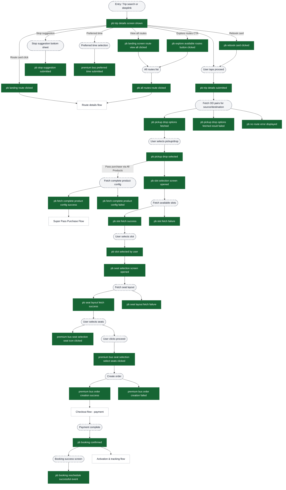
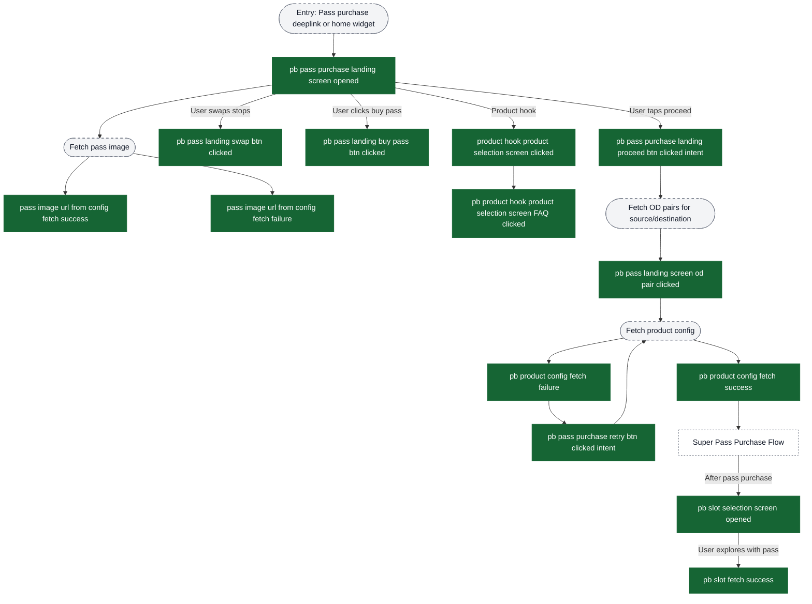
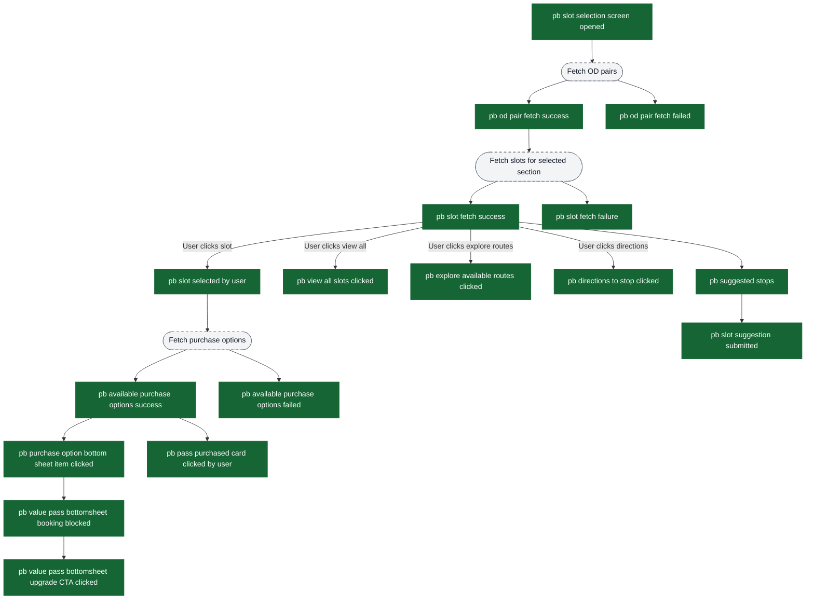
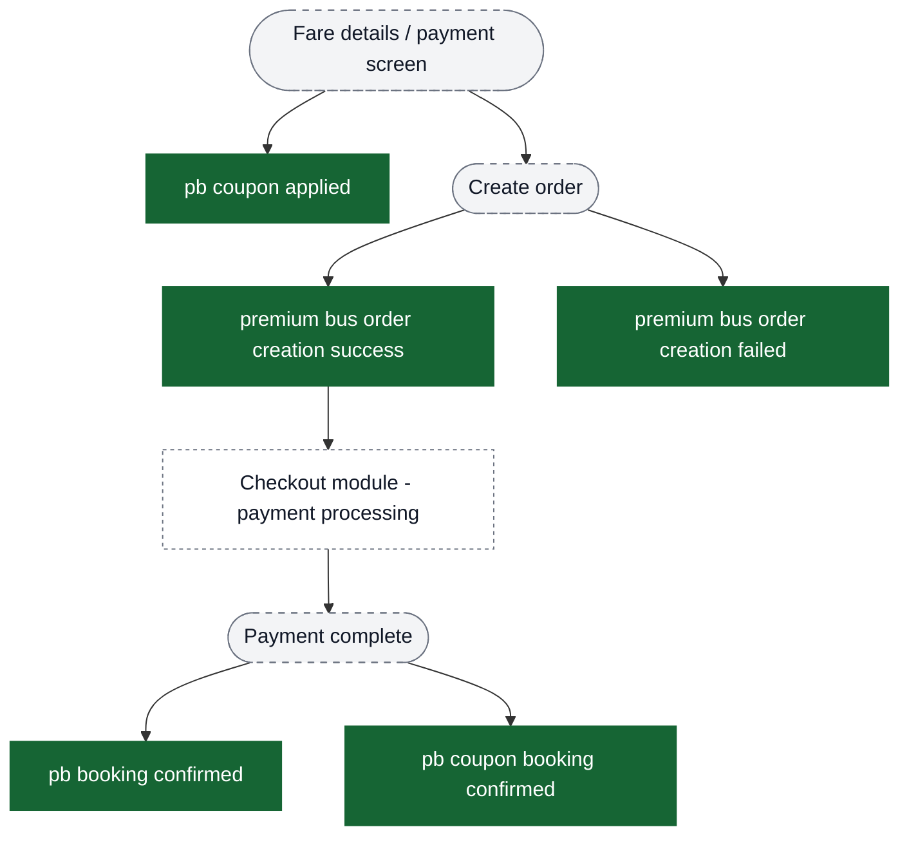

# Premium Bus — Booking Analytics Event Flow Diagrams

These diagrams help build funnels in analytics dashboards. Green nodes are exact event strings emitted by the app; grey nodes are non-analytics context (screens/states/branches). Edges show typical order and major forks.

Notes:
- Premium bus booking has **multiple entry points**: direct trip search, pass purchase landing, home screen widgets, and deeplinks.
- The booking flow branches based on whether the user is purchasing fresh, rescheduling, or booking via a pass.
- Bulk booking / manage rides is documented in `content/analytics/premium-bus-bulk-booking/flow-diagrams.md`.
- Post-booking activation & tracking is documented in `content/analytics/premium-bus-activation-tracking/flow-diagrams.md`.

Visual key:
- Green solid boxes: analytics events (exact strings from `events.json`)
- Grey dashed pills: screens/states/branches (not analytics events)
- Grey dotted boxes: external flows instrumented elsewhere


## Entry Points → Booking Funnel Decision

Use the initial events to identify which funnel path the user takes.


## Funnel 1: Fresh Booking (No Pass) - Complete Journey



## Funnel 2: Pass Purchase Landing → Pass Exploration



## Slot Selection Detailed Instrumentation

This shows granular events within the slot selection screen, useful for conversion optimization.



## Seat Selection Detailed Instrumentation

Shows granular seat selection interactions including gender confirmation for reserved seats.


## Payment & Order Creation

Shows the payment flow with coupon application and order creation.



## Key Funnel Construction Guidelines for PMs

### Fresh Booking Conversion Funnel
```
pb trip details screen shown
  → pb trip details submitted
  → pb pickup drop selected
  → pb slot selection screen opened
  → pb slot selected by user
  → pb seat selection screen opened
  → premium bus seat selection select seats clicked
  → premium bus order creation success
  → pb booking confirmed
```

### Pass Purchase Intent Funnel
```
pb pass purchase landing screen opened
  → pb pass purchase landing proceed btn clicked intent (optional)
  → pb pass landing screen od pair clicked
  → [Super Pass Purchase Flow - see super-pass-purchase/flow-diagrams.md]
  → pb slot selection screen opened (with pass)
```

### Slot Selection Conversion
```
pb slot selection screen opened
  → pb slot fetch success
  → pb slot selected by user
  (Drop-off: pb slot fetch failure)
```

### Seat Selection Conversion
```
pb seat selection screen opened
  → pb seat layout fetch success
  → premium bus seat selection seat icon clicked (one or more)
  → premium bus seat selection select seats clicked
  (Drop-off: pb seat layout fetch failure, insufficient seats)
```

## Error Events for Monitoring

Track these events to monitor booking flow health:

**Stop Selection Errors:**
- `pb pickup drop options fetched result failed`
- `pb no route error displayed`
- `pb fetch complete product config failed`

**Slot Selection Errors:**
- `pb slot fetch failure`
- `pb available purchase options failed`
- `pb od pair fetch failed`

**Seat Selection Errors:**
- `pb seat layout fetch failure`
- `premium bus seat selection seat change request failure`

**Payment & Order Errors:**
- `premium bus order creation failed`
