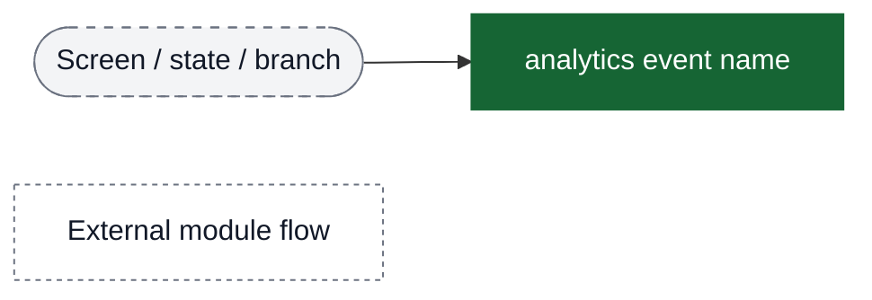
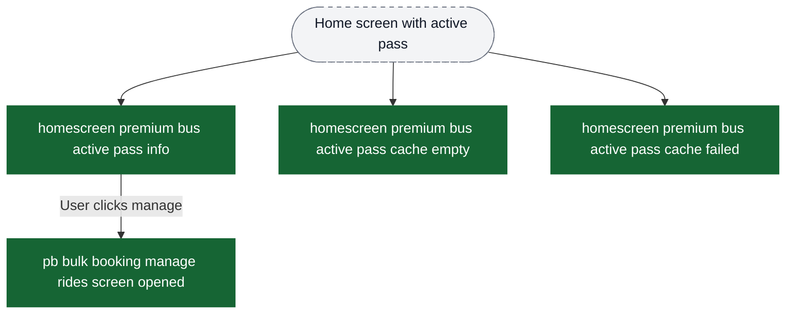
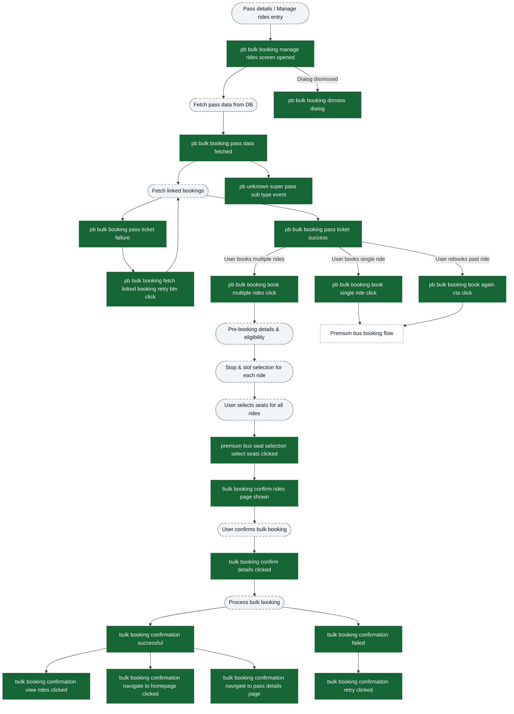
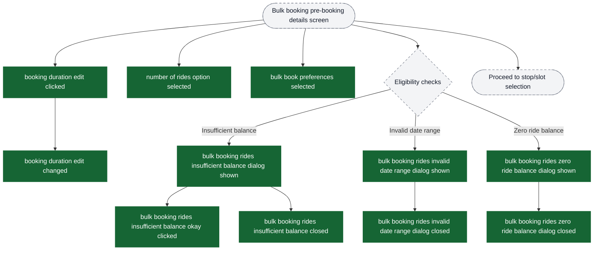
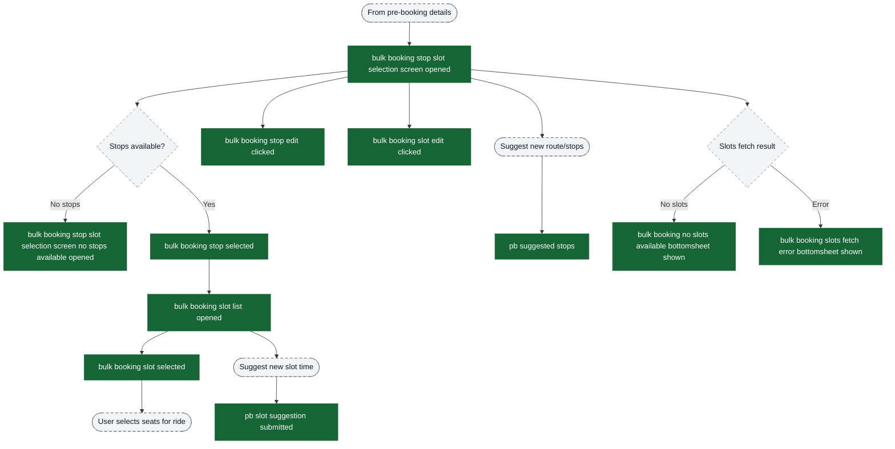
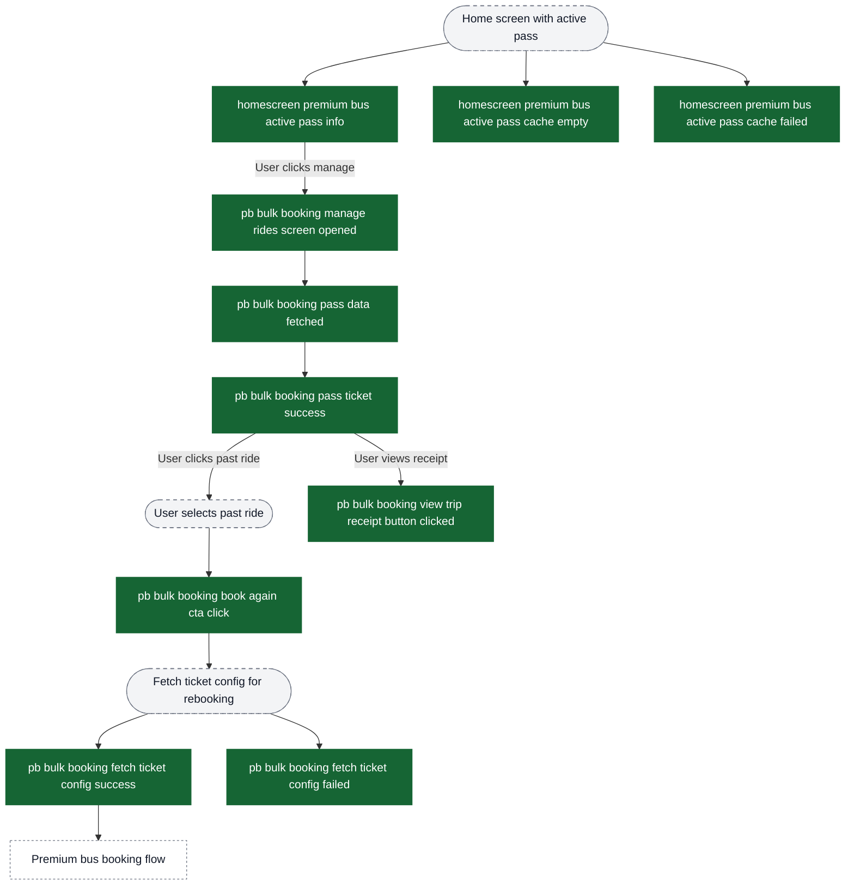

# Premium Bus — Bulk Booking & Manage Rides Analytics Event Flow Diagrams

These diagrams help build funnels in analytics dashboards. Green nodes are exact event strings emitted by the app; grey nodes are non-analytics context (screens/states/branches). Edges show typical order and major forks.

Notes:
- This flow focuses on **manage rides** + **bulk booking (multi-ride)** behavior for premium bus.
- “Book single ride” / “rebook” paths converge back into the main booking conversion flow in `content/analytics/premium-bus-booking/flow-diagrams.md`.
- Post-booking activation & tracking is documented in `content/analytics/premium-bus-activation-tracking/flow-diagrams.md`.

Visual key:
- Green solid boxes: analytics events (exact strings from `events.json`)
- Grey dashed pills: screens/states/branches (not analytics events)
- Grey dotted boxes: external flows instrumented elsewhere



## Entry: Home Screen → Manage Rides



## Funnel: Manage Rides → Bulk Booking (Pass-Based Multi-Ride)



## Funnel: Bulk Booking - Pre-Booking Details & Eligibility Checks



## Funnel: Bulk Booking - Stop & Slot Selection



## Funnel: Pass Management & Re-booking

Shows how users manage their passes and rebook rides.



## Seat Selection (Bulk Context)

This is a minimal bulk-focused slice; for full seat selection instrumentation (gender confirmation + seat change flow), see `content/analytics/premium-bus-booking/flow-diagrams.md`.

```mermaid
flowchart TD
  ev_seatScreenOpen["pb seat selection screen opened"] --> ui_layoutFetch([Fetch seat layout (bulk)])

  ui_layoutFetch --> ev_aggLayoutSuccess["pb aggregated seat layout fetch success"]
  ui_layoutFetch --> ev_aggLayoutFailed["pb aggregated seat layout fetch failure"]

  ev_aggLayoutSuccess --> ev_seatIconClicked["premium bus seat selection seat icon clicked"]
  ev_seatIconClicked --> ev_selectSeatsClicked["premium bus seat selection select seats clicked"]

  %%chalo:diagram-link ev_selectSeatsClicked -> title:Funnel: Manage Rides → Bulk Booking (Pass-Based Multi-Ride)

  classDef event fill:#166534,stroke:#166534,color:#ffffff;
  classDef ui fill:#f3f4f6,stroke:#6b7280,stroke-dasharray: 5 5,color:#111827;

  class ev_seatScreenOpen,ev_aggLayoutSuccess,ev_aggLayoutFailed,ev_seatIconClicked,ev_selectSeatsClicked event;
  class ui_layoutFetch ui;
```

## Key Funnel Construction Guidelines for PMs

### Bulk Booking Funnel
```
pb bulk booking manage rides screen opened
  → pb bulk booking pass data fetched
  → pb bulk booking pass ticket success
  → pb bulk booking book multiple rides click
  → pb seat selection screen opened
  → pb aggregated seat layout fetch success
  → premium bus seat selection select seats clicked
  → bulk booking confirm rides page shown
  → bulk booking confirm details clicked
  → bulk booking confirmation successful
```

### Pass Management Engagement
```
homescreen premium bus active pass info
  → pb bulk booking manage rides screen opened
  → pb bulk booking pass ticket success
  → pb bulk booking book single ride click OR pb bulk booking book multiple rides click
```

## Error Events for Monitoring

Track these events to monitor bulk booking flow health:

**Bulk Booking Errors:**
- `pb bulk booking pass ticket failure`
- `pb bulk booking fetch ticket config failed`
- `bulk booking confirmation failed`

**Seat Selection (Bulk) Errors:**
- `pb aggregated seat layout fetch failure`

**Pass Management Errors:**
- `homescreen premium bus active pass cache failed`
