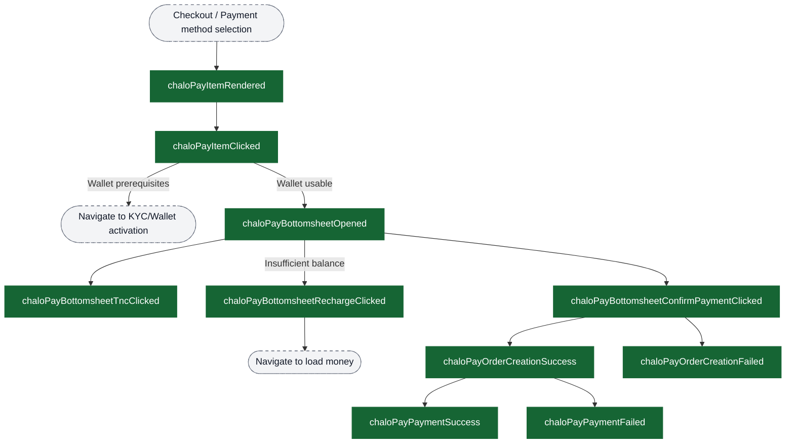

# Quick Pay (Chalo Pay) analytics event flow diagrams

These diagrams exist to help build funnels in analytics dashboards. Green nodes are the exact event strings emitted by the app; grey nodes are non-analytics context (screens/states/branches). Edges show the typical order and major forks.

Notes:
- Quick Pay has two main contexts: (1) Standalone Quick Pay flow for wallet-based bus fare payment, (2) Chalo Pay as payment method in checkout for other products
- The standalone flow starts from `pay for ticket screen opened` or direct navigation to `chalo pay trip amount fragment opened`
- The checkout integration uses `chaloPayItem*` and `chaloPayBottomsheet*` events
- Validation events are shared with other product validation flows but tagged with `isQuickPay=true`

Visual key:
- Green solid boxes: analytics events (exact strings from `events.json`)
- Grey dashed pills: screens/states/branches (not analytics events)
- Grey dotted boxes: external flows instrumented elsewhere

## Entry → amount entry (main Quick Pay flow)
Quick Pay can be entered from multiple sources. Use the `source` property to segment by origin.

## Funnel: amount entry → confirmation → order creation
Primary Quick Pay purchase flow from amount entry to order creation.

## Funnel: validation screen → BLE/QR → punch received
Validation screen with BLE and QR options, permission handling, and validation acknowledgment.

## Funnel: validation acknowledgment → post validation
Conductor validates ticket, app receives punch, processes receipt, and shows post-validation screen.

## Funnel: receipt viewing
Receipt viewing from post-validation screen or My Tickets history.

## Chalo Pay as payment method (checkout integration)
Chalo Pay used as wallet payment method for other products (mTicket, metro, premium bus, etc.).

## Validation screen side-paths (back press confirmation, help)
Additional validation screen interactions.

## Complete Quick Pay standalone flow (high-level overview)
End-to-end Quick Pay flow from entry to receipt viewing.

## Key funnel segments for PMs

### Funnel 1: Quick Pay purchase completion rate
Tracks users from amount entry to successful order creation.

**Events:**
1. `chalo pay trip amount fragment opened` (start)
2. `chalo pay trip amount fragment next button clicked` (intent)
3. `chalo pay bottom sheet fragment opened` (confirmation view)
4. `chalo pay bottom sheet fragment next button clicked` (confirmation intent)
5. `chalo pay order created` (conversion)

**Failure exit points:**
- `chalo pay trip amount fragment next button clicked failure` (amount validation)
- `chalo pay prerequisites failed` (KYC/wallet not ready)
- `chalo pay bottom sheet recharge button clicked` (insufficient balance)

### Funnel 2: Validation success rate
Tracks validation screen to successful ticket punch.

**Events:**
1. `chalo pay summary screen opened` or `ble screen open` (start)
2. `chalo pay ticket punched` (conversion)

**Permission sub-funnel:**
- `BLE permission check on validation initialization` → `BLE permission granted` vs `BLE permission denied`

### Funnel 3: Receipt viewing engagement
Tracks post-validation receipt views.

**Events:**
1. `Post validation screen opened` (start)
2. `view receipt post validation clicked` (intent)
3. `chalo pay receipt shown` (view)
4. `chalo pay receipt opened` (detailed view)

### Funnel 4: Chalo Pay checkout adoption
Tracks Chalo Pay usage as payment method for other products.

**Events:**
1. `chaloPayItemRendered` (exposure)
2. `chaloPayItemClicked` (selection)
3. `chaloPayBottomsheetOpened` (confirmation view)
4. `chaloPayBottomsheetConfirmPaymentClicked` (confirmation intent)
5. `chaloPayOrderCreationSuccess` + `chaloPayPaymentSuccess` (conversion)

**Failure exit points:**
- `chaloPayBottomsheetRechargeClicked` (insufficient balance)
- `chaloPayOrderCreationFailed` or `chaloPayPaymentFailed` (technical failure)

## Property combinations for segmentation

### By wallet state (Chalo Pay checkout)
Use `chaloPayWalletState` property from `chaloPayItemRendered` and `chaloPayItemClicked`:
- `ACTIVE` - Wallet ready
- `KYC_INITIATED` - KYC pending
- `DOES_NOT_EXIST` - Wallet not created
- `FULL_KYC_NEEDED` - Additional KYC required
- `BLOCKED_*` - Various blocked states

### By balance availability
Use `chaloPayWalletBalance` or `chalo pay bottom sheet wallet balance left` to segment by:
- High balance (>₹500)
- Medium balance (₹100-500)
- Low balance (<₹100)

### By validation method
Use `validationFlowType` from BLE events:
- Conductor validation (BLE/QR)
- TITO validation (automated tap)

### By failure reasons
- `chalo pay trip amount fragment next button clicked failure message` - Amount validation failures
- `reason` property - Invalid validation data reasons
- `failureReason` - Sync and other technical failures

## Notes for PM analytics setup

1. **Quick Pay vs Chalo Pay terminology**: "Quick Pay" is the standalone wallet-based bus fare product. "Chalo Pay" events (with camelCase naming) represent the wallet payment method used in checkout for other products. Both use the same wallet infrastructure.

2. **Order ID tracking**: The `orderId` property is crucial for tracking Quick Pay order lifecycle from creation → validation → punch → receipt.

3. **Validation events shared**: BLE validation events (`ble screen open`, `ble permission*`, etc.) are shared with other product validation flows. Always filter by `isQuickPay=true` to isolate Quick Pay validation events.

4. **TITO vs Conductor validation**: TITO events (`tito tap in*`) represent automated tap-in/tap-out validation. Regular punch events (`chalo pay ticket punched`) represent conductor-initiated validation.

5. **Receipt payload debugging**: `quickpay receipt payload` event logs full receipt JSON for debugging punch notification issues.

6. **Recharge flow branching**: When insufficient balance is detected, users can branch to wallet load money via `chalo pay bottom sheet recharge button clicked` or `chaloPayBottomsheetRechargeClicked`. Track recharge completion and return rate to Quick Pay flow.

7. **sendToPlotline flag**: Only `pay for ticket screen opened` has `sendToPlotline=true`. This is the main entry event for Plotline journey tracking.
