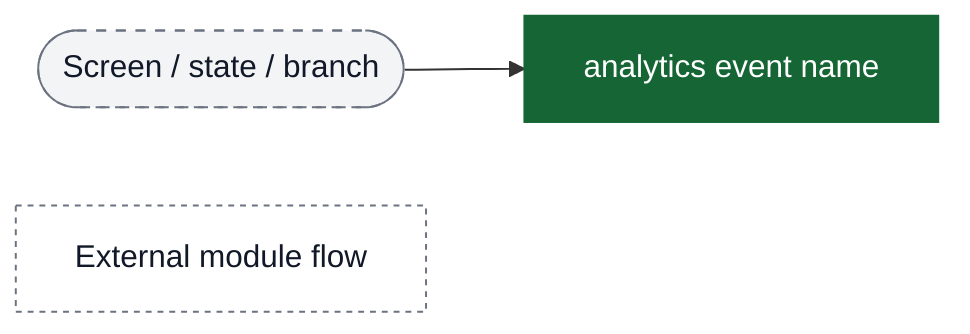
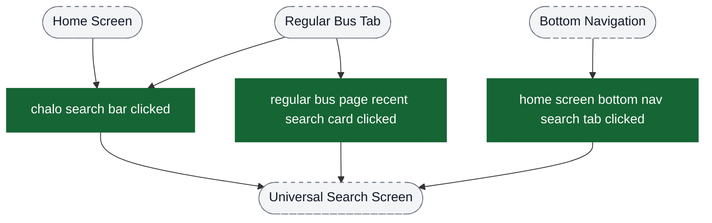
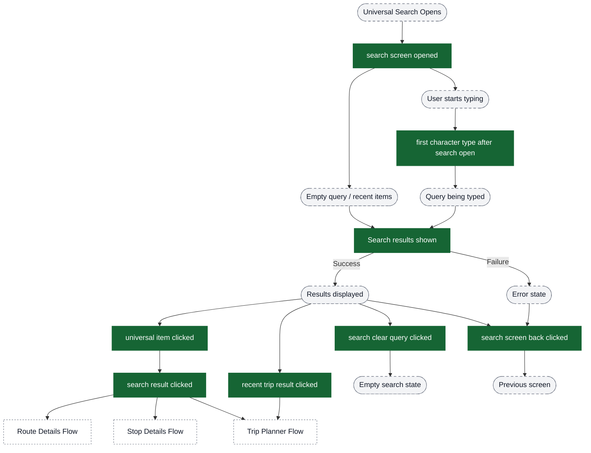
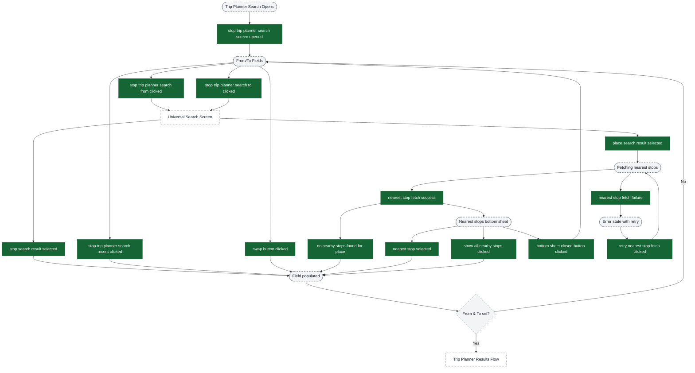
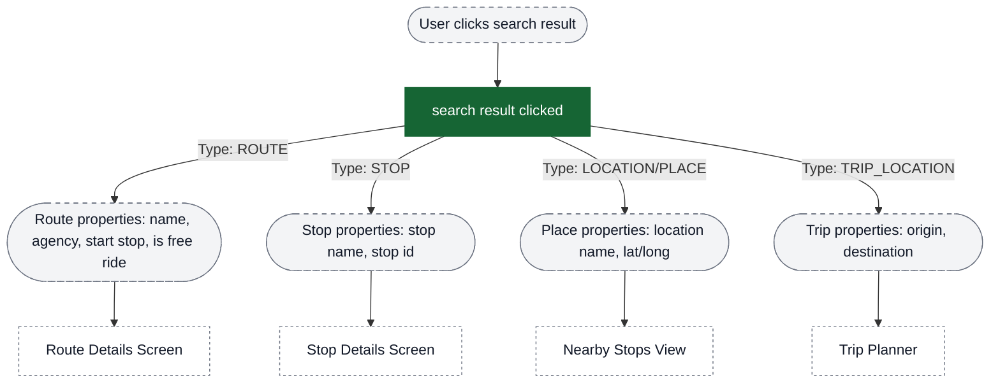
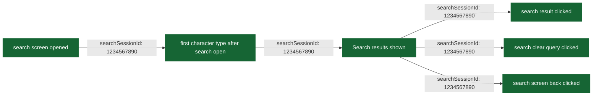
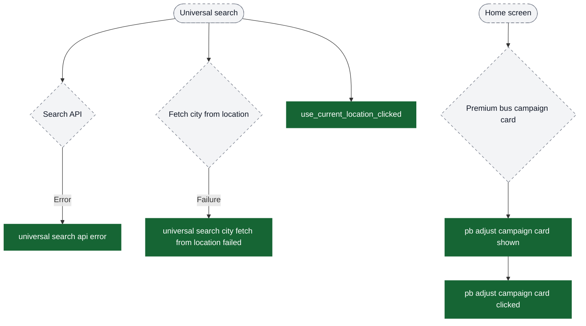

# Search analytics event flow diagrams

These diagrams exist to help build funnels in analytics dashboards. Green nodes are the exact event strings emitted by the app; grey nodes are non-analytics context (screens/states/branches). Edges show the typical order and major forks.

Notes:
- The search flow has two main paths: **Universal Search** (general route/stop/place search) and **Stop-Based Trip Planner Search** (from/to trip planning)
- `searchSessionId` ties together all events in a single universal search session from open to close
- Legacy `universal item clicked` events coexist with newer `search result clicked` events

Visual key:
- Green solid boxes: analytics events (exact strings from `events.json`)
- Grey dashed pills: screens/states/branches (not analytics events)
- Grey dotted boxes: external flows instrumented elsewhere



## Entry Points → Search Initiation

Users can initiate search from multiple entry points in the app.



## Universal Search Flow (Main Funnel)

The primary search experience where users search for routes, stops, or places.



## Stop-Based Trip Planner Search Flow

Dedicated flow for trip planning with from/to location selection and nearest stop resolution.



## Universal Search Item Types (Result Click Detail)

Different result types in universal search have different properties tracked.



## Search Session Tracking

All universal search events within a single session share the same `searchSessionId`.



## Funnel: Universal Search Errors & Campaign Cards

These events are useful for reliability dashboards and campaign attribution. They are not always part of the main “search → result click” funnel.



## Funnel Building Guide

### Universal Search Conversion Funnel

To measure search effectiveness:

```
1. Entry → "chalo search bar clicked"
2. Engagement → "first character type after search open"
3. Results → "Search results shown" (success)
4. Conversion → "search result clicked" OR "universal item clicked"
5. Abandonment → "search screen back clicked"
```

Filter by `searchSessionId` to track individual sessions.

### Trip Planner Search Funnel

To measure trip planning search:

```
1. Entry → "stop trip planner search screen opened"
2. From Selection → "stop trip planner search from clicked" → "stop search result selected" OR "place search result selected"
3. To Selection → "stop trip planner search to clicked" → "stop search result selected" OR "place search result selected"
4. Place Resolution → "nearest stop fetch success" → "nearest stop selected"
```

Filter by `searchTarget` (FROM/TO) to analyze each field separately.

### Search Result Quality Analysis

To analyze search result quality:

```
- Join "Search results shown" with "search result clicked" by searchSessionId
- Calculate: click_rate = clicks / results_shown
- Analyze "searchResultPosition" to understand result ranking quality
- Examine "searchResult1Type/Name" through "searchResult3Type/Name" in back/clear events for abandonment analysis
```

### Nearest Stop Resolution Funnel

For places requiring nearest stop resolution:

```
1. Place Selected → "place search result selected"
2. Fetch → "nearest stop fetch success" OR "nearest stop fetch failure"
3. Selection → "nearest stop selected" OR "show all nearby stops clicked"
4. Error Recovery → "retry nearest stop fetch clicked"
```

Conversion rate: `nearest stop selected / place search result selected`

## Session Example

A typical successful universal search session:

```
1. User clicks search bar on home screen
   → "chalo search bar clicked" { search bar title: "Search routes, stops & places" }

2. Search screen opens
   → "search screen opened" { searchSessionId: "1234567890", no of recent trips available: 3 }

3. User types "bu"
   → "first character type after search open" { searchSessionId: "1234567890", queryString: "b" }

4. Results load for "bus stand"
   → "Search results shown" { searchSessionId: "1234567890", queryString: "bus stand",
      total results: "15", route: "5", trips stops: "8", trips locations: "2", loadingTime: "450" }

5. User clicks 2nd result (Central Bus Stand stop)
   → "search result clicked" { searchSessionId: "1234567890", searchResultType: "STOP",
      searchResultPosition: "2", searchResultName: "Central Bus Stand" }
   → "universal item clicked" { stop: "Central Bus Stand", stopid: "12345",
      universal item clicked: "STOP" }

6. User navigates to stop details screen
```

An abandoned search session:

```
1. "chalo search bar clicked"
2. "search screen opened"
3. "first character type after search open" { queryString: "a" }
4. "Search results shown" { total results: "50" }
5. "search screen back clicked" { queryString: "airport", searchResult1Name: "Airport Road",
   is device back clicked: "true", time from result shown: "3500" }
```

## Property Value Examples

### searchScreenType
- Common values: "universal search", "route", "stop", "trip planner"

### searchScreenInputScreen
- Common values: "home", "route details", "stop details", "nearby stops", "trip planner"

### searchResultType
- Values: "LOCATION", "STOP", "ROUTE", "TRIP_STOP", "TRIP_LOCATION"

### searchPartner
- Values: "Chalo", "Google", "Here", etc.

### searchTarget (Trip Planner)
- Values: "FROM", "TO"

### from_type / to_type (Trip Planner)
- Values: "STOP", "PLACE"

## Notes for Dashboard Creation

1. **Search Effectiveness**: Use `searchSessionId` to track complete search journeys from open to result selection
2. **Result Quality**: Compare `searchResultPosition` distribution to understand if users find results at top of list
3. **Abandonment Analysis**: Look at `search screen back clicked` with top 3 results to understand why users abandon
4. **Performance**: Track `loadingTime` in "Search results shown" to identify slow searches
5. **Place Resolution**: Monitor "nearest stop fetch failure" and "no nearby stops found for place" to identify areas needing better stop coverage
6. **Query Analysis**: Use `queryString` and `queryLength` to understand search patterns and popular queries
7. **Legacy vs New**: Both `universal item clicked` and `search result clicked` fire for the same action - use `search result clicked` for new dashboards
8. **Entry Point Analysis**: Track which entry points (`chalo search bar clicked`, `regular bus page recent search card clicked`, etc.) lead to best conversion
9. **Recent Item Usage**: Filter by `is recent item: "true"` to understand repeat search behavior
10. **Time-Based Patterns**: Use `time from result shown` in back/clear events to measure user engagement duration
