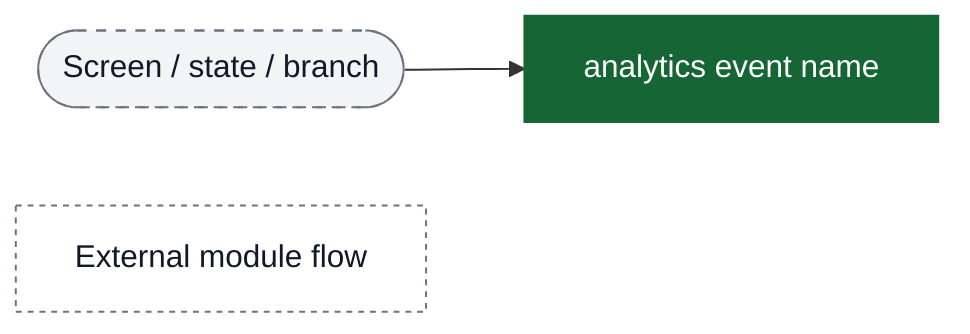
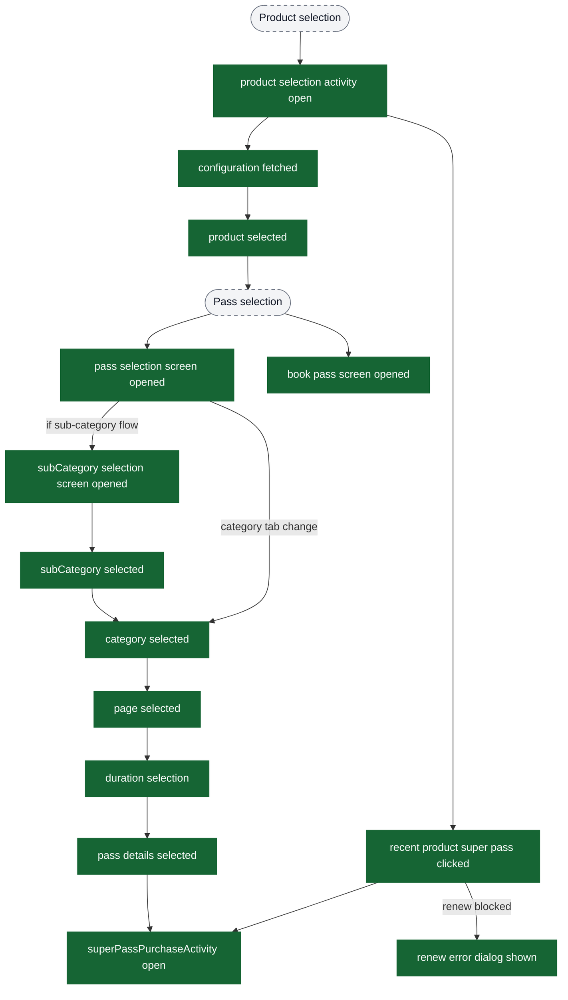
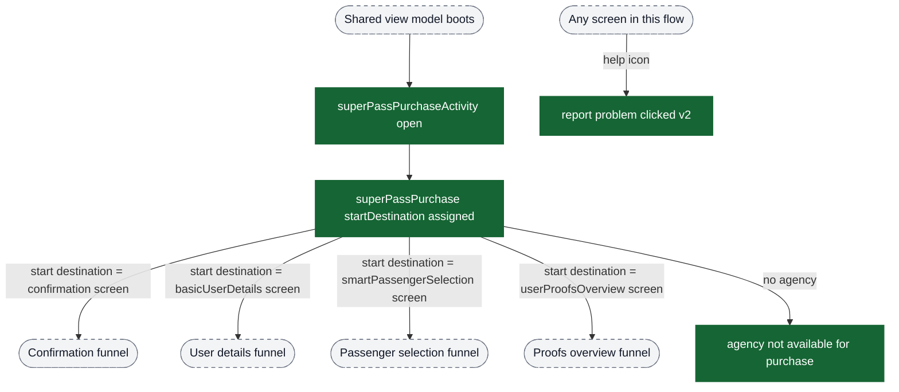
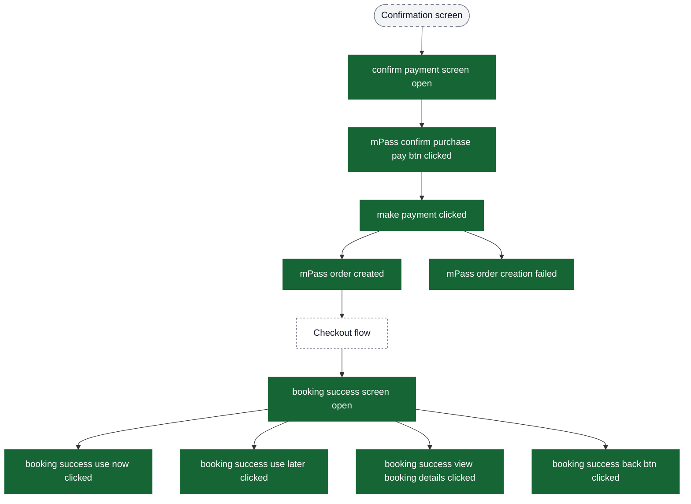
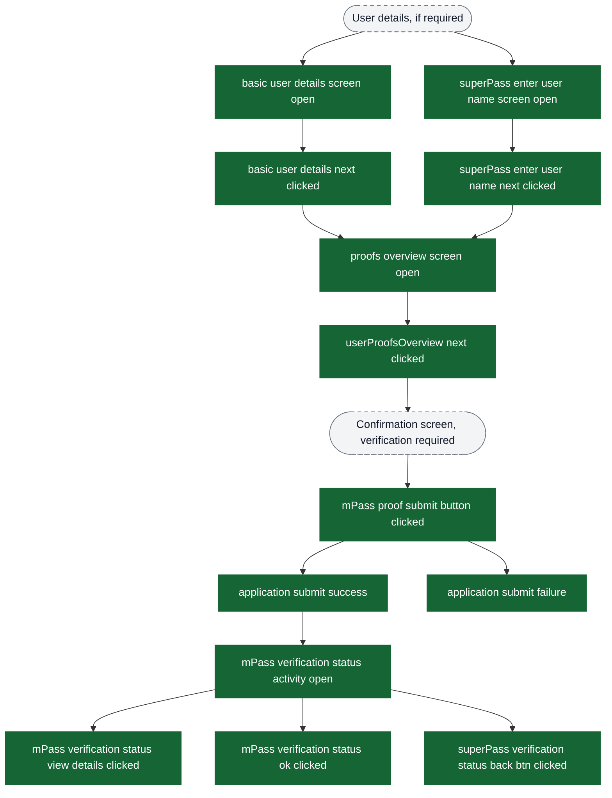
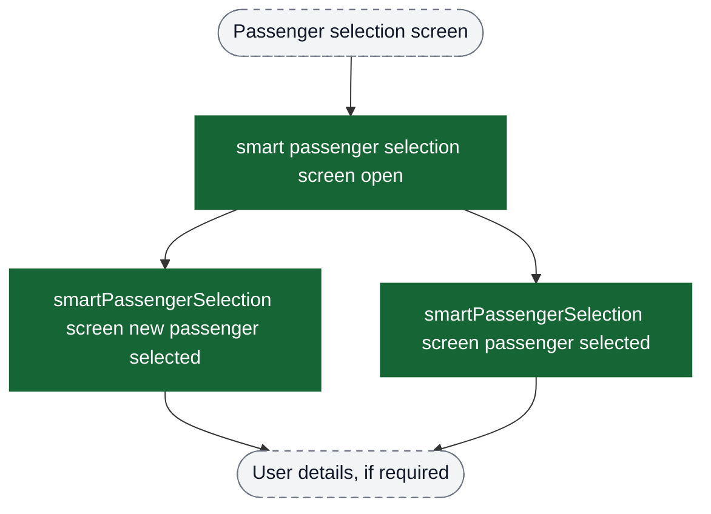
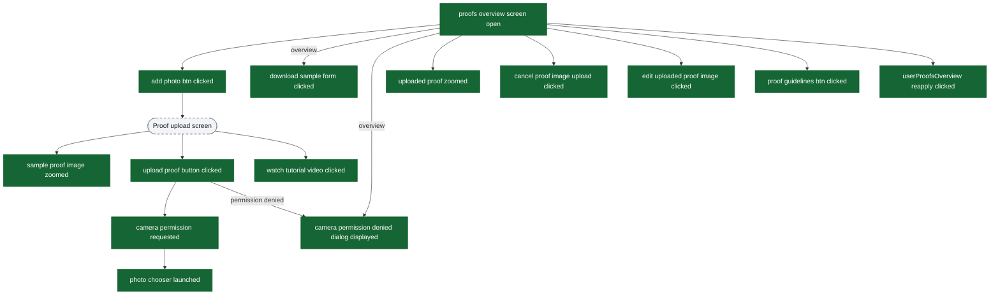
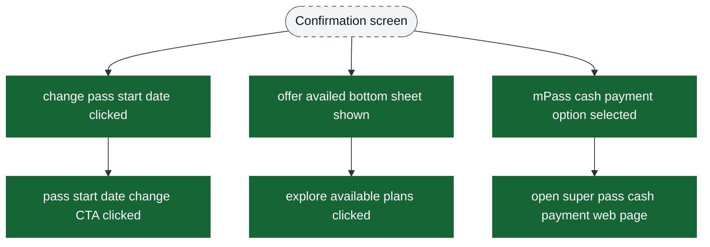
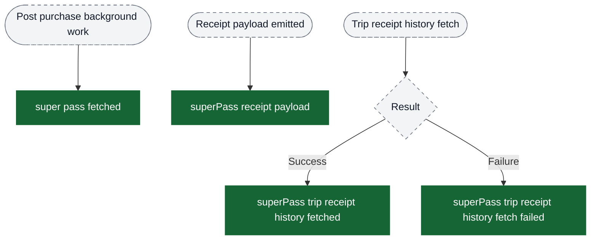

# Super Pass purchase analytics event flow diagrams

These diagrams exist to help build funnels in analytics dashboards. Green nodes are the exact event strings emitted by the app; grey nodes are non-analytics context (screens/states/branches). Edges show the typical order and major forks.

Notes:
- `confirm payment screen open` is **not emitted** in flows where verification is required (unless it’s the post‑verification payment or renew flow). Don’t use it as a universal funnel start.
- The actual payment processing UI lives in the Checkout module; this doc only shows the super pass purchase side of the instrumentation.

Visual key:
- Green solid boxes: analytics events (exact strings from `events.json`)
- Grey dashed pills: screens/states/branches (not analytics events)
- Grey dotted boxes: external flows instrumented elsewhere



## Pre-entry: Product Selection → Pass Selection → Book Pass

This funnel helps PMs build “selection → purchase” funnels (everything before `superPassPurchaseActivity open`).



## Entry → start destination (what funnel should branch on)
Use `superPassPurchase startDestination assigned` and its `start destination` property to decide which funnel applies.



## Funnel: confirmation → order creation → success (no verification required)


## Funnel: proof submission → verification status (verification required)


## Funnel: smart passenger selection (optional entry path)


## Proof upload instrumentation (granular funnel)


## Confirmation screen side-paths (optional instrumentation)


## Post-purchase: Fetch, Receipt Payload, Trip Receipt History



## Post-purchase: Activation Timestamp & Sync Reliability

```mermaid
flowchart TD
  ui_sync([Activation sync attempt]) --> ui_syncResult{Sync result}

  ui_syncResult -->|Success| ev_syncSuperPass["sync superPass activation timeStamp with backend"]
  ui_syncResult -->|Success (mTicket)| ev_syncMTicket["sync mTicket activation timeStamp with backend"]
  ui_syncResult -->|Failure| ev_syncFailed["product activation sync failed"]
  ui_syncResult -->|Exception| ev_syncException["product activation sync exception occurred"]
  ui_syncResult -->|Punch sync failure| ev_punchSyncFail["product activation pass punch sync failed"]

  classDef event fill:#166534,stroke:#166534,color:#ffffff;
  classDef ui fill:#f3f4f6,stroke:#6b7280,stroke-dasharray: 5 5,color:#111827;

  class ev_syncSuperPass,ev_syncMTicket,ev_syncFailed,ev_syncException,ev_punchSyncFail event;
  class ui_sync,ui_syncResult ui;
```
