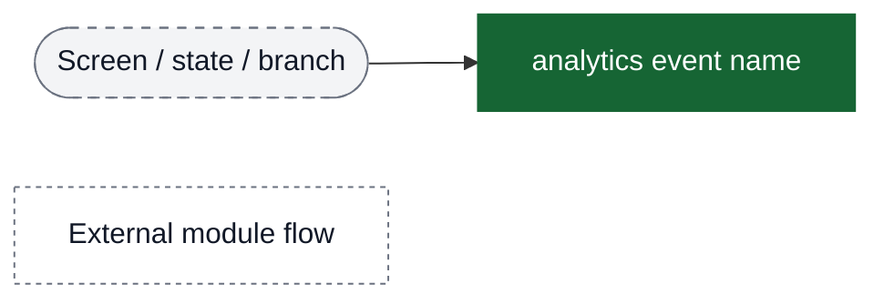
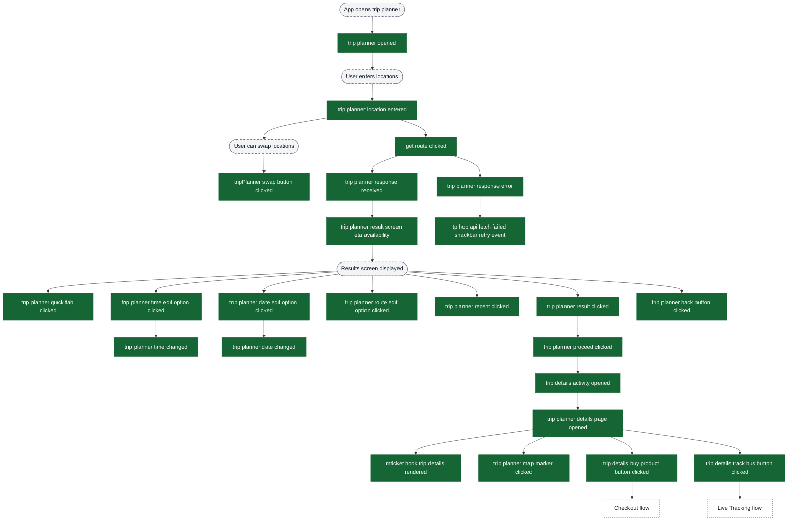
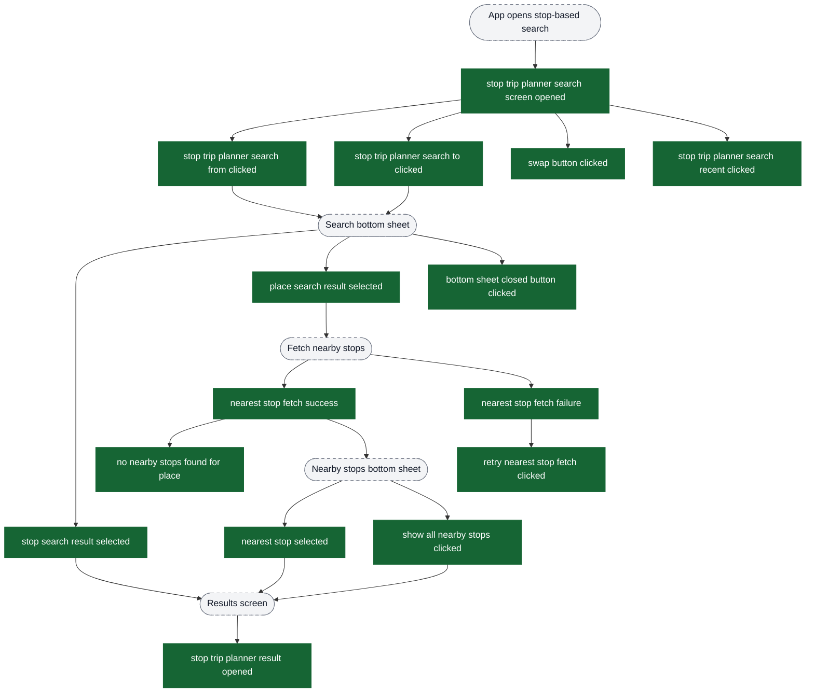
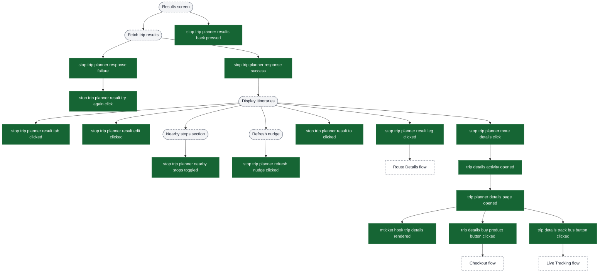

# Trip Planner analytics event flow diagrams

These diagrams exist to help build funnels in analytics dashboards. Green nodes are the exact event strings emitted by the app; grey nodes are non-analytics context (screens/states/branches). Edges show the typical order and major forks.

Notes:
- Trip planner has two main variants: **Universal Trip Planner** (location-based) and **Stop-Based Trip Planner** (stop-focused with nearby stops)
- Universal trip planner supports more transit modes including HOP integration
- Stop-based trip planner provides more granular stop selection with nearby stops functionality
- Both flows share similar result interaction patterns but have different entry points

Visual key:
- Green solid boxes: analytics events (exact strings from `events.json`)
- Grey dashed pills: screens/states/branches (not analytics events)
- Grey dotted boxes: external flows instrumented elsewhere



## Universal Trip Planner: Entry → Results → Details

The universal trip planner supports location-based trip planning with multiple transit modes including HOP.



## Stop-Based Trip Planner: Search → Stop Selection → Results

The stop-based trip planner focuses on stop-to-stop journey planning with nearby stops functionality.



## Stop-Based Trip Planner: Results Interaction → Trip Details

After stops are selected, users interact with trip results and view details.



## Key Funnel Patterns

### Universal Trip Planner Funnel (Simple)
```
trip planner opened
  → trip planner location entered
    → get route clicked
      → trip planner response received
        → trip planner result clicked
          → trip planner proceed clicked
            → trip planner details page opened
              → trip details buy product button clicked / trip details track bus button clicked
```

### Stop-Based Trip Planner Funnel (With Stop Selection)
```
stop trip planner search screen opened
  → stop trip planner search from clicked / stop trip planner search to clicked
    → stop search result selected / place search result selected
      [if place] → nearest stop fetch success
                    → nearest stop selected / show all nearby stops clicked
    → stop trip planner result opened
      → stop trip planner response success
        → stop trip planner result leg clicked
          → [Route Details] or [More Details]
```

### Tab Switching & Filters (Both Planners)
```
Results screen
  → trip planner quick tab clicked (Universal)
  → stop trip planner result tab clicked (Stop-based)
    → Re-fetch results with new tab filter
```

### Time/Date Modification (Universal Planner)
```
trip planner time edit option clicked
  → trip planner time changed
    → Re-fetch results with new time

trip planner date edit option clicked
  → trip planner date changed
    → Re-fetch results with new date
```

### Nearby Stops Management (Stop-based Planner)
```
[Nearby stops in results]
  → stop trip planner nearby stops toggled
    → [Expand/Collapse section]

[Stale results detected]
  → stop trip planner refresh nudge clicked
    → Re-fetch results for other tab
```

## Error Recovery Flows

### Universal Trip Planner Error Recovery
```
trip planner response error
  → tp hop api fetch failed snackbar retry event
    → [Re-attempt API call]
```

### Stop-Based Planner Error Recovery
```
stop trip planner response failure
  → stop trip planner result try again click
    → [Re-attempt trip search]

nearest stop fetch failure
  → retry nearest stop fetch clicked
    → [Re-attempt nearby stops fetch]
```

## Navigation Exit Points

Both trip planners can exit to:
- **Checkout flow** - via `trip details buy product button clicked`
- **Live Tracking flow** - via `trip details track bus button clicked`
- **Route Details flow** - via `stop trip planner result leg clicked` (stop-based only)
- **Back navigation** - via `trip planner back button clicked` or `stop trip planner results back pressed`
