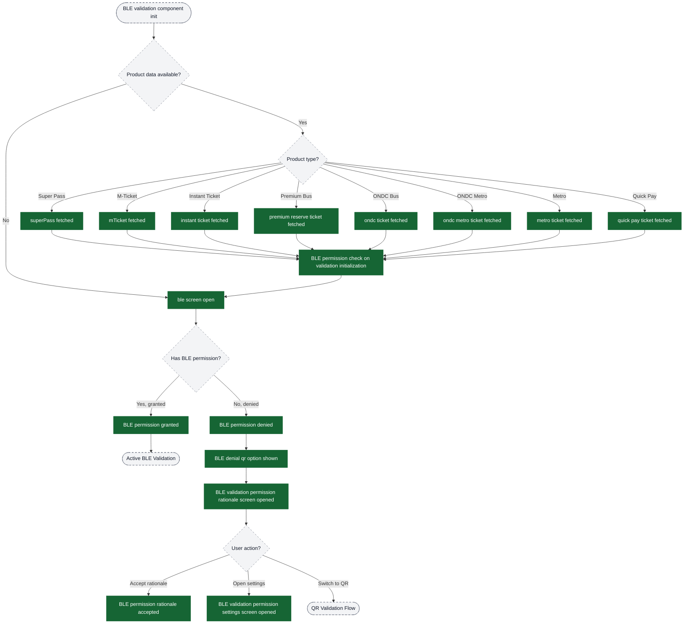
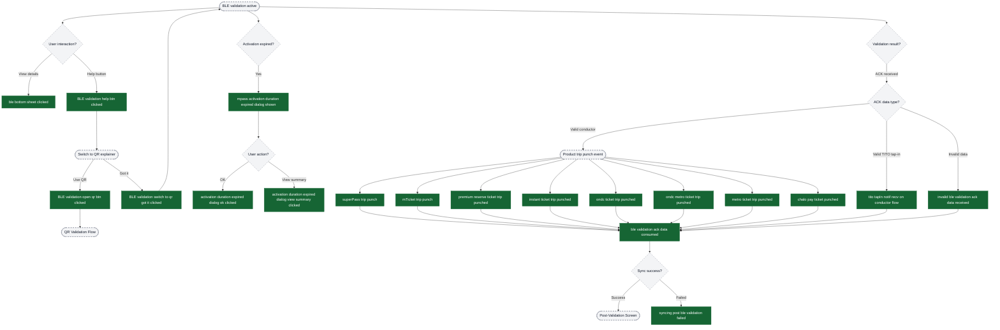
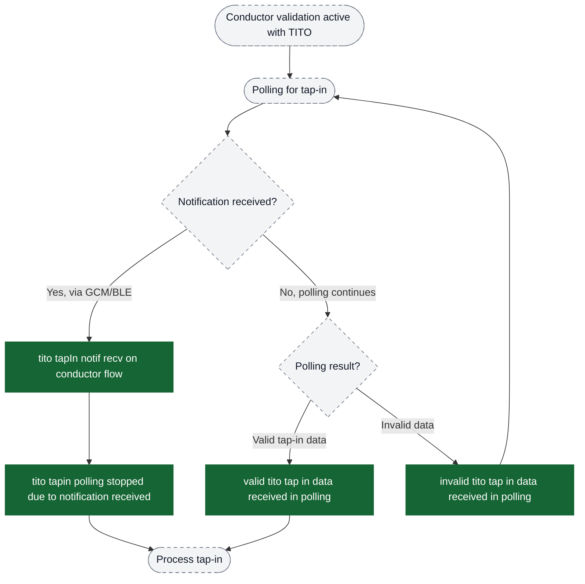
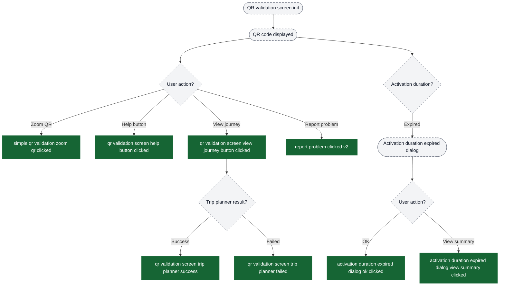
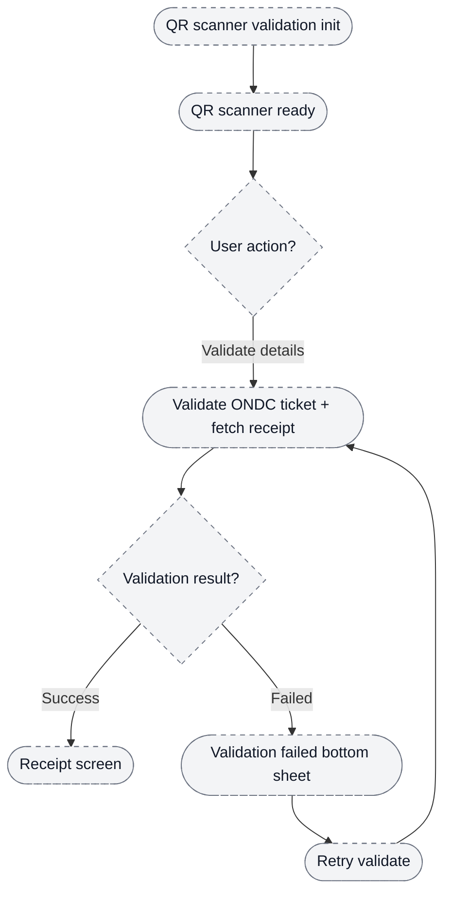
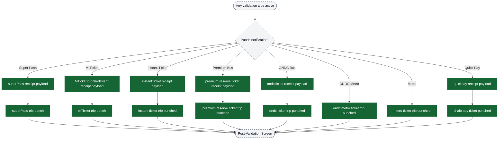
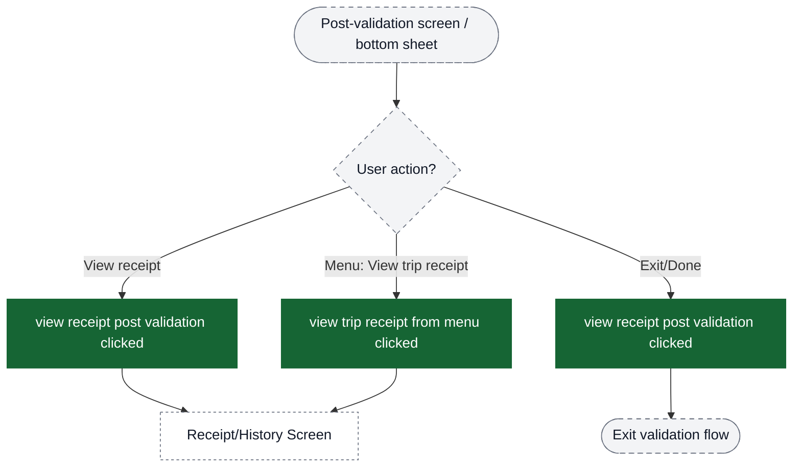
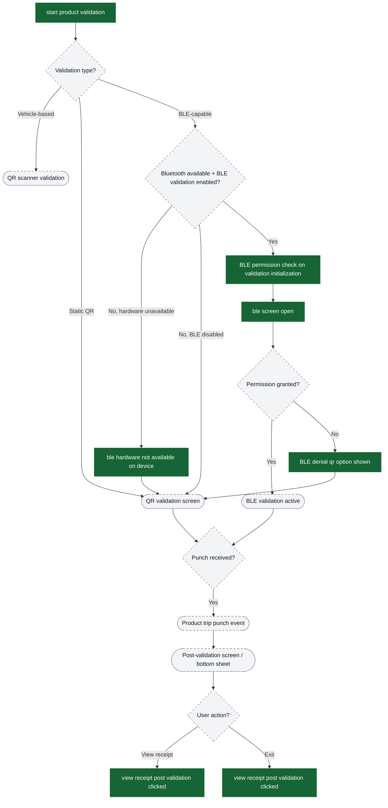

# Validation analytics event flow diagrams

These diagrams exist to help build funnels in analytics dashboards. Green nodes are the exact event strings emitted by the app; grey nodes are non-analytics context (screens/states/branches). Edges show the typical order and major forks.

Notes:
- Validation supports multiple products: Super Pass, M-Ticket, Instant Ticket, Premium Bus, ONDC Bus/Metro, Metro, Quick Pay
- Three validation types: BLE validation (conductor/TITO), QR validation, Vehicle-based validation
- BLE validation requires permissions; QR serves as fallback
- TITO (Ticket-In-Ticket-Out) enables tap-in/tap-out for distance-based fares
- Notifications can arrive via GCM (push), BLE (direct), or Polling (periodic API)

Visual key:
- Green solid boxes: analytics events (exact strings from `events.json`)
- Grey dashed pills: screens/states/branches (not analytics events)
- Grey dotted boxes: external flows instrumented elsewhere


## Entry → Validation Type Selection

```mermaid
flowchart TD
  %%chalo:diagram-link ui_bleBranch -> title:BLE Validation Flow - Permission Check
  %%chalo:diagram-link ui_qrBranch -> title:QR Validation Flow
  %%chalo:diagram-link ui_vehicleBranch -> title:Vehicle-Based Validation (QR Scanner)
  ui_entry([User initiates validation]) --> ev_start["start product validation"]

  ev_start --> ui_checkProduct{Product found?}
  ui_checkProduct -->|No| ev_notFound["validation product not found"]

  ui_checkProduct -->|Yes| ui_validationType{Validation type?}

  ui_validationType -->|Vehicle-based (ONDC/Metro)| ui_vehicleBranch([Vehicle-Based Validation (QR Scanner)])
  ui_validationType -->|Static QR (Metro/ONDC)| ui_qrBranch([QR Validation Flow])
  ui_validationType -->|BLE-capable products| ui_bleGate{Bluetooth available + BLE validation enabled?}

  ui_bleGate -->|No, hardware unavailable| ev_hwNotAvailable["ble hardware not available on device"]
  ui_bleGate -->|No, BLE disabled| ui_qrBranch
  ev_hwNotAvailable --> ui_qrBranch

  ui_bleGate -->|Yes| ui_bleBranch([BLE Validation Flow])

  classDef event fill:#166534,stroke:#166534,color:#ffffff;
  classDef ui fill:#f3f4f6,stroke:#6b7280,stroke-dasharray: 5 5,color:#111827;
  classDef external fill:#ffffff,stroke:#6b7280,stroke-dasharray: 3 3,color:#111827;

  class ev_start,ev_notFound,ev_hwNotAvailable event;
  class ui_entry,ui_checkProduct,ui_validationType,ui_bleGate,ui_bleBranch,ui_qrBranch,ui_vehicleBranch ui;
```

## BLE Validation Flow - Permission Check



## BLE Validation Flow - Active Validation



## TITO Tap-In Polling Flow



## QR Validation Flow



## Vehicle-Based Validation (QR Scanner)



## Conductor Punch Notifications



## Post-Validation Success Screen



## Complete Validation Funnel Overview

Use this diagram to understand the high-level funnel structure across all validation types:



## Key Funnel Metrics to Track

### Permission Funnel (BLE validation)
1. `ble screen open` → Entry point
2. `BLE permission check on validation initialization` → Permission check (raised before `ble screen open` today)
3. `BLE permission granted` / `BLE permission denied` → Permission decision
4. `BLE denial qr option shown` → Fallback trigger
5. (No QR screen open event today) → QR fallback screen shown

### Validation Success Funnel (Any product)
1. `start product validation` → Entry
2. `ble screen open` or (no QR screen open event) → Type selection
3. `[product] trip punch` → Validation success
4. Post-validation screen / bottom sheet (no explicit event today)
5. `view receipt post validation clicked` → Receipt view or exit

### TITO Tap-In Funnel
1. `ble screen open` (with validationFlowType = conductorOrUnifiedTapIn)
2. `tito tapIn notif recv on conductor flow` → Tap-in received
3. `ble validation ack data consumed` → Processed
4. Post-validation screen / bottom sheet (no explicit event today)

### QR Validation Engagement Funnel
1. (No QR screen open event today) → Entry
2. `simple qr validation zoom qr clicked` → Engagement
3. `qr validation screen view journey button clicked` → Journey interest
4. `qr validation screen trip planner success` → Journey fetched
5. `[product] trip punch` → Validation success

### Error/Fallback Funnel
1. `BLE permission denied` → Permission issue
2. `BLE denial qr option shown` → Fallback offered
3. `BLE validation permission settings screen opened` → Settings attempt
4. `ble hardware not available on device` → Hardware fallback
5. (No QR screen open event today) → Alternative path

### Product-Specific Funnels
Filter by `productType` property to analyze:
- Super Pass validation rates
- M-Ticket validation success
- Premium Bus validation patterns
- ONDC/Metro validation flows
- Quick Pay validation frequency

### Notification Delivery Analysis
Use `notificationDeliveryMedium` to segment:
- GCM (push notification) delivery rates
- BLE (direct Bluetooth) delivery rates
- Polling (API call) delivery rates
