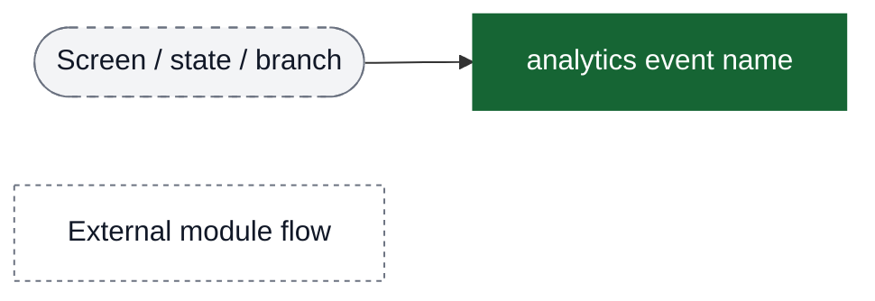
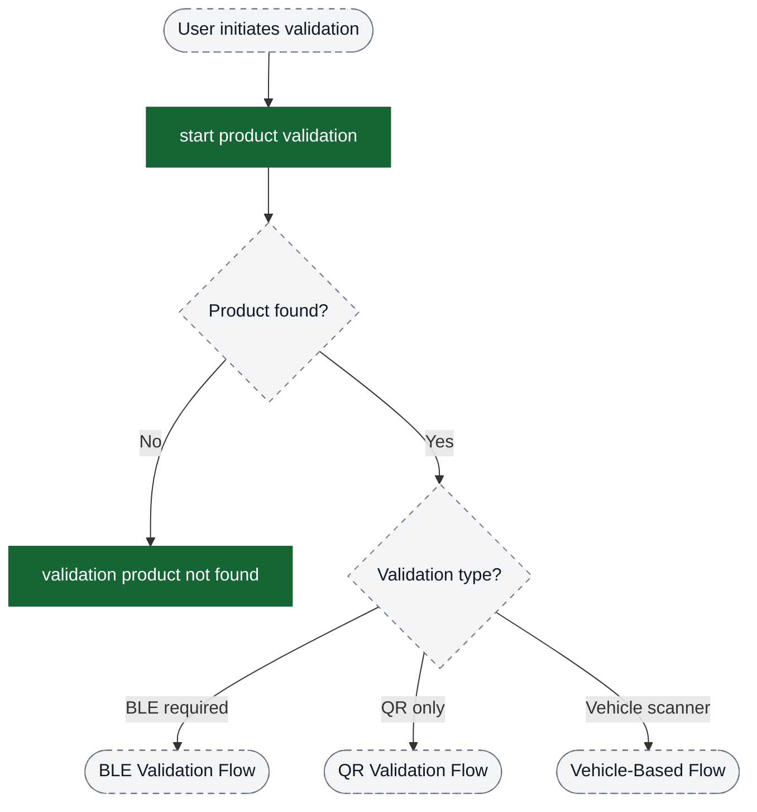
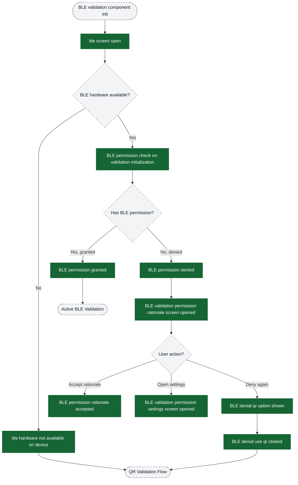
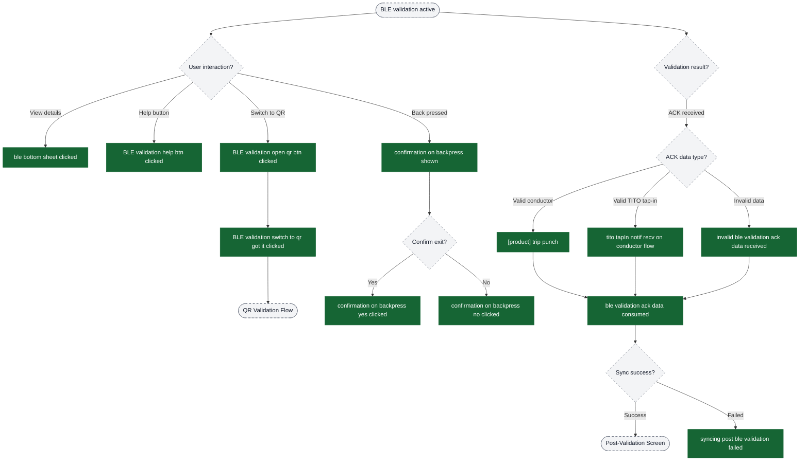
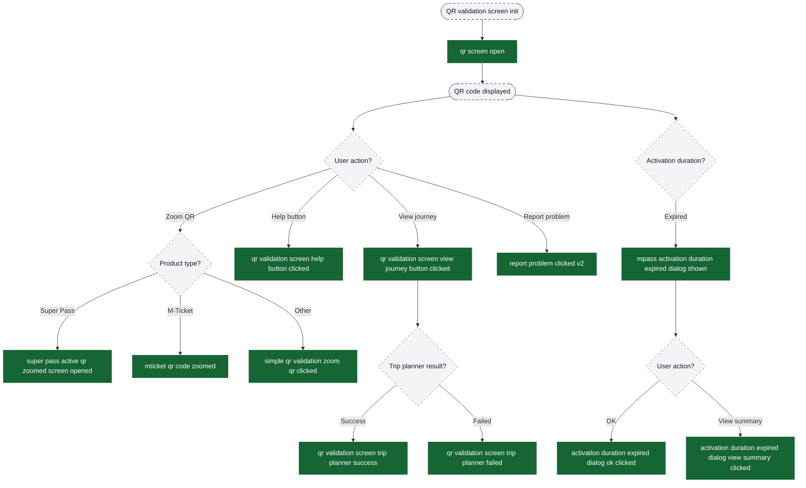
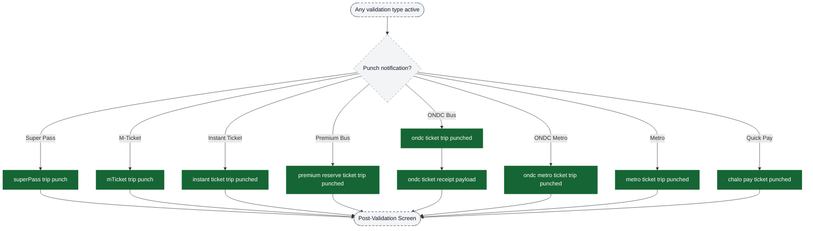
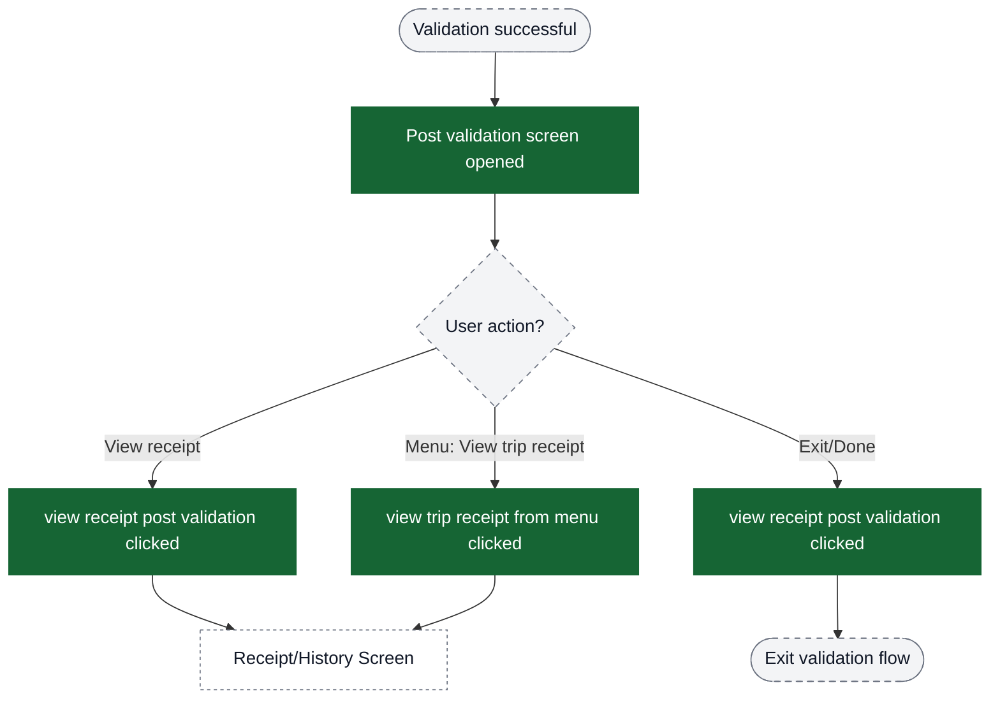
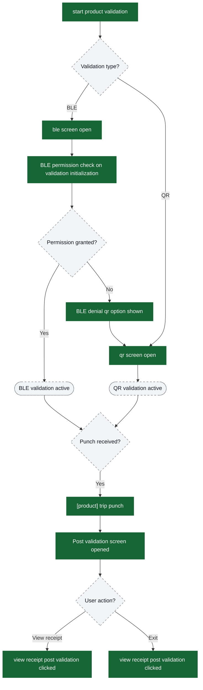

# Validation analytics event flow diagrams

These diagrams exist to help build funnels in analytics dashboards. Green nodes are the exact event strings emitted by the app; grey nodes are non-analytics context (screens/states/branches). Edges show the typical order and major forks.

Notes:
- Validation supports multiple products: Super Pass, M-Ticket, Instant Ticket, Premium Bus, ONDC Bus/Metro, Metro, Quick Pay
- Three validation types: BLE validation (conductor/TITO), QR validation, Vehicle-based validation
- BLE validation requires permissions; QR serves as fallback
- TITO (Ticket-In-Ticket-Out) enables tap-in/tap-out for distance-based fares
- Notifications can arrive via GCM (push), BLE (direct), or Polling (periodic API)

Visual key:
- Green solid boxes: analytics events (exact strings from `events.json`)
- Grey dashed pills: screens/states/branches (not analytics events)
- Grey dotted boxes: external flows instrumented elsewhere

## Entry → Validation Type Selection

## BLE Validation Flow - Permission Check

## BLE Validation Flow - Active Validation

## TITO Tap-In Polling Flow

## QR Validation Flow

## Conductor Punch Notifications

## Post-Validation Success Screen

## Complete Validation Funnel Overview

Use this diagram to understand the high-level funnel structure across all validation types:

## Key Funnel Metrics to Track

### Permission Funnel (BLE validation)
1. `ble screen open` → Entry point
2. `BLE permission check on validation initialization` → Permission check
3. `BLE permission granted` / `BLE permission denied` → Permission decision
4. `BLE denial qr option shown` → Fallback trigger
5. `qr screen open` → Fallback completion

### Validation Success Funnel (Any product)
1. `start product validation` → Entry
2. `ble screen open` or `qr screen open` → Type selection
3. `[product] trip punch` → Validation success
4. `Post validation screen opened` → Confirmation
5. `view receipt post validation clicked` → Receipt view or exit

### TITO Tap-In Funnel
1. `ble screen open` (with validationFlowType = conductorOrUnifiedTapIn)
2. `tito tapIn notif recv on conductor flow` → Tap-in received
3. `ble validation ack data consumed` → Processed
4. `Post validation screen opened` → Success

### QR Validation Engagement Funnel
1. `qr screen open` → Entry
2. `simple qr validation zoom qr clicked` → Engagement
3. `qr validation screen view journey button clicked` → Journey interest
4. `qr validation screen trip planner success` → Journey fetched
5. `[product] trip punch` → Validation success

### Error/Fallback Funnel
1. `BLE permission denied` → Permission issue
2. `BLE denial qr option shown` → Fallback offered
3. `BLE denial use qr clicked` → Fallback accepted
4. `qr screen open` → Alternative path

### Product-Specific Funnels
Filter by `productType` property to analyze:
- Super Pass validation rates
- M-Ticket validation success
- Premium Bus validation patterns
- ONDC/Metro validation flows
- Quick Pay validation frequency

### Notification Delivery Analysis
Use `notificationDeliveryMedium` to segment:
- GCM (push notification) delivery rates
- BLE (direct Bluetooth) delivery rates
- Polling (API call) delivery rates
