# Wallet flow analytics event flow diagrams

These diagrams exist to help build funnels in analytics dashboards. Green nodes are the exact event strings emitted by the app; grey nodes are non-analytics context (screens/states/branches). Edges show the typical order and major forks.

Notes:
- Wallet flow has multiple entry points: direct wallet access, Quick Pay from various screens, and ChaloPayV3 integration.
- Background wallet sync happens independently to keep balance updated.
- KYC flows can be triggered from wallet access checks.

Visual key:
- Green solid boxes: analytics events (exact strings from `events.json`)
- Grey dashed pills: screens/states/branches (not analytics events)
- Grey dotted boxes: external flows instrumented elsewhere

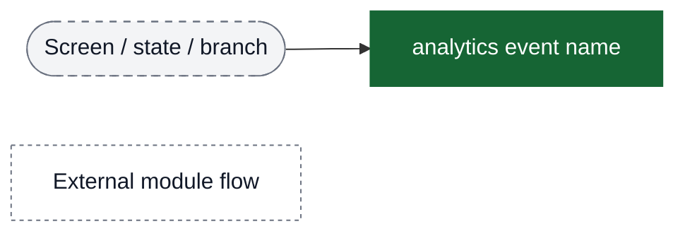

## Funnel: Wallet Entry Points (access wallet)

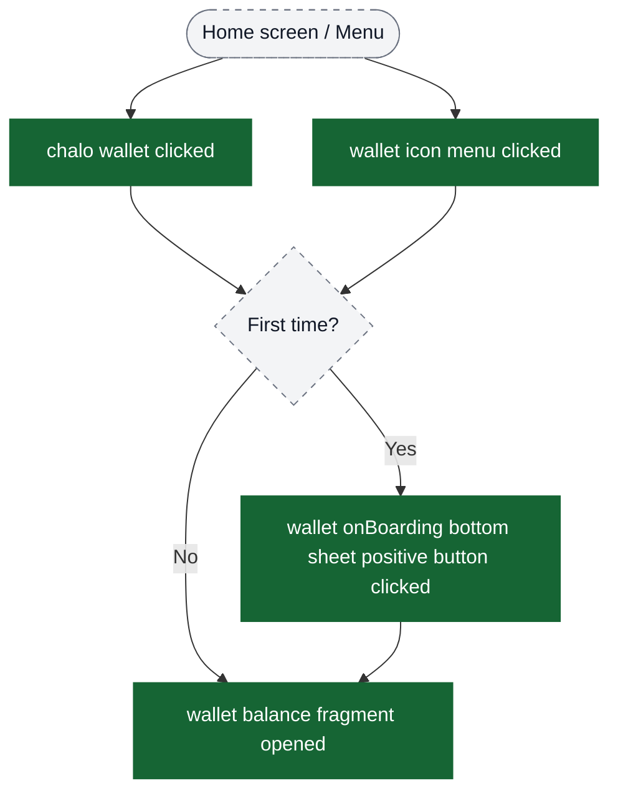

## Entry → Wallet Balance View (main entry point)

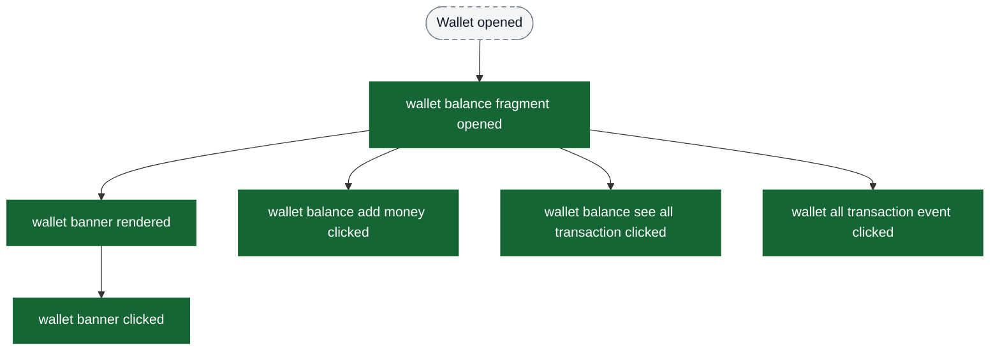

## Funnel: Load Money (wallet recharge flow)

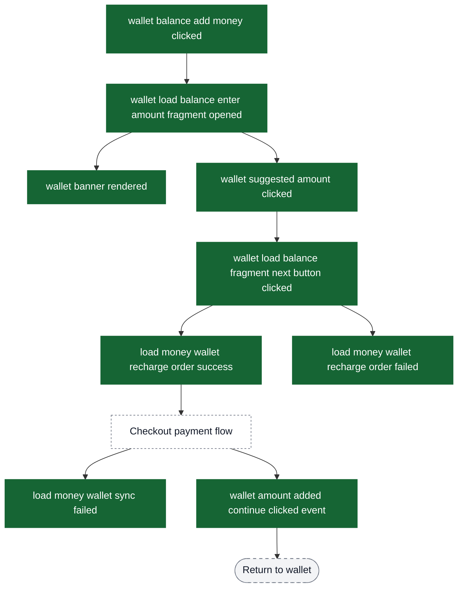

## Funnel: Transaction History View

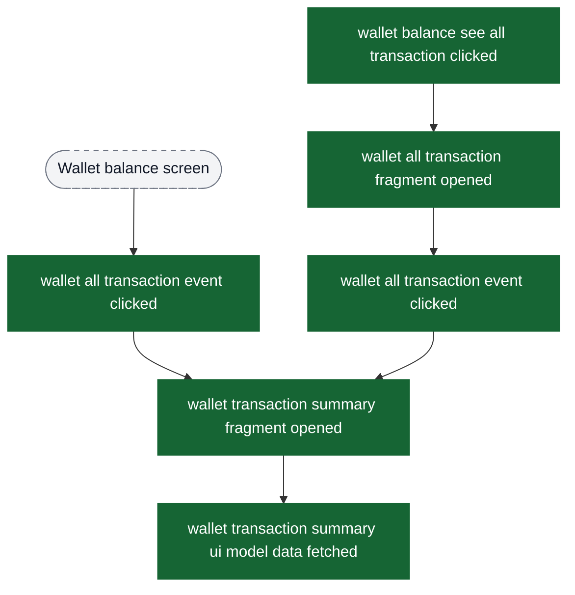

## Funnel: Wallet Access & KYC

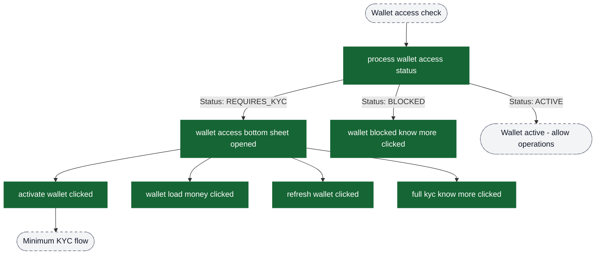

## Funnel: Minimum KYC Flow

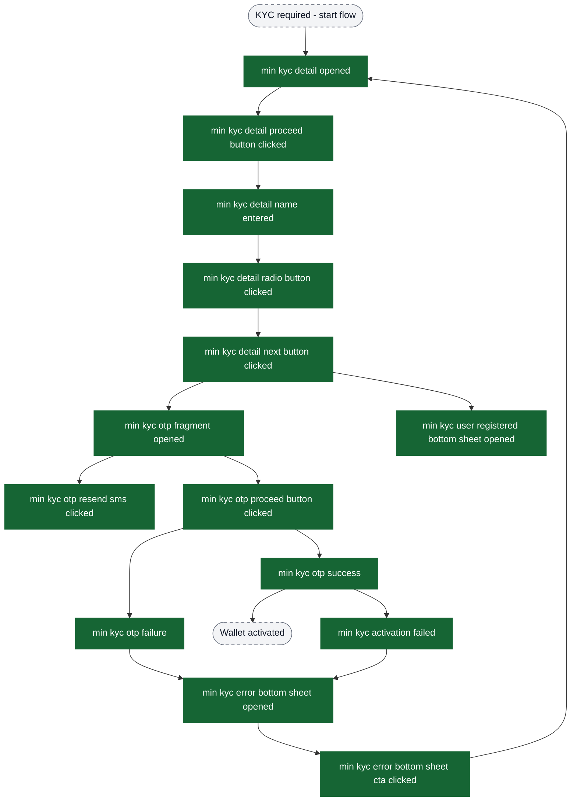

## Funnel: Pay For Ticket → Find Fare

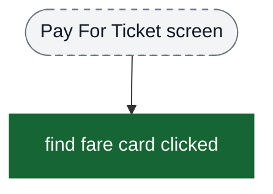

## Funnel: Quick Pay (ChaloPayV2) - Complete flow

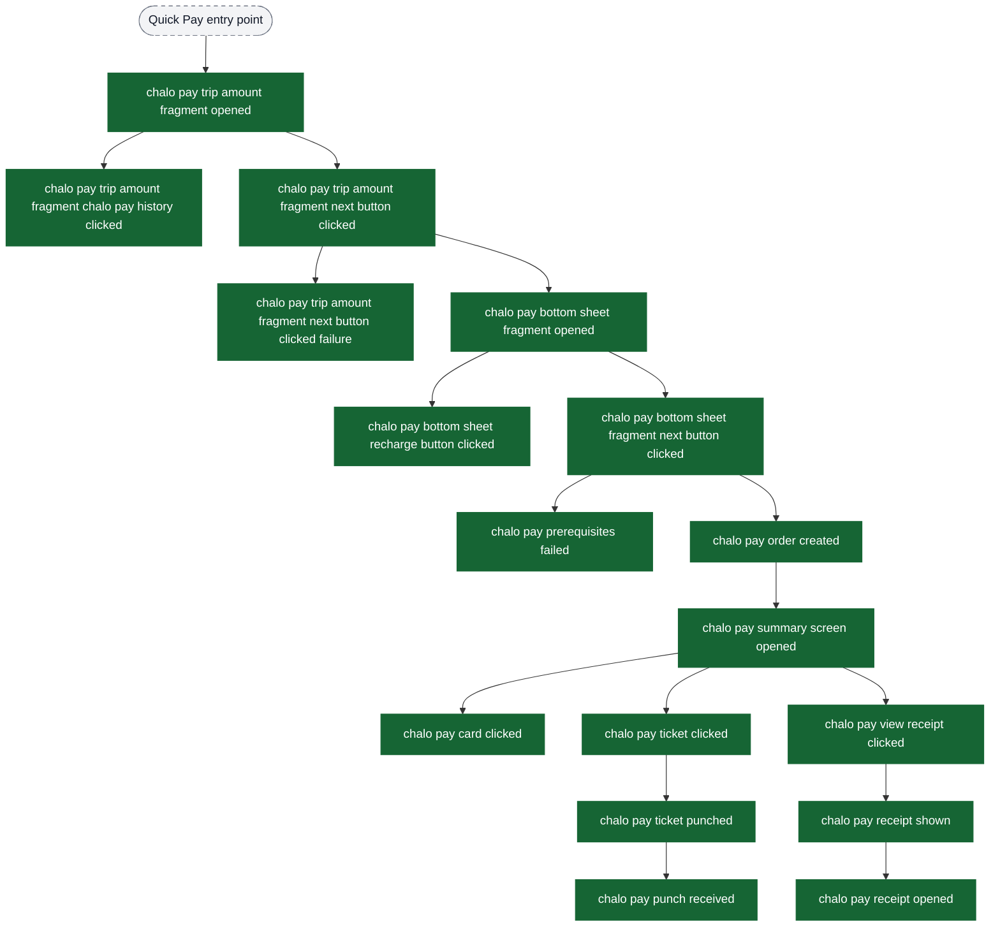

## Funnel: ChaloPayV3 (alternative entry point)

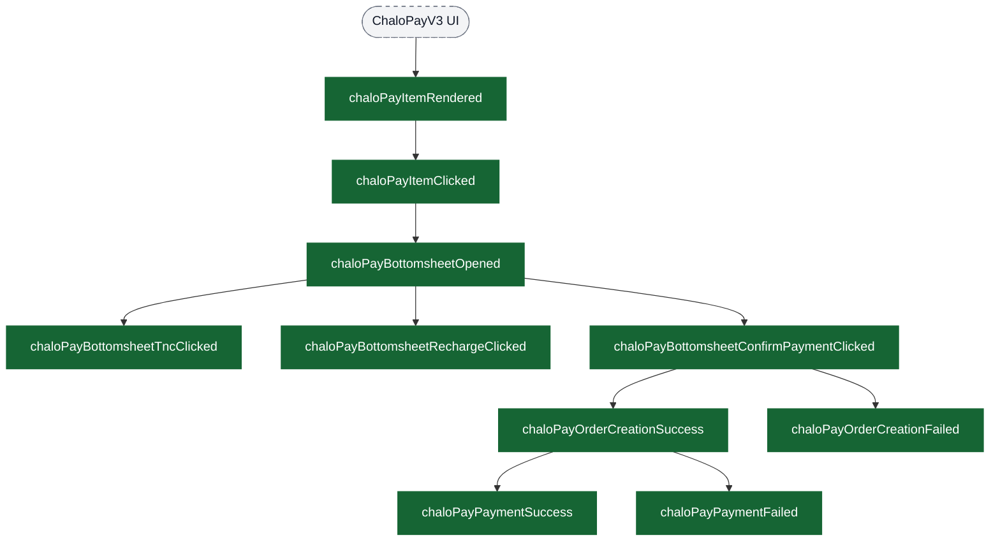

## Funnel: Wallet Migration (device change)

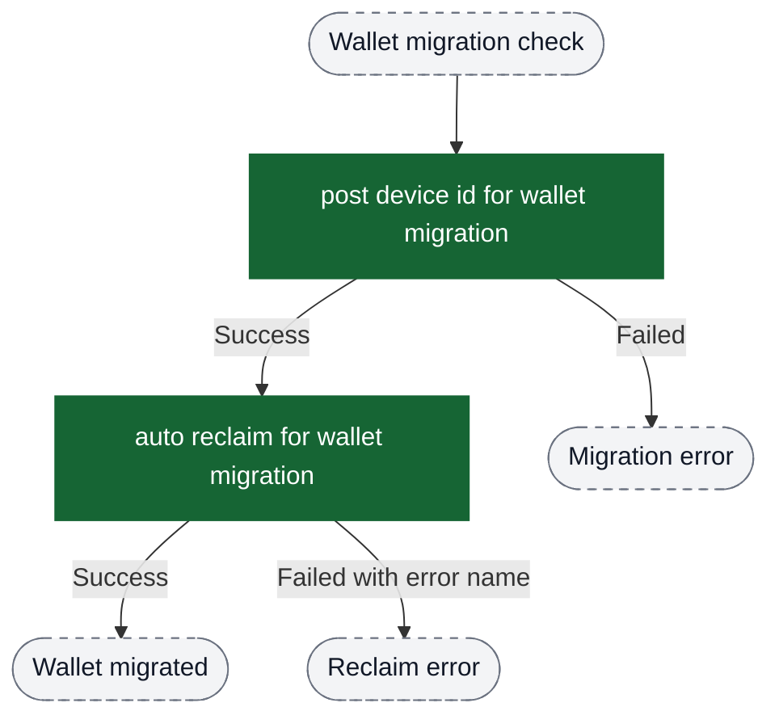

## Background Sync (independent flow)

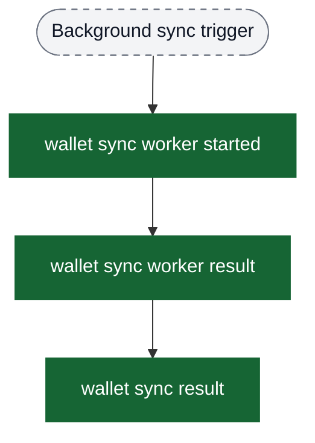

## Key Funnel Recommendations

### Wallet Entry & Onboarding Funnel
```
chalo wallet clicked (or) wallet icon menu clicked
  → wallet onBoarding bottom sheet positive button clicked (first time users)
    → wallet balance fragment opened
```

### Core Wallet Usage Funnel
```
wallet balance fragment opened
  → wallet balance add money clicked (or) wallet all transaction event clicked
    → Load money funnel (or) Transaction view funnel
```

### Load Money Conversion Funnel (with success)
```
wallet load balance enter amount fragment opened [with kycDone property]
  → wallet suggested amount clicked
    → wallet load balance fragment next button clicked
      → load money wallet recharge order success
        → [Checkout payment flow]
          → wallet amount added continue clicked event
            → Return to wallet
```

### Quick Pay Ticket Purchase Funnel
```
chalo pay trip amount fragment opened
  → chalo pay trip amount fragment next button clicked
    → chalo pay bottom sheet fragment opened
      → chalo pay bottom sheet fragment next button clicked
        → chalo pay order created
          → chalo pay summary screen opened
            → chalo pay ticket clicked
              → chalo pay ticket punched
```

### Wallet Activation Funnel (with error handling)
```
process wallet access status [walletStatus = REQUIRES_KYC]
  → wallet access bottom sheet opened
    → activate wallet clicked
      → min kyc detail opened
        → min kyc detail next button clicked
          → min kyc otp fragment opened
            → min kyc otp proceed button clicked
              → min kyc otp success (or) min kyc otp failure
                → min kyc error bottom sheet opened (on failure)
                  → min kyc error bottom sheet cta clicked
                    → retry from min kyc detail opened
```

### Transaction Engagement Funnel
```
wallet balance fragment opened
  → wallet all transaction event clicked (or) wallet balance see all transaction clicked
    → wallet transaction summary fragment opened
      → wallet transaction summary ui model data fetched
```

## Property-Based Segmentation

Use these properties to segment funnels:

- **walletStatus** - Filter users by wallet state (ACTIVE, REQUIRES_KYC, BLOCKED, etc.)
- **kycDone** - Segment load money flow by KYC completion status
- **wallet balance transaction type** - Separate QUICK_PAY, LOAD_MONEY, CHALO_PAY transactions
- **wallet balance transaction status** - Track SUCCESS vs FAILED vs PROCESSING transactions
- **walletLoadAmount** - Analyze recharge amount distributions
- **wallet suggested amount** - Track which suggested denominations are most popular
- **is chalo wallet activated** - Binary segmentation for activated vs non-activated users
