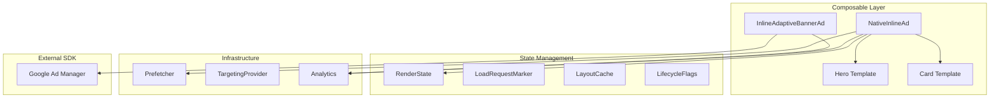
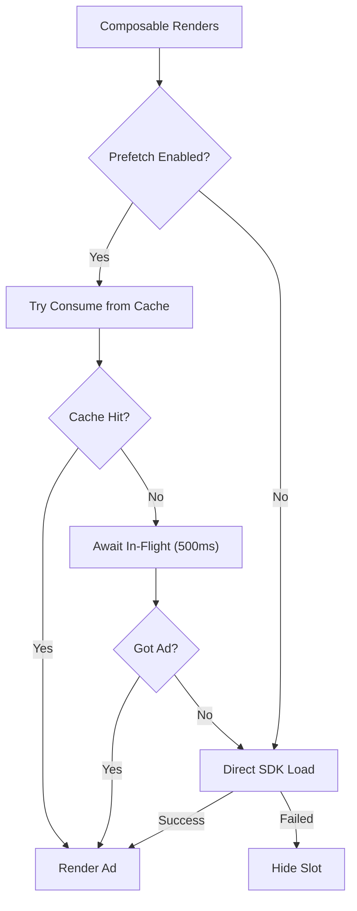
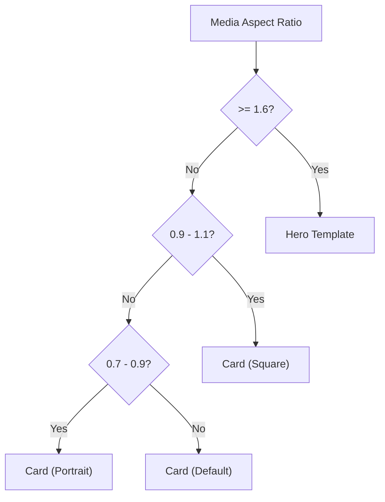
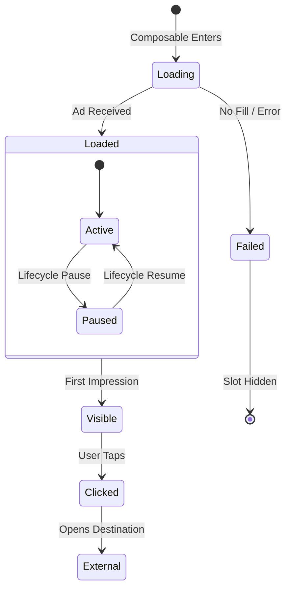
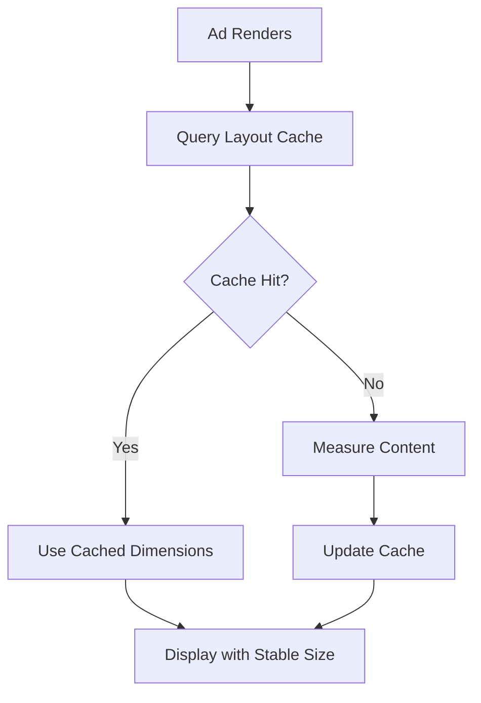

# Ads — Component Documentation

## Architecture Overview

The Ads feature integrates Google Ad Manager (GAM) advertisements using Compose UI. Two ad formats are supported: **Native Inline Ads** (highly customizable with prefetching) and **Adaptive Banner Ads** (simpler integration). Only Android has full implementations; iOS uses stub composables.

---

## Ad Components Inventory

| Component | Format | Platform | Purpose |
|-----------|--------|----------|---------|
| **NativeInlineAd** | Native | Android | Highly customizable inline ad with prefetch support |
| **InlineAdaptiveBannerAd** | Banner | Android | Simple adaptive banner that auto-sizes |
| **Hero Template** | Native | Android | Landscape-oriented full-width layout |
| **Card Template** | Native | Android | Portrait/square card-style layout |
| **iOS Stubs** | Both | iOS | Empty composables for future implementation |

---

## Native Inline Ad

**Purpose:** Renders native ads with full creative control, supporting prefetched or direct-loaded ads with video capability.

### User Journey

1. Screen containing ad slot renders
2. Composable checks for prefetched ad in cache
3. If cache hit, ad displays immediately (fast path)
4. If cache miss, waits briefly for in-flight prefetch or loads directly
5. Ad rendered using Hero or Card template based on aspect ratio
6. User interactions (view, click) tracked via analytics

### Loading Strategy

### State Management

The composable maintains several state categories:

| State | Description |
|-------|-------------|
| **Render State** | Current ad binding info (aspect ratio, load source, debug info) |
| **Request Marker** | Current load status identifier |
| **Cache Key** | Reference for layout dimension caching |
| **Native Ad View** | Reference to Android NativeAdView |
| **Media View** | Reference to video/image media container |
| **Lifecycle Flags** | Tracks which analytics events have fired |

### Lifecycle Event Tracking

| Flag | Trigger | Fires Once |
|------|---------|------------|
| **Rendered** | Ad first becomes visible | Yes |
| **Impression** | GAM SDK fires impression | Yes |
| **Clicked** | User taps ad | Yes |
| **Paid Impression** | Monetization callback received | Yes |

---

## Ad Templates

Native ads render using one of two templates based on media aspect ratio.

### Template Selection

### Aspect Ratio Categories

| Category | Ratio Range | Template |
|----------|-------------|----------|
| **Landscape** | >= 1.6 | Hero |
| **Square** | 0.9 – 1.1 | Card |
| **Portrait** | 0.7 – 0.9 | Card |
| **Unknown** | Other | Card |

### Hero Template

Full-width landscape layout optimized for video content:

| Element | Position | Description |
|---------|----------|-------------|
| Media Container | Top | Full-width video/image |
| Headline | Below media | Primary ad title |
| Body | Below headline | Description text |
| CTA Button | Bottom right | Call-to-action |
| AdChoices | Top right corner | Privacy disclosure icon |

### Card Template

Compact card layout for portrait/square media:

| Element | Position | Description |
|---------|----------|-------------|
| Media Container | Left or top | Constrained media area |
| Headline | Adjacent to media | Primary ad title |
| Body | Below headline | Description text |
| CTA Button | Bottom | Call-to-action |
| AdChoices | Top corner | Privacy disclosure icon |

---

## Adaptive Banner Ad

**Purpose:** Simple banner ad that automatically sizes to available width with a maximum height constraint.

### User Journey

1. Banner slot renders on screen
2. GAM SDK loads appropriate ad size
3. Banner displays at optimal height (max 250dp)
4. User may view or click

### Configuration

| Parameter | Default | Description |
|-----------|---------|-------------|
| **Max Height** | 250dp | Maximum banner height |
| **Width** | Parent width | Adapts to container |
| **Focus** | Block descendants | Prevents focus stealing |
| **Video** | Auto-muted | Videos start muted |

### Banner Lifecycle

---

## Ad Slots

### Native Inline Slots

| Slot ID | Screen | Ad Unit Path |
|---------|--------|--------------|
| `ROUTE_DETAILS` | Live tracking | `/23310137914/chalo_android_app/live_tracking_inline_v2` |
| `CHECKOUT_PAYMENT_METHODS` | Checkout | `/23310137914/chalo_android_app/checkout_payment_methods` |

### Banner Slots

| Slot ID | Screen | Ad Unit Path |
|---------|--------|--------------|
| `HOME_SCREEN_INLINE` | Home tab | `/23310137914/chalo_android_app/homescreen_inline_v1` |
| `REGULAR_BUS_SCREEN_INLINE` | Bus search | TBD |

---

## Layout Caching

To prevent layout shifts during recomposition, measured dimensions are cached per slot.

### Cache Behavior

### Cache Key Components

| Component | Description |
|-----------|-------------|
| **Ad Unit ID** | GAM ad unit identifier |
| **Targeting** | Normalized targeting parameters |
| **Aspect Category** | Layout template category |

---

## ANR Mitigation

A 500ms delay is applied before ad loading to prevent Application Not Responding (ANR) issues:

**Problem:** WebView cold-start can block the main thread during garbage collection, causing ANR crashes.

**Solution:** Brief delay allows system to stabilize before initiating heavy SDK operations.

**Applied To:**
- Prefetch trigger
- Direct SDK load fallback
- Post-load prefetch scheduling

---

## Analytics Events

### Native Inline Ad Events

| Event | Trigger |
|-------|---------|
| `native_inline_ad_requested` | Ad request initiated |
| `native_inline_ad_loaded` | Ad received from SDK/cache |
| `native_inline_ad_rendered` | Ad first displayed on screen |
| `native_inline_ad_impression` | SDK fires impression callback |
| `native_inline_ad_clicked` | User taps ad |
| `native_inline_ad_paid_impression` | Monetization event received |

### Banner Ad Events

| Event | Trigger |
|-------|---------|
| `banner_ad_requested` | Banner request initiated |
| `banner_ad_loaded` | Banner received |
| `banner_ad_impression` | SDK fires impression |
| `banner_ad_clicked` | User taps banner |
| `banner_ad_paid_impression` | Monetization event |

### Common Properties

| Property | Description |
|----------|-------------|
| `ad_unit_id` | GAM ad unit identifier |
| `screen` | Slot screen name |
| `native_ad_load_source` | "direct" or "prefetch" |
| `native_ad_aspect_ratio` | Media aspect ratio |
| `ad_load_time` | Load duration in milliseconds |

---

## Platform Differences

### Android

- Full GAM SDK integration
- Native ad views with video support
- Prefetch system with TTL-based caching
- Layout dimension caching
- Video lifecycle tracking (start, play, pause, end, mute)

### iOS

- Stub implementations (empty composables)
- No GAM SDK integration currently
- Ready for future implementation
- Same composable API for seamless migration

---

## Error Handling

| Scenario | UI Response |
|----------|-------------|
| **SDK Load Failed** | Slot hidden gracefully |
| **Unsupported Aspect Ratio** | Ad rejected, slot hidden |
| **No Ad Inventory** | Empty state, slot collapsed |
| **Prefetch Expired** | Falls back to direct load |
| **Network Failure** | Silent failure, slot hidden |
| **Missing Headline** | Ad rejected as invalid |
| **No Media Content** | Ad rejected as invalid |

---

## Video Support

Native ads may contain video content with lifecycle tracking:

| Callback | Trigger |
|----------|---------|
| **Video Start** | Playback begins |
| **Video Play** | Resumed from pause |
| **Video Pause** | User pauses |
| **Video End** | Playback completes |
| **Video Mute** | Audio muted |
| **Video Unmute** | Audio unmuted |

Videos start muted by default to avoid disruptive audio.
