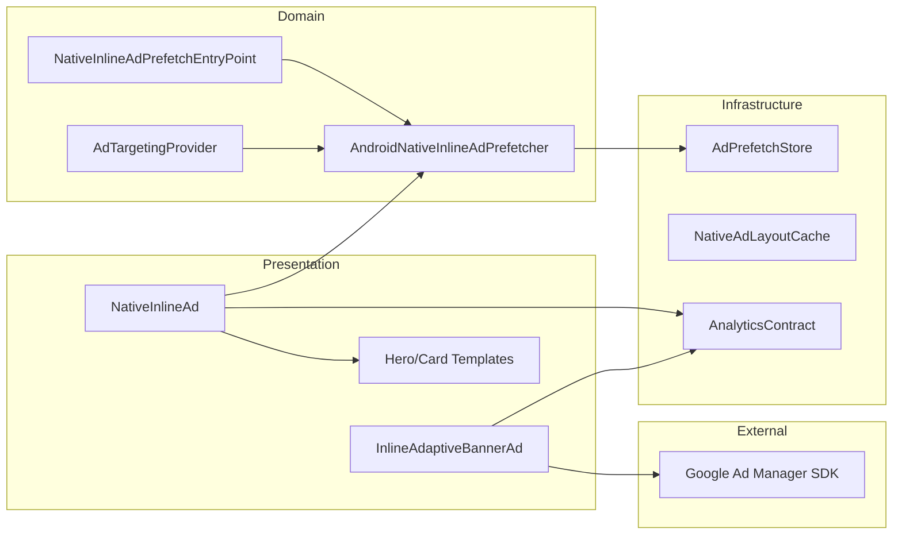

# Ads — High-Level Design

## Overview

The Ads feature integrates Google Ad Manager (GAM) advertisements into the Chalo app. It supports two ad formats: native inline ads (highly customizable) and adaptive banner ads (simpler integration). The feature includes sophisticated prefetching for native ads, comprehensive analytics tracking, and platform-specific implementations. Currently, only Android has full ad support; iOS implementations are stubs.

## User Journey

1. **Entry Points**:
   - Home screen → Banner ad section
   - Route details screen → Native inline ad
   - Checkout payment methods → Native inline ad

2. **Core Flow**:
   - Ad slot requests ad from GAM
   - Prefetch system loads ads in advance (native inline)
   - Ad rendered in appropriate template (Hero or Card)
   - User may view, click, or scroll past
   - Analytics events tracked for each interaction

3. **Exit Points**:
   - Ad click → Opens advertiser destination
   - Ad dismissed → User continues browsing
   - Ad failed to load → Slot hidden gracefully

## Architecture Diagram



## Key Components

| Component | Platform | File Path | Responsibility |
|-----------|----------|-----------|----------------|
| `NativeInlineAd` | Android | `shared/chalo-base/.../ads/NativeInlineAd.kt` | Native ad composable with prefetch |
| `InlineAdaptiveBannerAd` | Android | `shared/chalo-base/.../ads/InlineAdaptiveBannerAd.android.kt` | Banner ad composable |
| `NativeInlineAdTemplates` | Android | `shared/chalo-base/.../ads/NativeInlineAdTemplates.kt` | Hero/Card layout templates |
| `AndroidNativeInlineAdPrefetcher` | Android | `shared/chalo-base/.../ads/AndroidNativeInlineAdPrefetcherImpl.kt` | Prefetch orchestration |
| `AdPrefetchStore` | Shared | `shared/chalo-base/.../ads/AdPrefetchStore.kt` | TTL-based ad cache |
| `AdTargetingProvider` | Shared | `shared/chalo-base/.../ads/AdTargetingProvider.kt` | Ad targeting builder |

## Data Flow

### Native Inline Ad (with Prefetch)
1. App startup triggers `NativeInlineAdPrefetchEntryPoint.prefetchRouteDetailsNativeInline()`
2. Feature flag checked: `enableNativeInlineAdPrefetch`
3. `AdTargetingProvider` builds targeting payload (city, language, location)
4. 500ms ANR mitigation delay applied
5. `AndroidNativeInlineAdPrefetcher.prefetch()` loads ad from GAM
6. Ad stored in `AdPrefetchStore` with TTL (5 minutes)
7. When screen renders, `consume()` retrieves prefetched ad
8. If no prefetch available, direct load from GAM
9. Ad rendered in Hero (landscape) or Card (portrait/square) template
10. Analytics events fired: requested, loaded, rendered, impression, clicked

### Adaptive Banner Ad
1. `InlineAdaptiveBannerAd` composable placed in UI
2. GAM SDK loads ad with adaptive sizing
3. Ad rendered at optimal height (max 250dp)
4. Analytics tracked: requested, loaded, impression, clicked

## Platform Differences

### Android-Specific
- Full GAM SDK integration via `com.google.android.gms:play-services-ads`
- Native ad views: `NativeAdView`, `MediaView`, `AdChoicesView`
- `MobileAds.openAdInspector()` for debugging
- Video lifecycle tracking (start, play, pause, end, mute)

### iOS-Specific
- Stub implementations (no-op)
- `InlineAdaptiveBannerAd.ios.kt` — Empty composable
- `NativeInlineAdComposable.kt` — Empty composable
- Ready for future GAM iOS SDK integration

## Integration Points

### Analytics Events
- See [Analytics: ads](/analytics/flows/ads) for event documentation
- Key events:
  - `native_inline_ad_requested`
  - `native_inline_ad_loaded`
  - `native_inline_ad_rendered`
  - `native_inline_ad_impression`
  - `native_inline_ad_clicked`
  - `native_inline_ad_paid_impression`
  - `banner_ad_requested` / `loaded` / `impression` / `clicked` / `paid_impression`

### Analytics Attributes
| Attribute | Description |
|-----------|-------------|
| `ad_unit_id` | GAM ad unit identifier |
| `screen` | Slot name (route_details, checkout_payment_methods) |
| `native_ad_load_source` | "direct" or "prefetch" |
| `native_ad_aspect_ratio` | Media aspect ratio (float) |
| `ad_value_micros` | Revenue in micros |
| `ad_currency_code` | Currency (e.g., USD) |
| `ad_load_time` | Load time in milliseconds |

### Shared Services
- **Feature Flags**: `MiscFlagsUseCase` for ad enablement
- **Location**: `ChaloLocationManager` for targeting
- **City**: `CityProvider` for city targeting

### Navigation
- **Navigates to**: Advertiser destination (external)
- **Navigated from**: N/A (embedded in screens)

## Ad Slots

### Native Inline Ad Slots
| Slot | Ad Unit ID | Screen |
|------|------------|--------|
| `ROUTE_DETAILS` | `/23310137914/chalo_android_app/live_tracking_inline_v2` | Route details |
| `CHECKOUT_PAYMENT_METHODS` | `/23310137914/chalo_android_app/checkout_payment_methods` | Checkout |

### Banner Ad Slots
| Slot | Ad Unit ID | Screen |
|------|------------|--------|
| `HOME_SCREEN_INLINE` | `/23310137914/chalo_android_app/homescreen_inline_v1` | Home |
| `REGULAR_BUS_SCREEN_INLINE` | TBD | Regular bus screen |

## Edge Cases & Error Handling

| Scenario | Handling |
|----------|----------|
| Ad load failed | Slot hidden, no UI disruption |
| Unsupported aspect ratio | Ad rejected, `UnsupportedAspectRatio` result |
| No ad inventory | Empty state, slot collapsed |
| Prefetch expired (TTL) | Direct load attempted |
| Network failure | Silent failure, ad slot hidden |
| Ad clicked but destination unavailable | Opens in external browser |

## Data Models

### BindNativeAdResult
```kotlin
sealed class BindNativeAdResult {
    data class Success(
        val additionalInfoReceivedFromAd: Map<String, Any>,
        val mediaAspectRatio: Float,
        val loadSource: String  // "direct" or "prefetch"
    )
    sealed class Failed {
        data class SDKLoadAdError(val error: LoadAdError)
        data object UnsupportedAspectRatio
        data object NoAdMediaContent
        data object NoAdHeadlineAvailable
    }
}
```

### NativeInlineAdSlot
```kotlin
enum class NativeInlineAdSlot {
    ROUTE_DETAILS,
    CHECKOUT_PAYMENT_METHODS
}
```

### NativeMediaAspectRatioCategory
```kotlin
enum class NativeMediaAspectRatioCategory {
    LandScape,      // → Hero template
    SquareImage,    // → Card template
    PortraitImage,  // → Card template
    Unknown
}
```

## Prefetch System

### Configuration
| Parameter | Value |
|-----------|-------|
| TTL | 5 minutes |
| Max entries | 2 |
| ANR delay | 500ms |
| Eviction policy | FIFO with TTL |

### Eviction Reasons
```kotlin
enum class EvictReason {
    Replaced,   // New ad with same key
    Expired,    // TTL exceeded
    Capacity,   // Max entries reached
    Clear       // Manual clear
}
```

## Dependencies

### Internal
- `shared:chalo-base` — Ad components, targeting
- `shared:analytics` — Event tracking

### External
- Google Mobile Ads SDK — `com.google.android.gms:play-services-ads:23.6.0`
- Google Ad Manager — GAM account and ad units
