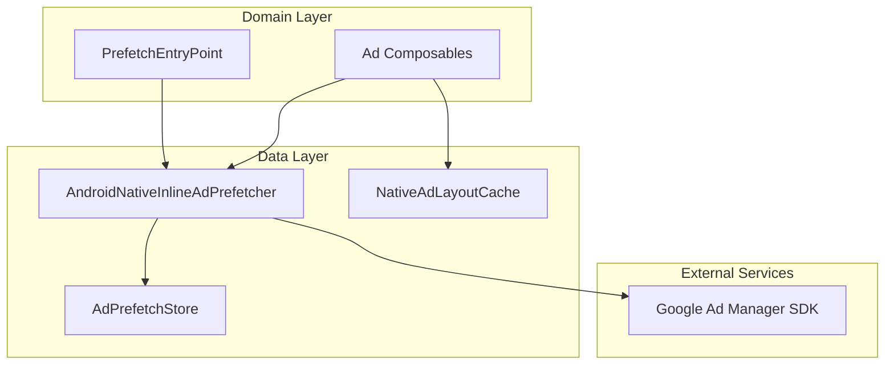
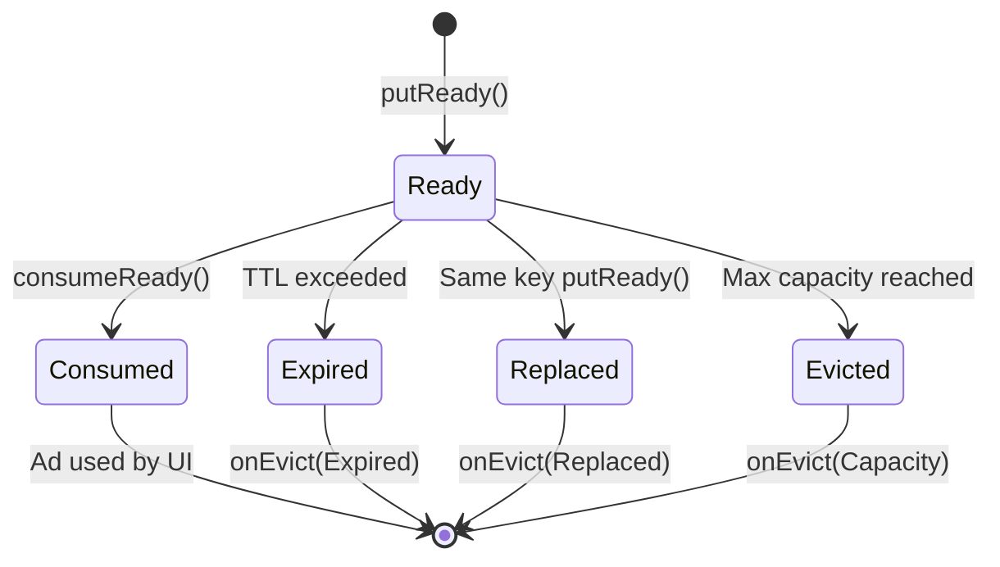
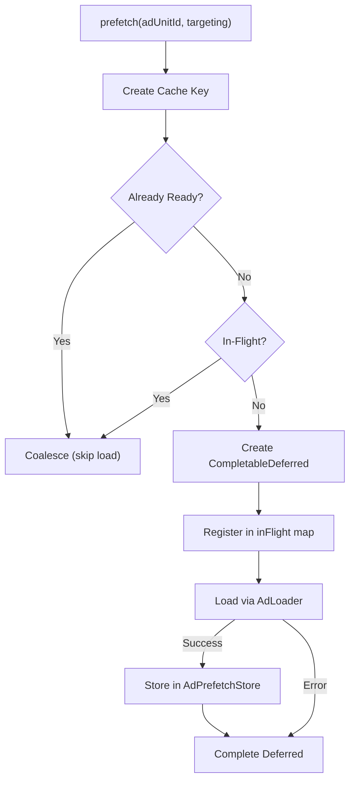
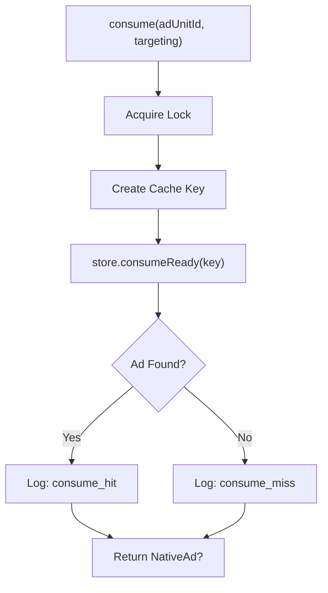
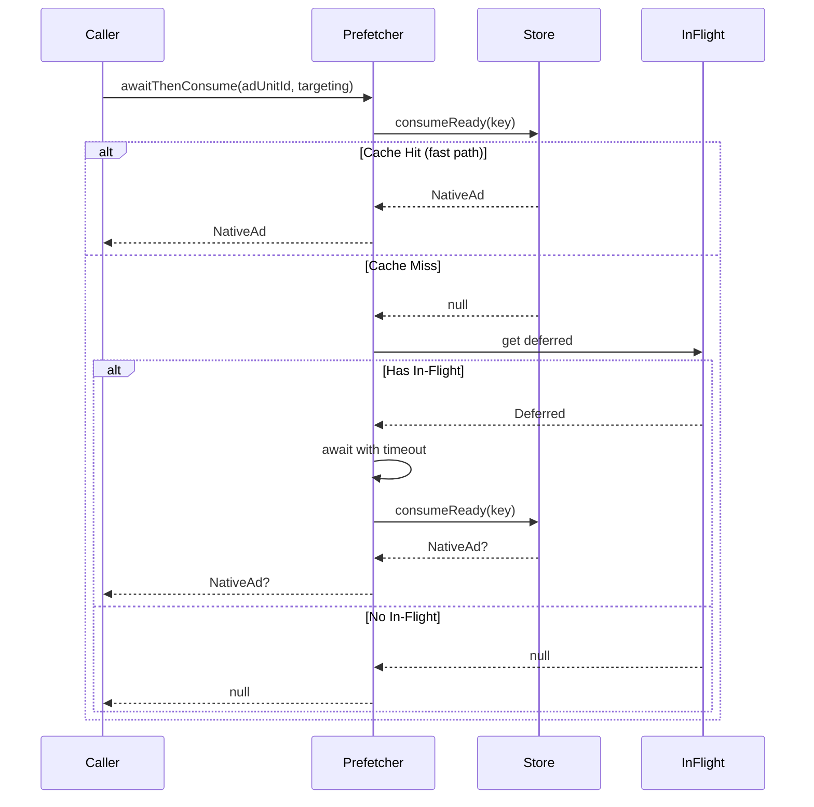
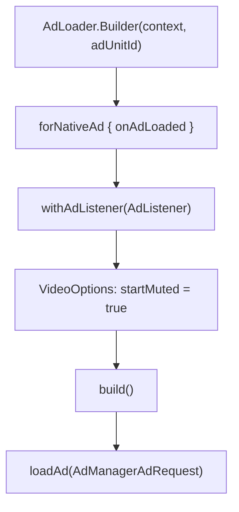
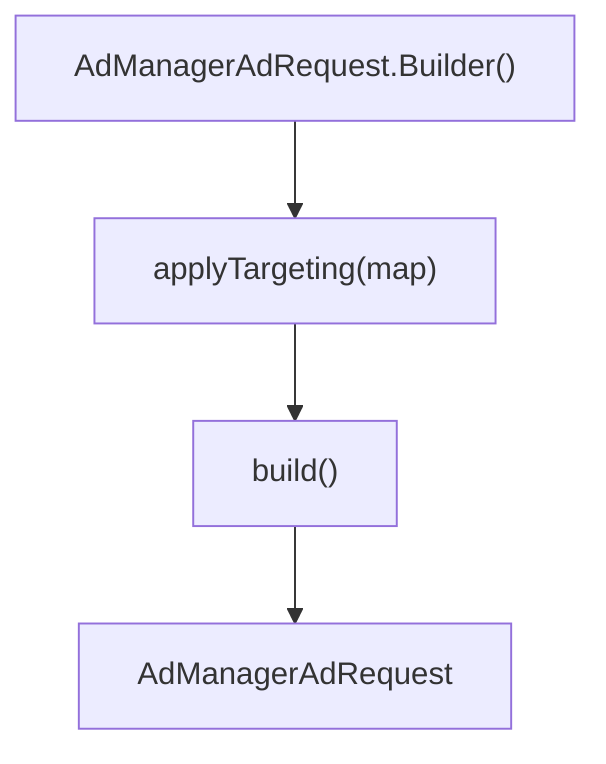
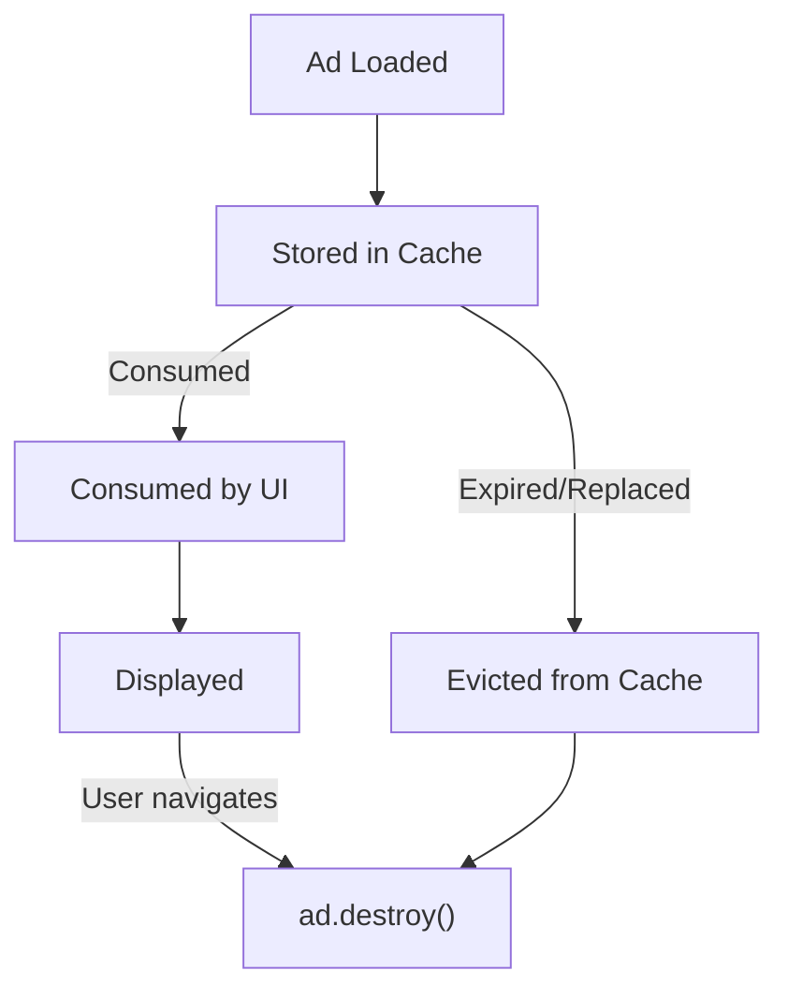
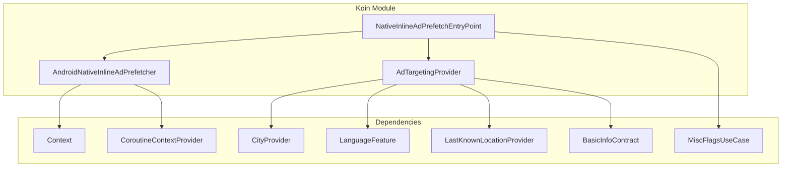

# Ads — Repository Documentation

## Data Layer Overview

The Ads data layer manages ad prefetching, caching, and SDK integration. Unlike traditional repository patterns, ads use a **Prefetcher** pattern that combines caching and SDK coordination.

---

## Data Components

| Component | Type | Purpose |
|-----------|------|---------|
| **AdPrefetchStore** | Generic cache | TTL-based storage for prefetched ads |
| **AndroidNativeInlineAdPrefetcher** | Interface | Prefetch coordination contract |
| **AndroidNativeInlineAdPrefetcherImpl** | Implementation | SDK integration and caching logic |
| **NativeAdLayoutCache** | Singleton | Layout dimension persistence |

---

## Ad Prefetch Store

**Responsibility:** Generic TTL-based cache for "preloaded but not yet consumed" objects.

### Design Principles

- **No peek operation** — Callers must consume to take ownership
- **Fast TTL expiration** — Avoids retaining heavy SDK objects
- **FIFO with TTL** — Oldest entries evicted when capacity reached
- **Not thread-safe** — Callers must synchronize externally

### Configuration

| Parameter | Default | Description |
|-----------|---------|-------------|
| **TTL** | 5 minutes | Time before ad expires |
| **Max Entries** | 2 | Maximum cached ads |
| **Eviction Policy** | FIFO + TTL | Oldest removed first |

### Operations

| Operation | Description |
|-----------|-------------|
| **putReady** | Store ad with current timestamp |
| **consumeReady** | Atomically remove and return ad |
| **hasReady** | Check if valid ad exists (without consuming) |
| **clear** | Remove all entries |
| **evictExpired** | Remove entries past TTL |

### Entry Lifecycle

### Eviction Reasons

| Reason | Cause | Cleanup Action |
|--------|-------|----------------|
| **Replaced** | New ad stored for same key | ad.destroy() |
| **Expired** | TTL exceeded | ad.destroy() |
| **Capacity** | Max entries reached, oldest removed | ad.destroy() |
| **Clear** | Explicit clear() call | ad.destroy() |

---

## Native Inline Ad Prefetcher

### Interface Contract

| Method | Parameters | Return | Description |
|--------|------------|--------|-------------|
| **prefetch** | adUnitId, targeting | void | Trigger background ad load |
| **consume** | adUnitId, targeting | NativeAd? | Synchronously take ad from cache |
| **awaitThenConsume** | adUnitId, targeting | NativeAd? | Wait for in-flight, then consume |
| **setInteractionListener** | ad, listener | void | Attach impression/click callbacks |
| **clear** | none | void | Clear all cached ads |

### Interaction Listener

| Callback | Trigger | Purpose |
|----------|---------|---------|
| **onImpression** | SDK fires impression | Analytics tracking |
| **onClicked** | User taps ad | Analytics tracking |

---

## Prefetcher Implementation

### Internal State

| State | Type | Purpose |
|-------|------|---------|
| **store** | AdPrefetchStore | TTL-based ad storage |
| **inFlight** | Map<Key, Deferred> | Coordinates concurrent loads |
| **interactionListeners** | Map<NativeAd, Listener> | Event callback registry |
| **scope** | CoroutineScope | Supervised background work |

### Cache Key Structure

The cache key combines ad unit and targeting for precise matching:

| Component | Normalization |
|-----------|---------------|
| **adUnitId** | As-is |
| **targeting** | Lowercase keys, sorted alphabetically |

This ensures consistent cache hits regardless of targeting parameter order.

### Prefetch Flow

### Prefetch Telemetry Events

| Event | Meaning |
|-------|---------|
| `prefetch_requested` | Prefetch method called |
| `prefetch_coalesced` | Already ready or in-flight |
| `prefetch_start` | New load initiated |
| `prefetch_sdk_load_start` | SDK AdLoader called |
| `prefetch_sdk_native_loaded` | SDK returned ad |
| `prefetch_ready` | Ad stored successfully |
| `prefetch_sdk_load_done` | Load complete (stored or discarded) |
| `prefetch_unexpected_error` | Exception during load |

### Consume Operation

### Await-Then-Consume Operation

---

## Layout Cache

**Responsibility:** Persists measured dimensions per ad slot to prevent layout shifts during recomposition.

### Cache Key

| Component | Description |
|-----------|-------------|
| **adUnitId** | GAM ad unit identifier |
| **targeting** | Normalized targeting map |
| **aspectRatioCategory** | Template category |

### Operations

| Operation | Description |
|-----------|-------------|
| **get** | Retrieve cached dimensions |
| **put** | Store initial dimensions |
| **updateSize** | Update existing entry |
| **invalidate** | Remove entry |
| **clear** | Remove all entries |

### Thread Safety

All operations are synchronized internally — safe for concurrent access.

---

## SDK Integration

### Ad Loading

### Ad Request Building

### Targeting Application

Each targeting key-value pair is added to the request:

| Method | Purpose |
|--------|---------|
| `addCustomTargeting(key, value)` | Add single targeting parameter |

---

## Thread Safety

| Component | Strategy |
|-----------|----------|
| **AdPrefetchStore** | Not thread-safe; caller synchronizes |
| **Prefetcher** | Synchronized locks on store/inFlight |
| **LayoutCache** | Synchronized methods |
| **SDK Callbacks** | Main thread via coroutine dispatcher |

### Coroutine Configuration

| Aspect | Configuration |
|--------|---------------|
| **Scope** | SupervisorJob + Main dispatcher |
| **Error Handling** | Caught and logged, never propagated |
| **Cancellation** | CancellationException re-thrown |

---

## Error Handling

| Scenario | Handling |
|----------|----------|
| **SDK load failed** | Log error, complete deferred, return null |
| **Timeout waiting** | Return null, UI falls back to direct |
| **Parse error** | Reject ad, report via telemetry |
| **Eviction during use** | Listener removed, ad destroyed |

---

## Cleanup

### Ad Lifecycle

### Resource Cleanup

| Trigger | Cleanup Action |
|---------|----------------|
| **Eviction callback** | ad.destroy() |
| **Screen disposal** | Remove interaction listener |
| **Prefetcher clear** | Destroy all cached ads |

---

## Local Storage

This feature does **not** use persistent local storage:

- **Prefetched ads** — Memory-only with TTL expiration
- **Layout dimensions** — Memory-only, cleared on process death
- **SDK state** — Managed by Google Play Services

**Rationale:**
- Ads must be fresh (server-controlled inventory)
- SDK handles its own caching
- No user data to persist

---

## Dependency Injection

### Koin Bindings

| Interface | Implementation | Scope |
|-----------|----------------|-------|
| AdTargetingProvider | AdTargetingProvider | Singleton |
| AndroidNativeInlineAdPrefetcher | AndroidNativeInlineAdPrefetcherImpl | Singleton |
| NativeInlineAdPrefetchEntryPoint | NativeInlineAdPrefetchEntryPointAndroid | Singleton |

### Dependency Graph

---

## Performance Considerations

| Aspect | Optimization |
|--------|--------------|
| **Prefetch timing** | 500ms delay avoids ANR |
| **Cache key normalization** | Ensures consistent hits |
| **In-flight deduplication** | Prevents duplicate SDK calls |
| **Layout caching** | Prevents recomposition jank |
| **Singleton prefetcher** | Shares state across screens |
