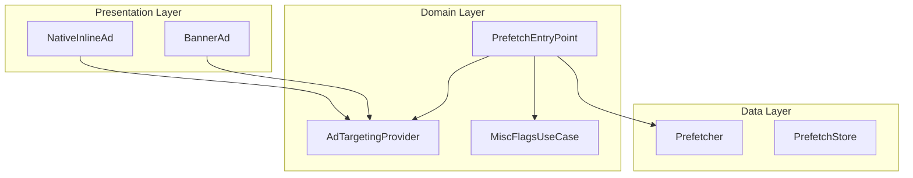
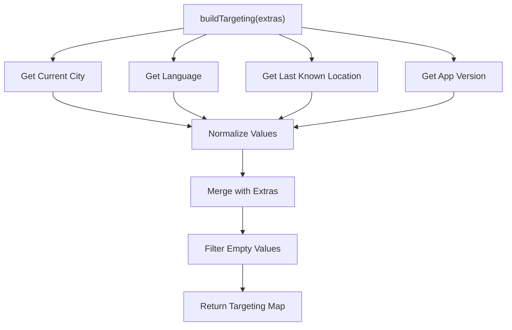
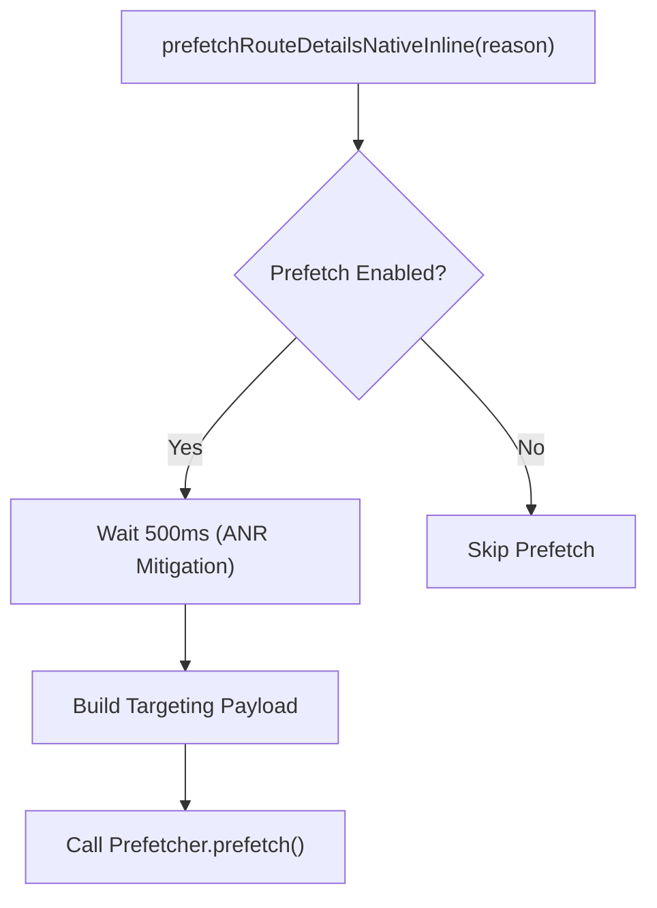
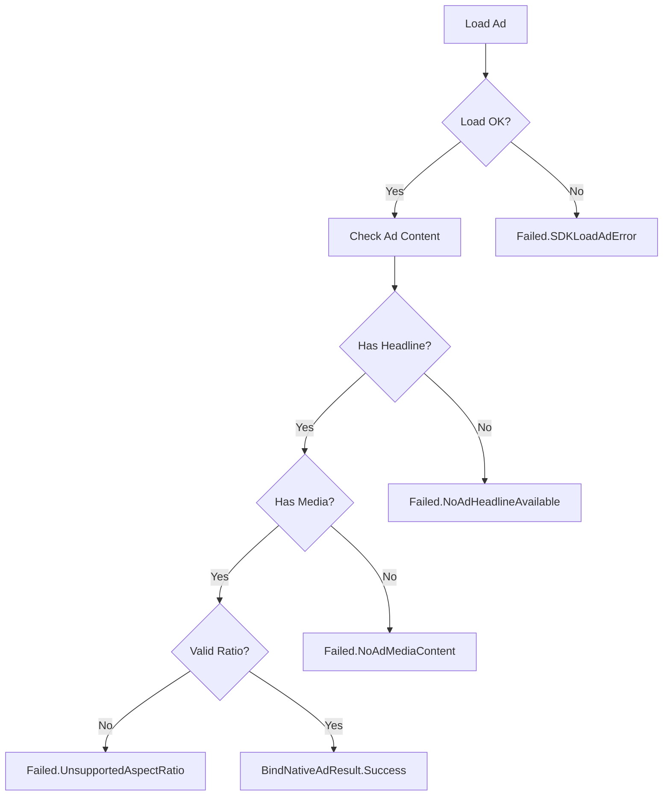
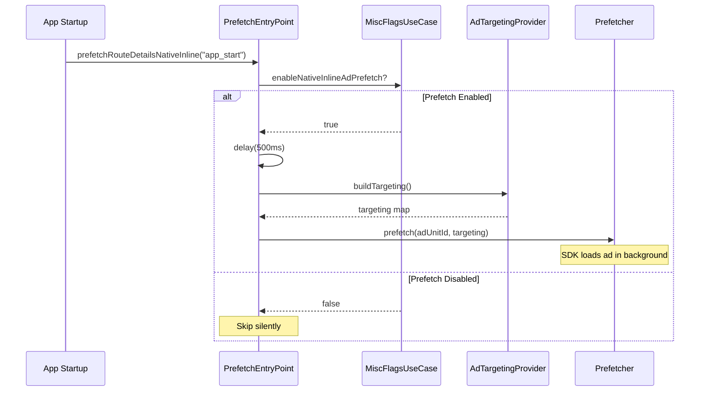
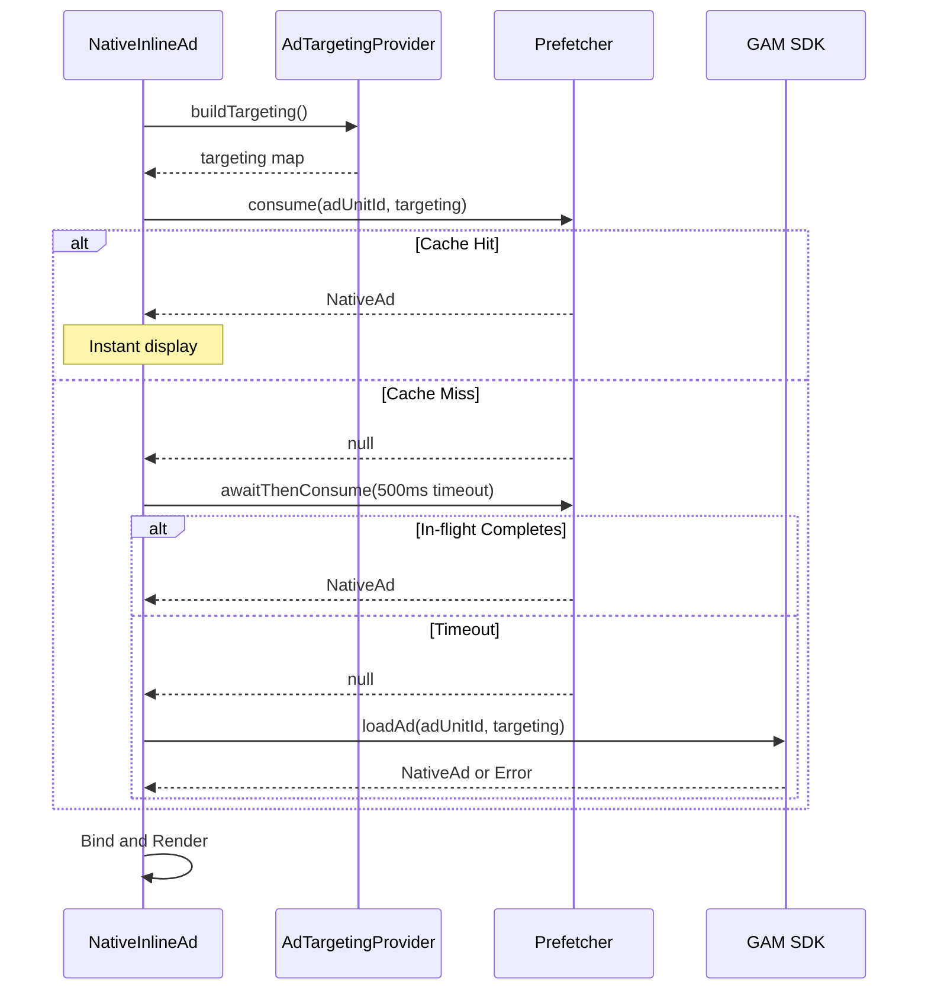

# Ads — UseCase Documentation

## Domain Layer Overview

The domain layer for Ads handles ad targeting, prefetch orchestration, and result processing. Unlike typical features, Ads doesn't follow the traditional UseCase pattern — instead, domain logic is encapsulated in specialized providers and entry points.

---

## Domain Component Inventory

| Component | Purpose | Called From |
|-----------|---------|-------------|
| **AdTargetingProvider** | Build targeting payload for ad requests | Composables, Prefetch Entry Point |
| **PrefetchEntryPoint** | App-level hook to trigger prefetch | App startup, navigation events |
| **MiscFlagsUseCase** | Check feature flag for prefetch enablement | Entry Point |
| **BindNativeAdResult** | Typed result for ad binding outcomes | Composables |

---

## Ad Targeting Provider

**Responsibility:** Builds a normalized targeting payload for ad requests using user context (city, language, location, app version).

### Targeting Construction Flow

### Targeting Parameters

| Key | Source | Description |
|-----|--------|-------------|
| `selected_city` | CityProvider | User's active city (lowercase) |
| `language` | LanguageFeature | App language locale |
| `location_lat` | LocationProvider | Latitude from coarse location |
| `location_long` | LocationProvider | Longitude from coarse location |
| `location_lat_long` | LocationProvider | Combined "lat,lng" format |
| `version_code` | BasicInfoContract | App version code |

### Normalization Rules

- All keys converted to lowercase
- All values trimmed of whitespace
- Empty values filtered out
- Extras merged (caller can override defaults)

### Dependencies

| Dependency | Purpose |
|------------|---------|
| **CityProvider** | Active city name |
| **LanguageFeature** | Current language locale |
| **LastKnownLocationProvider** | Coarse location coordinates |
| **BasicInfoContract** | App version and metadata |

---

## Prefetch Entry Point

**Responsibility:** App-level hook for triggering ad prefetch without coupling to UI lifecycle.

### Interface Contract

| Method | Parameters | Description |
|--------|------------|-------------|
| **prefetchRouteDetailsNativeInline** | reason: String | Trigger prefetch for route details slot |

### Android Implementation Flow

### Feature Flag Check

The entry point consults `MiscFlagsUseCase` to check if prefetch is enabled:

| Flag | Default | Description |
|------|---------|-------------|
| `enableNativeInlineAdPrefetch` | false | Controls whether prefetch runs |

When disabled, prefetch requests are silently ignored, and ads load directly when composables render.

### ANR Mitigation

A 500ms delay is applied before prefetch to avoid ANR (Application Not Responding) issues:

**Rationale:**
- WebView cold-start can block main thread
- GC pressure during app startup is high
- Brief delay allows system stabilization

---

## Result Types

### BindNativeAdResult

Represents the outcome of binding a native ad to the UI.

#### Success Path

| Field | Description |
|-------|-------------|
| **additionalInfoReceivedFromAd** | Extra metadata from ad creative |
| **mediaAspectRatio** | Aspect ratio for template selection |
| **loadSource** | "direct" or "prefetch" |

#### Failure Types

| Type | Cause | Handling |
|------|-------|----------|
| **SDKLoadAdError** | GAM SDK returned error | Report error code, hide slot |
| **UnsupportedAspectRatio** | Aspect ratio outside expected range | Reject ad, hide slot |
| **NoAdMediaContent** | Ad lacks required media | Reject as invalid |
| **NoAdHeadlineAvailable** | Ad lacks required headline | Reject as invalid |

### Result Flow

---

## Aspect Ratio Categories

Used to determine which template renders the ad.

| Category | Ratio Range | Template |
|----------|-------------|----------|
| **Landscape** | >= 1.6 | Hero (full-width) |
| **Square** | 0.9 – 1.1 | Card |
| **Portrait** | 0.7 – 0.9 | Card |
| **Unknown** | Other | Card (default) |

---

## Business Rules

| Rule | Description | Enforced By |
|------|-------------|-------------|
| **Feature flag gating** | Prefetch only runs when enabled | PrefetchEntryPoint |
| **ANR mitigation** | 500ms delay before heavy SDK ops | PrefetchEntryPoint, Composables |
| **Targeting normalization** | All targeting values lowercase/trimmed | AdTargetingProvider |
| **Content validation** | Ads must have headline and media | Bind validation |
| **Aspect ratio bounds** | Ads outside range rejected | Composable validation |
| **TTL expiration** | Prefetched ads expire after 5 minutes | Data layer |

---

## Ad Slot Mappings

### Native Inline Slots

| Slot | Ad Unit ID | Analytics Screen |
|------|------------|------------------|
| `ROUTE_DETAILS` | `live_tracking_inline_v2` | "route_details" |
| `CHECKOUT_PAYMENT_METHODS` | `checkout_payment_methods` | "checkout_payment_methods" |

### Banner Slots

| Slot | Ad Unit ID | Analytics Screen |
|------|------------|------------------|
| `HOME_SCREEN_INLINE` | `homescreen_inline_v1` | "home_screen" |
| `REGULAR_BUS_SCREEN_INLINE` | TBD | "regular_bus_screen" |

---

## Sequence: Prefetch Trigger

---

## Sequence: Ad Load with Fallback

---

## Error Handling

| Scenario | Domain Response | UI Impact |
|----------|-----------------|-----------|
| Feature flag disabled | Skip prefetch | Ads load directly |
| Targeting fetch failed | Use empty map | Ad may load with reduced targeting |
| Prefetch timeout | Fall back to direct | Slight delay, then ad shows |
| Invalid ad content | Return Failed result | Slot hidden |
| SDK error | Propagate error code | Slot hidden |
