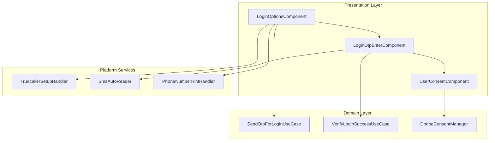
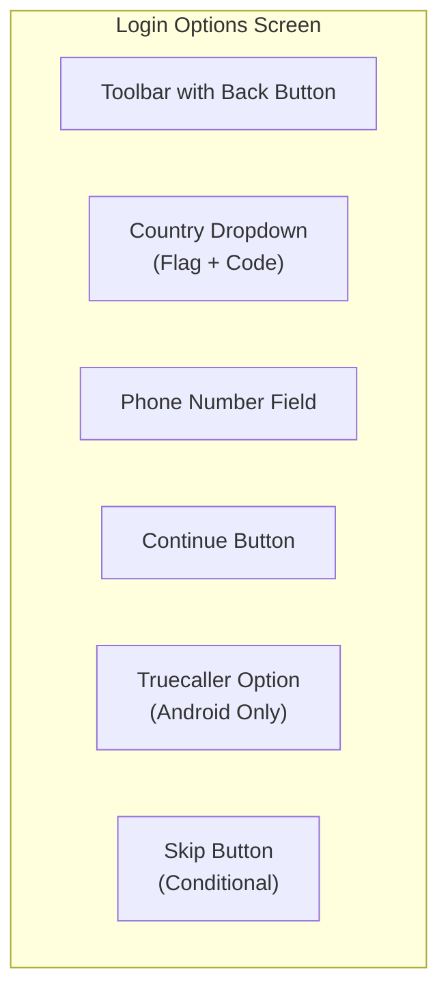
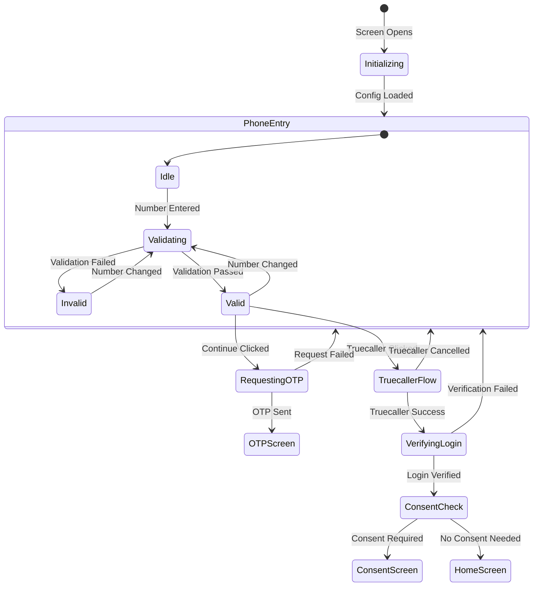
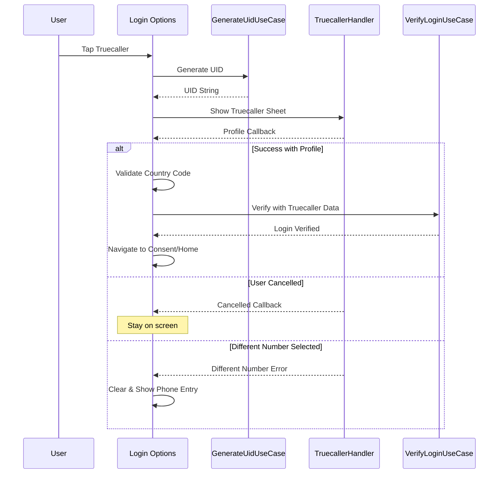
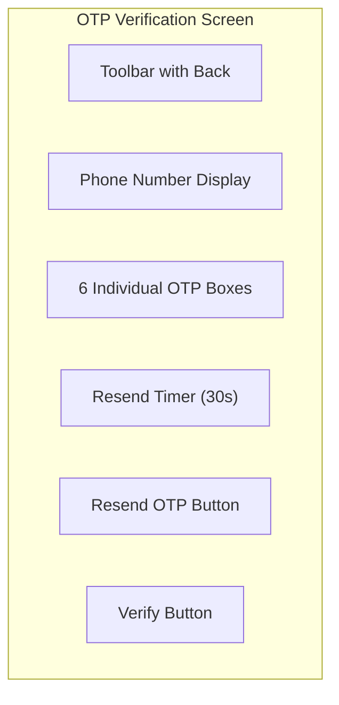
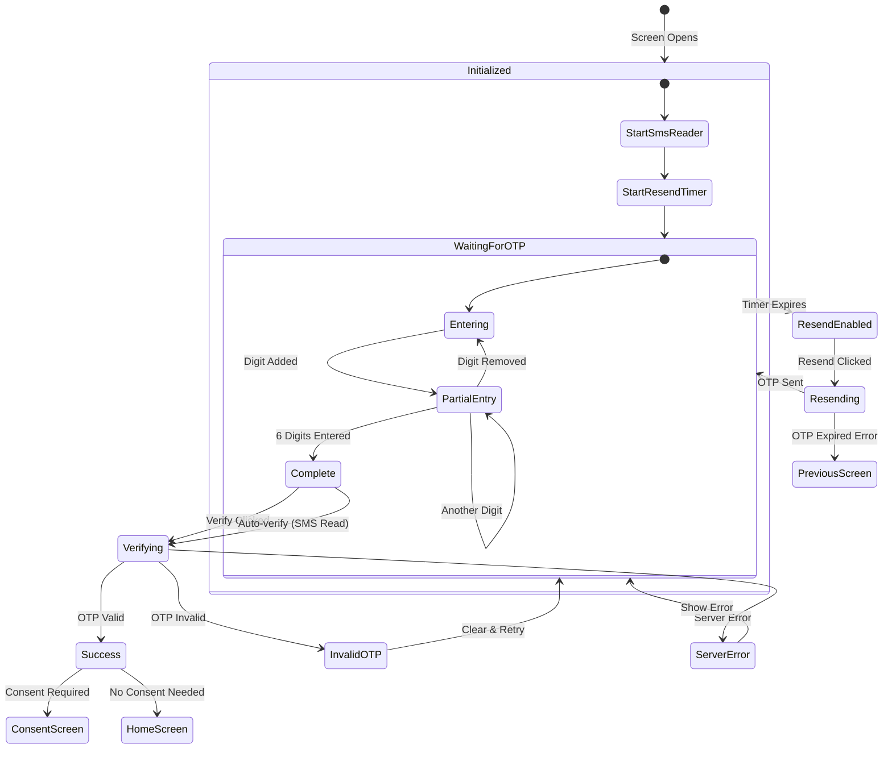
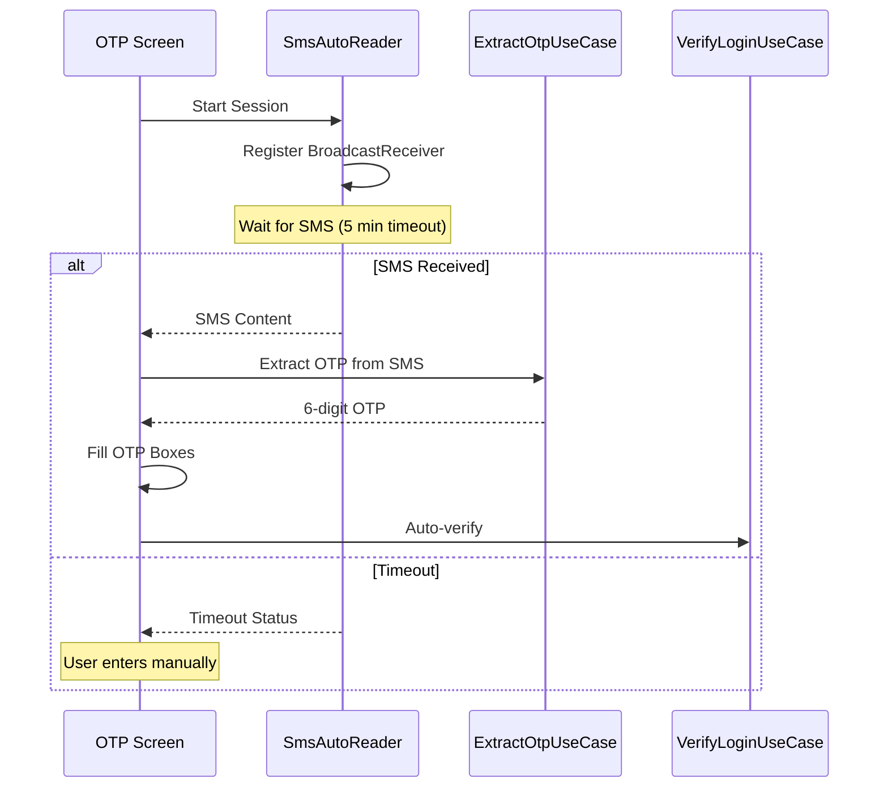
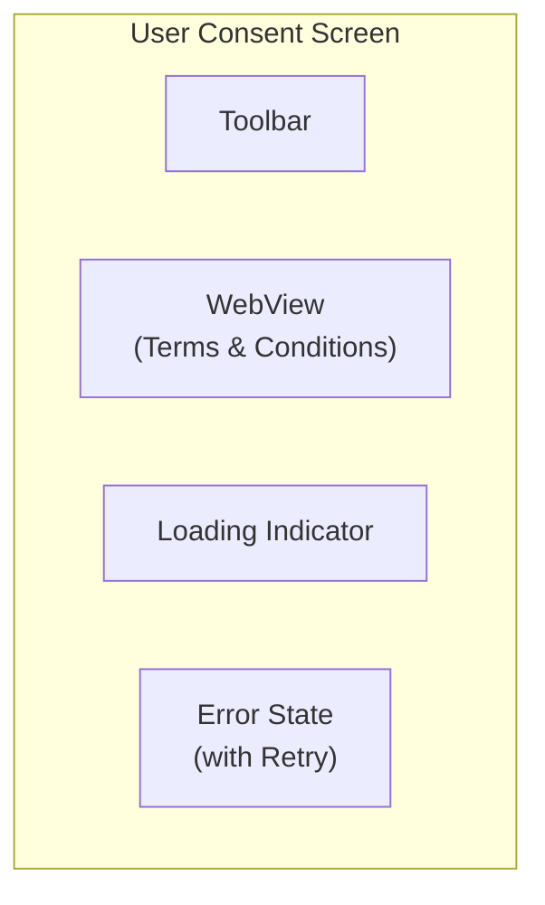
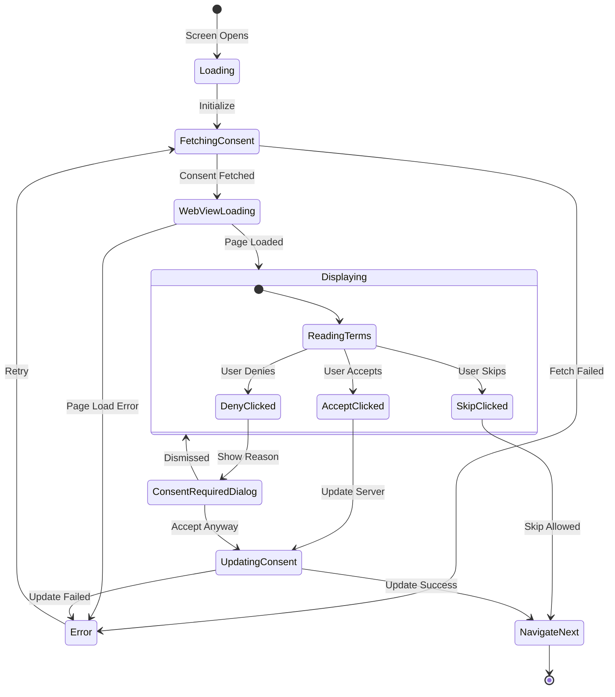

# Authentication — Component Documentation

## Architecture Overview

The Authentication feature follows the **Decompose + MVI** pattern across three main screens: Login Options (phone entry), OTP Verification, and User Consent (DPDPA). The feature resides in the `shared/login` module with platform-specific implementations for Android (Truecaller, SMS auto-read) and iOS.



---

## Screen Inventory

| Screen | Component | Purpose | Entry From |
|--------|-----------|---------|------------|
| **Login Options** | LoginOptionsComponent | Phone number entry, login method selection | App launch, Session expiry |
| **OTP Verification** | LoginOtpEnterComponent | OTP entry and verification | Login Options |
| **User Consent** | UserConsentComponent | DPDPA consent management | Post-login verification |

---

## Login Options Screen

**Purpose:** Manages phone number entry, country selection, and login method selection (OTP vs Truecaller on Android).

### User Journey

1. User arrives at login screen (first launch or session expiry)
2. Phone number field auto-focuses with keyboard
3. Country dropdown shows supported countries with flags
4. User enters phone number with real-time validation
5. Continue button enables when number is valid
6. User chooses OTP or Truecaller (Android only)
7. On success, navigates to OTP screen or directly to consent/home

### Screen Layout



### State Flow



### Phone Number Validation

| Check | Rule | Error Message |
|-------|------|---------------|
| **Length** | Must match country's phone length | "Invalid phone number" |
| **Format** | Digits only after country code | "Invalid format" |
| **Country match** | Must match selected country format | "Select correct country" |

### Truecaller Flow (Android)



### Country Selection

| Feature | Behavior |
|---------|----------|
| **Default selection** | Based on device SIM/locale |
| **Dropdown trigger** | Tap country flag/code |
| **Dialog content** | Scrollable list with flags and names |
| **Selection result** | Updates phone field validation rules |

---

## OTP Verification Screen

**Purpose:** Manages 6-digit OTP entry, verification, resend logic, and SMS auto-reading (Android).

### User Journey

1. User arrives from Login Options with reference number
2. OTP field auto-focuses with numeric keyboard
3. Individual digit boxes show entry progress
4. SMS auto-read fills OTP automatically (Android)
5. Verify button enables when 6 digits entered
6. 30-second timer before resend becomes available
7. On verification success, proceeds to consent or home

### Screen Layout



### OTP Box States

| State | Visual | Trigger |
|-------|--------|---------|
| **Empty** | Empty box with border | Initial state |
| **Cursor** | Blinking cursor | Current input position |
| **Filled** | Digit displayed | Digit entered |
| **Error** | Red border + shake | Invalid OTP submitted |

### State Flow



### SMS Auto-Read (Android)



### Resend Timer Logic

| Time | UI State | Action Available |
|------|----------|------------------|
| **0-30s** | "Resend in Xs" | None |
| **30s+** | "Resend OTP" button | Tap to resend |
| **After resend** | Timer resets to 30s | Wait again |

### Error Handling

| Error | Source | UI Response |
|-------|--------|-------------|
| **Invalid OTP** | Server response | Show error, clear boxes |
| **OTP Expired** | Server response (PREVIOUS_OTP_EXPIRED) | Navigate back to options |
| **Network error** | Connection failure | Show retry toast |
| **Too many attempts** | Rate limiting | Show wait message |

---

## User Consent Screen

**Purpose:** Manages DPDPA (Data Protection and Privacy Act) consent flow with WebView integration for terms display.

### User Journey

1. User arrives after successful login verification
2. WebView loads terms and conditions page
3. User reads terms (scrollable content)
4. Accept, Deny, or Skip (if available) buttons in WebView
5. JavaScript bridge communicates user choice
6. Consent status updated on server
7. Navigate to home or city selection

### Screen Layout



### Flow Types

| Flow Type | Entry Condition | Skip Available |
|-----------|-----------------|----------------|
| **FreshLogin** | First login ever | No |
| **PostLogin** | Consent version updated | Conditional |
| **SplashScreen** | Pending consent on app launch | Conditional |

### State Flow



### JavaScript Bridge

The WebView communicates with native code via a JavaScript interface:

| JS Method | Native Handler | Result |
|-----------|----------------|--------|
| `AndroidInterface.onAcceptClicked()` | AcceptConsentIntent | Update consent as GRANTED |
| `AndroidInterface.onDenyClicked()` | DenyConsentIntent | Show required dialog |
| `AndroidInterface.onSkipClicked()` | SkipConsentIntent | Skip if allowed |

### Consent Required Dialog

When user denies consent but it's mandatory:

| Element | Content |
|---------|---------|
| **Title** | "Consent Required" |
| **Message** | Explains why consent is needed |
| **Primary Action** | Accept |
| **Secondary Action** | Dismiss |

---

## State Management

All screens follow the MVI pattern with DataState to ViewState transformation.

### Login Options State

| State Field | Description |
|-------------|-------------|
| **phoneNumberEntered** | Current phone number text |
| **countryPhoneNumberConfig** | Selected country config |
| **numberEnterError** | Validation error message |
| **isLoading** | Operation in progress |
| **loadingPurpose** | GENERAL, REQUESTING_OTP, VERIFYING_LOGIN |
| **isContinueBtnEnabled** | Phone number valid |
| **uidForTruecaller** | Generated UID for Truecaller |
| **isTruecallerLoginVisible** | Show Truecaller option |
| **supportedLoginOptionsCountryList** | Available countries |
| **showSupportedCountryListDialogue** | Country picker visible |

### OTP Enter State

| State Field | Description |
|-------------|-------------|
| **otpEntered** | Current OTP string (0-6 chars) |
| **isLoading** | Verification in progress |
| **otpLength** | Expected OTP length (6) |
| **isVerifyBtnEnabled** | All digits entered |
| **shouldShowInvalidOtpError** | Show error state |
| **remainingTimeInMillisForEnablingResend** | Timer countdown |
| **isResendBtnEnabled** | Timer expired |
| **refNo** | Reference number from OTP send |
| **phoneNumber, countryCode** | User's phone details |

### User Consent State

| State Field | Description |
|-------------|-------------|
| **flowType** | FreshLogin, PostLogin, SplashScreen |
| **userConsentStatus** | List of consent items |
| **tncUrl** | Terms URL to load |
| **showLoading** | Loading indicator |
| **fullScreenError** | Error message |
| **showConsentRequiredReasonDialog** | Dialog visible |
| **isSkipOptionEnabled** | Skip button available |

### Intent Types

| Screen | Key Intents |
|--------|-------------|
| **Login Options** | OnPhoneNumberEntered, OnContinueClicked, OnTruecallerSuccessCallback, OnCountrySelected |
| **OTP Enter** | OnOtpEnteredIntent, OnVerifyClickedIntent, OnResendOtpClickedIntent, OnOtpSMSReadSuccessfully |
| **User Consent** | AcceptConsentIntent, DenyConsentIntent, SkipConsentIntent, RetryFetchIntent |

---

## Navigation

### Entry Points

| Source | Destination | Args |
|--------|-------------|------|
| App Launch (logged out) | Login Options | Source.APP_LAUNCH |
| Session Expiry | Login Options | Source.SESSION_EXPIRY |
| Logout | Login Options | Source.LOGOUT |

### Screen Transitions

```mermaid
flowchart TD
    Entry["Entry Point"]
    Options["Login Options"]
    OTP["OTP Verification"]
    Consent["User Consent"]
    City["City Selection"]
    Home["Home Screen"]

    Entry --> Options
    Options -->|OTP Method| OTP
    Options -->|Truecaller Success| Consent
    Options -->|Skip (if allowed)| Home
    OTP -->|Verification Success| Consent
    OTP -->|Back| Options
    Consent -->|Consent Complete| City
    Consent -->|Has City| Home
    City --> Home
```

### Exit Points

| Action | Destination | Nav Options |
|--------|-------------|-------------|
| Login Success (no consent needed) | Home/City | Clear login stack |
| Consent Complete | Home/City | Clear login stack |
| Skip Login | Home (limited) | Clear login stack |
| Back from Options | Exit App | Confirm dialog |

---

## Analytics Events

### Login Options Events

| Event | Properties | Trigger |
|-------|------------|---------|
| `enter_number_screen_opened` | source | Screen displayed |
| `continue_btn_clicked` | source, country_code | Continue tapped |
| `otp_sent` | country_code | OTP request success |
| `continue_with_truecaller` | — | Truecaller option tapped |
| `truecaller_uid_fetch_tried` | — | UID generation started |
| `truecaller_uid_fetch_failed` | error_reason | UID generation failed |

### OTP Screen Events

| Event | Properties | Trigger |
|-------|------------|---------|
| `otp_entered` | country_code, is_auto_read | OTP filled (manual/auto) |
| `otp_resent` | country_code | Resend tapped |
| `login_success` | login_method | Verification succeeded |
| `login_failed` | login_method, reason | Verification failed |

### Consent Events

| Event | Properties | Trigger |
|-------|------------|---------|
| `user_consent_screen_shown` | flow_type | Screen displayed |
| `user_consent_accepted` | consent_ids | Accept clicked |
| `user_consent_denied` | — | Deny clicked |
| `user_consent_skipped` | — | Skip clicked |

---

## Platform Differences

### Android-Specific

| Feature | Implementation |
|---------|----------------|
| **Truecaller Login** | Full SDK integration via TruecallerSetupHandler |
| **SMS Auto-Read** | Google Play Services SmsRetriever API |
| **Phone Hints** | Device credentials for suggested numbers |
| **Country Default** | SIM card country or device locale |

### iOS-Specific

| Feature | Implementation |
|---------|----------------|
| **Truecaller Login** | Limited or no support |
| **SMS Auto-Read** | Stub implementation (manual entry) |
| **Phone Hints** | iOS keyboard autofill |
| **Country Default** | Device locale only |

---

## Error Handling

| Scenario | UI Response |
|----------|-------------|
| **Invalid phone format** | Inline validation error, disable continue |
| **OTP request failed** | Toast with retry message |
| **Invalid OTP** | Shake animation, clear boxes, show error |
| **OTP expired** | Navigate back to options |
| **Truecaller cancelled** | Stay on options screen |
| **Consent fetch failed** | Full-screen error with retry |
| **Network failure** | Toast with connection message |
