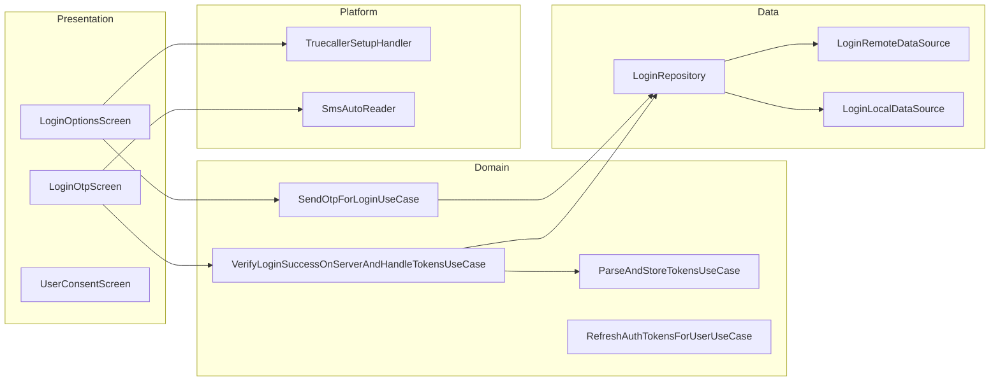

# Authentication — High-Level Design

## Overview

The Authentication feature handles user login and session management in the Chalo app. It supports phone-based OTP authentication and Truecaller integration (Android), with secure token management using JWT. The feature also manages DPDPA (Data Protection and Privacy Act) consent workflows and post-login analytics synchronization.

## User Journey

1. **Entry Points**:
   - App launch (first-time or logged out)
   - Session expiry
   - Explicit logout followed by re-login

2. **Core Flow**:
   - Enter phone number with country selection
   - Choose login method: OTP or Truecaller (Android)
   - Verify OTP (6-digit code with auto-read)
   - Complete DPDPA consent (if required)
   - Navigate to home screen

3. **Exit Points**:
   - Successful login → Home screen
   - DPDPA consent completed → Home screen
   - Back navigation → Exit app (if on login screen)

## Architecture Diagram



## Key Components

| Component | Platform | File Path | Responsibility |
|-----------|----------|-----------|----------------|
| `LoginOptionsComponent` | Shared | `shared/login/.../ui/options/LoginOptionsComponent.kt` | MVI component for phone entry |
| `LoginOtpEnterComponent` | Shared | `shared/login/.../ui/otp/LoginOtpEnterComponent.kt` | OTP verification logic |
| `UserConsentComponent` | Shared | `shared/login/.../ui/userconsent/UserConsentComponent.kt` | DPDPA consent management |
| `SendOtpForLoginUseCase` | Shared | `shared/login/.../domain/SendOtpForLoginUseCase.kt` | OTP request business logic |
| `VerifyLoginSuccessOnServerAndHandleTokensUseCase` | Shared | `shared/login/.../domain/VerifyLoginSuccessOnServerAndHandleTokensUseCase.kt` | OTP verification and token handling |
| `LoginRepository` | Shared | `shared/login/.../data/repository/LoginRepository.kt` | Auth data access abstraction |
| `TruecallerSetupHandler` | Android | `shared/login/.../truecaller/TruecallerSetupHandler.android.kt` | Truecaller SDK integration |
| `AndroidSmsAutoReader` | Android | `shared/login/.../smsautoread/AndroidSmsAutoReader.kt` | SMS OTP auto-read |

## Data Flow

### Phone + OTP Login
1. User enters phone number on `LoginOptionsScreen`
2. `LoginOptionsComponent` validates number format
3. `SendOtpForLoginUseCase` requests OTP via `LoginRepository`
4. API returns reference number; navigate to `LoginOtpScreen`
5. User enters OTP (or auto-read from SMS)
6. `VerifyLoginSuccessOnServerAndHandleTokensUseCase` verifies OTP
7. `ParseAndStoreTokensUseCase` stores JWT tokens securely
8. `DpdpaConsentManager` checks consent requirements
9. Navigate to home or consent screen

### Truecaller Login (Android)
1. User taps Truecaller option on `LoginOptionsScreen`
2. `GenerateUidForTruecallerLoginUseCase` creates verification UID
3. `TruecallerSetupHandler` shows Truecaller SDK
4. User authorizes in Truecaller app
5. Callback returns verified profile
6. `VerifyLoginSuccessOnServerAndHandleTokensUseCase` completes login
7. Same post-login flow as OTP

### Token Refresh
1. Access token expiry detected
2. `RefreshAuthTokensForUserUseCase` called with refresh token
3. New access token stored
4. Original request retried

## Platform Differences

### Android-Specific
- **Truecaller SDK**: Full integration with `TruecallerSetupHandlerProvider`
- **SMS Auto-Read**: Uses `SmsRetriever` API for automatic OTP extraction
- **Phone Number Hint**: Device-suggested phone numbers via `GetPhoneNumberHintIntentUseCase`

### iOS-Specific
- **No Truecaller**: Stub implementation (OTP-only login)
- **Limited SMS**: iOS SMS auto-fill via keyboard
- **Country Config**: Uses `IosCountryPhoneNumberConfigProvider`

## Integration Points

### Analytics Events
- `login_screen_shown`
- `login_otp_requested`
- `login_otp_verified_success` / `login_otp_verified_failure`
- `login_truecaller_initiated` / `login_truecaller_success` / `login_truecaller_error`
- `user_consent_accepted` / `user_consent_denied` / `user_consent_skipped`

### Shared Services
- **Vault**: Secure token storage via `ChaloAuthSecureManager`
- **Analytics**: Post-login property sync via `SyncAndUpdateAnalyticsPropertiesAfterLoginUseCase`
- **FCM**: Token registration after login

### Navigation
- **Navigates to**: Home screen, User consent screen, City selection (if no city)
- **Navigated from**: Splash screen, Session expiry handler

## Edge Cases & Error Handling

| Scenario | Handling |
|----------|----------|
| Invalid phone number | Shows validation error, blocks continue |
| OTP expired | Shows error, enables resend button |
| Invalid OTP entered | Shows error message, clears input |
| Truecaller not installed | Hides Truecaller option |
| Truecaller cancelled | Returns to phone entry |
| Network failure | Shows error with retry |
| Token refresh failed | Forces re-login |
| DPDPA consent required | Redirects to consent screen |

## API Endpoints

| Endpoint | Method | Purpose |
|----------|--------|---------|
| `auth/v1/otp/send` | POST | Request OTP |
| `auth/v1/login` | POST | Verify OTP or Truecaller |
| `auth/v1/token/refresh` | POST | Refresh access token |
| `auth/v1/logout` | POST | Logout user |
| `user/v1/consent` | GET/PUT | DPDPA consent management |

## Data Models

### LoginModeAppModel
```kotlin
sealed class LoginModeAppModel {
    data class PhoneAuthLogin(
        val phoneNumber: String,
        val countryCode: String,
        val otp: String,
        val refNo: String
    ) : LoginModeAppModel()

    data class TruecallerLogin(
        val payload: String,
        val signature: String,
        val signatureAlgorithm: String
    ) : LoginModeAppModel()
}
```

### LoginVerificationResult
```kotlin
sealed class LoginVerificationResult {
    data class LoginVerified(val userProfile: UserProfileAppModel)
    sealed class ServerError {
        object InvalidOtpEntered
        data class UnknownError(val errorMsg: String?)
        object InvalidProfileReceived
        object InvalidTokensReceived
        object ParseError
    }
    data class LocalError(val errorMsg: String?)
    object TokenProcessingError
}
```

## Security Considerations

- JWT tokens stored in platform-secure storage (Keystore/Keychain)
- Refresh tokens used to minimize access token exposure
- OTP has 5-minute expiry
- Truecaller verification uses cryptographic signatures
- DPDPA consent tracked and enforced server-side

## Dependencies

### Internal
- `shared:chalo-base` — Base models, security utilities
- `shared:vault` — Secure storage
- `shared:network` — API client

### External
- Truecaller SDK (Android) — One-tap login
- Google Play Services SMS Retriever (Android) — OTP auto-read
- DataStore — Local preferences
