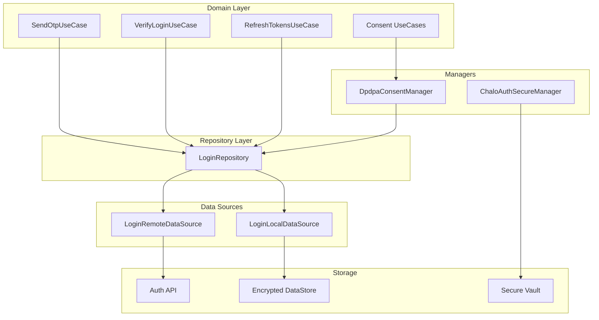
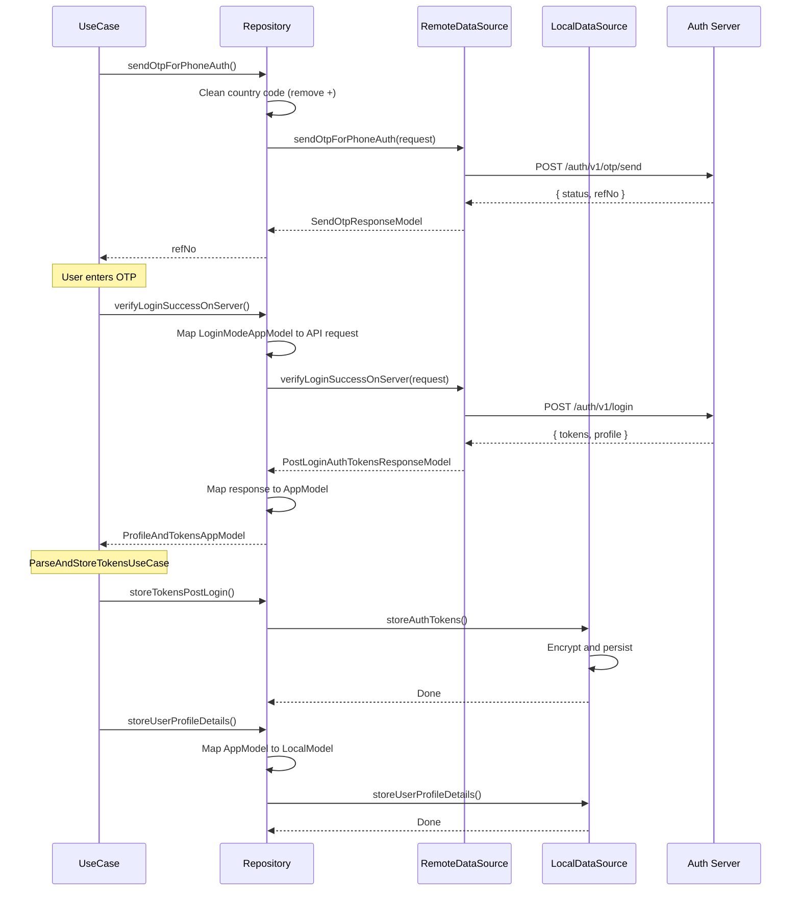
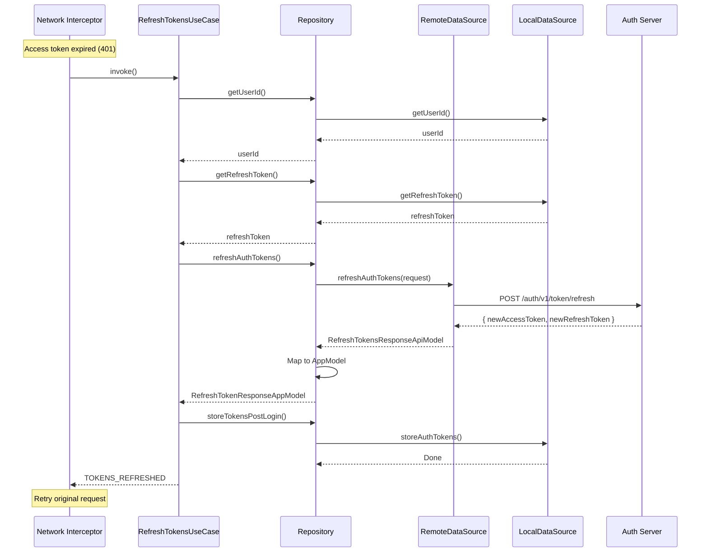
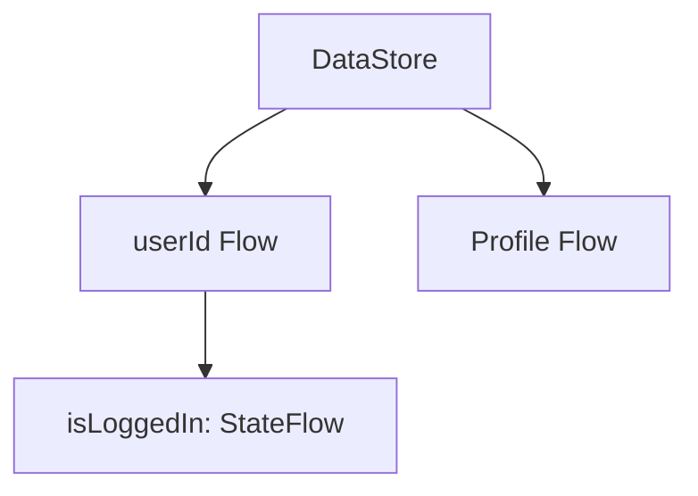
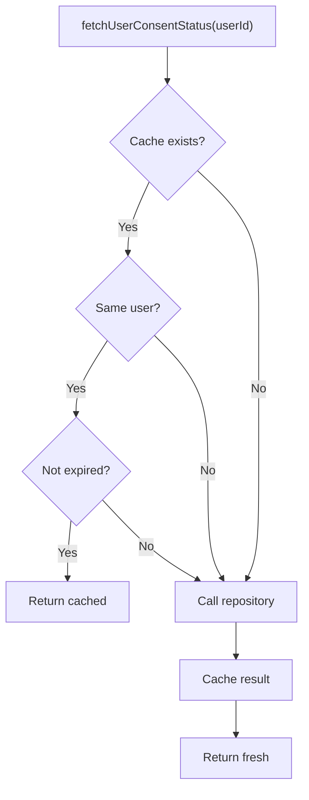
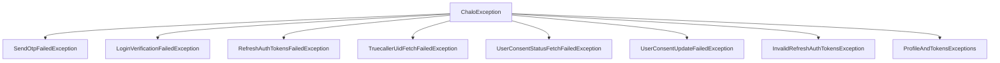
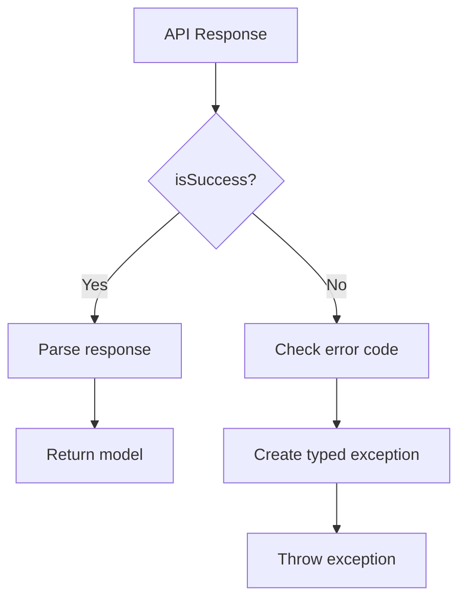
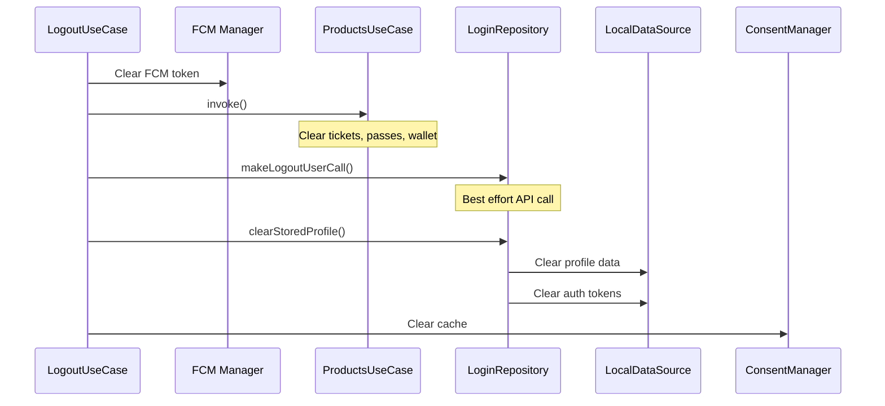
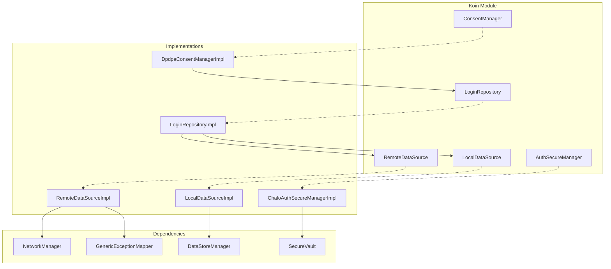

# Authentication — Repository Documentation

## Data Layer Overview

The data layer handles authentication API calls and secure token/profile storage. It follows the **Repository Pattern** with separate remote and local data sources, plus dedicated managers for consent caching and secure storage.

---

## Repository Operations

| Operation | Description | Data Flow |
|-----------|-------------|-----------|
| **sendOtpForPhoneAuth** | Request OTP for phone login | Remote → Return |
| **verifyLoginSuccessOnServerAndGetTokens** | Verify OTP/Truecaller | Remote → Transform → Return |
| **storeTokensPostLogin** | Persist tokens securely | Transform → Local |
| **storeUserProfileDetails** | Persist user profile | Transform → Local |
| **generateUidForTruecaller** | Get UID for Truecaller SDK | Remote → Return |
| **refreshAuthTokens** | Refresh expired access token | Remote → Return |
| **makeLogoutUserCall** | Server-side logout | Remote |
| **fetchUserConsentStatus** | Get DPDPA consent status | Remote → Return |
| **updateUserConsentStatus** | Update DPDPA consent | Remote → Return |
| **getUserId** | Get stored user ID | Local → Return |
| **getAccessToken** | Get stored access token | Local → Return |
| **getRefreshToken** | Get stored refresh token | Local → Return |
| **getAccessTokenExpiry** | Get token expiry time | Local → Return |

---

## API Endpoints

### Send OTP

Requests OTP for phone number authentication.

| Property | Value |
|----------|-------|
| **Endpoint** | `auth/v1/otp/send` |
| **Method** | POST |
| **Auth** | Not required |
| **Content-Type** | application/json |

**Request Body:**

| Field | Type | Required | Description |
|-------|------|----------|-------------|
| **phoneNumber** | String | Yes | Phone number without country code |
| **countryCode** | String | Yes | Country code without + |
| **templateId** | String | Yes | OTP template identifier |
| **refNo** | String | No | Previous refNo for resend |

**Response:**

| Field | Type | Description |
|-------|------|-------------|
| **status** | Boolean | OTP sent successfully |
| **refNo** | String | Reference for verification |
| **message** | String? | Error message if failed |

---

### Verify Login (OTP/Truecaller)

Verifies OTP or Truecaller credentials and returns tokens.

| Property | Value |
|----------|-------|
| **Endpoint** | `auth/v1/login` |
| **Method** | POST |
| **Auth** | Not required |
| **Content-Type** | application/json |

**Request Body (OTP):**

| Field | Type | Description |
|-------|------|-------------|
| **loginMode** | String | "PHONE_AUTH" |
| **phoneNumber** | String | Phone number |
| **countryCode** | String | Country code |
| **otp** | String | 6-digit OTP |
| **refNo** | String | Reference from send OTP |
| **deviceId** | String | Device identifier |
| **refreshToken** | Boolean | Request refresh token |

**Request Body (Truecaller):**

| Field | Type | Description |
|-------|------|-------------|
| **loginMode** | String | "TRUECALLER" |
| **payload** | String | Truecaller signed payload |
| **signature** | String | Digital signature |
| **signatureAlgorithm** | String | Algorithm (SHA256withRSA) |
| **uid** | String | Generated UID |
| **phoneNumber** | String | Phone from Truecaller |
| **countryCode** | String | Country code |
| **firstName** | String | First name |
| **lastName** | String | Last name |
| **emailId** | String | Email address |
| **deviceId** | String | Device identifier |

**Response:**

| Field | Type | Description |
|-------|------|-------------|
| **accessToken** | String | JWT access token |
| **refreshToken** | String | Refresh token |
| **profile** | Object | User profile data |

**Profile Object:**

| Field | Type | Description |
|-------|------|-------------|
| **userId** | String | User identifier |
| **firstName** | String | First name |
| **lastName** | String | Last name |
| **mobileNumber** | String | Phone number |
| **countryCode** | String | Country code |
| **emailId** | String | Email address |
| **profilePhoto** | String? | Photo URL |
| **gender** | String? | Gender string |
| **dateOfBirth** | Long? | DOB in milliseconds |

---

### Refresh Tokens

Refreshes expired access token.

| Property | Value |
|----------|-------|
| **Endpoint** | `auth/v1/token/refresh` |
| **Method** | POST |
| **Auth** | Refresh token in header |
| **Content-Type** | application/json |

**Request Body:**

| Field | Type | Description |
|-------|------|-------------|
| **userId** | String | User identifier |
| **deviceId** | String | Device identifier |
| **refreshToken** | String | Current refresh token |

**Response:**

| Field | Type | Description |
|-------|------|-------------|
| **accessToken** | String | New JWT access token |
| **refreshToken** | String | New refresh token |

---

### Generate Truecaller UID

Generates unique identifier for Truecaller SDK.

| Property | Value |
|----------|-------|
| **Endpoint** | `auth/v1/truecaller/uid` |
| **Method** | GET |
| **Auth** | Not required |

**Response:**

| Field | Type | Description |
|-------|------|-------------|
| **uid** | String | Unique identifier |

---

### Logout

Server-side logout to invalidate tokens.

| Property | Value |
|----------|-------|
| **Endpoint** | `auth/v1/logout` |
| **Method** | POST |
| **Auth** | Required (Access token) |
| **Content-Type** | application/json |

**Request Body:**

| Field | Type | Description |
|-------|------|-------------|
| **userId** | String | User identifier |
| **deviceId** | String | Device identifier |

**Response:**

| Field | Type | Description |
|-------|------|-------------|
| **success** | Boolean | Logout successful |

---

### Fetch User Consent Status

Retrieves DPDPA consent status for user.

| Property | Value |
|----------|-------|
| **Endpoint** | `user/v1/consent/{userId}` |
| **Method** | GET |
| **Auth** | Required |

**Response:**

| Field | Type | Description |
|-------|------|-------------|
| **userId** | String | User identifier |
| **policyVersion** | Int? | Current policy version |
| **tncUrl** | String | Terms and conditions URL |
| **consents** | List | Consent items |

**Consent Item:**

| Field | Type | Description |
|-------|------|-------------|
| **id** | String | Consent identifier |
| **status** | String | GRANTED, DENIED, NOT_REQUESTED |

---

### Update User Consent

Updates DPDPA consent status.

| Property | Value |
|----------|-------|
| **Endpoint** | `user/v1/consent` |
| **Method** | PUT |
| **Auth** | Required |
| **Content-Type** | application/json |

**Request Body:**

| Field | Type | Description |
|-------|------|-------------|
| **userId** | String | User identifier |
| **consents** | List | Updated consent items |

**Consent Item:**

| Field | Type | Description |
|-------|------|-------------|
| **id** | String | Consent identifier |
| **status** | String | GRANTED or DENIED |

**Response:** Same as fetch consent status

---

## Data Flow

### OTP Login Flow

### Token Refresh Flow

---

## Data Transformations

### Login Mode to API Request

**Phone Auth:**

| App Model | API Field | Transformation |
|-----------|-----------|----------------|
| phoneNumber | phoneNumber | Direct |
| countryCode | countryCode | Remove + prefix |
| otp | otp | Direct |
| refNo | refNo | Direct |

**Truecaller:**

| App Model | API Field | Transformation |
|-----------|-----------|----------------|
| payload | payload | Direct |
| signature | signature | Direct |
| signatureAlgorithm | signatureAlgorithm | Direct |
| uid | uid | Direct |
| phoneNumber | phoneNumber | Direct |
| countryCode | countryCode | Remove + prefix |
| firstName | firstName | Direct |
| lastName | lastName | Direct |
| emailId | emailId | Direct |

### API Response to App Model

**Profile:**

| API Field | App Field | Transformation |
|-----------|-----------|----------------|
| userId | userId | Direct |
| firstName | firstName | Null coalesce to "" |
| lastName | lastName | Null coalesce to "" |
| mobileNumber | mobileNumber | Direct |
| countryCode | countryCode | Direct |
| emailId | emailId | Null coalesce to "" |
| profilePhoto | profilePhoto | Null coalesce to "" |
| gender | gender | Parse via Gender.fromString() |
| dateOfBirth | dobInMillis | Direct |

### App Model to Local Model

| App Field | Local Field | Transformation |
|-----------|-------------|----------------|
| userId | userId | Direct |
| firstName | firstName | Direct |
| lastName | lastName | Direct |
| mobileNumber | mobileNumber | Direct |
| countryCode | countryCallingCode | Direct |
| emailId | mailId | Direct |
| profilePhoto | profilePhoto | Direct |
| gender | gender | Gender.value string |
| dobInMillis | dobInMillis | Direct |
| dobInMillis | dateOfBirth | Format to string |

---

## Local Storage

### Storage Mechanism

Authentication data is stored using encrypted DataStore wrapped by specialized managers.

### Token Storage

Tokens are stored securely via `ChaloAuthSecureManager`:

| Data | Storage | Encryption |
|------|---------|------------|
| **Access Token** | Encrypted Preferences | AES-256 |
| **Refresh Token** | Encrypted Preferences | AES-256 |
| **Token Expiry** | Encrypted Preferences | AES-256 |
| **Token Delta** | Encrypted Preferences | AES-256 |

### Profile Storage

User profile stored via `LoginLocalDataSource`:

| Data | Storage |
|------|---------|
| **User ID** | DataStore |
| **First Name** | DataStore |
| **Last Name** | DataStore |
| **Phone Number** | DataStore |
| **Email** | DataStore |
| **Profile Photo URL** | DataStore |
| **Gender** | DataStore |
| **DOB** | DataStore |

### Login State Flags

| Key | Type | Description |
|-----|------|-------------|
| **isUserLoginFirstTime** | Boolean | First-time login flag |
| **shouldRequestConsentAfterSplashScreen** | Boolean | Pending consent flag |
| **firstConsentRequestedAt_{userId}** | Long | Timestamp of first consent request |

### Reactive Access

Login state is exposed as reactive flows:

---

## DPDPA Consent Manager

### Caching Strategy

The consent manager implements session-based caching with thread safety:

### Cache Properties

| Property | Value | Purpose |
|----------|-------|---------|
| **Scope** | Per user session | Invalidates on logout/user change |
| **Thread Safety** | Mutex-protected | Prevents race conditions |
| **Force Refresh** | Supported | Clears cache and fetches fresh |

### Cache Status

| Status | Meaning |
|--------|---------|
| **NOT_CACHED_IN_MEMORY** | No cached data |
| **EXPIRED** | Cache has expired |
| **VALID** | Cache is usable |

---

## Exception Handling

### Exception Hierarchy

### Exception Details

| Exception | Cause | Contains |
|-----------|-------|----------|
| **SendOtpFailedException** | OTP API error | Error code, message |
| **LoginVerificationFailedException** | Login API error | Error code, message |
| **RefreshAuthTokensFailedException** | Refresh API error | Error code, message |
| **TruecallerUidFetchFailedException** | UID API error | Error code |
| **UserConsentStatusFetchFailedException** | Consent fetch error | Error code |
| **UserConsentUpdateFailedException** | Consent update error | Error code |
| **InvalidRefreshAuthTokensException** | Invalid tokens in response | — |
| **ProfileAndTokensExceptions** | Invalid profile/tokens | Specific sub-type |

### Error Response Mapping

### Server Error Codes

| Code | Meaning | Exception |
|------|---------|-----------|
| 1001 | Invalid OTP | LoginVerificationFailedException |
| 1002 | OTP expired | SendOtpFailedException (PREVIOUS_OTP_EXPIRED) |
| 1003 | Too many attempts | SendOtpFailedException |
| 2001 | Invalid refresh token | RefreshAuthTokensFailedException |
| 2002 | Refresh token expired | RefreshAuthTokensFailedException |
| 3001 | User not found | LoginVerificationFailedException |

---

## Logout Cleanup

### Data Cleared on Logout

| Data | Method | Order |
|------|--------|-------|
| FCM Token | FCM feature | 1 |
| Products (wallet, tickets) | ClearProductStoresUseCase | 2 |
| User profile | clearStoredUserProfileAndAuthTokensDetails() | 3 |
| Auth tokens | Same as above | 3 |
| Consent cache | DpdpaConsentManager.clear() | 4 |

### Cleanup Sequence

---

## Dependency Injection

### Koin Bindings

| Interface | Implementation | Scope |
|-----------|----------------|-------|
| LoginRepository | LoginRepositoryImpl | Factory |
| LoginRemoteDataSource | LoginRemoteDataSourceImpl | Factory |
| LoginLocalDataSource | LoginLocalDataSourceImpl | Factory |
| ChaloAuthSecureManager | ChaloAuthSecureManagerImpl | Singleton |
| DpdpaConsentManager | DpdpaConsentManagerImpl | Singleton |
| UserProfileDetailsProvider | UserProfileDetailsProviderImpl | Singleton (createdAtStart) |

### Dependency Graph

---

## Security

### Data Protection

| Aspect | Implementation |
|--------|----------------|
| **Token Storage** | Encrypted via Android Keystore / iOS Keychain |
| **Profile Storage** | Encrypted DataStore |
| **Transport** | HTTPS only with certificate pinning |
| **JWT Parsing** | Decode-only (no signature verification on client) |
| **Truecaller** | Server verifies signature |

### Token Security

| Token | Storage | Lifetime | Refresh |
|-------|---------|----------|---------|
| **Access Token** | Encrypted preferences | Short (15-30 min) | Via refresh token |
| **Refresh Token** | Encrypted preferences | Long (30 days) | Via re-login |

### Secure Headers

All authenticated API calls include:

| Header | Purpose |
|--------|---------|
| **Authorization** | Bearer {accessToken} |
| **X-Device-Id** | Device identifier |
| **X-App-Version** | App version |
| **X-Platform** | Android/iOS |

---

## Platform Implementations

### Android

| Component | Implementation |
|-----------|----------------|
| **Secure Storage** | Android Keystore + EncryptedSharedPreferences |
| **DataStore** | Jetpack DataStore |
| **Network** | Ktor with OkHttp engine |
| **SMS Retriever** | Google Play Services SmsRetriever |
| **Truecaller** | Truecaller Android SDK |

### iOS

| Component | Implementation |
|-----------|----------------|
| **Secure Storage** | iOS Keychain |
| **DataStore** | NSUserDefaults with encryption |
| **Network** | Ktor with Darwin engine |
| **SMS Retriever** | Not available (manual entry) |
| **Truecaller** | Limited/no support |

---

## Error Handling Summary

| Scenario | Exception | User Impact |
|----------|-----------|-------------|
| Network failure | Various | "Check connection" |
| OTP send failed | SendOtpFailedException | "Could not send OTP" |
| Invalid OTP | LoginVerificationFailedException | "Invalid OTP" |
| Token refresh failed | RefreshAuthTokensFailedException | Force re-login |
| Consent fetch failed | UserConsentStatusFetchFailedException | Full-screen error |
| Storage failure | ChaloLocalException | Retry or re-login |
