# Authentication — UseCase Documentation

## Domain Layer Overview

The domain layer orchestrates authentication flows including OTP request/verification, Truecaller login, token management, and DPDPA consent handling. Use cases validate inputs, coordinate repository operations, and map errors to user-friendly results.

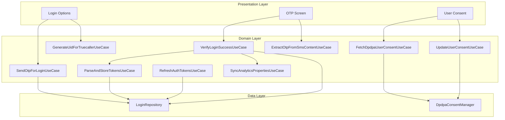

---

## Use Case Inventory

| Use Case | Purpose | Called From |
|----------|---------|-------------|
| **SendOtpForLogin** | Request OTP via phone number | Login Options |
| **VerifyLoginSuccessOnServerAndHandleTokens** | Verify OTP/Truecaller and store tokens | OTP Screen, Login Options |
| **ParseAndStoreTokens** | Parse JWT and persist tokens | Verify Login UseCase |
| **RefreshAuthTokensForUser** | Refresh expired access token | Network interceptor |
| **GenerateUidForTruecallerLogin** | Get UID for Truecaller SDK | Login Options |
| **FetchDpdpaUserConsent** | Get current consent status | User Consent Screen |
| **UpdateUserConsent** | Update consent status | User Consent Screen |
| **ExtractOtpFromSmsContent** | Parse OTP from SMS message | OTP Screen |
| **SyncAndUpdateAnalyticsPropertiesAfterLogin** | Post-login analytics sync | Verify Login UseCase |

---

## Send OTP for Login

**Responsibility:** Validates phone number and requests OTP from server, returning a reference number for verification.

### Request Flow

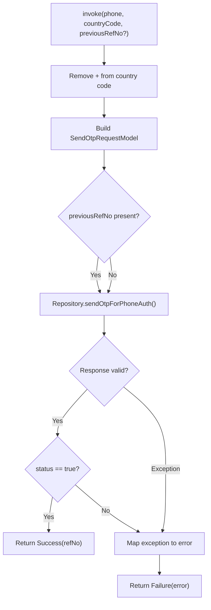

### Input Parameters

| Parameter | Type | Required | Description |
|-----------|------|----------|-------------|
| **phoneNumber** | String | Yes | User's phone number |
| **countryCode** | String | Yes | Country code (with or without +) |
| **previousRefNoToResendOtp** | String? | No | Reference number for resend |

### Result Types

| Result | Meaning | Trigger |
|--------|---------|---------|
| **Success(refNo)** | OTP sent, use refNo for verify | API returned status=true |
| **OTP_STATUS_FALSE** | Server rejected request | status=false in response |
| **INVALID_REF_NO** | Reference number missing | refNo null in response |
| **PREVIOUS_OTP_EXPIRED** | Previous OTP no longer valid | Server error code |
| **PARSE_EXCEPTION** | Response parsing failed | JSON error |
| **SERVER_ERROR** | Server returned error | HTTP error |
| **UNKNOWN_ERROR** | Unexpected failure | Exception caught |

### Error Mapping

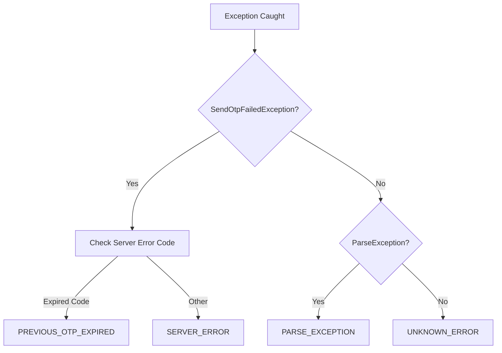

---

## Verify Login Success and Handle Tokens

**Responsibility:** Verifies OTP or Truecaller credentials with server, parses and stores authentication tokens, and persists user profile.

### Verification Flow

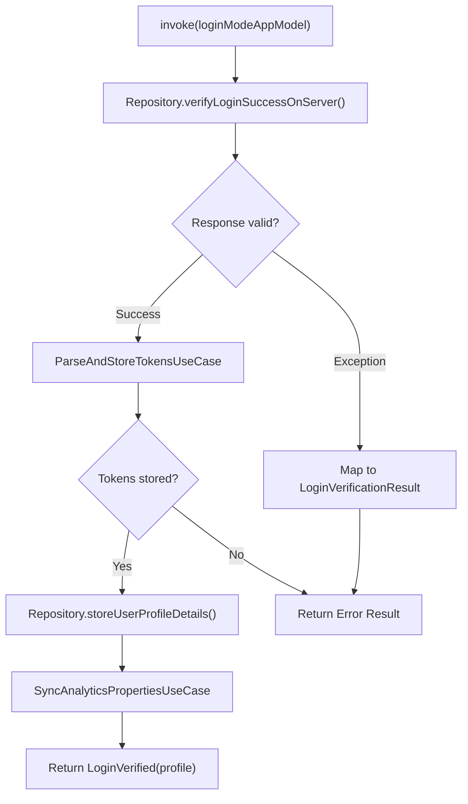

### Input: Login Mode

The use case accepts either OTP or Truecaller credentials:

**Phone Auth Login:**

| Field | Type | Description |
|-------|------|-------------|
| **phoneNumber** | String | User's phone number |
| **countryCode** | String | Country code |
| **otp** | String | 6-digit OTP |
| **refNo** | String | Reference from SendOtp |

**Truecaller Login:**

| Field | Type | Description |
|-------|------|-------------|
| **payload** | String | Signed profile data |
| **signature** | String | Digital signature |
| **signatureAlgorithm** | String | Algorithm used (SHA256withRSA) |
| **uid** | String | Generated UID |
| **phoneNumber, countryCode** | String | Phone details |
| **firstName, lastName, emailId** | String | Profile from Truecaller |

### Result Types

| Result | Meaning | Contains |
|--------|---------|----------|
| **LoginVerified** | Authentication successful | UserProfileAppModel |
| **InvalidOtpEntered** | OTP incorrect | — |
| **InvalidProfileReceived** | Profile data invalid | — |
| **InvalidTokensReceived** | Tokens missing/invalid | — |
| **ParseError** | Response parsing failed | — |
| **UnknownError** | Server error | Error message |
| **LocalError** | Local storage failed | Error message |
| **TokenProcessingError** | JWT parsing failed | — |

### Error Mapping

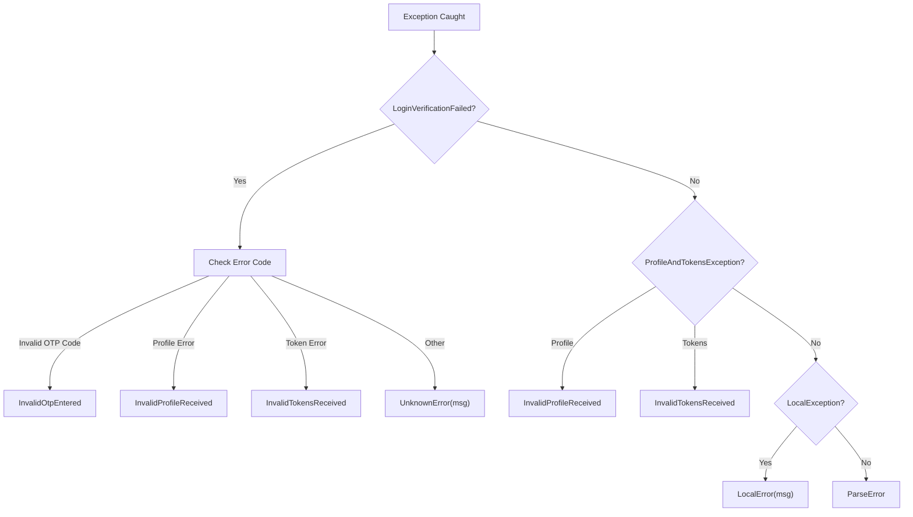

---

## Parse and Store Tokens

**Responsibility:** Decodes JWT access token to extract expiry, calculates time delta, and persists tokens securely.

### Token Processing Flow

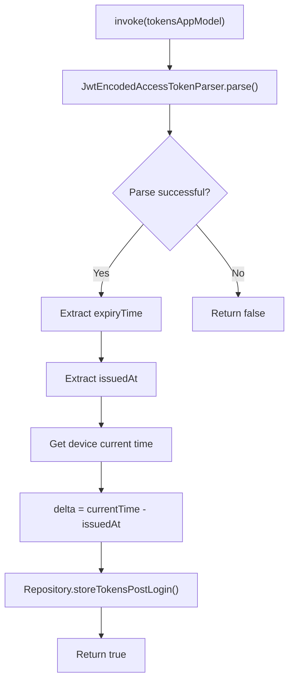

### JWT Parsing

| JWT Claim | Purpose | Usage |
|-----------|---------|-------|
| **exp** | Expiration timestamp | Token validity check |
| **iat** | Issued at timestamp | Calculate clock delta |

### Time Delta Calculation

The delta accounts for clock differences between server and device:

```
delta = deviceCurrentTime - tokenIssuedAt
adjustedExpiry = tokenExpiry - delta
```

This ensures token expiry checks work correctly regardless of device clock accuracy.

### Stored Token Data

| Field | Description |
|-------|-------------|
| **accessToken** | JWT access token string |
| **refreshToken** | Refresh token string |
| **expiryTime** | Adjusted expiry timestamp |
| **delta** | Clock difference value |

---

## Refresh Auth Tokens

**Responsibility:** Refreshes expired access token using refresh token, called by network interceptor when token expires.

### Refresh Flow

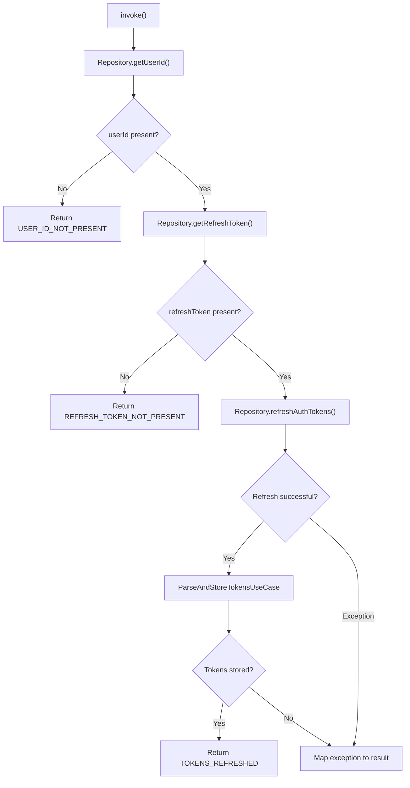

### Result Types

| Result | Meaning | Recovery Action |
|--------|---------|-----------------|
| **TOKENS_REFRESHED** | New tokens stored | Retry original request |
| **USER_ID_NOT_PRESENT** | No logged-in user | Force re-login |
| **REFRESH_TOKEN_NOT_PRESENT** | Refresh token missing | Force re-login |
| **SERVER_ERROR** | Refresh API failed | Retry or re-login |
| **INVALID_TOKENS_RECEIVED** | New tokens invalid | Force re-login |
| **REFRESH_CALL_UNAUTHORIZED** | Refresh token expired | Force re-login |
| **RESPONSE_PARSE_EXCEPTION** | Response parsing failed | Force re-login |
| **TOKENS_PARSE_EXCEPTION** | JWT parsing failed | Force re-login |
| **UNKNOWN_LOCAL_ERROR** | Local storage error | Retry |

---

## Generate UID for Truecaller Login

**Responsibility:** Requests unique identifier from server required by Truecaller SDK for verification.

### UID Generation Flow

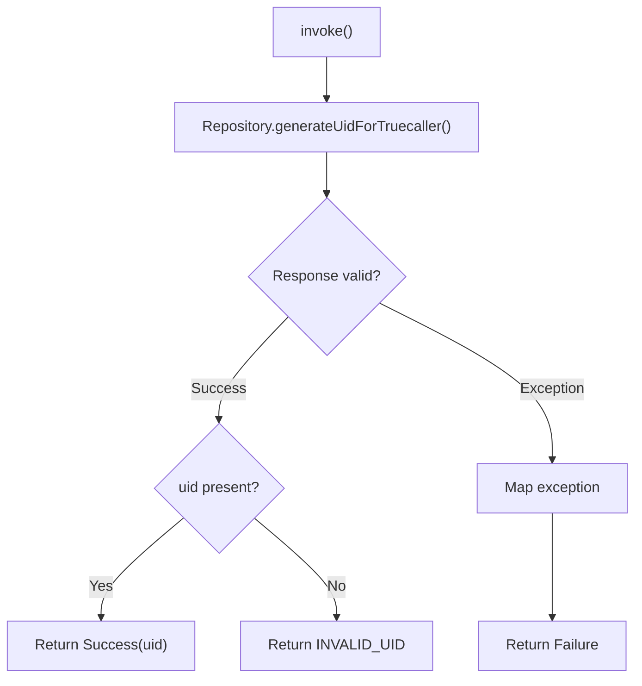

### Result Types

| Result | Meaning |
|--------|---------|
| **Success(uid)** | UID generated successfully |
| **INVALID_UID** | Server returned empty UID |
| **SERVER_ERROR** | API call failed |
| **UNKNOWN_ERROR** | Unexpected exception |

---

## Fetch DPDPA User Consent

**Responsibility:** Retrieves current consent status for user, including terms URL and consent items.

### Fetch Flow

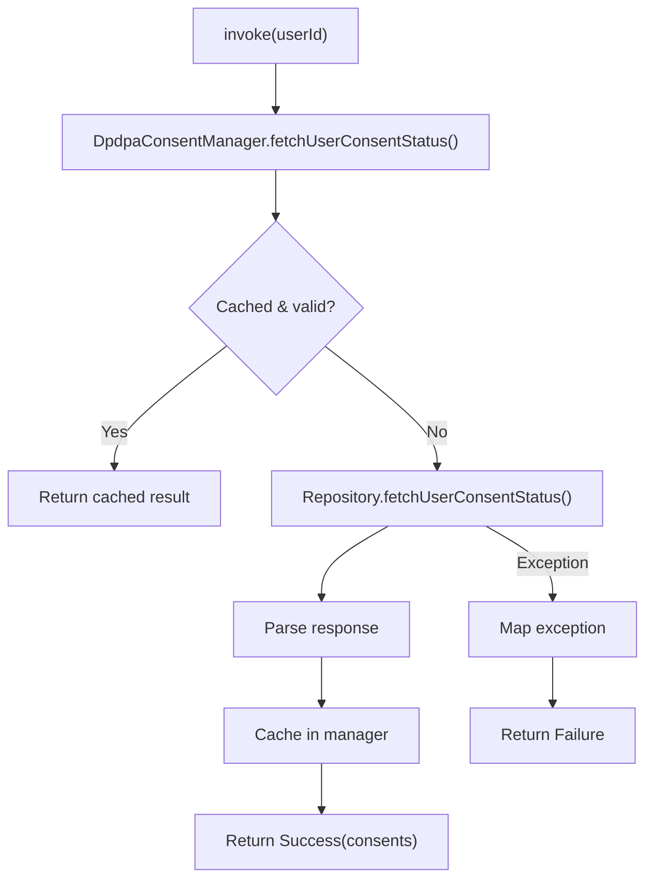

### Output: Consent Info

| Field | Type | Description |
|-------|------|-------------|
| **userId** | String | User identifier |
| **policyVersion** | Int? | Current policy version |
| **tncUrl** | String | Terms URL for WebView |
| **consents** | List | Individual consent items |

### Consent Item

| Field | Type | Values |
|-------|------|--------|
| **id** | String | "marketing", "analytics", etc. |
| **status** | Enum | GRANTED, DENIED, NOT_REQUESTED, UNKNOWN |

### Error Reasons

| Reason | Cause |
|--------|-------|
| **SERVER_ERROR** | API call failed |
| **LOCAL_ERROR** | Cache/storage failed |
| **INVALID_RESPONSE** | Response missing fields |
| **UNKNOWN_ERROR** | Unexpected exception |

---

## Update User Consent

**Responsibility:** Updates consent status on server after user accepts, denies, or skips.

### Update Flow

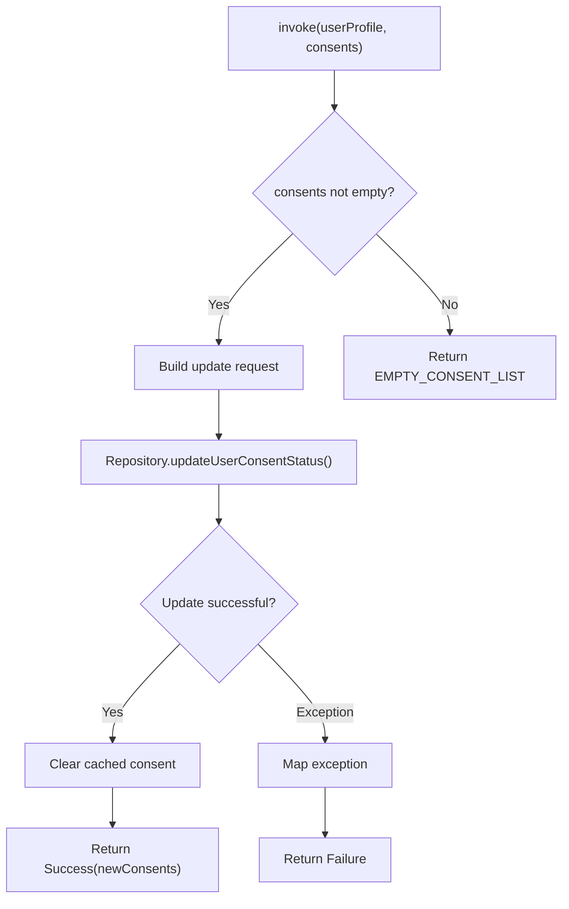

### Input Parameters

| Parameter | Type | Description |
|-----------|------|-------------|
| **userProfile** | UserProfileAppModel | Current user info |
| **consents** | List<DpdpaConsentInfoAppModel> | Updated consent statuses |

### Error Reasons

| Reason | Cause |
|--------|-------|
| **UPDATE_FAILED_ON_SERVER** | API rejected update |
| **LOCAL_ERROR** | Cache invalidation failed |
| **INVALID_RESPONSE** | Response parsing failed |
| **EMPTY_CONSENT_LIST** | No consents provided |
| **UNKNOWN_ERROR** | Unexpected exception |

---

## Extract OTP from SMS Content

**Responsibility:** Parses incoming SMS message to extract 6-digit OTP code.

### Extraction Flow

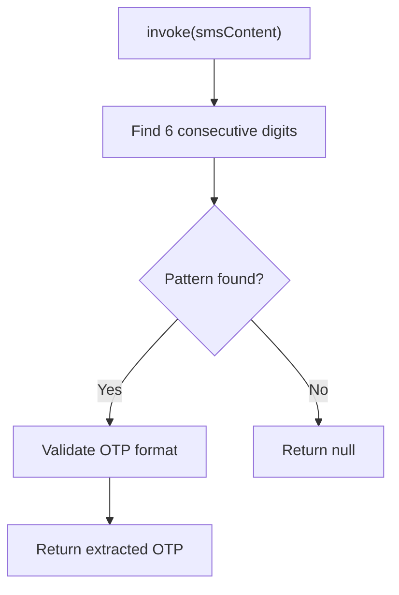

### Pattern Matching

| Rule | Description |
|------|-------------|
| **Length** | Exactly 6 digits |
| **Position** | First 6-digit sequence in message |
| **Validation** | All characters are digits |

---

## Sync Analytics Properties After Login

**Responsibility:** Orchestrates post-login setup including FCM registration, analytics sync, and product initialization.

### Sync Flow

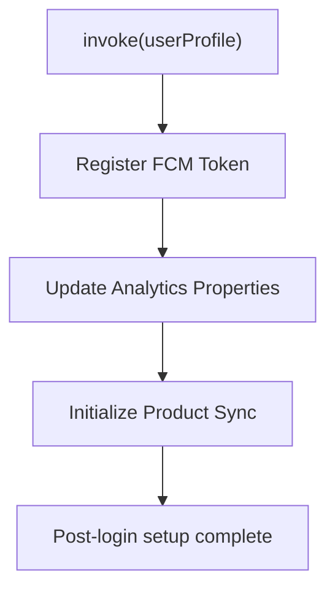

### Operations

| Step | Operation | Purpose |
|------|-----------|---------|
| 1 | Register FCM token | Enable push notifications |
| 2 | Update analytics properties | Set user ID, traits |
| 3 | Initialize product sync | Trigger wallet, tickets sync |

---

## Domain Models

### User Profile App Model

| Field | Type | Description |
|-------|------|-------------|
| **userId** | String | Unique user identifier |
| **firstName** | String | First name |
| **lastName** | String | Last name |
| **mobileNumber** | String | Phone number |
| **countryCode** | String | Country code |
| **emailId** | String | Email address |
| **profilePhoto** | String | Photo URL |
| **gender** | Gender? | MALE, FEMALE, OTHER |
| **dobInMillis** | Long? | Date of birth (epoch ms) |

### Post Login Tokens App Model

| Field | Type | Description |
|-------|------|-------------|
| **accessToken** | String | JWT access token |
| **refreshToken** | String | Refresh token |

### DPDPA Consent Status

| Value | Meaning |
|-------|---------|
| **GRANTED** | User accepted consent |
| **DENIED** | User rejected consent |
| **NOT_REQUESTED** | Not yet asked |
| **UNKNOWN** | Status unclear |

---

## Business Rules

| Rule | Description | Enforced By |
|------|-------------|-------------|
| **OTP length** | Must be exactly 6 digits | ExtractOtp UseCase |
| **Reference number required** | OTP verify needs refNo from send | VerifyLogin UseCase |
| **Token expiry adjustment** | Account for clock delta | ParseAndStore UseCase |
| **Consent caching** | Cache per user session | DpdpaConsentManager |
| **Refresh token priority** | Refresh before forcing re-login | RefreshTokens UseCase |
| **Truecaller UID required** | Must have UID before showing SDK | Login Options Component |

---

## Sequence Diagrams

### Complete OTP Login Sequence

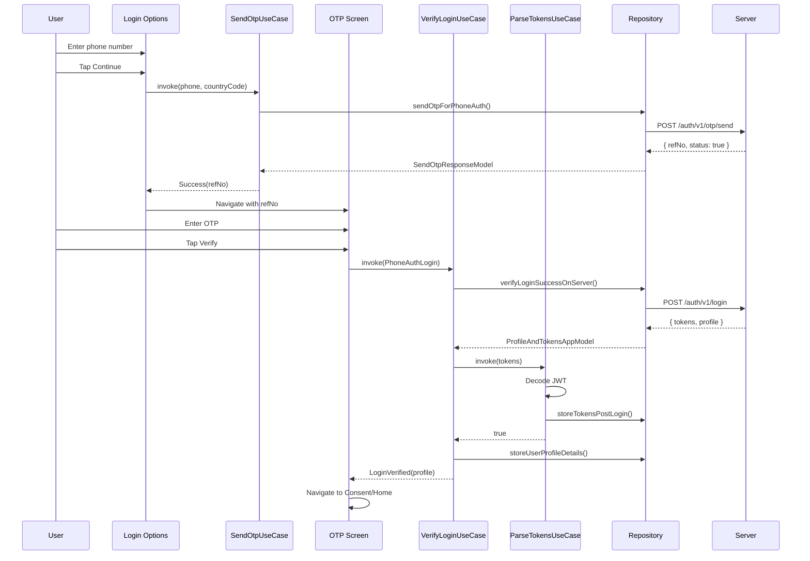

### Token Refresh Sequence

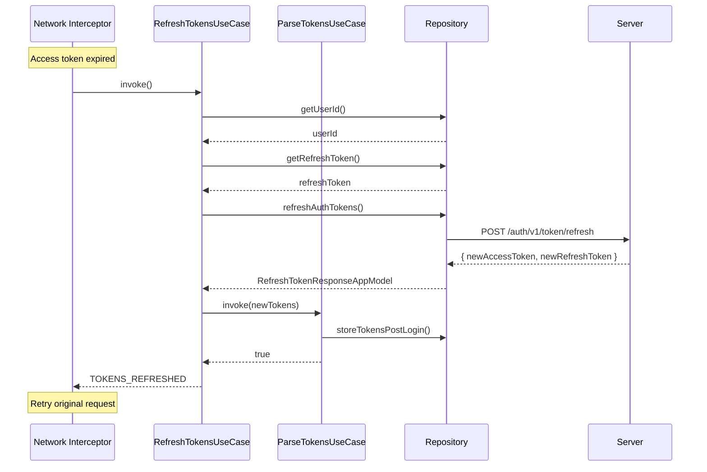

---

## Error Handling

### OTP Errors

| Code | Error | User Message |
|------|-------|--------------|
| 100 | OTP_STATUS_FALSE | "Could not send OTP" |
| 101 | INVALID_REF_NO | "Please try again" |
| 102 | PREVIOUS_OTP_EXPIRED | "OTP expired, please resend" |
| 103 | PARSE_EXCEPTION | "Something went wrong" |
| 104 | SERVER_ERROR | Server error message |

### Login Verification Errors

| Code | Error | User Message |
|------|-------|--------------|
| 105 | InvalidOtpEntered | "Invalid OTP, please try again" |
| 106 | InvalidProfileReceived | "Could not complete login" |
| 107 | InvalidTokensReceived | "Could not complete login" |
| 108 | ParseError | "Something went wrong" |
| 109 | TokenProcessingError | "Please try again" |
| 110 | LocalError | "Could not save login" |
| 111 | UnknownError | Server error message |

### Token Refresh Errors

| Code | Error | Recovery |
|------|-------|----------|
| 112 | USER_ID_NOT_PRESENT | Force re-login |
| 113 | REFRESH_TOKEN_NOT_PRESENT | Force re-login |
| 114 | REFRESH_CALL_UNAUTHORIZED | Force re-login |
| 115 | INVALID_TOKENS_RECEIVED | Force re-login |
