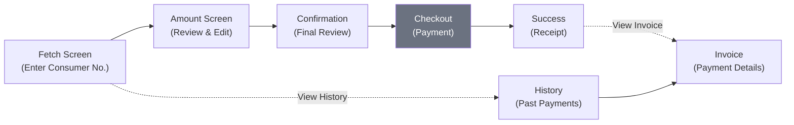
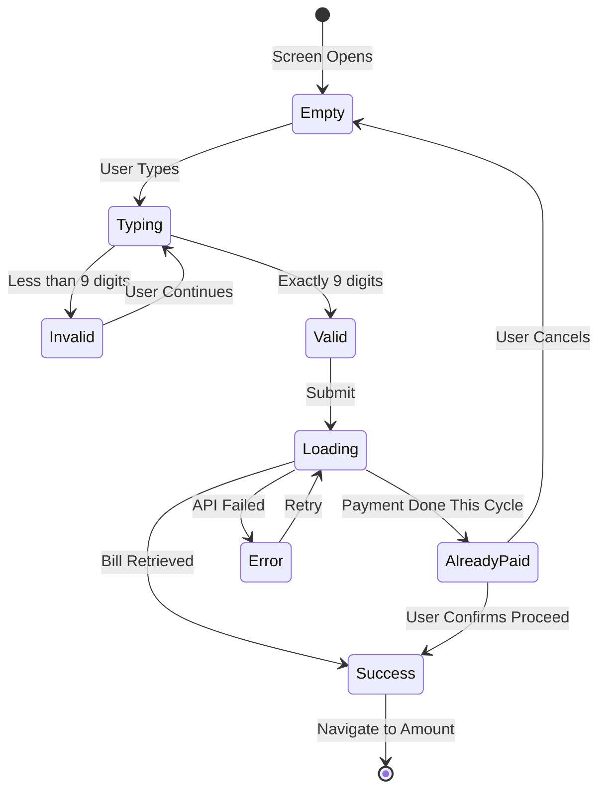
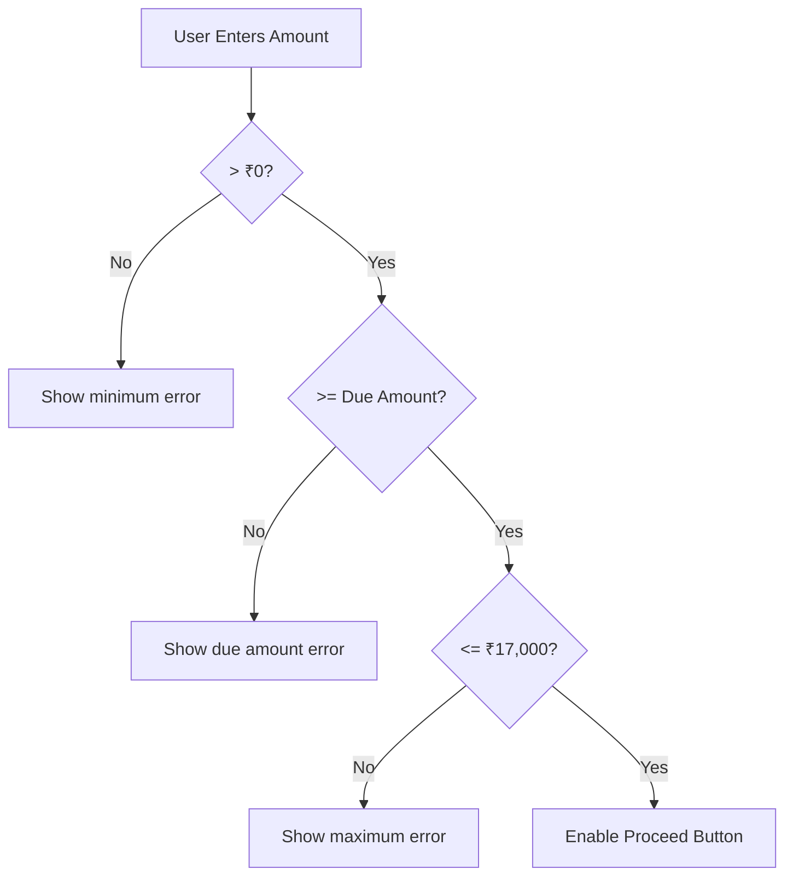
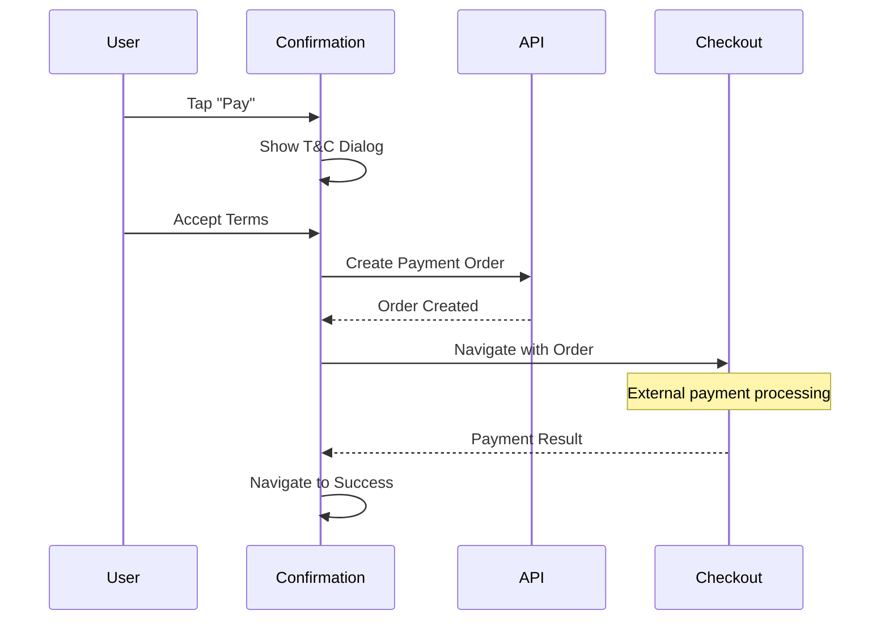

# Bills — Component Documentation

## Architecture Overview

The Bills feature follows the **Decompose + MVI** pattern used throughout the Chalo app. Each screen is managed by a Component that:

- Receives user actions as **Intents**
- Maintains internal **DataState**
- Transforms state into **ViewState** for the UI
- Emits **SideEffects** for one-time events like navigation

This pattern ensures unidirectional data flow and makes state changes predictable and testable.

---

## Screen Inventory

The feature consists of six screens that guide users through the bill payment journey:

| Screen | Purpose | Entry From | Exits To |
|--------|---------|------------|----------|
| **Fetch** | Consumer number entry and bill lookup | Home, Profile, Deep link | Amount, History |
| **Amount** | Display bill details, allow amount editing | Fetch | Confirmation |
| **Confirmation** | Final review before payment | Amount | Checkout (external module) |
| **Success** | Payment confirmation and receipt | Checkout | Home, Invoice |
| **History** | List of past bill payments | Fetch | Invoice |
| **Invoice** | Detailed receipt for a payment | Success, History | Back |

---

## Screen Details

### Fetch Screen

**Purpose:** Entry point where users enter their 9-digit BEST consumer number to retrieve bill details.

**User Journey:**
1. User enters consumer number in text field
2. Input is validated in real-time (must be exactly 9 digits)
3. "Next" button enables when input is valid
4. On submit, bill details are fetched from BEST API
5. If bill was already paid this cycle, a confirmation dialog appears
6. User proceeds to Amount screen with bill data

**State Diagram:**

**Key Behaviors:**
- Real-time validation provides immediate feedback
- Network errors show a snackbar with retry option
- "View Payment History" link allows checking past payments without entering a number

**Analytics Events:**
- Screen opened
- Next button clicked
- History link clicked
- Already-paid dialog shown/dismissed

---

### Amount Screen

**Purpose:** Displays retrieved bill details and allows users to modify the payment amount.

**User Journey:**
1. Screen shows customer name, consumer number, bill date, due date
2. Amount field is pre-filled with the due amount
3. User can edit to pay a different amount
4. Validation ensures amount is within allowed range
5. "Proceed" navigates to confirmation

**Validation Rules:**

| Rule | Constraint | Error Message |
|------|------------|---------------|
| Minimum | Amount must be > ₹0 | "Amount should be more than 0" |
| Due Amount | Amount must be ≥ due bill | "Amount should be more than due amount" |
| Maximum | Amount must be ≤ ₹17,000 | "Amount cannot be greater than Rs 17000" |

---

### Confirmation Screen

**Purpose:** Final review before initiating payment, with terms acceptance.

**User Journey:**
1. Screen displays final payment summary
2. User taps "Pay" button
3. Terms & Conditions dialog appears
4. User accepts terms
5. Payment order is created via API
6. User is navigated to the Checkout module
7. On successful payment, Success screen is shown

**Payment Flow:**

**Key Behaviors:**
- Loading indicator shown during order creation
- Network errors allow retry
- Order ID is passed to the shared Checkout module

---

### Success Screen

**Purpose:** Confirms successful payment and provides receipt access.

**User Journey:**
1. Success animation plays
2. Transaction summary is displayed
3. User can view invoice for full details
4. "OK" returns user to home screen

**Available Actions:**
- **View Invoice** → Navigate to Invoice screen with payment details
- **OK** → Clear navigation stack, return to home

---

### History Screen

**Purpose:** Lists all past electricity bill payments for the user.

**User Journey:**
1. Screen loads payment history from API
2. Payments are sorted by date (newest first)
3. Each item shows date, amount, status, consumer number
4. Tapping an item opens the Invoice screen
5. Empty state shown if no history exists

**List Item Information:**
- Transaction date
- Amount paid (formatted with currency)
- Payment status (Success, Processing, Failed)
- Consumer number

**Error Handling:**
- Network failure shows retry snackbar
- Empty history shows informational message

---

### Invoice Screen

**Purpose:** Displays detailed receipt for a specific payment.

**Content Displayed:**
- Transaction ID
- Payment status badge
- Customer name and consumer number
- Bill date and due date
- Amount paid
- Payment timestamp

---

## Shared UI Patterns

### Bottom Sheets

The feature uses modal bottom sheets for confirmations and results:

| Type | Usage | Dismissible |
|------|-------|-------------|
| T&C Dialog | Terms acceptance before payment | Yes |
| Success | Payment confirmation | No (must tap OK) |
| Error | Failure with retry option | Yes |

### Loading States

- **Full-screen loader:** During API calls (bill fetch, order creation)
- **Button loading:** While processing user action
- **Skeleton:** Not used (data loads quickly)

### Error Handling

All API errors surface via snackbar with retry action, except:
- Consumer not found → Inline error below text field
- Payment failed → Bottom sheet with details

---

## Navigation

### Entry Points

| Source | Deep Link | Args |
|--------|-----------|------|
| Home screen | `chalo://electricitybill` | None |
| Profile section | — | None |
| History item | — | Payment data |

### Scene Arguments

Data is passed between screens as JSON-encoded models:

| Transition | Data Passed |
|------------|-------------|
| Fetch → Amount | Bill details (customer, amounts, dates) |
| Amount → Confirmation | Updated bill with user-entered amount |
| Confirmation → Success | Bill details + order response |
| History → Invoice | Payment history record |

---

## Analytics Events

| Screen | Event | Trigger |
|--------|-------|---------|
| Fetch | `ebill_fetch_screen_opened` | Screen opens |
| Fetch | `ebill_fetch_next_clicked` | Next button tapped |
| Fetch | `ebill_fetch_history_clicked` | History link tapped |
| Fetch | `ebill_already_paid_dialog_shown` | Dialog appears |
| Amount | `ebill_amount_entered` | Amount changed |
| Confirm | `ebill_payment_initiated` | Pay button tapped |
| Success | `ebill_payment_success` | Screen opens |
| History | `ebill_history_viewed` | Screen opens |
