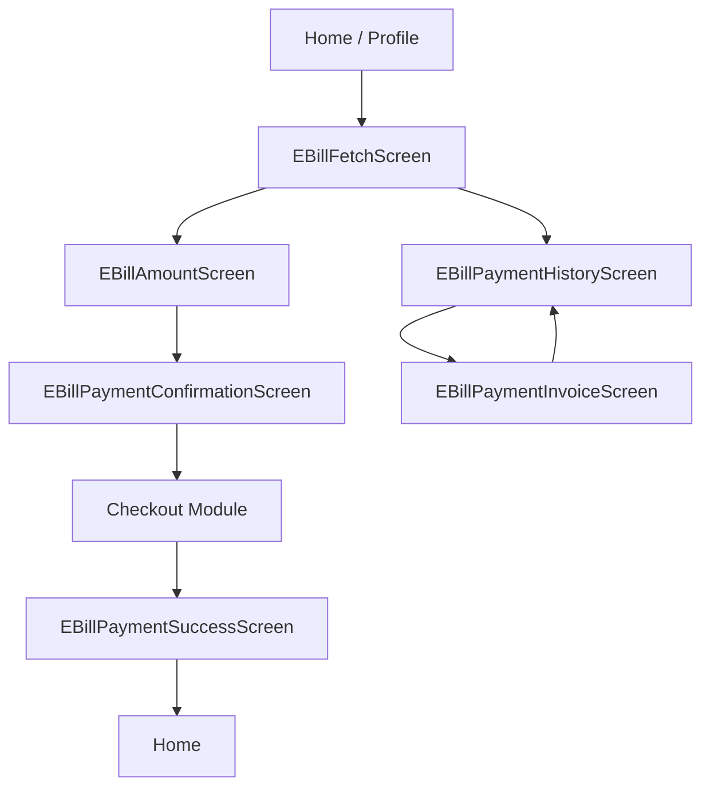

# Bills — Component Documentation


## Architecture Pattern

The Bills feature uses a **Decompose + MVI** architecture:
- **Decompose**: Component-based navigation and lifecycle management
- **MVI**: Model-View-Intent pattern with unidirectional data flow
- **ChaloBaseStateMviComponent**: Base class providing state management

Each screen consists of:
1. **Component** — Business logic, state management, navigation
2. **Contract** — UI state, data state, intents, side effects
3. **Screen** — Compose UI rendering

---

## Screen Components

### EBillFetchScreen

- **File**: `shared/home/src/commonMain/kotlin/app/chalo/electricitybill/ui/ebillfetch/ui/EBillFetchScreen.kt`
- **Component**: `EBillFetchComponent`
- **Contract**: `EBillFetchContract.kt`

#### Purpose
Entry screen where users enter their 9-digit BEST consumer number to fetch bill details.

#### Data State
```kotlin
data class EBillFetchDataState(
    val isLoading: Boolean = false,
    val customerNoError: String? = null,
    val isNextBtnClickable: Boolean = false,
    val currentlyEnteredNumber: String = "",
    val showEBillPaymentDialog: Boolean = false,
    val showEBillFetchSnackBar: Boolean = false,
    val showInternetConnectionSnackBar: Boolean = false,
    val electricityBillAppModel: ElectricityBillAppModel? = null
)
```

#### View State
```kotlin
data class EBillFetchViewState(
    val specs: EBillFetchUISpecs,
    val toolbarUIState: ToolbarUIState,
    val loader: LoadingDialogUIState?,
    val title: ChaloTextUIState,
    val subTitle: ChaloTextUIState,
    val textFieldUIState: TextFieldUIState,
    val errorText: ChaloTextUIState?,
    val proceedButton: ButtonUIState,
    val viewHistoryBtn: ClickableTextUiState,
    val paymentDialogUIState: ConfirmationDialogUiState?,
    val snackbarUIState: SnackbarUIState?
)
```

#### Intents
```kotlin
sealed class EBillFetchIntent {
    data class NumberEnteredIntent(val currentlyEnteredNumber: String)
    data class NextClickIntent(val currentlyEnteredNumber: String)
    object ViewPaymentHistoryIntent
    data class ProceedWithPaymentClickedIntent(val electricityBillAppModel: ElectricityBillAppModel)
    data class RetryBillFetchIntent(val currentlyEnteredNumber: String)
    data class InternetConnectionIntent(val currentNetworkConnectionType: NetworkConnectionType)
    object EBillPaymentDialogPositiveBtnClickedIntent
    object EBillPaymentDialogNegativeBtnClickedIntent
}
```

#### UI Elements
- Title text ("Pay BEST Electricity Bill")
- Subtitle text (instructions)
- Consumer number text field (numeric, 9 digits max)
- Error text (validation/API errors)
- "Next" button (disabled until valid input)
- "View Payment History" link
- Loading dialog (during API call)
- Payment confirmation dialog (if bill already paid)
- Snackbar (network errors, retry option)

#### Analytics Events
- `EBILL_FETCH_SCREEN_OPENED` — Screen opened
- `EBILL_FETCH_SCREEN_NEXT_BTN_CLICKED` — Next button clicked
- `EBILL_FETCH_SCREEN_SHOW_PAYMENT_HISTORY_BTN_CLICKED` — History link clicked
- `EBILL_FETCH_SCREEN_PAYMENT_ALREADY_DONE_DIALOG_SHOWN` — Duplicate payment dialog shown
- `EBILL_FETCH_SCREEN_PAYMENT_ALREADY_DONE_DIALOG_OK_CLICKED` — Proceed anyway
- `EBILL_FETCH_SCREEN_PAYMENT_ALREADY_DONE_DIALOG_CANCEL_CLICKED` — Cancel

---

### EBillAmountScreen

- **File**: `shared/home/src/commonMain/kotlin/app/chalo/electricitybill/ui/ebillamount/ui/EBillAmountScreen.kt`
- **Component**: `EbillAmountComponent`
- **Contract**: `EBillAmountContract.kt`

#### Purpose
Displays fetched bill details and allows users to enter/modify the payment amount.

#### Key Features
- Shows customer info (name, consumer number)
- Displays due amount and due date
- Editable amount field (pre-filled with due amount)
- Amount validation (min: due amount, max: Rs 17,000)
- Proceed to payment button

#### Navigation
- Entry: From `EBillFetchScreen` with `ElectricityBillAppModel`
- Exit: To `EBillPaymentConfirmationScreen`

---

### EBillPaymentConfirmationScreen

- **File**: `shared/home/src/commonMain/kotlin/app/chalo/electricitybill/ui/ebillpayment/ui/EBillPaymentConfirmationScreen.kt`
- **Component**: `EBillPaymentConfirmationComponent`
- **Contract**: `EBillPaymentConfirmationContract.kt`

#### Purpose
Final confirmation before initiating payment. Creates the payment order and transitions to checkout.

#### Key Features
- Summary of payment details
- Customer information display
- Confirm payment button
- Creates order via `EBillCreateOrderUseCase`
- Navigates to shared checkout module

---

### EBillPaymentSuccessScreen

- **File**: `shared/home/src/commonMain/kotlin/app/chalo/electricitybill/ui/ebillpaymentsuccess/ui/EBillPaymentSuccessScreen.kt`
- **Component**: `EBillPaymentSuccessComponent`
- **Contract**: `EBillPaymentSuccessContract.kt`

#### Purpose
Displays payment success confirmation with receipt details.

#### Key Features
- Success message and animation
- Transaction details summary
- Receipt/invoice option
- Done button (returns to home)

---

### EBillPaymentHistoryScreen

- **File**: `shared/home/src/commonMain/kotlin/app/chalo/electricitybill/ui/paymenthistory/ui/EBillPaymentHistoryScreen.kt`
- **Component**: `ElectricityBillPaymentHistoryComponent`
- **Contract**: `ElectricityBillPaymentHistoryContract.kt`

#### Purpose
Lists historical electricity bill payments made by the user.

#### Key Features
- List of past payments
- Each item shows: date, amount, status, consumer number
- Tap item to view invoice details
- Empty state for no history

---

### EBillPaymentInvoiceScreen

- **File**: `shared/home/src/commonMain/kotlin/app/chalo/electricitybill/ui/invoice/ui/EBillPaymentInvoiceScreen.kt`
- **Component**: `EBillPaymentInvoiceComponent`
- **Contract**: `EBillPaymentInvoiceContract.kt`

#### Purpose
Displays detailed invoice/receipt for a specific payment.

#### Key Features
- Full transaction details
- Customer information
- Payment breakdown
- Share/download option

---

## Shared UI Components

### CustomerInfoUI

- **File**: `shared/home/src/commonMain/kotlin/app/chalo/electricitybill/ui/base/CustomerInfoUI.kt`
- **Props**: `CustomerInfoUIState`
- **Used by**: Amount screen, confirmation screen, success screen

Displays customer details (name, consumer number) in a consistent format.

### TransactionInfoView

- **File**: `shared/home/src/commonMain/kotlin/app/chalo/electricitybill/ui/base/TransactionInfoView.kt`
- **Props**: `TransactionInfoUIState`
- **Used by**: Success screen, invoice screen, history items

Displays transaction details (amount, date, status) in a consistent format.

---

## Component Base Class

### ChaloBaseStateMviComponent

All screen components extend this base class:

```kotlin
abstract class ChaloBaseStateMviComponent<
    Intent,
    DataState,
    ViewState,
    SideEffect
>(componentContext: ComponentContext) {

    // Observable states
    val dataState: StateFlow<DataState>
    val viewState: StateFlow<ViewState>
    val sideEffect: Flow<SideEffect>

    // Methods
    abstract fun initialDataState(): DataState
    abstract suspend fun convertToUiState(dataState: DataState): ViewState
    open fun processIntent(intent: Intent)
    fun updateState(transform: (DataState) -> DataState)

    // Lifecycle
    val componentScope: CoroutineScope
    fun repeatOnStarted(block: suspend () -> Unit)
}
```

---

## Navigation Flow

### Screen Graph


### Navigation Manager

Navigation uses `ChaloNavigationManager` with `ChaloNavigationRequest`:

```kotlin
// Navigate to next screen
navigationManager.postNavigationRequest(
    ChaloNavigationRequest.Navigate(
        args = EBillAmountScreenArgs(model.toJson())
    )
)

// Go back
navigationManager.postNavigationRequest(
    ChaloNavigationRequest.Pop
)
```

### Scene Args

Each screen has corresponding args for navigation:

| Screen | Args Class | Data |
|--------|-----------|------|
| Fetch | `EBillFetchScreenArgs` | None (data object) |
| Amount | `EBillAmountScreenArgs` | `model: String` (JSON) |
| Confirmation | `EBillPaymentConfirmationArgs` | `model: String` (JSON) |
| Success | `EBillPaymentSuccessArgs` | `model: String`, `createOrderModel: String` |
| History | `EBillHistoryScreenArgs` | None (data object) |
| Invoice | `EBillPaymentInvoiceScreenArgs` | `paymentInvoice: String` (JSON) |

---

## Dependencies

### Component Dependencies

| Dependency | Purpose |
|------------|---------|
| `ComponentContext` | Decompose lifecycle context |
| `NetworkStateManager` | Network connectivity monitoring |
| `ChaloNavigationManager` | Navigation requests |
| `AnalyticsContract` | Analytics event tracking |
| `StringProvider` | Localized strings |
| Use cases | Business logic execution |

### DI (Koin)

Components are created via factory functions in `AppComponentFactory`:

```kotlin
fun createEBillFetchComponent(
    componentContext: ComponentContext,
    args: EBillFetchScreenArgs
): EBillFetchComponent {
    return EBillFetchComponent(
        componentContext = componentContext,
        args = args,
        networkStateManager = get(),
        eBillFetchUseCase = get(),
        navigationManager = get(),
        analyticsContract = get(),
        stringProvider = get()
    )
}
```

---

## State Management

### Data Flow
1. User interaction triggers **Intent**
2. Component's `processIntent()` handles the intent
3. `updateState()` modifies **DataState**
4. `convertToUiState()` transforms DataState → **ViewState**
5. Screen observes ViewState and recomposes

### Example Flow (Number Entry)
```kotlin
// 1. User types in text field
TextFieldUIState(
    eventHandler = TextFieldEventHandlerHelper.basicWithCharConstraint(
        maxLength = 9,
        valueChange = { processIntent(EBillFetchIntent.NumberEnteredIntent(it)) }
    )
)

// 2. Component processes intent
private fun handleNumberEnteredIntent(intent: NumberEnteredIntent) {
    val isValid = eBillFetchUseCase.isConsumerNoLengthValid(intent.currentlyEnteredNumber)
    updateState {
        it.copy(
            isNextBtnClickable = isValid,
            currentlyEnteredNumber = intent.currentlyEnteredNumber
        )
    }
}

// 3. ViewState updates button enabled state
proceedButton = ButtonUIStateFactory.chaloOrangeButton(
    enabled = dataState.isNextBtnClickable
)
```
