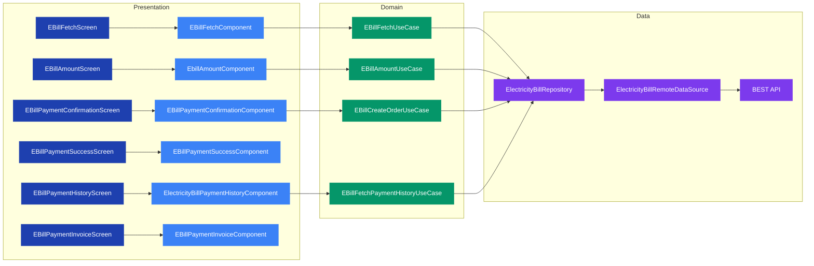

# Bills — High-Level Design

## Overview

The Bills feature enables users to pay their electricity bills (BEST bills) directly through the Chalo app. Users enter their consumer number, fetch their current bill details, review the amount, and proceed to payment. The feature also provides payment history and invoice viewing capabilities.

This is a utility payment feature that extends Chalo's service offering beyond transit, providing convenience for users who already have the app installed for their commute.

## User Journey

1. **Entry Points**:
   - Home screen profile section
   - Quick actions menu
   - Deep link: `chalo://electricitybill`

2. **Core Flow**:
   - Enter 9-digit consumer number
   - Fetch bill from BEST API
   - View bill amount and due date
   - Confirm payment details
   - Complete payment via checkout
   - View payment success/invoice

3. **Exit Points**:
   - Payment success screen → Home
   - Back navigation → Previous screen
   - Payment history → Invoice details

## Architecture Diagram

## Key Components

| Component | Platform | File Path | Responsibility |
|-----------|----------|-----------|----------------|
| EBillFetchScreen | Shared | `shared/home/.../electricitybill/ui/ebillfetch/ui/EBillFetchScreen.kt` | Consumer number entry UI |
| EBillFetchComponent | Shared | `shared/home/.../electricitybill/ui/ebillfetch/EBillFetchComponent.kt` | Manages fetch screen state and intents |
| EBillAmountScreen | Shared | `shared/home/.../electricitybill/ui/ebillamount/ui/EBillAmountScreen.kt` | Displays bill amount details |
| EbillAmountComponent | Shared | `shared/home/.../electricitybill/ui/ebillamount/EbillAmountComponent.kt` | Manages amount screen state |
| EBillPaymentConfirmationScreen | Shared | `shared/home/.../electricitybill/ui/ebillpayment/ui/EBillPaymentConfirmationScreen.kt` | Payment confirmation UI |
| EBillPaymentSuccessScreen | Shared | `shared/home/.../electricitybill/ui/ebillpaymentsuccess/ui/EBillPaymentSuccessScreen.kt` | Success screen with receipt |
| EBillFetchUseCase | Shared | `shared/home/.../electricitybill/domain/EBillFetchUseCase.kt` | Validates and fetches bills |
| ElectricityBillRepository | Shared | `shared/home/.../electricitybill/data/repository/ElectricityBillRepository.kt` | Data access interface |

## Data Flow

### Request Path (Bill Fetch)
1. User enters 9-digit consumer number in `EBillFetchScreen`
2. `EBillFetchComponent` validates input via `EBillFetchUseCase.isConsumerNoLengthValid()`
3. On "Next" click, `EBillFetchUseCase.fetchEBillOnline()` is called
4. UseCase calls `ElectricityBillRepository.fetchElectricityBill()`
5. Repository delegates to `ElectricityBillRemoteDataSource`
6. Remote data source calls BEST API endpoint

### Response Path
1. API returns `FetchElectricityBillResponseApiModel`
2. Data source maps to `ElectricityBillAppModel`
3. Repository returns domain model
4. UseCase wraps in `ChaloUseCaseResult<ElectricityBillAppModel, EBillFetchException>`
5. Component updates `EBillFetchDataState` and `EBillFetchViewState`
6. Screen recomposes with bill details or error state

### Payment Flow
1. User confirms payment amount
2. `EBillCreateOrderUseCase` calls `repository.createElectricityBillPaymentOrder()`
3. Order creation returns `CreateOrderResponseAppModel`
4. App navigates to checkout flow (shared checkout module)
5. On payment success, navigates to `EBillPaymentSuccessScreen`

## Platform Differences

### Android-Specific
- Uses Compose for all UI components
- Navigation handled via Decompose `Component` pattern
- DI via Koin (`ElectricityBillModule.kt`)

### iOS-Specific
- Uses same Compose Multiplatform screens via KMP
- SKIE annotations (`@SealedInterop.Enabled`) for Swift interop on sealed classes
- iOS app hosts KMP Compose views

## Integration Points

### Analytics Events
- See [Analytics: Bills](/analytics/flows/bills) for event documentation
- Key events: bill fetch initiated, bill fetch success/failure, payment initiated, payment success

### Shared Services
- **Auth**: `UserProfileDetailsProvider` for user ID
- **Networking**: Core network module for API calls
- **Checkout**: Shared checkout module for payment processing
- **Navigation**: Decompose-based navigation via `ChaloScenes`

### Navigation
- **Entry**: `ChaloScenes.EBillFetchScreen`
- **Internal Flow**:
  - EBillFetch → EBillAmount → EBillPaymentConfirmation → Checkout → EBillPaymentSuccess
  - EBillFetch → EBillHistory → EBillPaymentInvoice
- **Exit**: Back to home or profile

## Edge Cases & Error Handling

| Scenario | Handling |
|----------|----------|
| Invalid consumer number | Client-side validation (must be exactly 9 digits) |
| Consumer not found | `ElectricityBillConsumerNotFoundException` → User-friendly error dialog |
| Network failure | `showInternetConnectionSnackBar` state → Retry option |
| Payment order creation fails | `ElectricityBillPaymentOrderCreationException` → Error dialog |
| Empty payment history | Empty state UI in history screen |

## Dependencies

### Internal Modules
- `shared:chalo-base` — Scene args, common utilities
- `shared:checkout` — Payment processing
- `shared:core` — Navigation, app component factory
- `shared:network` — API client, network connection type

### External Libraries
- Ktor — HTTP client for API calls
- Koin — Dependency injection
- Decompose — Component-based navigation
- SKIE — Swift interop for sealed classes
