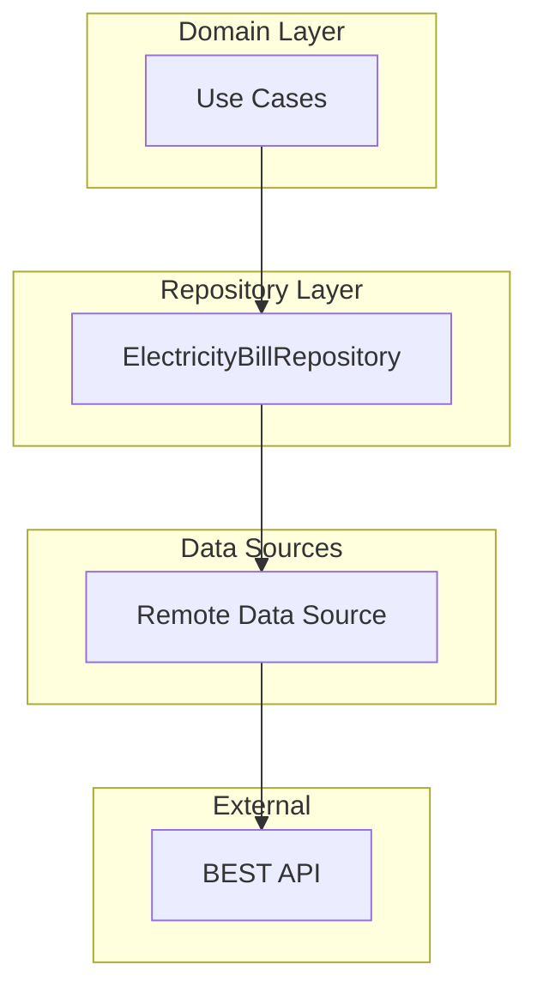
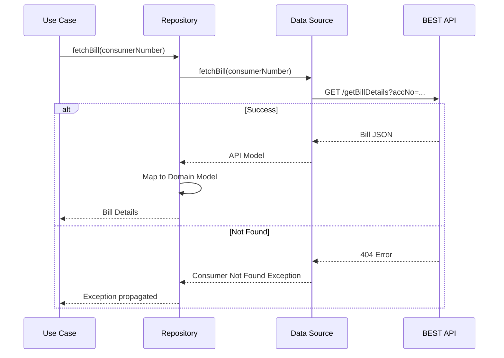
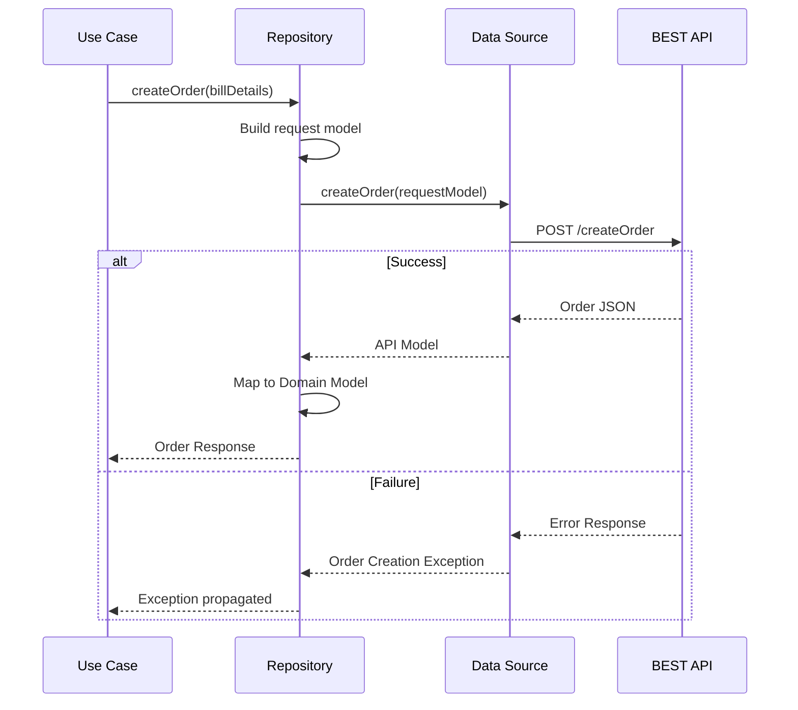
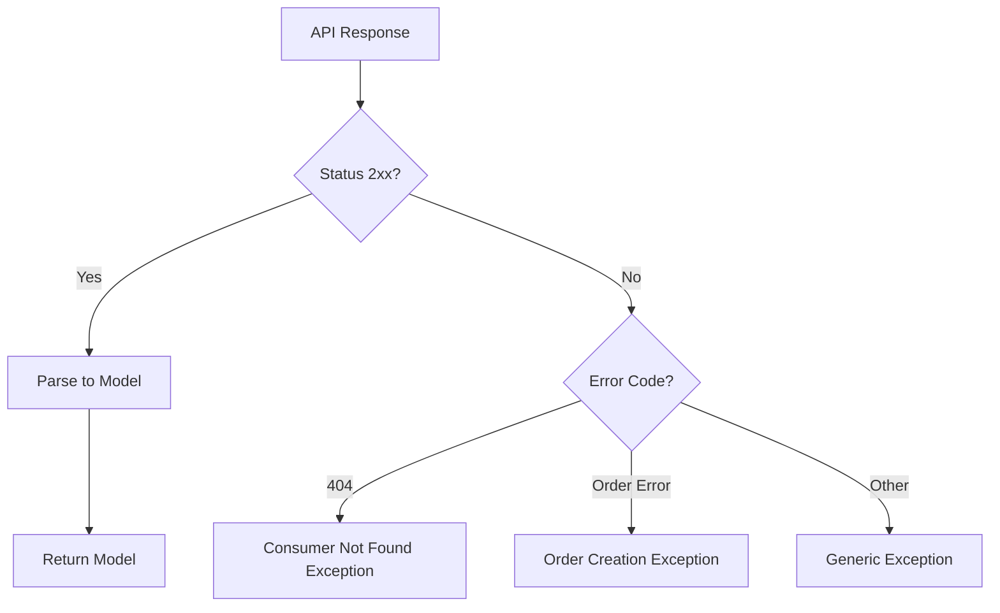

# Bills — Repository Documentation

## Data Layer Overview

The data layer handles all external data operations for the Bills feature. It follows the **Repository Pattern** where:

- **Repository** provides a clean API to the domain layer
- **Remote Data Source** handles HTTP communication
- **Mappers** transform API responses to domain models

This separation allows the domain layer to remain agnostic to how data is fetched or stored.

---

## Repository Operations

The repository provides three operations:

| Operation | Purpose | Caching |
|-----------|---------|---------|
| **Fetch Bill** | Retrieve current bill for a consumer | None |
| **Create Order** | Create payment order for checkout | None |
| **Get History** | Retrieve past payments | None |

All operations are network-only with no local caching, ensuring data freshness for this financial feature.

---

## API Endpoints

### Bill Fetch

Retrieves bill details for a consumer number.

| Property | Value |
|----------|-------|
| **Endpoint** | `mticketing/v2/ebill/getBillDetails` |
| **Method** | GET |
| **Auth** | Required |
| **Query Param** | `accNo` — 9-digit consumer number |

**Response includes:** Customer name, account number, bill amount, bill date, due date, payment status.

### Order Creation

Creates a payment order for the checkout flow.

| Property | Value |
|----------|-------|
| **Endpoint** | `mticketing/v3/ebill/createOrder` |
| **Method** | POST |
| **Auth** | Required |
| **Body** | Bill details, amount, user/device info |

**Request body includes:**
- City ID
- User ID
- Device ID, app version
- Bill properties (amount, dates, consumer info)
- Payment type (`online`)

**Response includes:** Order ID and payment details for checkout.

### Payment History

Retrieves the user's past electricity bill payments.

| Property | Value |
|----------|-------|
| **Endpoint** | `mticketing/v2/ebill/payments/history` |
| **Method** | GET |
| **Auth** | Required |

**Response includes:** List of payment records with transaction details.

---

## Data Flow

### Bill Fetch Flow

### Order Creation Flow

---

## Data Transformations

### API to Domain Mapping

When data is received from the API, it's transformed to domain models:

**Bill Details:**
| API Field | Domain Field | Transformation |
|-----------|--------------|----------------|
| `accountNo` | Consumer Number | Direct |
| `customerName` | Customer Name | Direct |
| `totalBillAmount` | Due Amount (paisa) | Ensure ≥ 0 |
| `billDate` | Bill Date | Unix timestamp |
| `dueDate` | Due Date | Unix timestamp |
| `isPaymentDone` | Already Paid | Boolean (default: false) |

**Payment History:**
| API Field | Domain Field | Transformation |
|-----------|--------------|----------------|
| `transactionId` | Transaction ID | Direct |
| `amount` | Amount | Paisa to formatted currency |
| `status` | Payment Status | String to enum (Success/Processing/Failed) |
| `bookingTime` | Payment Date | Unix timestamp to formatted date |

---

## Error Handling

### Exception Types

| Exception | Trigger | User-Facing Result |
|-----------|---------|-------------------|
| **Consumer Not Found** | Invalid consumer number | "Consumer number not found" |
| **Order Creation Failed** | Server rejected order | "Unable to create order" |
| **History Load Failed** | Network/server error | "Unable to load history" |
| **Network Error** | Connectivity issues | "Check your connection" |
| **Parse Error** | Invalid response format | "Something went wrong" |

### Error Mapping

The data source maps HTTP errors to typed exceptions:

---

## Security

### Authentication

All API calls include secure headers:

- Authorization token (user session)
- Device fingerprint
- App signature

### Data Sensitivity

Bill information contains PII (customer name, account number). The app:

- Does not cache bill data locally
- Clears data on logout
- Transmits over HTTPS only

---

## Integration Points

### Shared Checkout Module

After order creation, the Bills feature hands off to the shared Checkout module:

1. Order response contains payment details
2. Checkout module handles actual payment processing
3. Result is communicated back via a result state manager
4. Bills feature shows success/failure based on result

### Network Layer

The data source uses the app's shared network infrastructure:

- Standard request builder with auth headers
- Automatic token refresh on 401
- Retry logic for transient failures
- Request/response logging in debug builds

---

## Configuration

### Fixed Values

| Constant | Value | Purpose |
|----------|-------|---------|
| Config ID | `ebill_dakjh` | Identifies bill payment product type |
| Payment Type | `online` | All payments are online |
| LP Version | `v1` | Payment protocol version |

### Amount Constraints

| Constraint | Value | Enforced At |
|------------|-------|-------------|
| Minimum | ₹1 | Domain layer |
| Maximum | ₹17,000 | Domain layer |
| Currency | Paisa | All layers |

---

## Local Storage

This feature does **not** use local storage. Rationale:

- **Bill data must be fresh** — Amounts and due dates change
- **Payment history is dynamic** — New payments appear
- **Financial accuracy** — Stale data could cause payment issues
- **Privacy** — No sensitive data persisted on device

All data is fetched on-demand from the server.
