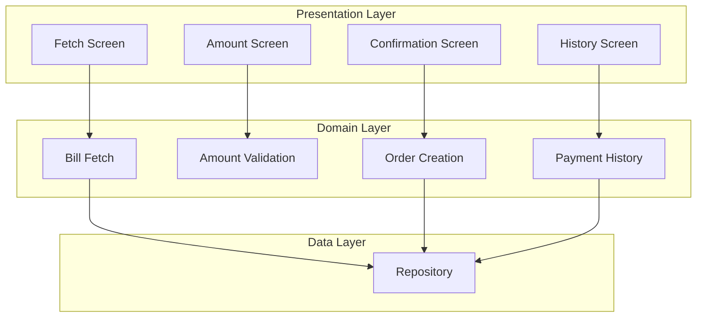
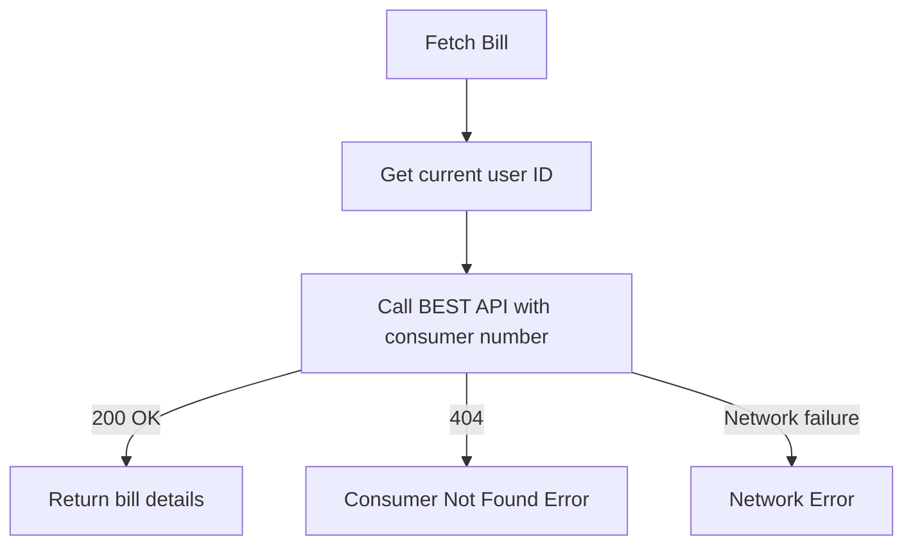
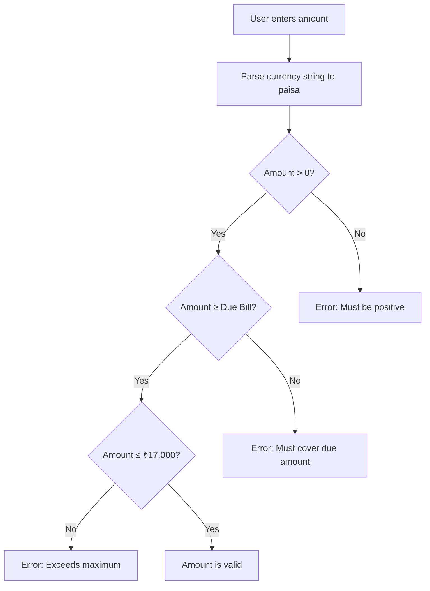
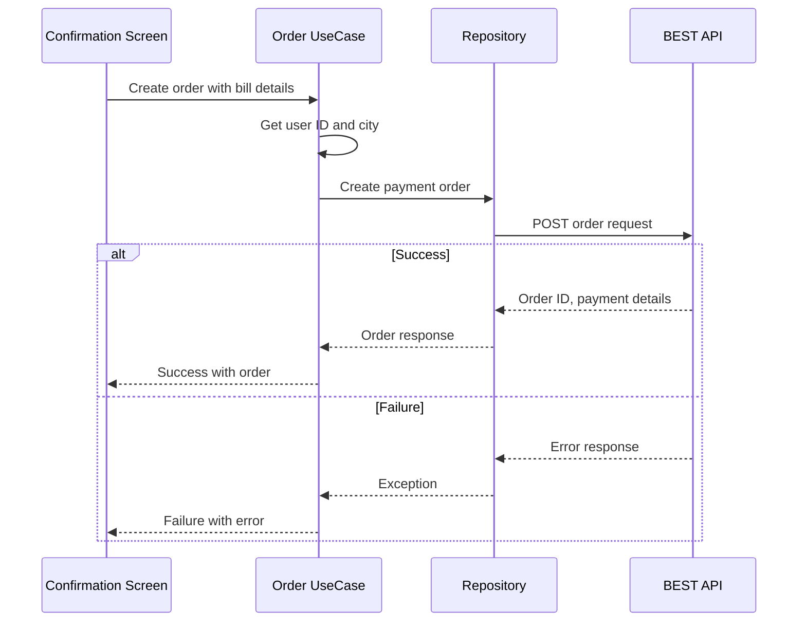

# Bills — UseCase Documentation

## Domain Layer Overview

The domain layer encapsulates all business logic for the Bills feature. Use cases are single-responsibility classes that:

- Validate inputs against business rules
- Orchestrate data operations via repositories
- Transform errors into user-friendly results
- Remain independent of UI and data layer implementation details

---

## Use Case Inventory

| Use Case | Purpose | Depends On |
|----------|---------|------------|
| **EBillFetchUseCase** | Validate consumer number, fetch bill details | Repository, User Profile |
| **EBillAmountUseCase** | Validate payment amount against business rules | Currency Service |
| **EBillCreateOrderUseCase** | Create payment order for checkout | Repository, User Profile, City |
| **EBillFetchPaymentHistoryUseCase** | Retrieve past payments | Repository |

---

## Bill Fetch

**Responsibility:** Validates the consumer number format and retrieves bill details from the BEST electricity provider.

### Input Validation

The consumer number must be exactly 9 digits. This is validated client-side before any API call:

- Empty or null → Invalid
- Less than 9 digits → Invalid (user still typing)
- Exactly 9 digits → Valid, ready to fetch
- More than 9 digits → Prevented by input field

### Fetch Operation

### Bill Details Returned

When successful, the following information is retrieved:

- Customer name
- Consumer number (account number)
- Due bill amount (in paisa)
- Bill date
- Due date
- Whether payment was already made this cycle

### Error Scenarios

| Scenario | Cause | User Impact |
|----------|-------|-------------|
| Consumer not found | Invalid consumer number | Error shown below input field |
| Network failure | Connectivity issues | Snackbar with retry option |
| User not logged in | Session expired | Redirected to login |

---

## Amount Validation

**Responsibility:** Ensures the user-entered payment amount complies with business rules before proceeding to payment.

### Validation Flow

### Business Rules

| Rule | Constraint | Rationale |
|------|------------|-----------|
| **Positive amount** | > ₹0 | Cannot pay zero or negative |
| **Minimum amount** | ≥ Due bill amount | Partial payments not supported by BEST |
| **Maximum amount** | ≤ ₹17,000 | Payment gateway limit |

### Amount Handling

- All amounts are stored internally in **paisa** (1/100th of a rupee)
- Display formatting uses the app's currency service
- The maximum of ₹17,000 equals 17,00,000 paisa internally

---

## Order Creation

**Responsibility:** Creates a payment order with the BEST backend, preparing for the checkout flow.

### Order Creation Flow

### Order Request Contents

The order request includes:

- **User context:** User ID, city name
- **Bill details:** Consumer number, customer name, bill date, due date
- **Payment:** User-entered amount (in paisa)
- **Config:** Fixed configuration ID (`ebill_dakjh`)
- **Device:** App version, device ID

### Error Handling

| Error Type | Cause | Recovery |
|------------|-------|----------|
| Order creation failed | Server rejected request | Show error, allow retry |
| Network failure | Connectivity issues | Show error, allow retry |
| Invalid response | Parsing failed | Show generic error |

---

## Payment History

**Responsibility:** Retrieves the user's past electricity bill payments.

### Data Retrieval

The history is fetched from the server with no local caching:

1. Request sent to payment history endpoint
2. Response contains list of past payments
3. List is sorted by payment date (newest first)
4. Each payment is transformed for display

### Payment Record Contents

Each historical payment includes:

- Transaction ID
- Amount paid
- Payment status (Success, Processing, Failed)
- Payment timestamp
- Consumer number
- Customer name
- Bill and due dates

### Empty State

If the user has never paid an electricity bill through the app, an empty state is shown with an informational message.

---

## Domain Models

### Bill Information

Represents a fetched electricity bill:

| Field | Type | Description |
|-------|------|-------------|
| Consumer Number | String | 9-digit BEST account number |
| Customer Name | String | Name on the account |
| Due Amount | Integer | Bill amount in paisa |
| User Amount | Integer | Amount user wants to pay (in paisa) |
| Bill Date | Timestamp | When bill was generated |
| Due Date | Timestamp | Payment deadline |
| Already Paid | Boolean | Whether paid this cycle |

### Payment Status

Payments can be in one of three states:

| Status | Meaning |
|--------|---------|
| **Success** | Payment completed successfully |
| **Processing** | Payment initiated but not confirmed |
| **Failed** | Payment attempt failed |

---

## Error Types Summary

| Use Case | Error | Cause |
|----------|-------|-------|
| Fetch | Consumer not found | Invalid consumer number |
| Fetch | API failed | Network or server error |
| Fetch | User not logged in | Session expired |
| Amount | Invalid amount | Fails validation rules |
| Order | Creation failed | Server rejected order |
| History | Load failed | Network error |
