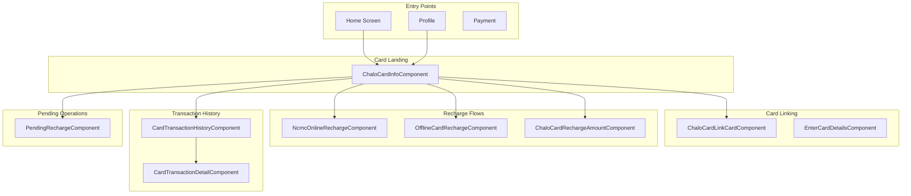
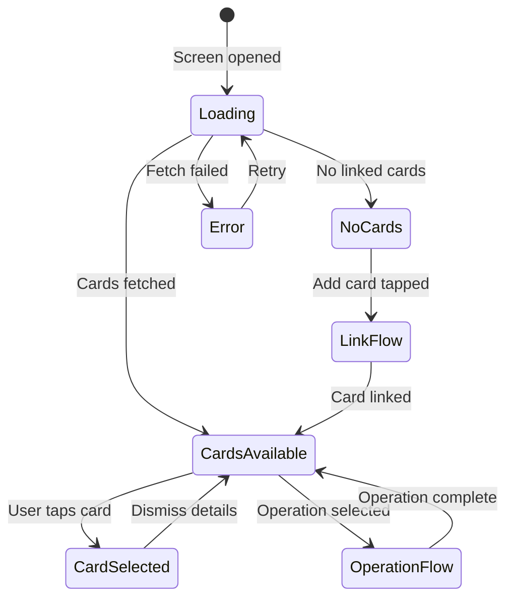
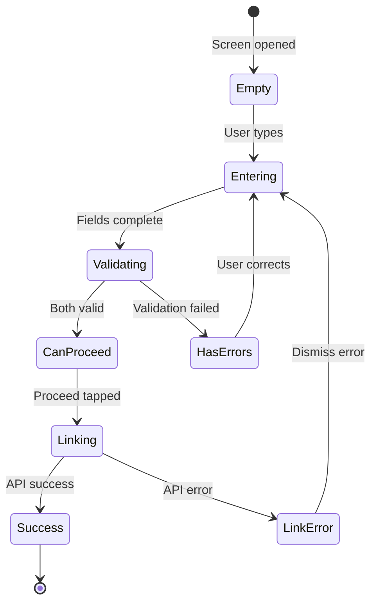
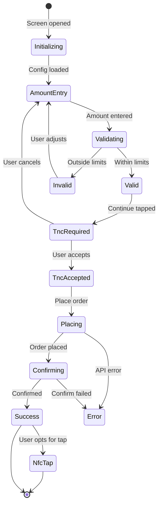
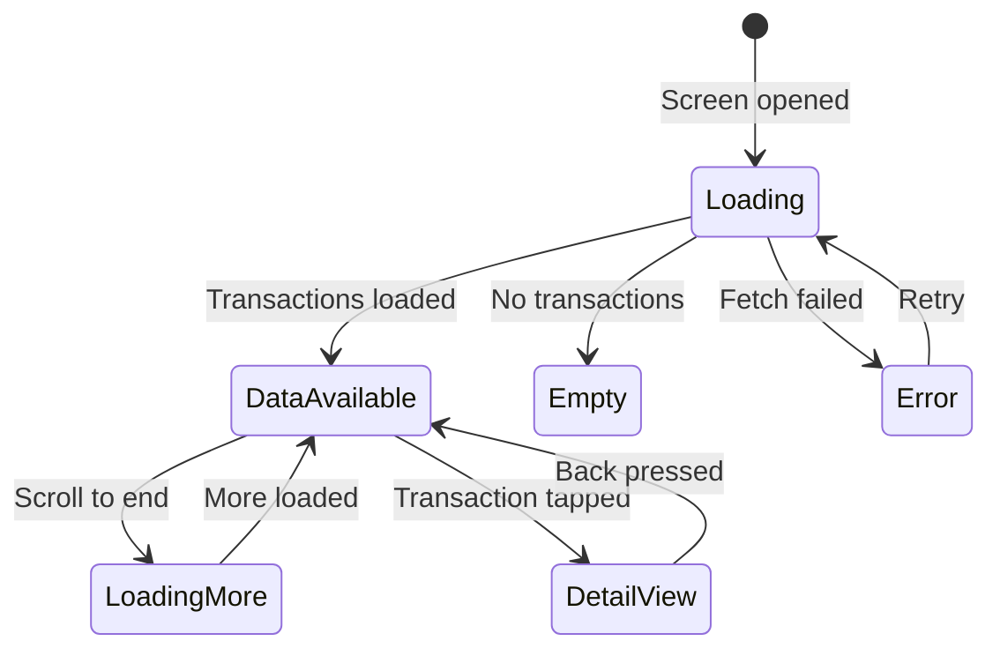
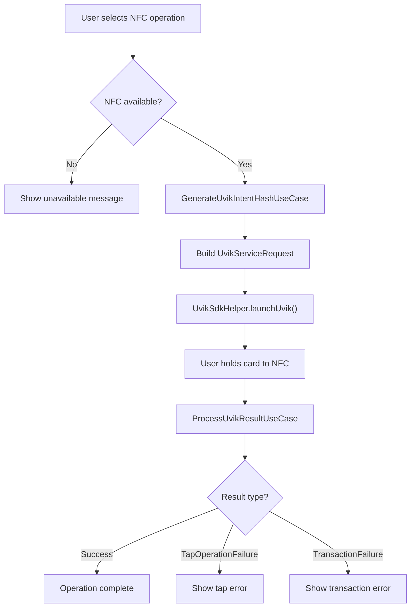
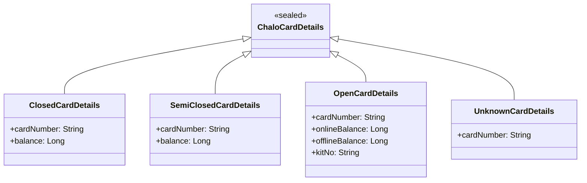
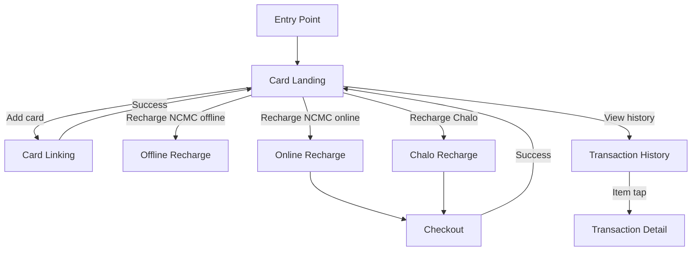

# Card (Chalo Card / NCMC) — Component Documentation

## Architecture Overview

The Card presentation layer implements a multi-screen flow for physical card management using Decompose components. The main landing component displays linked cards and available operations, while dedicated components handle card linking, recharging (online/offline), and transaction history. NFC operations integrate with the Uvik SDK for NCMC balance management.

---

## Screen Inventory

| Screen | Component | Purpose |
|--------|-----------|---------|
| **Card Landing** | ChaloCardInfoComponent | Card dashboard with operations |
| **Card Linking** | ChaloCardLinkCardComponent | Link card via number + code |
| **Enter Details** | EnterCardDetailsComponent | Card details for one-off recharge |
| **NCMC Online Recharge** | NcmcOnlineRechargeComponent | Online recharge via payment |
| **NCMC Offline Recharge** | OfflineCardRechargeComponent | NFC tap recharge |
| **Chalo Card Recharge** | ChaloCardRechargeAmountComponent | Closed-loop card recharge |
| **Transaction History** | CardTransactionHistoryComponent | Paginated transaction list |
| **Transaction Detail** | CardTransactionDetailComponent | Single transaction details |
| **Pending Recharges** | PendingRechargeComponent | Unsynced recharge management |

---

## Card Landing Screen

The card landing screen is the primary dashboard for card operations. It displays linked cards, balances, active passes, and available operations.

### User Journey

1. User enters from home or profile
2. Screen fetches linked cards and NCMC data
3. Cards displayed with masked numbers and balances
4. User selects a card to view details
5. User can perform operations (recharge, block, unlink, etc.)
6. User can link new cards

### State Flow

### View State Structure

| Field | Type | Description |
|-------|------|-------------|
| **chaloCardDetails** | ChaloCardDetails? | Card details object |
| **maskedCardNumbers** | List<String> | Masked card numbers |
| **cardFetchStatus** | FetchCardStatus | FETCHING, FETCHED_AND_AVAILABLE, etc. |
| **layoutType** | ChaloCardInfoScreenLayoutType | ALL_CARDS, SINGLE_CARD_DETAILS, CARD_LINK_TUTORIAL |
| **selectedCardDetailsUiModel** | SelectedCardDetailsUiModel | Currently selected card |
| **activePassDetails** | ChaloCardActivePass? | Active pass info |
| **bottomSheetType** | CardInfoLandingScreenBottomSheetType | None, CardLinking, NfcTapUnavailable |
| **showPendingRechargeBanner** | Boolean | Show unsynced recharges |

### Card Fetch Status

| Status | Meaning |
|--------|---------|
| **FETCHING** | Loading card data |
| **FETCHED_AND_AVAILABLE** | Cards loaded successfully |
| **FETCHED_BUT_NOT_AVAILABLE** | No cards linked |
| **FETCH_FAILED** | API error |

### Intents

| Intent | Trigger | Action |
|--------|---------|--------|
| **InitializationIntent** | Screen mount | Fetch cards and config |
| **BuyNewCardIntent** | Buy card tapped | Navigate to purchase URL |
| **RefreshDataClickedIntent** | Pull refresh | Re-fetch card data |
| **UseLinkCodeClickedIntent** | Link code tapped | Open linking screen |
| **ShowTransactionHistoryClickedIntent** | History tapped | Navigate to transactions |
| **OnCardClick** | Card item tap | Select card |
| **AddCardClickIntent** | Add card button | Open linking flow |
| **ConfirmationDialogPositiveButtonClick** | Dialog confirm | Execute unlink/block |
| **ChangePinClickIntent** | Change PIN tap | Open PIN change flow |
| **CardOperationClicked** | Operation button | Execute card operation |
| **TapUnavailableBottomSheetOkClickIntent** | NFC unavailable dismiss | Close bottom sheet |

### Card Operations

Operations vary by card type and selection context:

**All Card Options:**

| Operation | Description |
|-----------|-------------|
| **ChangePin** | Change NCMC PIN |
| **Block** | Block card |
| **BuyNewCard** | Purchase new card |
| **Recharge** | Add balance |
| **ActivateCardForMetro** | Metro activation |
| **UpdateBalance** | NFC balance update |
| **BalanceEnquiry** | NFC balance check |
| **ActivateNCMCCard** | Activate NCMC |

**Specific Card Options:**

| Operation | Description |
|-----------|-------------|
| **UpdateBalance** | NFC balance update |
| **ViewOfflineBalance** | Check offline balance |
| **ChangePin** | Change PIN (with kitNumber) |
| **Block** | Block this card |
| **ViewTransactions** | Transaction history |
| **Unlink** | Remove card |
| **Recharge** | Add balance |

### Side Effects

| Effect | When Triggered | Result |
|--------|----------------|--------|
| **NavigateToLinking** | Add card tapped | Open linking screen |
| **NavigateToRecharge** | Recharge selected | Open appropriate recharge flow |
| **NavigateToTransactions** | History tapped | Open transaction list |
| **LaunchUvikSdk** | NFC operation | Start NFC tap flow |
| **ShowConfirmationDialog** | Block/unlink | Display confirmation |
| **ShowNfcUnavailable** | NFC not supported | Display bottom sheet |

---

## Card Linking Screen

Handles card linking flow with card number and link code validation.

### User Journey

1. User navigates from landing screen
2. Enter card number (validated for length)
3. Enter link code (validated for length)
4. Tap proceed when both fields valid
5. API validates and links card
6. Success: return to landing with new card
7. Failure: show specific error message

### State Flow

### View State Structure

| Field | Type | Description |
|-------|------|-------------|
| **currentlyEnteredCardNo** | String | Card number input |
| **currentlyEnteredLinkCode** | String | Link code input |
| **isProceedBtnEnabled** | Boolean | Can submit |
| **isLoaderVisible** | Boolean | Loading indicator |
| **isCardLinkedToAnotherNoDialogVisible** | Boolean | Show already linked error |
| **cardLinkingErrorType** | CardLinkingErrorType | Error state |
| **maxCardNumberLength** | Int | Max card number length |
| **minCardNumberLength** | Int | Min card number length |
| **maxLinkCodeLength** | Int | Max link code length |
| **minLinkCodeLength** | Int | Min link code length |

### Intents

| Intent | Trigger | Action |
|--------|---------|--------|
| **InitializationLinkIntent** | Screen mount | Initialize with source |
| **OnLinkCodeEnteredLink** | Code input | Update link code |
| **OnCardLinkNumberEntered** | Number input | Update card number |
| **ProceedClickedLinkIntent** | Proceed button | Submit linking request |
| **CardAlreadyLinkedErrorDialogOkClickedLinkIntent** | Error dismiss | Close error dialog |

### Linking Error Types

| Error | Meaning | Display |
|-------|---------|---------|
| **NO_ERROR** | No error | — |
| **INVALID_CARD_NUMBER** | Card number invalid | "Invalid card number" |
| **INVALID_LINK_CODE** | Link code wrong | "Invalid link code" |
| **CARD_LINKED_TO_ANOTHER_NUMBER** | Already linked | Dialog with info |
| **API_CALL_FAILED** | Network error | "Something went wrong" |
| **KYC_NOT_DONE** | KYC incomplete | "Complete KYC first" |
| **CARD_NOT_REGISTERED_IN_CURR_CITY** | Wrong city | "Card not available in city" |

---

## Offline Card Recharge Screen

Handles NCMC offline (NFC tap) recharge flow.

### User Journey

1. Screen receives card details and recharge config
2. User enters recharge amount
3. System validates against min/max limits
4. User accepts terms and conditions
5. Order placed via API
6. Order confirmed on server
7. Success screen shown
8. Optional: NFC tap to sync balance

### State Flow

### View State Structure

| Field | Type | Description |
|-------|------|-------------|
| **enteredAmount** | String | Amount input |
| **enteredAmountError** | String? | Amount validation error |
| **enableContinueBtn** | Boolean | Can proceed |
| **showTncDialog** | Boolean | Show terms dialog |
| **screenType** | OfflineRechargeScreenType | MAIN, SUCCESS |
| **showLoadingDialog** | Boolean | Loading indicator |
| **showErrorSnackbar** | Boolean | Error display |
| **snackbarErrorMsg** | String? | Error message |
| **onlineBalance** | Long? | Current online balance |
| **onlineBalanceFormatted** | String? | Formatted balance |
| **minRechargeAmount** | Long? | Minimum amount |
| **maxRechargeAmount** | Long? | Maximum amount |
| **isUvikTapAvailable** | Boolean | NFC available |
| **balanceFetchFailed** | Boolean | Balance fetch error |

### Intents

| Intent | Trigger | Action |
|--------|---------|--------|
| **InitialIntent** | Screen mount | Initialize with config |
| **RechargeAmountEntered** | Amount input | Update and validate |
| **OnRechargeClicked** | Continue button | Proceed to TnC |
| **OnAddMoneyClicked** | Add money button | Submit recharge |
| **TncDialogueAccepted** | Accept terms | Place order |
| **TncDialogueCancelled** | Cancel terms | Return to entry |
| **OfflineRechargeSuccessfulPositiveBtnClicked** | Success action | Trigger NFC tap |

### Amount Validation

| Check | Rule | Error Message |
|-------|------|---------------|
| **Minimum** | amount >= minRechargeAmount | "Minimum amount is ₹X" |
| **Maximum** | amount <= maxRechargeAmount | "Maximum amount is ₹X" |
| **Numeric** | Valid number | "Enter valid amount" |

---

## Transaction History Screen

Displays paginated transaction history with filtering.

### User Journey

1. Screen receives card number and type
2. Fetch first page of transactions
3. Display transactions grouped by date
4. User scrolls to load more pages
5. User taps transaction for details
6. Optional: email transaction history

### State Flow

### View State Structure

| Field | Type | Description |
|-------|------|-------------|
| **errorMessage** | String? | Error message |
| **errorType** | CardTransactionHistoryUiErrorWrapper? | Error type |
| **currencySymbol** | String | Currency display |
| **showEmailStatementDialog** | Boolean | Show email dialog |
| **pendingRechargeBannerTitle** | String? | Unsynced recharges |

### Transaction Types

| Type | Description | Detail Screen |
|------|-------------|---------------|
| **RECHARGE** | Wallet load | CardTransactionDetail |
| **TICKET** | Bus ticket | TripSummary |
| **PASS_PURCHASE** | Pass subscription | CardTransactionDetail |
| **MERCHANT** | Third-party payment | CardTransactionDetail |
| **UNKNOWN** | Unrecognized | CardTransactionDetail |

### Intents

| Intent | Trigger | Action |
|--------|---------|--------|
| **InitialIntent** | Screen mount | Fetch transactions |
| **RefreshTransactionHistoryIntent** | Pull refresh | Reload data |
| **RetryIntent** | Retry button | Re-fetch |
| **TransactionClickedIntent** | Item tap | Navigate to detail |
| **EmailAllTransactionHistoryClickedIntent** | Email button | Show email dialog |
| **UnsyncedRechargeBannerViewMoreClickedIntent** | Banner tap | Navigate to pending |

---

## NFC Operations Flow

### Uvik SDK Integration

### Uvik Service Types

| Service | Purpose | When Used |
|---------|---------|-----------|
| **SERVICE_CREATION** | Activate card for metro | New NCMC activation |
| **BALANCE_UPDATE** | Add balance via NFC | After recharge |
| **BALANCE_ENQUIRY** | Check offline balance | View balance operation |

### Uvik Request Structure

| Request Type | Fields |
|--------------|--------|
| **Creation** | hash |
| **BalanceUpdate** | hash, amount |
| **BalanceEnquiry** | hash |

---

## Card Type Hierarchy

### ChaloCardDetails

### Card-Specific Operations

| Card Type | Available Operations |
|-----------|----------------------|
| **Closed** | Recharge, Transactions, Unlink |
| **Semi-Closed** | Recharge, Transactions, Unlink |
| **Open (NCMC)** | All operations including NFC |
| **Unknown** | View only |

---

## Navigation Flow

---

## Analytics Events

| Event | Screen | Trigger |
|-------|--------|---------|
| **card_landing_screen_opened** | Landing | Screen mount |
| **card_link_clicked** | Landing | Link button tap |
| **card_link_success** | Linking | Link success |
| **card_link_failed** | Linking | Link failure |
| **card_recharge_clicked** | Landing | Recharge tap |
| **card_recharge_success** | Recharge | Payment success |
| **card_nfc_tap_initiated** | Landing | NFC operation start |
| **card_nfc_tap_success** | Landing | NFC success |
| **card_nfc_tap_failed** | Landing | NFC failure |
| **card_transactions_opened** | History | Screen mount |

---

## Error Handling

| Error Scenario | Screen | UI Response |
|----------------|--------|-------------|
| **Card fetch failed** | Landing | Error state with retry |
| **Linking failed** | Linking | Error dialog with reason |
| **Invalid card number** | Linking | Field error |
| **Invalid link code** | Linking | Field error |
| **NFC unavailable** | Landing | Bottom sheet message |
| **NFC tap failed** | Landing | Error toast with code |
| **Recharge failed** | Recharge | Error snackbar |
| **Transaction fetch failed** | History | Error state with retry |
