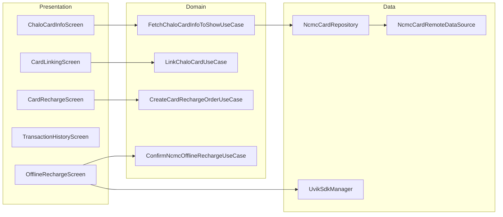

# Card (Chalo Card / NCMC) — High-Level Design

## Overview

The Card feature enables users to manage physical smart cards (Chalo Card, NCMC) within the Chalo app. Users can link cards, view balances, recharge cards (online and offline via NFC), view transactions, and perform card operations like blocking and PIN changes. NCMC cards support offline balance via UVIK NFC SDK.

## User Journey

1. **Entry Points**:
   - Home screen → Card card
   - Profile → My Cards
   - Payment → Card top-up

2. **Core Flow**:
   - Link card with card number and code
   - View card balance and details
   - Recharge card (online or NFC tap)
   - View transaction history
   - Manage card (block, PIN change, unlink)

3. **Exit Points**:
   - Balance updated → Card details
   - Recharge complete → Success screen
   - Card blocked → Card removed from list

## Architecture Diagram



## Key Components

| Component | Platform | File Path | Responsibility |
|-----------|----------|-----------|----------------|
| `ChaloCardInfoComponent` | Shared | `shared/home/.../ncmc/ui/landing/ChaloCardInfoComponent.kt` | Card dashboard |
| `ChaloCardLinkCardComponent` | Shared | `shared/home/.../ncmc/ui/cardlinking/linking/ChaloCardLinkCardComponent.kt` | Card linking |
| `ChaloCardRechargeAmountComponent` | Shared | `shared/home/.../ncmc/ui/cardrechargeamount/ChaloCardRechargeAmountComponent.kt` | Recharge amount |
| `OfflineCardRechargeComponent` | Shared | `shared/home/.../ncmc/ui/ncmcofflinerecharge/OfflineCardRechargeComponent.kt` | NFC offline recharge |
| `CardTransactionHistoryComponent` | Shared | `shared/home/.../ncmc/ui/transactionhistory/CardTransactionHistoryComponent.kt` | Transaction history |
| `NcmcCardRepository` | Shared | `shared/home/.../ncmc/repository/NcmcCardRepository.kt` | Card data management |
| `UvikSdkManager` | Android/iOS | `shared/home/.../ncmc/uvik/UvikSdkManager.kt` | NFC SDK interface |

## Data Flow

### Card Linking
1. User enters card number and link code
2. `LinkChaloCardUseCase` validates and links card
3. Card added to local storage
4. Balance fetched from server
5. Card displayed on landing screen

### Online Recharge
1. User selects card and enters amount
2. `FetchChaloCardRechargeConfigurationUseCase` gets options
3. `CreateCardRechargeOrderUseCase` creates order
4. Payment processed via checkout
5. Balance updated after success

### NCMC Offline Recharge (NFC)
1. User selects NCMC card and amount
2. `PlaceNcmcOfflineRechargeAndGetOrderIdUseCase` creates order
3. `GenerateUvikIntentHashUseCase` prepares NFC data
4. User taps card on NFC reader
5. `ProcessUvikResultUseCase` handles result
6. `ConfirmNcmcOfflineRechargeUseCase` confirms on server

## Platform Differences

### Android-Specific
- Native NFC via Android NFC API
- UVIK SDK integration for NCMC
- Card number OCR scanning

### iOS-Specific
- Limited NFC support (read-only)
- UVIK SDK iOS implementation
- Core NFC framework

## Integration Points

### Analytics Events
- See [Analytics: card](/analytics/flows/card) for event documentation
- Key events:
  - `card_landing_screen_opened`
  - `card_link_clicked`
  - `card_link_success`
  - `card_recharge_clicked`
  - `card_recharge_success`
  - `card_nfc_tap_success`

### Shared Services
- **Payment**: Checkout for online recharge
- **NFC**: UVIK SDK for NCMC operations
- **Receipt**: Card receipt manager

### Navigation
- **Navigates to**: Card linking, Recharge, Transactions, Checkout
- **Navigated from**: Home, Profile

## Card Types

### ChaloCardDetails (Sealed Class)
```kotlin
sealed class ChaloCardDetails {
    data class ClosedCardDetails(...)      // Closed-loop cards
    data class SemiClosedCardDetails(...)  // Semi-closed cards
    data class OpenCardDetails(...)        // NCMC with online/offline balance
    data class UnknownCardDetails(...)     // Unknown card types
}
```

### NCMC Card Features
- Online balance (server-stored)
- Offline balance (card-stored, via NFC)
- Load limits (daily/monthly)
- Block/unblock capability
- PIN management

## UVIK Service Types

```kotlin
enum class UvikServiceType {
    SERVICE_CREATION,   // Activate card for metro
    BALANCE_UPDATE,     // Add balance via NFC
    BALANCE_ENQUIRY     // Check offline balance
}
```

## Edge Cases & Error Handling

| Scenario | Handling |
|----------|----------|
| Card not found | Shows add card prompt |
| Link code invalid | Shows error message |
| NFC tap failed | Shows retry with instructions |
| Offline balance mismatch | Syncs with server |
| Card blocked | Shows block reason |
| Recharge limit exceeded | Shows limit message |

## Card Operations

### AllCardOption
- Recharge (any card)
- Activate NCMC Card
- Update Balance (NFC)
- Balance Enquiry (NFC)
- Activate Card for Metro
- Buy New Card

### SpecificCardOption
- View Offline Balance
- Update Balance
- Change PIN
- Block
- View Transactions
- Unlink
- Recharge

## Data Models

### NcmcCardAppModel
```kotlin
data class NcmcCardAppModel(
    val cardNumber: String,
    val onlineBalance: Long?,
    val offlineBalance: Long?,
    val kitNo: String?,
    val status: NcmcCardStatus,
    val remainingOfflineLoadLimit: Long?,
    val remainingOnlineLoadLimit: Long?,
    val isCardBlocked: Boolean,
    val isEligibleForUnlink: Boolean
)
```

### CardTransaction (Sealed)
```kotlin
sealed class CardTransaction {
    data class CardRechargeTransaction(...)
    data class CardTicketTransaction(...)
    data class CardPassPurchaseTransaction(...)
    data class CardMerchantTransaction(...)
    data class CardUnknownTransaction(...)
}
```

### UvikServiceRequest
```kotlin
sealed class UvikServiceRequest {
    data class Creation(val hash: String)
    data class BalanceUpdate(val hash: String, val amount: Long)
    data class BalanceEnquiry(val hash: String)
}
```

## Dependencies

### Internal
- `shared:home` — NCMC module
- `shared:checkout` — Payment processing
- `shared:chalo-base` — Base models

### External
- UVIK SDK — NCMC NFC operations
- NFC APIs — Android NFC, Core NFC (iOS)
- SQLDelight — Card data storage
