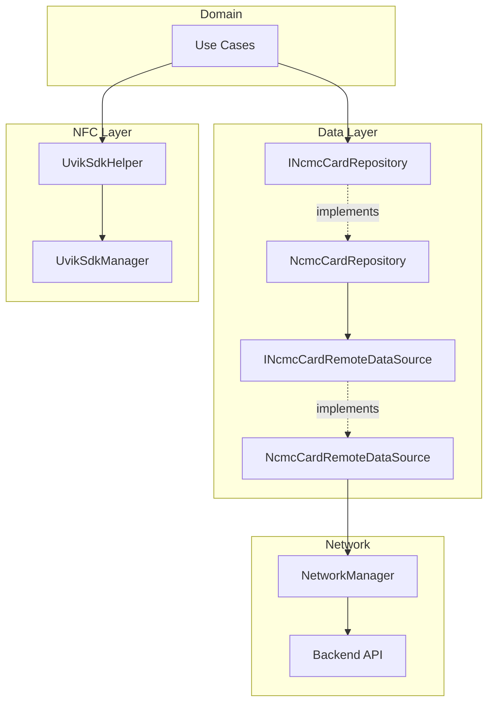
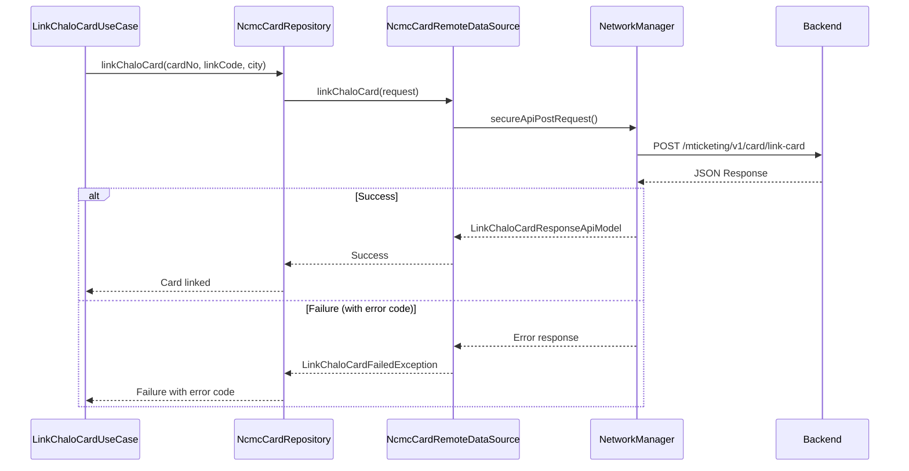
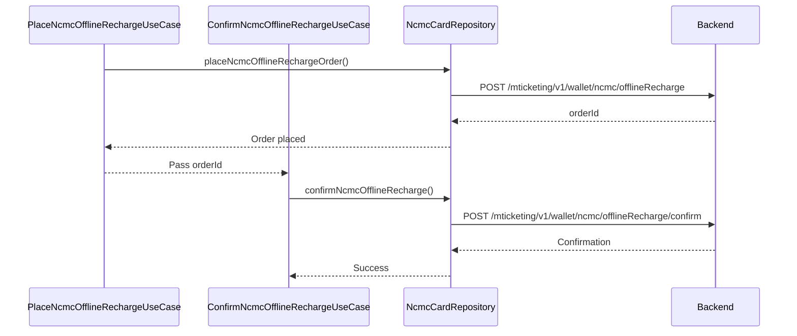
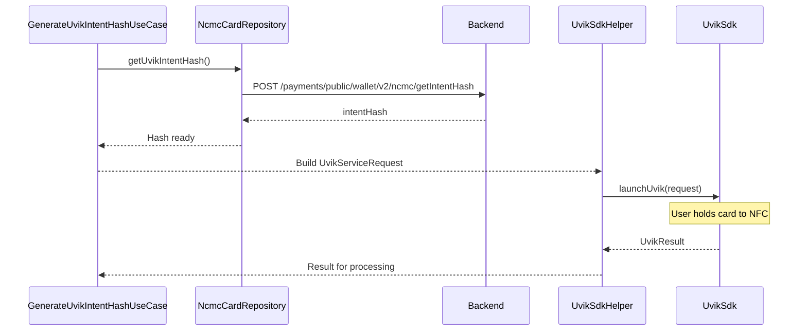
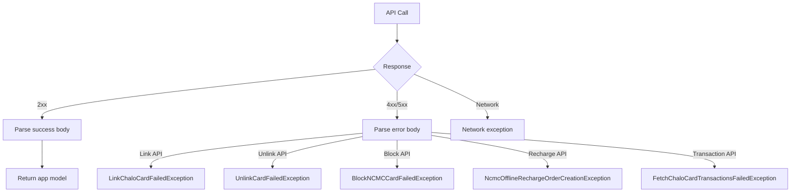

# Card (Chalo Card / NCMC) — Repository Documentation

## Data Layer Overview

The Card data layer handles API communication for card management, recharging, and NFC operations. The layer uses the NcmcCardRepository for all card operations and integrates with the Uvik SDK for NCMC NFC functionality.

---

## Repository Interface

The `INcmcCardRepository` interface defines all card data operations.

### Operations

| Method | Purpose | Returns |
|--------|---------|---------|
| **fetchNcmcCardRechargeConfig** | Get NCMC recharge config | List<NcmcCardRechargeConfigAppModel> |
| **getNCMCCardData** | Fetch NCMC card data | List<NcmcCardAppModel> |
| **placeNcmcOfflineRechargeOrder** | Place offline recharge | NcmcOfflineRechargeResponseApiModel |
| **confirmNcmcOfflineRecharge** | Confirm offline recharge | NcmcOfflineRechargeConfirmResponseModel |
| **createNcmcOnlineRechargeOrder** | Create online recharge | CreateOrderResponseAppModel |
| **getCardTransactions** | Fetch transactions | CardTransactionAppModel |
| **linkChaloCard** | Link card to account | LinkChaloCardResponseAppModel |
| **fetchLinkedChaloCardsInfo** | Fetch linked cards | ChaloCardsInfoAppModel |
| **fetchChaloCardRechargeConfiguration** | Get Chalo recharge config | ChaloCardRechargeConfigurationListAppModel |
| **createCardRechargeOrder** | Create Chalo recharge | CreateOrderResponseAppModel |
| **fetchEligibleCards** | Check auto-link eligibility | EligibleCardResponseAppModel |
| **unlinkCard** | Remove linked card | UnlinkCardResponseAppModel |
| **blockNCMCCard** | Block NCMC card | BlockNCMCCardResponseAppModel |
| **changeNcmcCardPin** | Change NCMC PIN | ChangeNcmcCardPinResponseAppModel |
| **validateChaloCard** | Validate card | CardValidationAppModel |
| **getUvikIntentHash** | Generate NFC intent | IntentHashAppModel |

---

## API Endpoints

### Link Card

Links a card to the user's account.

| Property | Value |
|----------|-------|
| **Endpoint** | POST /mticketing/v1/card/link-card |
| **Auth** | Required |

**Request Body:**

| Field | Type | Description |
|-------|------|-------------|
| **cardNumber** | String | Card number |
| **linkCode** | String | Linking code |
| **city** | String | City name |
| **isAutoLinkFlow** | Boolean | Auto-link flag |

**Response: LinkChaloCardResponseApiModel**

| Field | Type | Description |
|-------|------|-------------|
| **status** | CardApiResponseStatus | SUCCESS or FAILED |
| **message** | String? | Error message |
| **errorCode** | Int? | Error code for mapping |

---

### Fetch Linked Cards Info

Retrieves all linked cards and pass information.

| Property | Value |
|----------|-------|
| **Endpoint** | GET /mticketing/v1/card/card-info |
| **Auth** | Required |

**Query Parameters:**

| Parameter | Type | Description |
|-----------|------|-------------|
| **city** | String | City name |
| **fetchWithNcmcCard** | Boolean | Include NCMC data |

**Response: ChaloCardsInfoApiModel**

| Field | Type | Description |
|-------|------|-------------|
| **cards** | List<ChaloCardDetailsApiModel> | Card details |
| **passes** | List<ChaloCardActivePassApiModel> | Active passes |

---

### Card Transactions

Fetches paginated transaction history.

| Property | Value |
|----------|-------|
| **Endpoint** | GET /mticketing/v1/card/transaction-history |
| **Auth** | Required |

**Query Parameters:**

| Parameter | Type | Description |
|-----------|------|-------------|
| **cardNumber** | String | Card to query |
| **city** | String | City name |
| **kitNumber** | String? | NCMC kit number |
| **cardType** | String | Card type |
| **page** | Int | Page number |

**Response: CardTransactionApiModel**

| Field | Type | Description |
|-------|------|-------------|
| **transactions** | List<CardTransactionItemApiModel> | Transaction items |
| **hasMore** | Boolean | More pages available |

---

### Card Recharge Configuration

Retrieves recharge limits and fare info.

| Property | Value |
|----------|-------|
| **Endpoint** | GET /configuration/v3/cities/{city}/cardRecharge |
| **Auth** | Required |

**Response: ChaloCardRechargeConfigurationApiModel**

| Field | Type | Description |
|-------|------|-------------|
| **minAmount** | Long | Minimum recharge |
| **maxAmount** | Long | Maximum recharge |
| **fareInfo** | FareInfo | Fare breakdown |

---

### Chalo Card Recharge

Creates a recharge order for Chalo Card.

| Property | Value |
|----------|-------|
| **Endpoint** | POST /mticketing/v2/card/recharge |
| **Auth** | Required |

**Request Body:**

| Field | Type | Description |
|-------|------|-------------|
| **cardNumber** | String | Card number |
| **amount** | Long | Recharge amount |
| **configurationId** | String | Config ID |
| **cardType** | String | Card type |

**Response: CreateOrderResponseApiModel**

| Field | Type | Description |
|-------|------|-------------|
| **orderId** | String | Backend order ID |
| **chaloOrderId** | String | Payment reference |

---

### NCMC Offline Recharge

Places an offline (NFC) recharge order.

| Property | Value |
|----------|-------|
| **Endpoint** | POST /mticketing/v1/wallet/ncmc/offlineRecharge |
| **Auth** | Required |

**Request Body:**

| Field | Type | Description |
|-------|------|-------------|
| **amount** | Long | Recharge amount |
| **cardNumber** | String | Card number |
| **configurationId** | String | Config ID |
| **kitNumber** | String | NCMC kit number |
| **userId** | String | User ID |

**Response: NcmcOfflineRechargeResponseApiModel**

| Field | Type | Description |
|-------|------|-------------|
| **orderId** | String | Created order ID |

---

### NCMC Offline Recharge Confirm

Confirms an offline recharge order.

| Property | Value |
|----------|-------|
| **Endpoint** | POST /mticketing/v1/wallet/ncmc/offlineRecharge/confirm |
| **Auth** | Required |

**Request Body:**

| Field | Type | Description |
|-------|------|-------------|
| **amount** | Long | Recharge amount |
| **cardNumber** | String | Card number |
| **city** | String | City name |
| **configurationId** | String | Config ID |
| **kitNumber** | String | NCMC kit number |
| **userId** | String | User ID |
| **orderId** | String | Order to confirm |

**Response: NcmcOfflineRechargeConfirmResponseModel**

| Field | Type | Description |
|-------|------|-------------|
| **status** | String | Confirmation status |

---

### NCMC Online Recharge

Creates an online recharge order for NCMC.

| Property | Value |
|----------|-------|
| **Endpoint** | POST /mticketing/v2/wallet/ncmc/rechargeOrder |
| **Auth** | Required |

**Request Body:**

| Field | Type | Description |
|-------|------|-------------|
| **amount** | Long | Recharge amount |
| **configurationId** | String | Config ID |
| **cardNumber** | String | Card number |
| **kitNumber** | String | NCMC kit number |

**Response: CreateOrderResponseApiModel**

| Field | Type | Description |
|-------|------|-------------|
| **orderId** | String | Backend order ID |
| **chaloOrderId** | String | Payment reference |

---

### Unlink Card

Removes a linked card from the user's account.

| Property | Value |
|----------|-------|
| **Endpoint** | POST /mticketing/v1/card/unlink-card |
| **Auth** | Required |

**Request Body:**

| Field | Type | Description |
|-------|------|-------------|
| **cardNumber** | String | Card to unlink |

**Response: UnlinkCardResponseApiModel**

| Field | Type | Description |
|-------|------|-------------|
| **status** | String | Operation status |

---

### Block NCMC Card

Blocks an NCMC card.

| Property | Value |
|----------|-------|
| **Endpoint** | POST /payments/public/wallet/v3/block |
| **Auth** | Required |

**Request Body:**

| Field | Type | Description |
|-------|------|-------------|
| **cardNumber** | String | Card to block |
| **cardType** | String | Card type |
| **kitNumber** | String | NCMC kit number |
| **reason** | String | Block reason |

**Response: BlockNCMCCardResponseApiModel**

| Field | Type | Description |
|-------|------|-------------|
| **status** | String | Block status |

---

### Change NCMC PIN

Initiates NCMC PIN change.

| Property | Value |
|----------|-------|
| **Endpoint** | POST /payments/public/wallet/v3/ncmc/pin |
| **Auth** | Required |

**Request Body:**

| Field | Type | Description |
|-------|------|-------------|
| **kitNumber** | String | NCMC kit number |

**Response: ChangeNcmcCardPinResponseApiModel**

| Field | Type | Description |
|-------|------|-------------|
| **redirectUrl** | String | URL for PIN change |

---

### Get NCMC Card Data

Fetches NCMC card information.

| Property | Value |
|----------|-------|
| **Endpoint** | GET /payments/public/wallet/v2/user/card |
| **Auth** | Required |

**Query Parameters:**

| Parameter | Type | Description |
|-----------|------|-------------|
| **userId** | String | User ID |

**Response: List<NcmcCardApiModel>**

| Field | Type | Description |
|-------|------|-------------|
| **cardNumber** | String? | Card number |
| **onlineBalance** | Long? | Server balance |
| **offlineBalance** | Long? | Card balance |
| **status** | String | Card status |
| **kitNo** | String? | Kit number |

---

### Get Uvik Intent Hash

Generates intent hash for NFC operations.

| Property | Value |
|----------|-------|
| **Endpoint** | POST /payments/public/wallet/v2/ncmc/getIntentHash |
| **Auth** | Required |

**Request Body:**

| Field | Type | Description |
|-------|------|-------------|
| **serviceType** | String | SERVICE_CREATION, BALANCE_UPDATE, BALANCE_ENQUIRY |
| **kitNumber** | String | NCMC kit number |
| **amount** | Long? | Amount (for BALANCE_UPDATE) |

**Response: IntentHashApiModel**

| Field | Type | Description |
|-------|------|-------------|
| **intentHash** | String | Hash for NFC operation |

---

## Data Flow Diagrams

### Card Linking Flow

### Offline Recharge Flow

### NFC Operation Flow

---

## Data Transformation

### API to App Model Mapping

**Card Details:**

| API Field | App Field | Transform |
|-----------|-----------|-----------|
| cardNumber | cardNumber | Direct |
| onlineBalance | onlineBalance | Long (paise) |
| offlineBalance | offlineBalance | Long (paise) |
| status | ncmcCardStatus | Enum mapping |
| kitNo | kitNo | Direct |

**Transaction Types:**

| API Type | App Model |
|----------|-----------|
| RECHARGE | CardRechargeTransactionAppModel |
| TICKET | CardTicketTransactionAppModel |
| PASS_PURCHASE | CardPassPurchaseTransactionAppModel |
| MERCHANT | CardMerchantTransactionAppModel |
| UNKNOWN | CardUnknownTransactionAppModel |

**Card Status Mapping:**

| API Value | App Enum |
|-----------|----------|
| "ACTIVE" | NcmcCardStatus.ACTIVE |
| "BLOCKED" | NcmcCardStatus.BLOCKED |
| "EXPIRED" | NcmcCardStatus.EXPIRED |

---

## Exception Handling

### Exception Flow

### Exception Types

| Exception | When Thrown |
|-----------|-------------|
| **FetchLinkedChaloCardsInfoException** | Card fetch failed |
| **LinkChaloCardFailedException** | Linking failed |
| **UnlinkCardFailedException** | Unlink failed |
| **BlockNCMCCardFailedException** | Block failed |
| **ChangeNCMCCardPinFailedException** | PIN change failed |
| **NcmcOfflineRechargeOrderCreationException** | Offline order failed |
| **NcmcOfflineRechargeConfirmationFailedException** | Confirmation failed |
| **NcmcOnlineRechargePaymentOrderCreationException** | Online order failed |
| **FetchChaloCardTransactionsFailedException** | Transaction fetch failed |
| **UvikIntentHashCreationException** | NFC intent failed |
| **ChaloCardValidationException** | Validation failed |

### Linking Error Code Mapping

| Error Code | Failure Reason |
|------------|----------------|
| 3003 | INVALID_CARD_NUMBER |
| 7001 | INVALID_LINK_CODE |
| 7002 | CARD_LINKED_TO_ANOTHER_NUMBER |
| 7003 | KYC_NOT_DONE |
| 7005 | CARD_NOT_REGISTERED_IN_CURR_CITY |
| 1004 | SERVER_ERROR |
| 0 | UNKNOWN_ERROR |

---

## NFC SDK Integration

### UvikSdkManager

The Uvik SDK manages NFC operations for NCMC cards.

**Interface:**

| Method | Purpose |
|--------|---------|
| **canUseUvikSdk()** | Check NFC availability |
| **launchUvik(request)** | Start NFC operation |

**Service Request Types:**

| Type | Fields | Purpose |
|------|--------|---------|
| **Creation** | hash | Activate card for metro |
| **BalanceUpdate** | hash, amount | Add balance via NFC |
| **BalanceEnquiry** | hash | Check offline balance |

**Result Types:**

| Result | Meaning |
|--------|---------|
| **SUCCESS** | Operation completed |
| **TapOperationFailure** | NFC tap failed |
| **TransactionFailure** | Transaction failed |
| **ResultUnavailable** | No result from SDK |

### Platform Implementation

| Platform | Implementation |
|----------|----------------|
| **Android** | Native NFC API + Uvik SDK |
| **iOS** | Core NFC + Uvik iOS SDK |

---

## Local Storage

### Card Data Caching

| Data | Storage | Purpose |
|------|---------|---------|
| **Linked cards** | Memory | Session cache |
| **Recharge config** | DataStore | Offline access |
| **Pending recharges** | SQLDelight | Unsynced tracking |

### Pending Recharge Management

The `CardUnsyncedRechargesHelper` tracks recharges that failed to sync:

| Operation | Description |
|-----------|-------------|
| **observe()** | Flow of pending recharges |
| **addPending()** | Add unsynced recharge |
| **removePending()** | Remove after sync |

---

## Dependency Injection

### Module Bindings

| Interface | Implementation |
|-----------|----------------|
| INcmcCardRepository | NcmcCardRepository |
| INcmcCardRemoteDataSource | NcmcCardRemoteDataSource |
| UvikSdkManagerProvider | UvikSdkManagerProviderImpl |
| UvikSdkHelper | UvikSdkHelperImpl |

### Repository Dependencies

**NcmcCardRepository:**

| Dependency | Purpose |
|------------|---------|
| INcmcCardRemoteDataSource | API calls |

**NcmcCardRemoteDataSource:**

| Dependency | Purpose |
|------------|---------|
| NetworkManager | HTTP client |

---

## Request/Response Models

### Request Models

**LinkChaloCardRequestApiModel:**

| Field | Type | Required |
|-------|------|----------|
| cardNumber | String | Yes |
| linkCode | String | Yes |
| city | String | Yes |
| isAutoLinkFlow | Boolean | No |

**NcmcOfflineRechargeRequestApiModel:**

| Field | Type | Required |
|-------|------|----------|
| amount | Long | Yes |
| cardNumber | String | Yes |
| configurationId | String | Yes |
| kitNumber | String | Yes |
| userId | String | Yes |

**UvikIntentHashRequestApiModel:**

| Field | Type | Required |
|-------|------|----------|
| serviceType | String | Yes |
| kitNumber | String | Yes |
| amount | Long | No |

### Response Models

**NcmcCardApiModel:**

| Field | Type |
|-------|------|
| cardNumber | String? |
| onlineBalance | Long? |
| offlineBalance | Long? |
| status | String |
| kitNo | String? |
| remainingOfflineLoadLimit | Long? |
| remainingOnlineLoadLimit | Long? |

**CardTransactionItemApiModel:**

| Field | Type |
|-------|------|
| transactionId | String |
| type | String |
| amount | Long |
| timestamp | Long |
| status | String |
| fareInfo | FareInfoApiModel? |

---

## Network Configuration

### Headers

All card API calls include:

| Header | Value |
|--------|-------|
| Authorization | Bearer {token} |
| Content-Type | application/json |
| X-Platform | android/ios |
| X-App-Version | {version} |

### Timeouts

| Operation | Timeout |
|-----------|---------|
| Card info fetch | 15s |
| Link card | 30s |
| Recharge order | 30s |
| Transactions | 15s |
| NFC intent hash | 10s |

### Retry Policy

| Scenario | Retry |
|----------|-------|
| Network timeout | 1 retry |
| 5xx errors | 1 retry |
| 4xx errors | No retry |
