# Card (Chalo Card / NCMC) — UseCase Documentation

## Domain Layer Overview

The Card domain layer handles card management operations including linking, recharging, balance management, and NFC operations. Use cases coordinate between UI components and repositories, applying business rules for card validation and transaction processing.

```mermaid
flowchart TB
    subgraph Presentation
        Landing["ChaloCardInfoComponent"]
        Linking["ChaloCardLinkCardComponent"]
        Recharge["RechargeComponents"]
        History["CardTransactionHistoryComponent"]
    end

    subgraph Domain["Domain Layer"]
        subgraph CardMgmt["Card Management"]
            FetchCards["FetchChaloCardInfoToShowUseCase"]
            LinkCard["LinkChaloCardUseCase"]
            UnlinkCard["UnlinkCardUseCase"]
            BlockCard["BlockNCMCCardUseCase"]
            ChangePin["ChangeNCMCPinUseCase"]
        end

        subgraph Recharges["Recharge Use Cases"]
            CreateRecharge["CreateCardRechargeOrderUseCase"]
            CreateNcmcOnline["CreateNcmcOnlineRechargeOrderUseCase"]
            PlaceOffline["PlaceNcmcOfflineRechargeAndGetOrderIdUseCase"]
            ConfirmOffline["ConfirmNcmcOfflineRechargeUseCase"]
        end

        subgraph NFC["NFC Use Cases"]
            GenerateHash["GenerateUvikIntentHashUseCase"]
            ProcessResult["ProcessUvikResultUseCase"]
        end

        subgraph Config["Configuration"]
            FetchConfig["FetchChaloCardRechargeConfigurationUseCase"]
            GetNcmcConfig["GetNcmcCardRechargeConfigUseCase"]
        end

        subgraph Transactions["Transaction Use Cases"]
            FetchTxns["FetchChaloCardTransactionsUseCase"]
        end
    end

    subgraph Data
        Repo["NcmcCardRepository"]
        UvikSdk["UvikSdkManager"]
    end

    Landing --> FetchCards
    Landing --> GenerateHash
    Linking --> LinkCard
    Recharge --> CreateRecharge
    Recharge --> PlaceOffline
    History --> FetchTxns
    GenerateHash --> UvikSdk
    FetchCards --> Repo
    LinkCard --> Repo
```

---

## Use Case Inventory

| Use Case | Purpose | Called From |
|----------|---------|-------------|
| **FetchChaloCardInfoToShowUseCase** | Aggregate linked cards | ChaloCardInfoComponent |
| **FetchLinkedChaloCardInfoUseCase** | Fetch raw card info | FetchChaloCardInfoToShowUseCase |
| **LinkChaloCardUseCase** | Link card via number + code | ChaloCardLinkCardComponent |
| **UnlinkCardUseCase** | Remove linked card | ChaloCardInfoComponent |
| **BlockNCMCCardUseCase** | Block NCMC card | ChaloCardInfoComponent |
| **ChangeNCMCPinUseCase** | Initiate PIN change | ChaloCardInfoComponent |
| **GetNcmcCardAndRechargeConfigUseCase** | Fetch NCMC card + config | RechargeComponents |
| **GetNcmcCardUseCase** | Fetch NCMC card data | GetNcmcCardAndRechargeConfigUseCase |
| **GetNcmcCardRechargeConfigUseCase** | Fetch recharge config | RechargeComponents |
| **FetchChaloCardRechargeConfigurationUseCase** | Fetch Chalo recharge config | ChaloCardRechargeAmountComponent |
| **FetchChaloCardTransactionsUseCase** | Paginated transactions | CardTransactionHistoryComponent |
| **FetchEligibleCardsUseCase** | Auto-link eligibility | ChaloCardInfoComponent |
| **CreateCardRechargeOrderUseCase** | Create Chalo recharge order | ChaloCardRechargeAmountComponent |
| **CreateNcmcOnlineRechargeOrderUseCase** | Create NCMC online order | NcmcOnlineRechargeComponent |
| **PlaceNcmcOfflineRechargeAndGetOrderIdUseCase** | Place offline recharge | OfflineCardRechargeComponent |
| **ConfirmNcmcOfflineRechargeUseCase** | Confirm offline recharge | OfflineCardRechargeComponent |
| **GenerateUvikIntentHashUseCase** | Generate NFC intent hash | ChaloCardInfoComponent |
| **ProcessUvikResultUseCase** | Process NFC result | ChaloCardInfoComponent |
| **GetMaskedCardNoFromCardNoUseCase** | Mask card number | UI components |
| **ValidateCardNumberUseCase** | Validate card format | ChaloCardLinkCardComponent |
| **GetAvailableChaloCardOptionsUseCase** | Get card options/URLs | ChaloCardInfoComponent |
| **GetLinkCardConfigUseCase** | Get linking tutorial config | ChaloCardInfoComponent |

---

## Fetch Chalo Card Info To Show

**Responsibility:** Aggregates linked cards from multiple sources into a unified display model.

### Flow

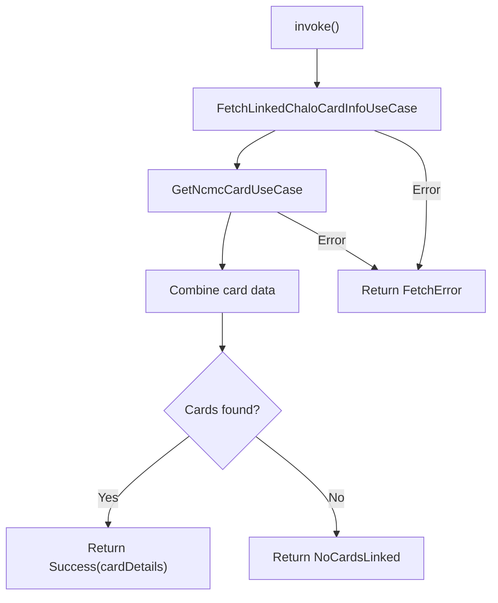

### Output Types

| Result | Meaning |
|--------|---------|
| **Success** | Cards fetched with details |
| **NoCardsLinked** | User has no linked cards |
| **FetchError** | API or network error |

### Failure Reasons

| Reason | Description |
|--------|-------------|
| **API_CALL_FAILED** | Network or server error |
| **NO_CARD_LINKED** | No cards in account |
| **FETCH_NCMC_CARD_ERROR** | NCMC fetch failed |
| **FETCH_NCMC_CARD_TIMEOUT_ERROR** | NCMC request timed out |

---

## Link Chalo Card

**Responsibility:** Validates and links a card to the user's account.

### Flow

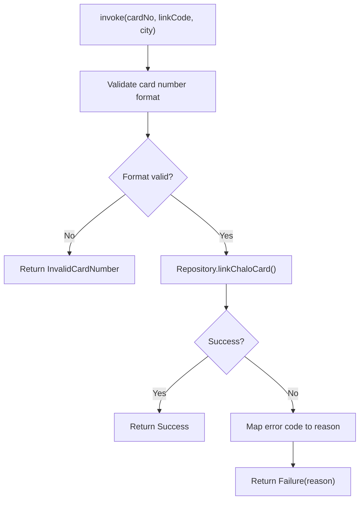

### Input Parameters

| Parameter | Type | Description |
|-----------|------|-------------|
| **cardNo** | String | Card number |
| **linkCode** | String | Linking code |
| **city** | String | Current city |
| **isAutoLinkFlow** | Boolean | Auto-link eligibility |

### Failure Reasons

| Reason | Error Code | Description |
|--------|------------|-------------|
| **INVALID_CARD_NUMBER** | 3003 | Card number invalid |
| **INVALID_LINK_CODE** | 7001 | Wrong link code |
| **CARD_LINKED_TO_ANOTHER_NUMBER** | 7002 | Already linked |
| **KYC_NOT_DONE** | 7003 | KYC incomplete |
| **CARD_NOT_REGISTERED_IN_CURR_CITY** | 7005 | City mismatch |
| **SERVER_ERROR** | 1004 | Backend error |
| **UNKNOWN_ERROR** | 0 | Unexpected error |

---

## Unlink Card

**Responsibility:** Removes a linked card from the user's account.

### Flow

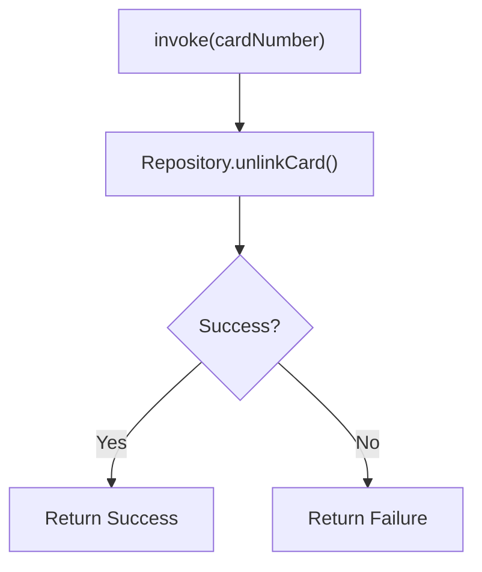

### Input/Output

| Direction | Type | Description |
|-----------|------|-------------|
| **Input** | String | Card number to unlink |
| **Output** | Result | Success or failure |

---

## Block NCMC Card

**Responsibility:** Blocks an NCMC card with a specified reason.

### Flow

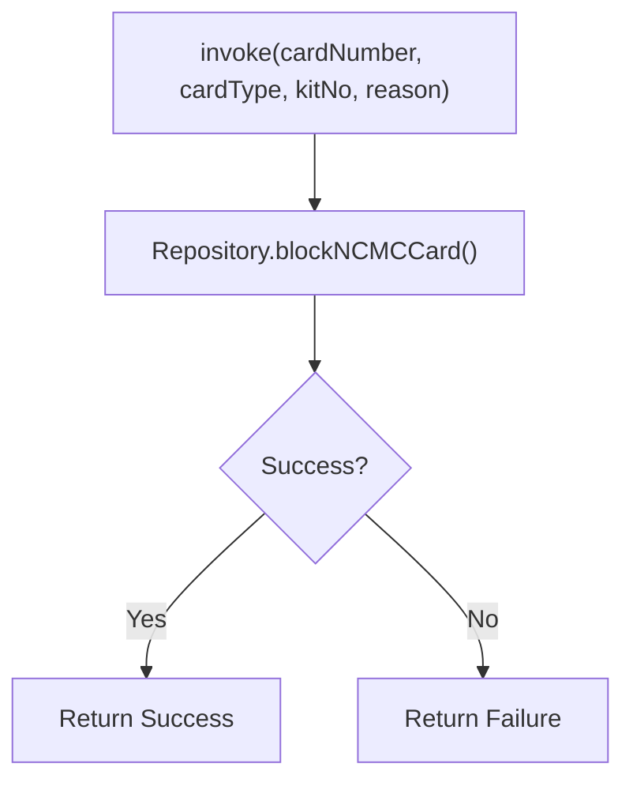

### Input Parameters

| Parameter | Type | Description |
|-----------|------|-------------|
| **cardNumber** | String | Card to block |
| **cardType** | String | Card type |
| **kitNo** | String | NCMC kit number |
| **reason** | String | Block reason (USER_REQUEST) |

---

## Change NCMC Pin

**Responsibility:** Initiates NCMC PIN change via web redirect.

### Flow

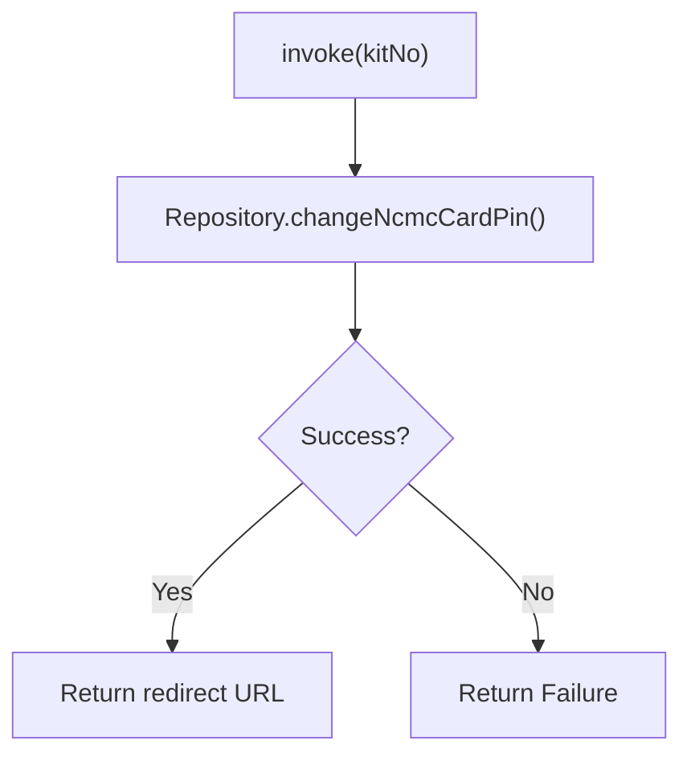

### Output

Returns a redirect URL for the PIN change web flow.

---

## Place NCMC Offline Recharge

**Responsibility:** Creates an offline (NFC) recharge order.

### Flow

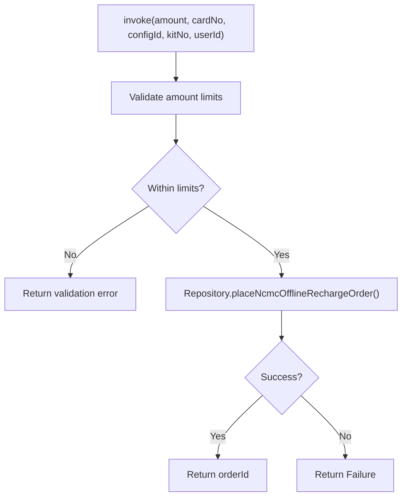

### Input Parameters

| Parameter | Type | Description |
|-----------|------|-------------|
| **amount** | Long | Recharge amount |
| **cardNo** | String | Card number |
| **configId** | String | Configuration ID |
| **kitNo** | String | NCMC kit number |
| **userId** | String | User ID |

### Output

| Field | Type | Description |
|-------|------|-------------|
| **orderId** | String | Created order ID |

---

## Confirm NCMC Offline Recharge

**Responsibility:** Confirms an offline recharge order on the server.

### Flow

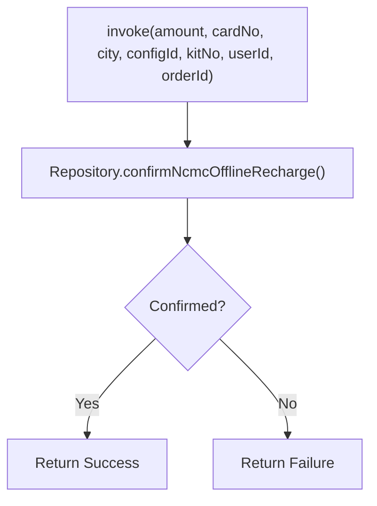

### Input Parameters

| Parameter | Type | Description |
|-----------|------|-------------|
| **amount** | Long | Recharge amount |
| **cardNo** | String | Card number |
| **city** | String | City name |
| **configId** | String | Configuration ID |
| **kitNo** | String | NCMC kit number |
| **userId** | String | User ID |
| **orderId** | String | Order to confirm |

---

## Generate Uvik Intent Hash

**Responsibility:** Generates the intent hash for NFC operations via Uvik SDK.

### Flow

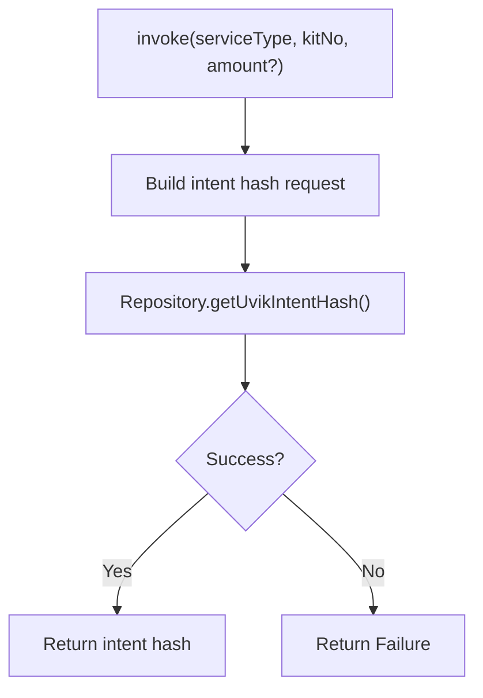

### Input Parameters

| Parameter | Type | Description |
|-----------|------|-------------|
| **serviceType** | UvikServiceType | SERVICE_CREATION, BALANCE_UPDATE, BALANCE_ENQUIRY |
| **kitNo** | String | NCMC kit number |
| **amount** | Long? | Amount (for BALANCE_UPDATE) |

### Output

| Field | Type | Description |
|-------|------|-------------|
| **intentHash** | String | Hash for NFC operation |

---

## Process Uvik Result

**Responsibility:** Processes the result from Uvik SDK NFC operations.

### Flow

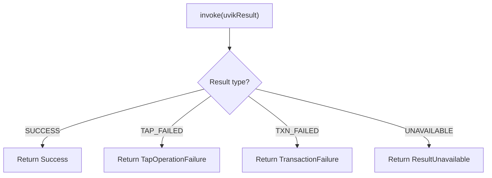

### Uvik Result Errors

| Error Type | Description |
|------------|-------------|
| **ResultUnavailable** | No result from SDK |
| **TapOperationFailure** | NFC tap failed (with code) |
| **TransactionFailure** | Transaction failed (with status) |

---

## Fetch Chalo Card Transactions

**Responsibility:** Fetches paginated transaction history for a card.

### Flow

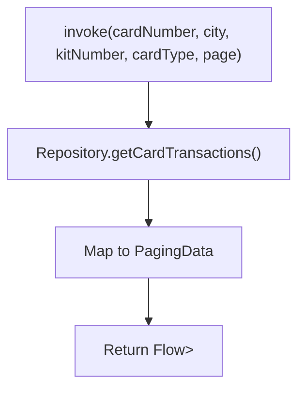

### Input Parameters

| Parameter | Type | Description |
|-----------|------|-------------|
| **cardNumber** | String | Card to query |
| **city** | String | City name |
| **kitNumber** | String? | NCMC kit number |
| **cardType** | String | Card type |
| **page** | Int | Page number |

### Output

Returns a Flow of paginated transaction data.

---

## Create Card Recharge Order

**Responsibility:** Creates a recharge order for Chalo Card (non-NCMC).

### Flow

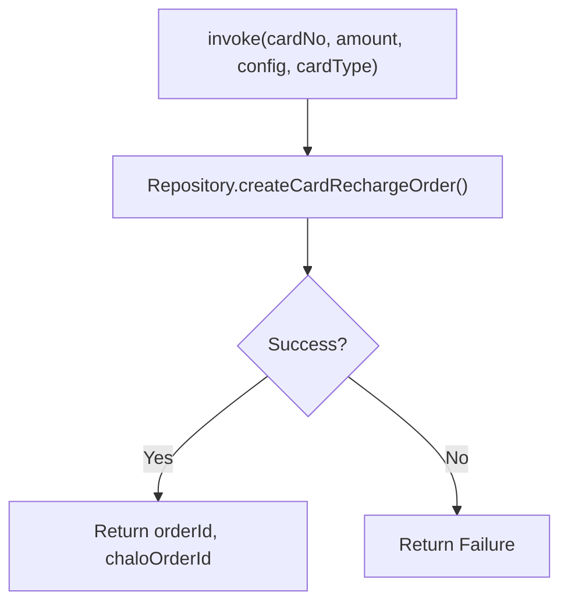

### Input Parameters

| Parameter | Type | Description |
|-----------|------|-------------|
| **cardNo** | String | Card number |
| **amount** | Long | Recharge amount |
| **config** | RechargeConfiguration | Recharge config |
| **cardType** | String | Card type |

### Output

| Field | Type | Description |
|-------|------|-------------|
| **orderId** | String | Backend order ID |
| **chaloOrderId** | String | Payment reference |

---

## Get Masked Card No

**Responsibility:** Masks a card number for display (e.g., 6077****8634).

### Masking Logic

| Input | Output |
|-------|--------|
| 6077123456788634 | 6077****8634 |

Keeps first 4 and last 4 digits, masks middle with asterisks.

---

## Validate Card Number

**Responsibility:** Validates card number format against configuration.

### Validation Rules

| Check | Rule |
|-------|------|
| Length | Between min and max from config |
| Format | Numeric only |
| Prefix | Valid card prefix (optional) |

---

## Domain Models

### NcmcCardAppModel

| Field | Type | Description |
|-------|------|-------------|
| **cardNumber** | String? | Card number |
| **onlineBalance** | Long? | Server-stored balance |
| **offlineBalance** | Long? | Card-stored balance |
| **ncmcCardStatus** | NcmcCardStatus | ACTIVE, BLOCKED, EXPIRED |
| **kitNo** | String? | Kit number |
| **remainingOfflineLoadLimit** | Long? | Offline limit remaining |
| **remainingOnlineLoadLimit** | Long? | Online limit remaining |

### ChaloCardDetails (Sealed)

| Variant | Key Fields |
|---------|------------|
| **ClosedCardDetails** | cardNumber, balance |
| **SemiClosedCardDetails** | cardNumber, balance |
| **OpenCardDetails** | cardNumber, onlineBalance, offlineBalance, kitNo |
| **UnknownCardDetails** | cardNumber |

### CardTransaction (Sealed)

| Variant | Description |
|---------|-------------|
| **CardRechargeTransaction** | Wallet load |
| **CardTicketTransaction** | Bus ticket |
| **CardPassPurchaseTransaction** | Pass subscription |
| **CardMerchantTransaction** | Third-party payment |
| **CardUnknownTransaction** | Unrecognized |

### UvikServiceType

| Type | Purpose |
|------|---------|
| **SERVICE_CREATION** | Activate card for metro |
| **BALANCE_UPDATE** | Add balance via NFC |
| **BALANCE_ENQUIRY** | Check offline balance |

---

## Business Rules

| Rule | Description | Enforced By |
|------|-------------|-------------|
| **Card number format** | Must match config length | ValidateCardNumberUseCase |
| **Link code required** | Cannot be empty | LinkChaloCardUseCase |
| **Recharge limits** | Amount within min/max | PlaceNcmcOfflineRechargeUseCase |
| **KYC required** | KYC must be complete for linking | LinkChaloCardUseCase |
| **City match** | Card must be registered in city | LinkChaloCardUseCase |

---

## Sequence Diagrams

### Card Linking Sequence

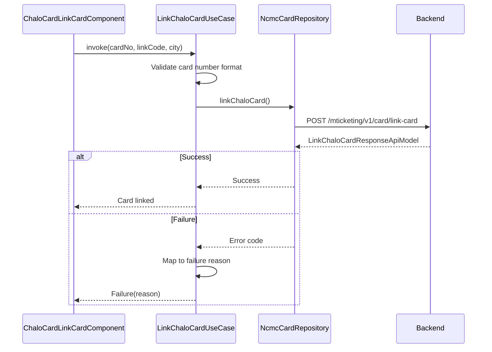

### Offline Recharge Sequence

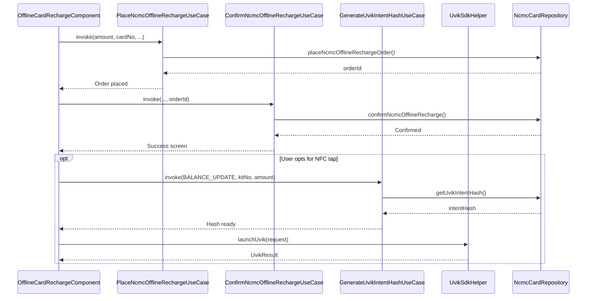

---

## Error Handling

### Exception Types

| Exception | When Thrown |
|-----------|-------------|
| **FetchLinkedChaloCardsInfoException** | Card info fetch failed |
| **LinkChaloCardFailedException** | Linking validation failed |
| **UnlinkCardFailedException** | Unlink API error |
| **BlockNCMCCardFailedException** | Block operation failed |
| **ChangeNCMCCardPinFailedException** | PIN change failed |
| **NcmcOfflineRechargeOrderCreationException** | Offline order failed |
| **NcmcOfflineRechargeConfirmationFailedException** | Confirmation failed |
| **NcmcOnlineRechargePaymentOrderCreationException** | Online order failed |
| **FetchChaloCardTransactionsFailedException** | Transaction fetch failed |
| **UvikIntentHashCreationException** | NFC intent failed |
| **ChaloCardValidationException** | Card validation failed |

### Recovery Strategies

| Error | Strategy |
|-------|----------|
| **Linking failed** | Show specific error, allow retry |
| **Recharge failed** | Show error, return to entry |
| **NFC failed** | Show tap instructions, retry |
| **Transaction fetch failed** | Retry button |
