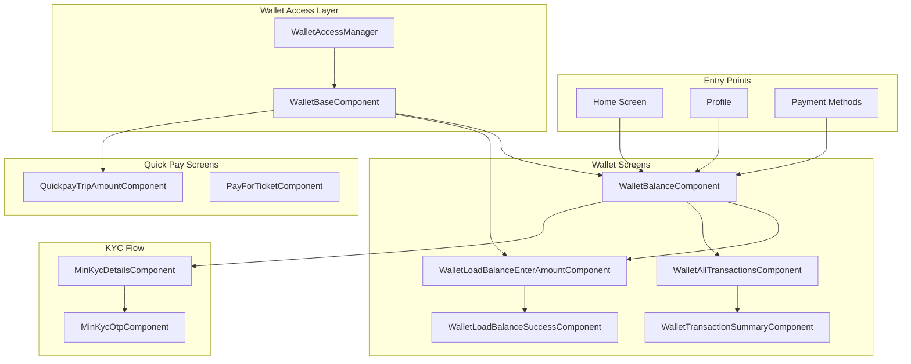
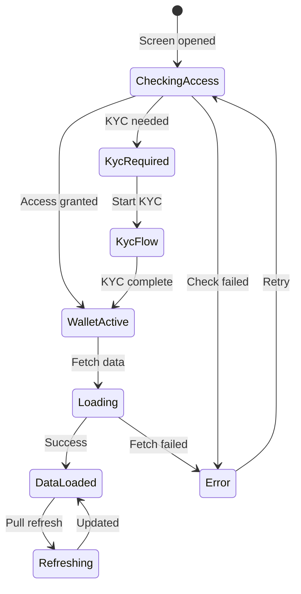
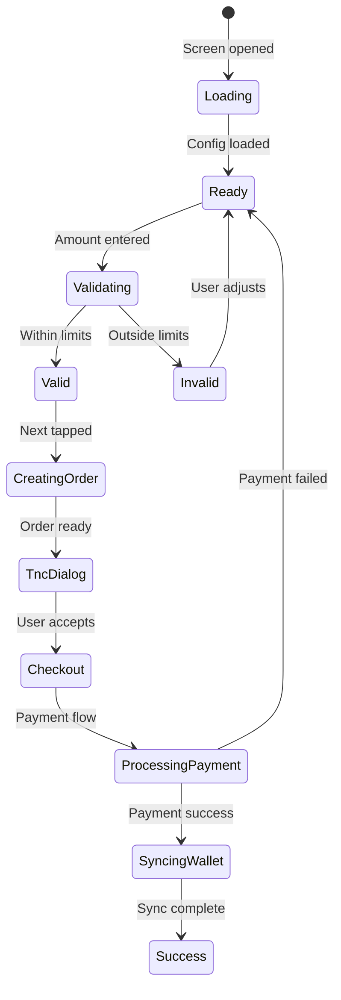
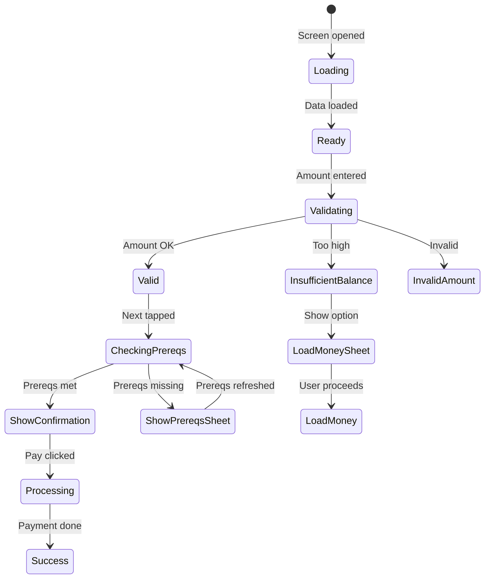
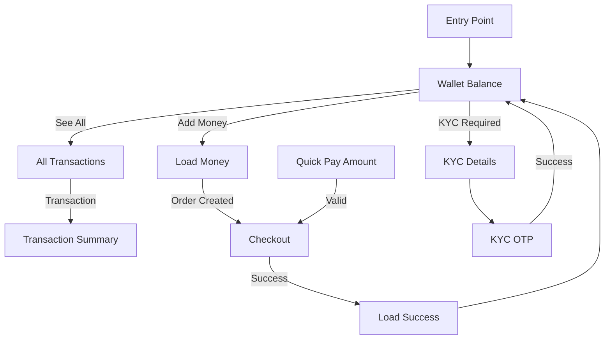

# Chalo Wallet & Quick Pay — Component Documentation

## Architecture Overview

The Wallet presentation layer implements a comprehensive digital wallet experience using Decompose components. The main balance component displays wallet status and transactions, while dedicated components handle load money, transaction history, and Quick Pay operations. All wallet components extend a base component that manages wallet access state.

---

## Screen Inventory

| Screen | Component | Purpose |
|--------|-----------|---------|
| **Wallet Balance** | WalletBalanceComponent | Main dashboard with balance and transactions |
| **Load Money** | WalletLoadBalanceEnterAmountComponent | Add funds to wallet |
| **All Transactions** | WalletAllTransactionsComponent | Complete transaction history |
| **Transaction Summary** | WalletTransactionSummaryComponent | Single transaction details |
| **Load Success** | WalletLoadBalanceSuccessComponent | Recharge confirmation |
| **Quick Pay Amount** | QuickpayTripAmountComponent | Quick Pay payment entry |
| **Pay For Ticket** | PayForTicketComponent | Quick Pay checkout |
| **KYC Details** | MinKycDetailsComponent | User details for KYC |
| **KYC OTP** | MinKycOtpComponent | OTP verification |

---

## Wallet Access Management

All wallet components extend `WalletBaseComponent` which integrates with `WalletAccessManager` for centralized access control.

### WalletAccessManager

| Property | Type | Description |
|----------|------|-------------|
| **walletActive** | StateFlow<Boolean> | Wallet active status |
| **walletAccessState** | Value<WalletAccessState> | Current access state |

### WalletAccessIntent

| Intent | Description |
|--------|-------------|
| **CheckWalletStatus** | Verify wallet availability |
| **RefreshWalletStatus** | Re-check wallet state |

### WalletAccessState

| State | Meaning |
|-------|---------|
| **Checking** | Verifying wallet status |
| **Active** | Wallet is usable |
| **Inactive** | Wallet needs KYC/setup |
| **Error** | Access check failed |

---

## Wallet Balance Screen

The balance screen is the main wallet dashboard showing current balance, recent transactions, and promotional banners.

### User Journey

1. User enters from home, profile, or payment
2. Screen checks wallet access state
3. If active: fetch balance and transactions
4. If inactive: prompt for KYC
5. Display balance and last 10 transactions
6. Show promotional banners with auto-scroll
7. User can add money or view all transactions

### State Flow

### View State Structure

| Field | Type | Description |
|-------|------|-------------|
| **showWalletAccessLoading** | Boolean | Loading wallet access |
| **walletBalance** | String | Formatted balance display |
| **addMoneyButtonEnabled** | Boolean | Can add money |
| **showSeeAllTransactionsButton** | Boolean | Has transactions |
| **showAddMoneyTutorialInfo** | Boolean | First-time user hint |
| **showTransactions** | Boolean | Display transactions |
| **transactions** | List<WalletTransactionUiModel>? | Transaction list |
| **promotionCardItems** | List<PromotionCardItem> | Banner items |

### Data State Fields

| Field | Type | Description |
|-------|------|-------------|
| **balanceInSubcurrency** | Long? | Balance in smallest unit |
| **transactions** | List<WalletTransactionUiModel> | Last 10 transactions |
| **promotionCardItems** | List<PromotionCardItem> | Banner data |
| **isWalletActive** | Boolean | Wallet status |
| **isCheckingWalletAccess** | Boolean | Loading state |

### Intents

| Intent | Trigger | Action |
|--------|---------|--------|
| **ViewCreated** | Screen mount | Initialize |
| **LoadWalletBalance** | After access check | Fetch balance |
| **AddMoneyClicked** | Add money button | Navigate to load money |
| **SeeAllTransactionsClicked** | See all button | Navigate to history |
| **TransactionClicked** | Transaction tap | Navigate to summary |
| **BannerTimerIntent** | Every 5 seconds | Auto-scroll banner |
| **BannerClickedIntent** | Banner tap | Handle deep link |

### Side Effects

| Effect | When Triggered | Result |
|--------|----------------|--------|
| **NavigateToLoadMoney** | Add money clicked | Open load screen |
| **NavigateToAllTransactions** | See all clicked | Open history |
| **NavigateToTransactionSummary** | Transaction tapped | Open detail |
| **HandleBannerDeepLink** | Banner tapped | Process deep link |
| **NavigateToKyc** | KYC required | Open KYC flow |

### Promotional Banners

Banners auto-scroll every 5 seconds and support deep links:

| Deep Link | Action |
|-----------|--------|
| **open_chalo_pay** | Navigate to Quick Pay |
| **open_wallet_recharge** | Navigate to Load Money |

---

## Load Money Screen

Handles wallet recharge with amount validation and payment integration.

### User Journey

1. User navigates from balance screen
2. Screen loads suggested denominations
3. User enters amount or selects preset
4. Amount validated against min/max limits
5. User taps Next
6. Wallet synced to ensure fresh state
7. Recharge order created
8. Terms dialog displayed
9. User accepts and proceeds to checkout
10. Payment completed externally
11. Wallet synced with new balance
12. Success screen displayed

### State Flow

### View State Structure

| Field | Type | Description |
|-------|------|-------------|
| **currentlyEnteredAmountString** | String | User input |
| **enteredAmountError** | String? | Validation error |
| **isAmountValid** | Boolean | Passes validation |
| **suggestedAmountsDenominations** | List<Int> | Preset amounts |
| **currentRemainingBalance** | Long | Current balance |
| **walletLoadConfigAndOrderCombined** | Combined? | Order details |
| **dialogType** | WalletLoadBalanceDialogType? | TnC or error |

### Intents

| Intent | Trigger | Action |
|--------|---------|--------|
| **AmountEnteredIntent** | User types | Update and validate |
| **NextBtnClickIntent** | Next button | Create order |
| **SuggestedDenominationClickedIntent** | Preset tap | Use preset amount |
| **TnCAcceptClickIntent** | TnC accept | Navigate to checkout |
| **PaymentCompletedIntent** | Checkout return | Sync and show success |
| **DismissDialog** | Dialog close | Close dialog |

### Amount Validation

| Check | Rule | Error Message |
|-------|------|---------------|
| **Minimum** | >= minAmount from config | "Minimum amount is ₹X" |
| **Maximum** | <= maxAmount from config | "Maximum amount is ₹X" |
| **Format** | Valid numeric | "Enter valid amount" |

### Suggested Denominations

Pre-configured amounts fetched from `GetLoadMoneyDenominationsUseCase`.

---

## All Transactions Screen

Displays complete wallet transaction history with filtering.

### User Journey

1. User navigates from balance screen
2. Fetch all transactions
3. Display grouped by type
4. User can filter by Quick Pay only
5. User taps transaction for details

### Transaction Types

| Type | Icon | Description |
|------|------|-------------|
| **QUICK_PAY** | QR icon | Tap-to-pay transactions |
| **LOAD_MONEY** | Plus icon | Wallet recharge |
| **CHALO_PAY** | Wallet icon | Checkout wallet payments |

### Intents

| Intent | Trigger | Action |
|--------|---------|--------|
| **LoadAllTransactions** | Screen mount | Fetch all types |
| **QuickPayTransactions** | Filter tap | Filter Quick Pay only |
| **SingleTransactionClicked** | Item tap | Navigate to summary |

---

## Quick Pay Amount Screen

Handles Quick Pay payment amount entry and validation.

### User Journey

1. User initiates Quick Pay from ticket purchase
2. Screen loads wallet balance and config
3. Amount pre-filled or user enters
4. Amount validated against balance and limits
5. Prerequisites checked (KYC, wallet status)
6. Confirmation bottom sheet shown
7. User confirms payment
8. Navigate to product activation

### State Flow

### View State Structure

| Field | Type | Description |
|-------|------|-------------|
| **currentAmountString** | String | Formatted amount |
| **tripAmountState** | TripAmountState | Validation state |
| **remainingCurrentBalance** | Long | Current balance |
| **maxQuickPayAmountAllowed** | Long | Config limit |
| **bottomSheetType** | QuickPayBottomSheetState? | Current sheet |

### Trip Amount States

| State | Meaning |
|-------|---------|
| **CORRECT_AMOUNT** | Valid amount |
| **INCORRECT_AMOUNT** | Invalid format or over max |
| **INSUFFICIENT_BALANCE** | Amount > balance |
| **WALLET_ERROR** | Wallet unavailable |

### Intents

| Intent | Trigger | Action |
|--------|---------|--------|
| **ViewCreatedIntent** | Screen mount | Load data |
| **ValidateIntent** | Amount change | Validate amount |
| **PrerequisitesIntent** | Prereq check | Refresh prerequisites |
| **NextIntent** | Next button | Check and show confirmation |
| **QuickPayHistoryClickedIntent** | History tap | Navigate to history |
| **NavigateToWalletBalanceIntent** | Balance tap | Navigate to balance |
| **QuickPayBottomSheetPayClickedIntent** | Pay button | Process payment |

### Bottom Sheet Types

| Type | Trigger | Content |
|------|---------|---------|
| **Prerequisites** | Prereqs missing | KYC/device requirements |
| **Confirmation** | Valid amount | Amount and balance confirmation |
| **InsufficientBalance** | Amount > balance | Load money option |
| **Error** | Validation failed | Error message |

---

## KYC Flow

### Min KYC Details Screen

Collects user information for KYC registration.

### User Journey

1. User prompted for KYC during wallet access
2. Full name pre-filled from profile if available
3. User confirms or edits name
4. Proceed to OTP verification

### Intents

| Intent | Trigger | Action |
|--------|---------|--------|
| **InitializationIntent** | Screen mount | Load profile name |
| **FullNameEnteredIntent** | Name input | Update name |
| **ProceedButtonClickedIntent** | Proceed button | Navigate to OTP |

### Min KYC OTP Screen

Handles OTP verification for KYC completion.

### User Journey

1. OTP sent to registered phone
2. User enters received OTP
3. KYC submitted with OTP
4. Wallet activated on success

### Intents

| Intent | Trigger | Action |
|--------|---------|--------|
| **OtpEnteredIntent** | OTP input | Update OTP |
| **SubmitOtpIntent** | Submit button | Submit KYC |
| **ResendOtpIntent** | Resend link | Request new OTP |

---

## Transaction Summary Screen

Displays detailed view of a single transaction.

### Transaction Fields

| Field | Description |
|-------|-------------|
| **transactionId** | Unique identifier |
| **type** | QUICK_PAY, LOAD_MONEY, CHALO_PAY |
| **amount** | Transaction amount |
| **status** | PROCESSING, COMPLETED, FAILED, RECLAIMED |
| **timestamp** | Transaction time |
| **description** | Transaction description |

---

## Navigation Flow

---

## Analytics Events

| Event | Screen | Trigger |
|-------|--------|---------|
| **wallet_balance_screen_opened** | Balance | Screen mount |
| **wallet_add_money_clicked** | Balance | Add money tap |
| **wallet_load_money_initiated** | Load Money | Order created |
| **wallet_load_money_success** | Success | Payment complete |
| **wallet_transaction_clicked** | Balance/History | Transaction tap |
| **quick_pay_screen_opened** | Quick Pay | Screen mount |
| **quick_pay_initiated** | Quick Pay | Payment started |
| **quick_pay_success** | Quick Pay | Payment complete |
| **wallet_kyc_started** | KYC Details | Flow started |
| **wallet_kyc_completed** | KYC OTP | KYC success |

---

## Error Handling

| Error Scenario | Screen | UI Response |
|----------------|--------|-------------|
| **Wallet access failed** | Balance | Error state with retry |
| **KYC required** | Balance | Navigate to KYC flow |
| **Amount validation failed** | Load Money | Error message |
| **Order creation failed** | Load Money | Error dialog |
| **Payment failed** | Checkout | Return to load money |
| **Insufficient balance** | Quick Pay | Load money bottom sheet |
| **Prerequisites missing** | Quick Pay | Prerequisites bottom sheet |
