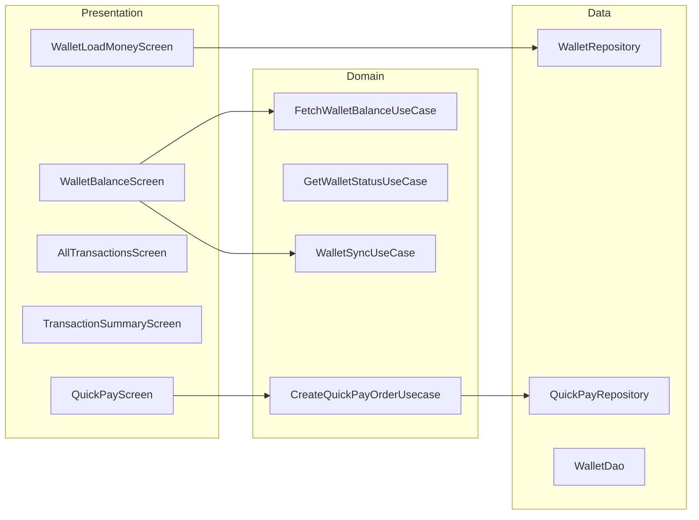

# Chalo Wallet & Quick Pay — High-Level Design

## Overview

The Chalo Wallet feature provides a digital wallet within the Chalo app for quick payments. Users can view balance, load money via online payment, view transaction history, and complete KYC for full wallet access. Quick Pay enables tap-to-pay functionality for bus rides using wallet balance.

## User Journey

1. **Entry Points**:
   - Home screen → Wallet card
   - Profile → My Wallet
   - Payment method → Chalo Pay

2. **Core Flow**:
   - View wallet balance and transactions
   - Load money via payment gateway
   - Complete KYC (if required)
   - Use wallet for quick payments
   - View transaction receipts

3. **Exit Points**:
   - Balance displayed → Transaction history
   - Payment initiated → Quick Pay receipt
   - KYC completed → Full wallet access

## Architecture Diagram



## Key Components

| Component | Platform | File Path | Responsibility |
|-----------|----------|-----------|----------------|
| `WalletBalanceComponent` | Shared | `shared/wallet/.../ui/mainbalance/WalletBalanceComponent.kt` | Balance display |
| `WalletLoadBalanceEnterAmountComponent` | Shared | `shared/wallet/.../ui/loadbalance/WalletLoadBalanceEnterAmountComponent.kt` | Load money |
| `WalletAllTransactionsComponent` | Shared | `shared/wallet/.../ui/alltransactions/WalletAllTransactionsComponent.kt` | Transaction history |
| `QuickpayTripAmountComponent` | Shared | `shared/wallet/.../quickpay/ui/tripamount/QuickpayTripAmountComponent.kt` | Quick Pay initiation |
| `FetchWalletBalanceUseCase` | Shared | `shared/wallet/.../domain/FetchWalletBalanceUseCase.kt` | Balance fetching |
| `WalletSyncUseCase` | Shared | `shared/framework-wallet/.../domain/WalletSyncUseCase.kt` | Wallet sync |
| `WalletRepository` | Shared | `shared/framework-wallet/.../data/repository/WalletRepository.kt` | Wallet data |

## Data Flow

### Balance Display
1. `WalletBalanceComponent` initializes
2. `FetchWalletBalanceUseCase` gets cached balance
3. `WalletSyncUseCase` syncs with server
4. Balance and recent transactions displayed
5. Promotion banners shown (if configured)

### Load Money
1. User enters amount on `WalletLoadBalanceEnterAmountComponent`
2. `GetLoadMoneyDenominationsUseCase` provides presets
3. `GetWalletLoadConfigAndPlaceRechargeOrderUseCase` creates order
4. Payment processed via checkout
5. `AddProcessingLoadMoneyTransactionsAndSyncWalletUseCase` updates balance

### Quick Pay Flow
1. User initiates Quick Pay at bus entry
2. `CreateQuickPayOrderUsecase` creates order with amount
3. Wallet balance deducted
4. QR code generated for validation
5. Receipt stored via `SyncQuickPayReceiptsUseCase`

## Platform Differences

### Android-Specific
- Encrypted SharedPreferences for wallet data
- Native payment result handling
- Background sync worker

### iOS-Specific
- Keychain for secure storage
- iOS wallet integration
- Background fetch

## Integration Points

### Analytics Events
- See [Analytics: chalo-wallet](/analytics/flows/chalo-wallet) for event documentation
- Key events:
  - `wallet_balance_screen_opened`
  - `wallet_load_money_clicked`
  - `wallet_load_money_success`
  - `quick_pay_initiated`
  - `quick_pay_success`
  - `wallet_kyc_completed`

### Shared Services
- **Payment**: Checkout for load money
- **KYC**: Min KYC verification flow
- **Validation**: Quick Pay validation SDK

### Navigation
- **Navigates to**: Load money, Transactions, KYC, Checkout
- **Navigated from**: Home, Profile, Payment method selection

## Wallet Status States

```kotlin
enum class WalletStatus {
    USER_NOT_LOGGED_IN,
    WALLET_FETCH_PENDING,
    DOES_NOT_EXIST,
    FULL_KYC_NEEDED,
    ACTIVE,
    BLOCKED_FOR_BACKEND_RECLAIM,
    BLOCKED_USER,
    BLOCKED_FOR_APP_RECLAIM,
    WALLET_TIMED_OUT,
    KYC_INITIATED,
    CHALO_TIME_UNAVAILABLE
}
```

## KYC Flow

### Min KYC Components
- `MinKycOtpComponent` — OTP verification
- `MinKycDetailsComponent` — User details entry
- `RegisterUserUseCase` — Register for KYC
- `SubmitKycUseCase` — Submit KYC data

### KYC Flow
1. User initiates wallet creation
2. OTP sent for verification
3. User enters details (name, DOB, etc.)
4. KYC submitted to backend
5. Wallet created with MIN_KYC status

## Edge Cases & Error Handling

| Scenario | Handling |
|----------|----------|
| Wallet not created | Shows KYC prompt |
| KYC pending | Shows status message |
| Wallet blocked | Shows block reason |
| Insufficient balance | Shows load money prompt |
| Sync failed | Uses cached balance |
| Quick Pay timeout | Shows retry option |

## Transaction Types

```kotlin
enum class WalletTransactionType {
    QUICK_PAY,      // Tap-to-pay transactions
    LOAD_MONEY,     // Wallet recharge
    CHALO_PAY       // Checkout wallet payments
}
```

## Data Models

### WalletAppModel
```kotlin
data class WalletAppModel(
    val walletId: String,
    val balance: Long,
    val status: WalletStatus,
    val kycLevel: KycLevel,
    val lastSyncTime: Long
)
```

### WalletTransactionAppModel
```kotlin
data class WalletTransactionAppModel(
    val transactionId: String,
    val type: WalletTransactionType,
    val amount: Long,
    val status: WalletTransactionStatus,
    val timestamp: Long,
    val description: String
)
```

### QuickPayAppModel
```kotlin
data class QuickPayAppModel(
    val orderId: String,
    val amount: Long,
    val status: QuickPayOrderStatus,
    val qrCode: String?,
    val expiryTime: Long,
    val punchTime: Long?
)
```

### QuickPayOrderStatus
```kotlin
enum class QuickPayOrderStatus {
    PENDING,
    SUCCESS,
    FAILED,
    EXPIRED
}
```

## Dependencies

### Internal
- `shared:wallet` — Wallet UI components
- `shared:framework-wallet` — Data layer
- `shared:kyc` — KYC verification
- `shared:checkout` — Payment processing

### External
- SQLDelight — Transaction storage
- Encrypted SharedPreferences — Secure wallet data
- DataStore — Wallet preferences
